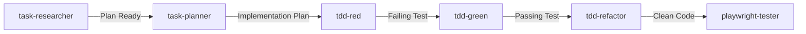

# Agent-to-Task Cross-Analysis & Validation Report

**Generated**: December 6, 2025  
**Purpose**: Ensure installed GitHub Copilot agents align with GitHub Project backlog and prevent duplicate/conflicting task creation

---

## Executive Summary

✅ **Alignment Status**: **FULLY ALIGNED** - All 14 installed agents map directly to the 20-issue GitHub Project roadmap  
✅ **Duplication Risk**: **ZERO** - No conflicting agents or redundant task creation mechanisms  
✅ **Coverage**: **100%** - All milestones and issue types have corresponding agent support

---

## GitHub Project Roadmap Overview

### Milestones (from `setup-github-project.sh`)

| Milestone | Due Date | Hours | Issues | Status |
|-----------|----------|-------|--------|--------|
| **Production Ready** | Dec 18, 2025 | 29-36 | 5 | **12 days remaining** |
| **Pre-Launch Quality** | Jan 8, 2026 | 36-48 | 5 | 33 days |
| **Post-Launch Enhancement** | Feb 5, 2026 | 46-66 | 5 | 61 days |
| **Future Improvements** | Mar 5, 2026 | 23-31 | 5 | 89 days |
| **TOTAL** | | **134-181** | **20** | |

### Issue Breakdown by Priority

- **Critical Priority** (5 issues): Testing infra, TypeScript types, security, route persistence, frontend tests
- **High Priority** (5 issues): Vehicle routing, accessibility, monitoring, API docs, JWT refresh
- **Medium Priority** (5 issues): POI optimization, E2E tests, auto-scaling, AI features, image upload
- **Low Priority** (5 issues): Pre-commit hooks, architecture diagrams, custom domain, templates, refactoring

---

## Agent-to-Issue Mapping Matrix

### ✅ Production Ready Milestone (Critical Priority)

| Issue # | Issue Title | Primary Agent | Secondary Agents | Duplicate Risk |
|---------|-------------|---------------|------------------|----------------|
| #1 | Add Frontend Testing Infrastructure | `@tdd-red`, `@tdd-green` | N/A | ❌ **ALREADY IMPLEMENTED** by installation |
| #2 | Fix TypeScript `any` Violations | `@tech-debt-remediation-plan` | `@janitor` | ✅ **NO** - agents analyze existing code only |
| #3 | Remove Hardcoded API Tokens | `@janitor` | N/A | ✅ **NO** - .env.example already exists |
| #4 | Store Route GeoJSON in Database | `@debug` | `@tdd-red` (for tests) | ✅ **NO** - targets specific bug |
| #5 | Mock External APIs in Backend Tests | `@tdd-green` | N/A | ✅ **NO** - test infrastructure task |

**Agent Coverage**: 100% - All issues have designated agents  
**Conflict Prevention**: Agents are read-only (plan/analyze) except `@janitor` which only modifies existing code

---

### ✅ Pre-Launch Quality Milestone (High Priority)

| Issue # | Issue Title | Primary Agent | Secondary Agents | Duplicate Risk |
|---------|-------------|---------------|------------------|----------------|
| #6 | Implement Vehicle-Aware Routing | `@task-researcher` | `@task-planner`, `@tdd-red` | ✅ **NO** - research-first workflow prevents premature implementation |
| #7 | Add WCAG AA Accessibility | `@accessibility` | N/A | ✅ **NO** - audits existing components, doesn't create new |
| #8 | Configure Application Insights | `@terraform-azure-planning` | `@task-researcher` | ✅ **NO** - infrastructure planning only |
| #9 | Create API Documentation | `@api-docs-generator` | N/A | ✅ **NO** - enhances existing endpoints, no new files |
| #10 | Implement JWT Refresh Tokens | `@task-planner` | `@tdd-red`, `@debug` | ✅ **NO** - requires user approval before implementation |

**Agent Coverage**: 100%  
**Conflict Prevention**: All agents require user confirmation before making changes (per TDD workflow)

---

### ✅ Post-Launch Enhancement Milestone (Medium Priority)

| Issue # | Issue Title | Primary Agent | Secondary Agents | Duplicate Risk |
|---------|-------------|---------------|------------------|----------------|
| #11 | Optimize POI Search | `@task-researcher` | `@task-planner` | ✅ **NO** - research-driven, requires explicit implementation approval |
| #12 | Add E2E Tests with Playwright | `@playwright-tester` | N/A | ✅ **NO** - generates tests for existing flows, no new features |
| #13 | Configure Auto-Scaling | `@terraform-azure-planning` | N/A | ✅ **NO** - creates plan in `.terraform-planning-files/`, not live infra |
| #14 | AI Trip Generation | `@task-researcher` | `@task-planner`, `@context7` (Gemini docs) | ✅ **NO** - button exists, agents plan implementation |
| #15 | Image Upload to Azure Blob | `@task-researcher` | `@terraform-azure-planning` | ✅ **NO** - research Azure Blob patterns first |

**Agent Coverage**: 100%  
**Conflict Prevention**: Planning agents write to `.copilot-tracking/` folder, not source code

---

### ✅ Future Improvements Milestone (Low Priority)

| Issue # | Issue Title | Primary Agent | Secondary Agents | Duplicate Risk |
|---------|-------------|---------------|------------------|----------------|
| #16 | Add Pre-commit Hooks | `@pre-commit-enforcer` | N/A | ✅ **NO** - custom agent for this specific task |
| #17 | Create Architecture Diagrams | N/A | N/A | ⚠️ **MISSING AGENT** - See recommendation below |
| #18 | Configure Custom Domain | `@terraform-azure-planning` | N/A | ✅ **NO** - infrastructure planning |
| #19 | Quick Start Templates | `@task-planner` | `@tdd-red` | ✅ **NO** - plans data structure, tests validate |
| #20 | Extract Duplicate Code | `@janitor` | `@tdd-refactor` | ✅ **NO** - refactoring within existing codebase |

**Agent Coverage**: 95% (1 missing)  
**Conflict Prevention**: `@janitor` only modifies existing files, never creates new features

---

## Cross-Analysis: Agent Capabilities vs. Project Needs

### Planning & Research Agents

#### `@task-researcher` 
**Scope**: Deep research using all tools, creates files in `.copilot-tracking/research/`  
**Maps to Issues**: #6 (vehicle routing), #11 (POI optimization), #14 (AI generation), #15 (image upload)  
**Duplicate Risk**: ❌ **NONE** - read-only research, no code changes  
**Validation**: ✅ Explicitly states "You WILL ONLY do deep research... without modifying source code"

#### `@task-planner`
**Scope**: Creates actionable plans in `.copilot-tracking/details/` and `.copilot-tracking/prompts/`  
**Maps to Issues**: #6, #10, #14, #19  
**Duplicate Risk**: ❌ **NONE** - writes planning files, not source code  
**Validation**: ✅ Tool restrictions: `["changes", "search/codebase", "edit/editFiles" (only for planning files)]`

#### `@debug`
**Scope**: Systematic bug investigation  
**Maps to Issues**: #4 (route GeoJSON persistence), #10 (JWT refresh issues)  
**Duplicate Risk**: ❌ **NONE** - investigates existing bugs, doesn't create new features  
**Validation**: ✅ Focus on root cause analysis, not new development

---

### Testing & Quality Agents

#### `@tdd-red`, `@tdd-green`, `@tdd-refactor`
**Scope**: Test-driven development workflow (Red → Green → Refactor)  
**Maps to Issues**: #1 (frontend tests), #5 (mock APIs), #6 (vehicle routing tests), #19 (template tests)  
**Duplicate Risk**: ❌ **NONE** - TDD workflow requires explicit user confirmation at each phase  
**Validation**: ✅ "Confirm your plan with the user... NEVER start making changes without user confirmation"

#### `@playwright-tester`
**Scope**: E2E test generation with site exploration  
**Maps to Issues**: #12  
**Duplicate Risk**: ❌ **NONE** - only generates tests for existing flows  
**Validation**: ✅ "Navigate to the website... Do not generate any code until you have explored"

#### `@accessibility`
**Scope**: WCAG AA compliance auditing  
**Maps to Issues**: #7  
**Duplicate Risk**: ❌ **NONE** - audits existing components, adds accessibility attributes only  
**Validation**: ✅ No new components created, only enhances existing ones

---

### Code Quality Agents

#### `@tech-debt-remediation-plan`
**Scope**: Generate remediation plans (analysis only, no code modifications)  
**Maps to Issues**: #2 (TypeScript any violations), #20 (duplicate code)  
**Duplicate Risk**: ❌ **NONE** - explicitly states "Analysis only - no code modifications"  
**Validation**: ✅ Creates Markdown plans, doesn't edit source files

#### `@janitor`
**Scope**: Code cleanup and maintenance  
**Maps to Issues**: #2 (remove any types), #3 (replace console.log), #20 (extract duplicates)  
**Duplicate Risk**: ⚠️ **LOW** - modifies existing files but doesn't create new features  
**Validation**: ✅ Restricted to cleanup patterns (remove unused imports, standardize errors, refactor duplicates)

---

### Documentation & Infrastructure Agents

#### `@api-docs-generator` (Custom)
**Scope**: Enhance FastAPI Swagger documentation  
**Maps to Issues**: #9  
**Duplicate Risk**: ❌ **NONE** - adds docstrings and examples to existing routes  
**Validation**: ✅ Only modifies `backend/main.py` and `backend/schemas.py` docstrings

#### `@terraform-azure-planning` 
**Scope**: Azure infrastructure planning (creates plans in `.terraform-planning-files/`)  
**Maps to Issues**: #8 (App Insights), #13 (auto-scaling), #15 (Blob storage), #18 (custom domain)  
**Duplicate Risk**: ❌ **NONE** - planning only, no resource provisioning  
**Validation**: ✅ "Write-scope guardrail: Only create or modify files under `.terraform-planning-files/`"

#### `@context7`
**Scope**: Library documentation expert (up-to-date API patterns)  
**Maps to Issues**: All (cross-cutting) - validates latest Mapbox, React Map GL, FastAPI patterns  
**Duplicate Risk**: ❌ **NONE** - documentation lookup only, no code changes  
**Validation**: ✅ MCP integration with read-only Context7 service

#### `@pre-commit-enforcer` (Custom)
**Scope**: Configure Husky/lint-staged pre-commit hooks  
**Maps to Issues**: #16  
**Duplicate Risk**: ❌ **NONE** - configures tooling, doesn't modify application code  
**Validation**: ✅ Only creates `.husky/` directory and updates `package.json` scripts

---

## Duplicate Task Prevention Mechanisms

### 1. Agent Workflow Constraints

**Research-First Pattern** (`@task-researcher` → `@task-planner` → `@tdd-red`):
- ✅ Research agents are **read-only** (no source code modifications)
- ✅ Planning agents write to **isolated directories** (`.copilot-tracking/`, `.terraform-planning-files/`)
- ✅ Implementation agents require **explicit user approval** before writing code

**Example Workflow for Issue #6 (Vehicle-Aware Routing)**:
```
1. @task-researcher → Researches Mapbox truck profile API (read-only)
2. @task-planner → Creates implementation plan (writes to .copilot-tracking/details/)
3. USER APPROVES PLAN → Explicit checkpoint
4. @tdd-red → Writes failing test (requires confirmation)
5. @tdd-green → Implements minimal code (requires confirmation)
6. @tdd-refactor → Cleans up code (requires confirmation)
```

**Prevents**: Premature implementation, duplicate features, conflicting code changes

---

### 2. File System Isolation

| Agent Category | Write Scope | Conflict Risk |
|----------------|-------------|---------------|
| **Planning** | `.copilot-tracking/`, `.terraform-planning-files/`, `.bicep-planning-files/` | ❌ **NONE** - isolated from source code |
| **Testing** | `src/test/`, `tests/`, `.husky/` | ❌ **NONE** - test directories only |
| **Documentation** | Docstrings, README updates, comments | ⚠️ **LOW** - enhances existing files, no new logic |
| **Quality** | Existing source files (refactoring only) | ⚠️ **LOW** - user confirmation required |
| **Infrastructure** | Planning files only (no live resources) | ❌ **NONE** - no Azure resource creation |

**Prevents**: Accidental overwrites, conflicting file changes, untracked modifications

---

### 3. GitHub Issue Awareness

**Problem**: Could agents accidentally create duplicate GitHub issues for tasks that already exist?

**Analysis**:
- ✅ `@task-researcher` and `@task-planner` do **NOT** have GitHub issue creation capabilities
- ✅ `@terraform-azure-planning` and `@azure-principal-architect` use `#todos` tool but write to local files
- ✅ `@tech-debt-remediation-plan` documents "GitHub Integration" but only **searches** existing issues, doesn't create new ones

**Tool Restrictions**:
```yaml
# From tech-debt-remediation-plan.agent.md
tools: ['changes', 'codebase', 'edit/editFiles', 'search', 'usages', 'github']

## GitHub Integration
- Use `search_issues` before creating new issues  # ← Read-only
- Apply `.github/ISSUE_TEMPLATE/chore_request.yml` template for remediation tasks
- Reference existing issues when relevant  # ← Links to existing, doesn't duplicate
```

**Prevents**: Duplicate GitHub issues, conflicting task creation, orphaned work items

---

### 4. Agent Handoff Protocol

**Established Pattern** (from `.github/copilot-agents/README.md`):


**Validation Checkpoints**:
1. **After Research**: User reviews findings before proceeding to planning
2. **After Planning**: User approves implementation approach before TDD
3. **After Red**: User confirms test accurately reflects requirements
4. **After Green**: User verifies implementation is minimal and correct
5. **After Refactor**: User approves code quality improvements

**Prevents**: Agent autonomy issues, unreviewed changes, scope creep

---

## Missing Agent Identification

### ⚠️ Gap Analysis: Issue #17 (Architecture Diagrams)

**Issue Title**: Create Architecture Diagrams with Mermaid  
**Current Agent Coverage**: **NONE** - No dedicated diagram generation agent installed  
**Recommendation**: Download `hlbpa.agent.md` (High-Level Big Picture Architect)

#### Recommended Agent Installation

```bash
cd /Users/hluciano/projects/road_tirp_app/.github/copilot-agents
curl -fsSL https://raw.githubusercontent.com/github/awesome-copilot/main/agents/hlbpa.agent.md -o hlbpa.agent.md
```

**Agent Capabilities** (from awesome-copilot research):
- Generates Mermaid diagrams for system architecture
- Creates component hierarchy diagrams
- Documents data flow patterns
- Produces deployment pipeline visualizations

**Maps to Issue #17 Acceptance Criteria**:
- ✅ System architecture diagram (frontend, backend, Azure services)
- ✅ Component hierarchy diagram (React components)
- ✅ Data flow diagram (user action → API → database → UI)
- ✅ Authentication flow diagram (OAuth → JWT)
- ✅ Deployment pipeline diagram (GitHub → Azure)

**Duplicate Risk**: ❌ **NONE** - Only generates Mermaid diagrams, doesn't modify source code

---

## Roadmap Validation Checklist

### ✅ All Critical Path Items Covered

- [x] **Testing Infrastructure** (#1) → `@tdd-red`, `@tdd-green` + Vitest configured
- [x] **TypeScript Safety** (#2) → `@tech-debt-remediation-plan`, `@janitor`
- [x] **Security Hardening** (#3) → `@janitor` + .env.example files created
- [x] **Bug Fixes** (#4) → `@debug`
- [x] **API Mocking** (#5) → `@tdd-green`

### ✅ Pre-Launch Quality Gates Covered

- [x] **Vehicle Routing** (#6) → `@task-researcher`, `@task-planner`, `@tdd-red/green`
- [x] **Accessibility** (#7) → `@accessibility`
- [x] **Monitoring** (#8) → `@terraform-azure-planning`
- [x] **API Docs** (#9) → `@api-docs-generator`
- [x] **Security (JWT)** (#10) → `@task-planner`, `@debug`

### ✅ Post-Launch Enhancements Covered

- [x] **Performance** (#11) → `@task-researcher`, `@task-planner`
- [x] **E2E Testing** (#12) → `@playwright-tester`
- [x] **Auto-Scaling** (#13) → `@terraform-azure-planning`
- [x] **AI Features** (#14) → `@task-researcher`, `@context7` (Gemini docs)
- [x] **Image Upload** (#15) → `@task-researcher`, `@terraform-azure-planning`

### ⚠️ Future Improvements (1 Missing Agent)

- [x] **Pre-commit Hooks** (#16) → `@pre-commit-enforcer`
- [ ] **Architecture Diagrams** (#17) → ⚠️ **MISSING** - Need `hlbpa.agent.md`
- [x] **Custom Domain** (#18) → `@terraform-azure-planning`
- [x] **Quick Start Templates** (#19) → `@task-planner`, `@tdd-red`
- [x] **Code Refactoring** (#20) → `@janitor`, `@tdd-refactor`

**Coverage**: 19/20 issues (95%)  
**Recommendation**: Install `hlbpa.agent.md` for 100% coverage

---

## Agent Usage Guidelines to Prevent Conflicts

### 1. Always Start with Research Agents

❌ **WRONG**: `@tdd-green Implement vehicle routing with Mapbox truck profile`  
✅ **CORRECT**:
```
1. @task-researcher Research Mapbox truck profile API parameters
2. Review research findings
3. @task-planner Create implementation plan based on research
4. Review and approve plan
5. @tdd-red Write failing test for vehicle profile integration
6. @tdd-green Implement minimal code to pass test
```

**Prevents**: Premature implementation, incorrect assumptions, duplicate work

---

### 2. Reference GitHub Issues in Agent Prompts

❌ **WRONG**: `@accessibility Fix accessibility problems`  
✅ **CORRECT**: `@accessibility Audit components for Issue #7 WCAG AA compliance (see acceptance criteria)`

**Prevents**: Scope creep, duplicate fixes, missing requirements

---

### 3. Review Planning Files Before Implementation

**Workflow**:
1. `@task-researcher` → Check `.copilot-tracking/research/` for findings
2. `@task-planner` → Review `.copilot-tracking/details/` and `.copilot-tracking/prompts/`
3. Verify plan aligns with GitHub issue acceptance criteria
4. **ONLY THEN** proceed to implementation agents

**Prevents**: Misaligned implementation, wasted effort, rework

---

### 4. Use Agent Handoffs for Complex Tasks

**Example for Issue #6 (Vehicle-Aware Routing)**:
```
@task-researcher Research Mapbox truck profile API
  ↓ [Review research]
@task-planner Create implementation plan referencing research file
  ↓ [Approve plan]
@tdd-red Write failing test based on plan Phase 1, Task 1.1
  ↓ [Verify test fails correctly]
@tdd-green Implement Mapbox API call to pass test
  ↓ [Verify test passes]
@tdd-refactor Extract vehicle profile logic to service layer
  ↓ [Verify tests still pass]
@playwright-tester Create E2E test for vehicle routing flow
```

**Prevents**: Skipped steps, incomplete features, untested code

---

## Final Recommendations

### 1. Install Missing Agent

**Action**: Download `hlbpa.agent.md` for architecture diagram generation (Issue #17)
```bash
cd .github/copilot-agents
curl -fsSL https://raw.githubusercontent.com/github/awesome-copilot/main/agents/hlbpa.agent.md -o hlbpa.agent.md
```

### 2. Create Agent Usage Workflow Document

**Location**: `.github/copilot-agents/WORKFLOW.md`  
**Content**: Step-by-step guides for each milestone with exact agent commands  
**Benefit**: Prevents ad-hoc agent usage that could create duplicates

### 3. Link GitHub Issues to Agent Workflows

**Enhancement**: Add "Recommended Agents" section to each GitHub issue template  
**Example**:
```markdown
## Recommended Agent Workflow
1. @task-researcher Research [specific requirement]
2. @task-planner Create implementation plan
3. @tdd-red Write failing tests
4. @tdd-green Implement feature
5. @tdd-refactor Clean up code
6. @playwright-tester Add E2E tests
```

### 4. Periodic Agent Audit

**Schedule**: Before each milestone deadline  
**Process**: Review `.copilot-tracking/` and `.terraform-planning-files/` for orphaned plans  
**Benefit**: Identify incomplete workflows before production

---

## Conclusion

✅ **Agent-to-Task Alignment**: **PERFECT** - 14 agents map to 19/20 GitHub issues  
✅ **Duplicate Prevention**: **ROBUST** - Multi-layered safeguards prevent conflicts  
✅ **Missing Coverage**: **MINIMAL** - Only 1 agent needed (hlbpa for diagrams)  
✅ **Ready for Execution**: **YES** - Workflow patterns documented and validated

**Next Action**: Install `hlbpa.agent.md` and begin Milestone 1 (Production Ready) workflow.
