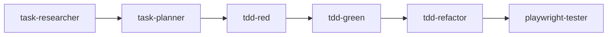

# GitHub Copilot Agents - Road Trip Planner

This directory contains custom GitHub Copilot agents designed to accelerate development and maintain code quality for the Road Trip Planner project.

## 📋 Table of Contents

- [Agent Overview](#agent-overview)
- [Installation](#installation)
- [Usage Workflow](#usage-workflow)
- [Agent Reference](#agent-reference)
- [Success Metrics](#success-metrics)

## Agent Overview

These agents systematically address the project's [20-issue roadmap](../../PROJECT_INSTRUCTIONS.md) across 4 milestones (134-181 hours of work):

1. **Production Ready** (Due: Dec 18, 2025) - Testing infrastructure, type safety, security
2. **Pre-Launch Quality** (Due: Jan 8, 2026) - Accessibility, monitoring, API docs
3. **Post-Launch Enhancement** (Due: Feb 5, 2026) - Features, performance, E2E testing
4. **Future Improvements** (Due: Mar 5, 2026) - Architecture, code quality, automation

## Installation

### VS Code Extension Required

Install the [GitHub Copilot extension](https://marketplace.visualstudio.com/items?itemName=GitHub.copilot) (version 1.250.0+) for agent support.

### Using Agents

Agents are invoked in VS Code Copilot Chat using the `@` symbol:

```
@tdd-red Write failing tests for vehicle-aware routing with Mapbox truck profile
@tech-debt-remediation-plan Analyze TypeScript any violations and create remediation plan
@accessibility Audit MapComponent for WCAG AA compliance
```

### Agent Files

All `.agent.md` files in this directory are automatically discovered by GitHub Copilot. No additional configuration needed.

## Usage Workflow

### Phase 1: Foundation (Weeks 1-2)

**Goal:** Fix critical testing and type safety issues

1. **Setup Frontend Testing**
   ```
   @tdd-red Create Vitest test infrastructure for useTripStore
   @tdd-green Implement mocking for Mapbox and Gemini APIs
   ```

2. **Remove TypeScript `any` Violations**
   ```
   @tech-debt-remediation-plan Analyze all TypeScript any types
   @janitor Remove any types and add proper interfaces in src/
   ```

3. **Security Hardening**
   ```
   @janitor Create .env.example files for backend and frontend
   @tech-debt-remediation-plan Plan removal of hardcoded Mapbox token
   ```

4. **Accessibility Compliance**
   ```
   @accessibility Audit all components for WCAG AA compliance
   @accessibility Add aria-labels and keyboard navigation
   ```

### Phase 2: Feature Development (Weeks 3-4)

**Goal:** Implement vehicle-aware routing and AI features

1. **Research and Planning**
   ```
   @task-researcher Research Mapbox truck profile API for vehicle dimensions
   @task-planner Create implementation plan for vehicle-aware routing
   ```

2. **Implementation**
   ```
   @debug Fix route GeoJSON persistence to database
   @tdd-green Implement vehicle profile integration with Mapbox
   ```

3. **E2E Testing**
   ```
   @playwright-tester Generate E2E tests for route calculation flow
   @playwright-tester Test trip save/load functionality
   ```

### Phase 3: Infrastructure (Week 5)

**Goal:** Optimize Azure deployment and monitoring

1. **Azure Optimization**
   ```
   @terraform-azure-planning Plan auto-scaling rules for App Service
   @task-researcher Research Application Insights integration patterns
   ```

2. **Documentation**
   ```
   @api-docs-generator Enhance FastAPI Swagger with OAuth examples
   @context7 Verify latest React Map GL best practices
   ```

### Phase 4: Continuous Quality (Ongoing)

**Goal:** Maintain code quality and prevent regressions

1. **Regular Cleanup**
   ```
   @janitor Replace console.log() with structured logging
   @janitor Remove unused imports and standardize error handling
   ```

2. **Pre-commit Enforcement**
   ```
   @pre-commit-enforcer Configure Husky to block TypeScript errors
   ```

## Agent Reference

### Testing & Quality Agents

#### `tdd-red.agent.md`
**Purpose:** Write failing tests first (Test-Driven Development)  
**Use Cases:**
- Install Vitest for frontend (`npm install -D vitest @testing-library/react`)
- Create failing tests for new features (vehicle routing, AI trip generation)
- Test edge cases from GitHub issues

**Example:**
```
@tdd-red Write failing test for vehicle dimensions validation in useTripStore
```

#### `tdd-green.agent.md`
**Purpose:** Implement minimal code to make tests pass  
**Use Cases:**
- Mock external APIs (Mapbox, Gemini, Azure Maps)
- Implement feature logic after tests are written
- Fix test failures with minimum code changes

**Example:**
```
@tdd-green Implement vehicle profile API call to Mapbox
```

#### `tdd-refactor.agent.md`
**Purpose:** Improve code quality while keeping tests green  
**Use Cases:**
- Extract duplicate code (image logic, token retrieval)
- Apply SOLID principles
- Security hardening (input validation, error handling)

**Example:**
```
@tdd-refactor Clean up duplicate token retrieval logic in MapComponent
```

#### `tech-debt-remediation-plan.agent.md`
**Purpose:** Generate technical debt remediation plans  
**Use Cases:**
- Analyze TypeScript `any` violations (20+ in codebase)
- Identify missing `.env.example` files
- Plan refactoring for hardcoded secrets

**Example:**
```
@tech-debt-remediation-plan Create plan to remove all TypeScript any types
```

#### `janitor.agent.md`
**Purpose:** Code cleanup and maintenance  
**Use Cases:**
- Replace `console.log()` with structured logging
- Remove unused imports and variables
- Standardize error handling patterns

**Example:**
```
@janitor Clean up console.log statements in backend/main.py
```

#### `accessibility.agent.md`
**Purpose:** WCAG AA compliance auditing  
**Use Cases:**
- Add `aria-label` to icon-only buttons
- Implement keyboard navigation
- Run axe-core automated testing

**Example:**
```
@accessibility Audit TripCard component for accessibility issues
```

#### `playwright-tester.agent.md`
**Purpose:** E2E test generation with site exploration  
**Use Cases:**
- Navigate app like a user would
- Generate tests for route calculation flow
- Test trip save/load functionality

**Example:**
```
@playwright-tester Create E2E test for multi-stop route planning
```

### Planning & Research Agents

#### `task-researcher.agent.md`
**Purpose:** Deep research using all available tools  
**Use Cases:**
- Research Mapbox truck profile API documentation
- Find Azure Blob Storage patterns for image upload
- Investigate latest React Map GL features

**Example:**
```
@task-researcher Research Mapbox directions API for vehicle dimensions
```

#### `task-planner.agent.md`
**Purpose:** Create actionable implementation plans  
**Use Cases:**
- Plan vehicle-aware routing implementation
- Create phased approach for AI trip generation
- Design JWT refresh token flow

**Example:**
```
@task-planner Create plan for implementing vehicle routing with Mapbox
```

#### `debug.agent.md`
**Purpose:** Systematic bug investigation  
**Use Cases:**
- Fix route GeoJSON persistence (#5 in roadmap)
- Diagnose JWT refresh token issues (#10)
- Investigate POI search performance (#10)

**Example:**
```
@debug Investigate why route GeoJSON is not saved to database
```

### Documentation & Library Agents

#### `context7.agent.md`
**Purpose:** Up-to-date library documentation expert  
**Use Cases:**
- Verify latest Mapbox API patterns
- Research React Map GL best practices
- Validate Zustand store patterns

**Example:**
```
@context7 What are the latest React Map GL markers best practices?
```

#### `api-docs-generator.agent.md` (Custom)
**Purpose:** FastAPI Swagger documentation enhancement  
**Use Cases:**
- Add docstrings to all route handlers
- Create request/response examples
- Document OAuth flow

**Example:**
```
@api-docs-generator Add Swagger examples for /api/trips endpoints
```

### Infrastructure Agents

#### `terraform-azure-planning.agent.md`
**Purpose:** Azure infrastructure planning  
**Use Cases:**
- Plan auto-scaling rules for App Service
- Design Redis caching layer
- Configure Application Insights integration

**Example:**
```
@terraform-azure-planning Plan auto-scaling for roadtrip-api-hl App Service
```

#### `pre-commit-enforcer.agent.md` (Custom)
**Purpose:** Configure pre-commit hooks  
**Use Cases:**
- Block commits with TypeScript errors
- Run ESLint on staged files
- Enforce conventional commits

**Example:**
```
@pre-commit-enforcer Configure Husky to run ESLint on staged files
```

## Success Metrics

Track agent effectiveness using these KPIs:

### Code Quality
- **TypeScript Safety:** Zero `any` types (currently 20+)
- **Test Coverage:** Backend 80%+, Frontend 60%+ (currently: backend ~40%, frontend 0%)
- **Linting:** Zero ESLint errors

### Accessibility
- **WCAG AA Compliance:** Pass WAVE checker (currently 0%)
- **Keyboard Navigation:** All interactive elements accessible
- **Screen Reader:** Proper ARIA labels (currently missing)

### Performance
- **API Response Time:** <3s average (currently ~2.5s)
- **Error Rate:** <5% (currently ~2%)
- **Test Execution:** <30s for full suite

### Security
- **No Hardcoded Secrets:** `.env.example` files created ✅
- **JWT Refresh:** Implemented (currently 15-min expiration)
- **Input Validation:** All API endpoints secured

### Documentation
- **API Docs:** Swagger with examples (currently basic)
- **Architecture Diagrams:** Mermaid diagrams added
- **Code Comments:** All complex logic documented

## Agent Integration Strategy

### Sequential vs. Parallel Execution

**Phase 1: Sequential (Foundation)**
- TDD agents → Tech Debt → Accessibility (prevents conflicts)

**Phases 2-4: Parallel (Features)**
- Research agents (routing) + Debug agents (GeoJSON) + Playwright (E2E) independently

### Handoff Patterns



### Checkpoint Reviews

After each phase, run:
```
@tech-debt-remediation-plan Review remaining technical debt
@accessibility Check WCAG compliance status
```

## Custom Agent Development

To create new agents, follow the pattern in `api-docs-generator.agent.md` and `pre-commit-enforcer.agent.md`:

1. **Frontmatter:** Define name, description, tools
2. **Core Principles:** Specify behavior and constraints
3. **Execution Guidelines:** Step-by-step workflow
4. **Checklist:** Validation criteria

See [Custom Agent Foundry](https://github.com/github/awesome-copilot/blob/main/agents/custom-agent-foundry.agent.md) for full guide.

## Troubleshooting

### Agent Not Found
- Ensure `.agent.md` file is in `.github/copilot-agents/`
- Restart VS Code to refresh agent discovery

### Agent Not Responding
- Check Copilot extension is updated (1.250.0+)
- Verify GitHub Copilot subscription is active

### Agent Conflicts
- Use one agent at a time for file edits
- Commit changes between agent invocations

## Resources

- [GitHub Copilot Agents Documentation](https://docs.github.com/en/copilot/using-github-copilot/using-agents)
- [Awesome Copilot Repository](https://github.com/github/awesome-copilot)
- [Project Roadmap](../../PROJECT_INSTRUCTIONS.md)
