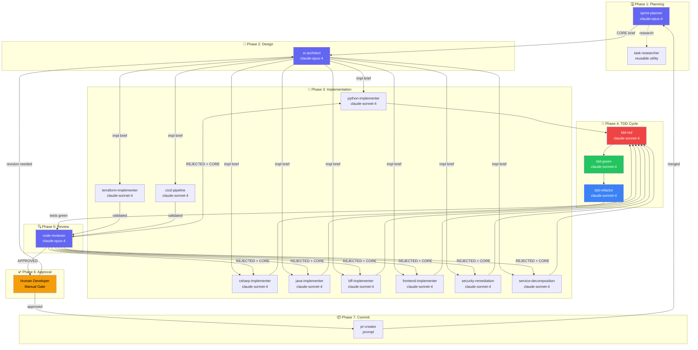
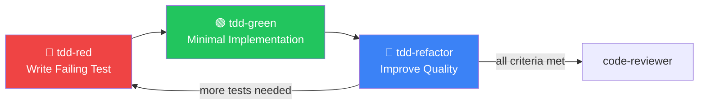
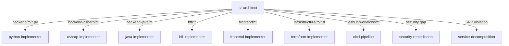
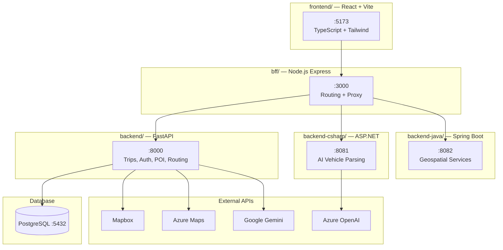

# AI SDLC Workflow — Road Trip Planner

> **Purpose**: Define the end-to-end AI-assisted Software Development Lifecycle for the Road Trip Planner project.  
> **Audience**: Developers, AI agents, and anyone contributing to the project.  
> **Last Updated**: Auto-generated from roadmap analysis.

---

## Table of Contents

1. [Pipeline Overview](#pipeline-overview)
2. [Architecture Diagram](#architecture-diagram)
3. [Agent Catalog](#agent-catalog)
4. [Stage Details & CORE Prompts](#stage-details--core-prompts)
5. [Service Boundary Map](#service-boundary-map)
6. [Roadmap Coverage Matrix](#roadmap-coverage-matrix)
7. [Model Assignments](#model-assignments)
8. [Quick Reference](#quick-reference)
9. [Per-Language Developer Workflow Guides](#per-language-developer-workflow-guides)

---

## Pipeline Overview

The AI SDLC follows a **7-stage pipeline** with human approval gates:

```
Sprint Planning → Architecture → Implementation → TDD → Code Review → Human Approval → PR Creation
```

Each stage has a dedicated agent (or set of agents) with clear handoff protocols using the **CORE Framework** (Context, Objective, Requirements, Example).

---

## Architecture Diagram

### Main Pipeline Flow



### TDD Cycle Detail



### Agent Routing by Service



---

## Agent Catalog

### SDLC Pipeline Agents (`.github/agents/`)

| Agent | Model | Role | Scope |
|-------|-------|------|-------|
| `sprint-planner` | claude-opus-4 | Reads roadmaps, selects sprint tasks, delegates | All 5 roadmap files |
| `sr-architect` | claude-opus-4 | Designs implementation, routes to implementers | Full codebase (read-only) |
| `python-implementer` | claude-sonnet-4 | Python FastAPI implementation | `backend/**/*.py` |
| `csharp-implementer` | claude-sonnet-4 | C# ASP.NET implementation | `backend-csharp/**` |
| `java-implementer` | claude-sonnet-4 | Java Spring Boot implementation | `backend-java/**` |
| `bff-implementer` | claude-sonnet-4 | Node.js BFF implementation | `bff/**` |
| `frontend-implementer` | claude-sonnet-4 | React/TypeScript implementation | `frontend/**` |
| `code-reviewer` | claude-opus-4 | Reviews against conventions, SOLID, security | Full codebase (read-only) |

### Reusable Utility Agents (`.github/copilot-agents/`)

| Agent | Model | Role |
|-------|-------|------|
| `tdd-red` | claude-sonnet-4 | Write failing tests (Red phase) |
| `tdd-green` | claude-sonnet-4 | Minimal implementation to pass (Green phase) |
| `tdd-refactor` | claude-sonnet-4 | Improve quality while keeping green (Refactor phase) |
| `security-remediation` | claude-sonnet-4 | Fix Critical/High security vulnerabilities |
| `service-decomposition` | claude-sonnet-4 | SRP/ISP/DIP refactoring of monolithic files |
| `terraform-implementer` | claude-sonnet-4 | Write Terraform HCL modules |
| `cicd-pipeline` | claude-sonnet-4 | GitHub Actions & deployment scripts |
| `api-docs-generator` | — | Swagger/OpenAPI documentation (Python + C#) |
| `task-researcher` | — | Deep-dive research on implementation approaches |
| `terraform-azure-planning` | — | Azure infrastructure architecture planning |
| `debug` | — | Debugging specialist |
| `pre-commit-enforcer` | — | Pre-commit hook validation |
| `accessibility` | — | WCAG 2.1 AA compliance |
| `janitor` | — | Code cleanup and dead code removal |
| `tech-debt-remediation-plan` | — | Technical debt analysis and planning |
| `task-planner` | — | General task breakdown |
| `context7` | — | Context management utility |

---

## Stage Details & CORE Prompts

### Stage 1: Sprint Planning

**Agent**: `@sprint-planner`  
**Model**: claude-opus-4  
**Input**: 5 roadmap files  
**Output**: CORE brief for sr-architect  

#### CORE Prompt Template

```
Context:
  Sprint capacity is 1-3 tasks. The following roadmaps define all remaining work:
  - docs/ROADMAP.md (Phase 1-8, cross-cutting)
  - docs/PYTHON_BACKEND_ROADMAP.md (7 epics, 25 tasks)
  - docs/CSHARP_BACKEND_ROADMAP.md (9 epics, 34 tasks)
  - docs/TERRAFORM_ROADMAP.md (infrastructure)
  - docs/PLAYWRIGHT_TESTING_ROADMAP.md (E2E tests)

Objective:
  Select the highest-priority tasks for the next sprint, considering dependencies
  and the current state of each service.

Requirements:
  - Pick 1-3 tasks maximum
  - Critical priority before High before Medium
  - Verify dependencies are satisfied (check "Depends On" column)
  - Include the task's acceptance criteria and Definition of Done
  - Format output as a CORE brief for sr-architect

Example:
  Sprint #1 Tasks:
  1. [PYTHON] Epic 1.1 — Create constants.py (no dependencies, foundation task)
  2. [CSHARP] Epic 1.1 — Create Constants/ directory (no dependencies, foundation task)
  3. [PYTHON] Epic 2.1 — Fix SECRET_KEY hardcoding (Critical security, no dependencies)
```

---

### Stage 2: Architecture Design

**Agent**: `@sr-architect`  
**Model**: claude-opus-4  
**Input**: Sprint plan from sprint-planner  
**Output**: Implementation brief for language-specific implementer  

#### CORE Prompt Template

```
Context:
  Sprint task: {task_id} — {task_title}
  Service: {service_name} ({language})
  Current files: {list of relevant files with line counts}
  Dependencies: {list of dependencies that must exist first}

Objective:
  Design the implementation approach for this task, specify which files to
  create/modify, and define the API contract changes (if any).

Requirements:
  - List every file to create or modify with expected line ranges
  - Define function/class signatures
  - Specify test file locations and test names
  - Identify which instruction file governs conventions
  - Note any cross-service impacts (e.g., BFF route changes)

Example:
  Implementation Brief: Create backend/constants.py
  
  Files to Create:
  - backend/constants.py (~80 lines) — ERROR_*, CONFIG_*, DEFAULT_* constants
  
  Files to Modify:
  - backend/main.py — Replace 16 hardcoded strings with constant imports
  - backend/auth.py — Replace 3 hardcoded strings
  - backend/ai_service.py — Replace 2 hardcoded strings
  
  Test File:
  - backend/tests/test_constants.py — Verify all constants are importable
  
  Convention: python.instructions.md
  Delegate to: @python-implementer
```

---

### Stage 3: Implementation

**Agents**: Per-language implementers  
**Model**: claude-sonnet-4  
**Input**: Implementation brief from sr-architect  
**Output**: Code changes + tests for TDD cycle  

#### CORE Prompt Template

```
Context:
  Implementation brief from sr-architect:
  {paste the full brief}
  
  Governing conventions: {language}.instructions.md
  Test conventions: testing.instructions.md

Objective:
  Implement the changes described in the brief, following TDD
  (Red → Green → Refactor).

Requirements:
  - Write failing tests FIRST (delegate to @tdd-red)
  - Implement minimum code to pass (delegate to @tdd-green)
  - Refactor for quality (delegate to @tdd-refactor)
  - All tests must pass before handoff
  - No hardcoded strings (use constants)
  - Follow the instruction file patterns exactly

Example:
  1. @tdd-red: Write test_constants_importable() — FAIL (file doesn't exist)
  2. @tdd-green: Create constants.py with all constants — PASS
  3. @tdd-red: Write test_main_uses_constants() — FAIL (main.py still hardcoded)
  4. @tdd-green: Replace hardcoded strings in main.py — PASS
  5. @tdd-refactor: Group constants by domain, add docstrings — PASS
  6. Hand off to @code-reviewer
```

---

### Stage 4: TDD Cycle

**Agents**: `@tdd-red` → `@tdd-green` → `@tdd-refactor`  
**Model**: claude-sonnet-4  
**Input**: Test specification from implementer  
**Output**: Passing tests + quality code  

#### CORE Prompt Template (Red)

```
Context:
  Task: {task_description}
  Language: {Python/C#/Java/TypeScript}
  Test file: {path to test file}
  Source file: {path to source file}

Objective:
  Write a failing test that validates the acceptance criteria for this task.

Requirements:
  - Test name describes the behavior: test_{action}_{expected_result}
  - Use AAA pattern (Arrange, Act, Assert)
  - Mock external dependencies (APIs, databases)
  - Test must actually FAIL before implementation
  - Follow testing.instructions.md conventions

Example:
  def test_constants_error_messages_importable():
      """All error message constants should be importable from constants module."""
      from constants import ERROR_INVALID_TOKEN, ERROR_USER_NOT_FOUND, ERROR_TRIP_NOT_FOUND
      assert ERROR_INVALID_TOKEN is not None
      assert ERROR_USER_NOT_FOUND is not None
```

---

### Stage 5: Code Review

**Agent**: `@code-reviewer`  
**Model**: claude-opus-4  
**Input**: Completed implementation with passing tests  
**Output**: APPROVED or REJECTED with CORE feedback  

#### CORE Prompt Template (Rejection)

```
Context:
  Reviewed: {task_id} — {task_title}
  Implementer: @{language}-implementer
  Files changed: {list}
  Tests: {pass_count}/{total_count} passing

Objective:
  Fix the following issues identified during code review.

Requirements:
  Issue 1: {file:line} — {description of problem}
    Fix: {specific fix instruction}
  
  Issue 2: {file:line} — {description of problem}
    Fix: {specific fix instruction}

Example:
  Issue 1: backend/constants.py:15 — ERROR_INVALID_TOKEN uses "Invalid token" 
    but auth.py:42 expects "Invalid or expired token"
    Fix: Update constant value to match existing behavior
```

---

### Stage 6: Human Approval

**Actor**: Human Developer  
**Input**: Code review approval + diff  
**Output**: Approve or request revision  

This is a **manual gate**. The human reviews:
- The code-reviewer's approval checklist
- The actual diff
- Test results
- Any cross-service impacts

---

### Stage 7: PR Creation

**Prompt**: `/pr-creator`  
**Input**: Approved changes  
**Output**: Pull request with conventional commit  

See [pr-creator.prompt.md](../.github/prompts/pr-creator.prompt.md) for the full template.

---

## Service Boundary Map



---

## Roadmap Coverage Matrix

This matrix maps every agent to the roadmap tasks it can execute:

| Agent | ROADMAP.md | PYTHON | CSHARP | TERRAFORM | PLAYWRIGHT |
|-------|-----------|--------|--------|-----------|------------|
| `sprint-planner` | All phases | All epics | All epics | All phases | All phases |
| `sr-architect` | All phases | All epics | All epics | All phases | All phases |
| `python-implementer` | Phase 2 | Epics 1-7 | — | — | — |
| `csharp-implementer` | Phase 3 | — | Epics 1-9 | — | — |
| `java-implementer` | Phase 4 | — | — | — | — |
| `bff-implementer` | Phase 2, 5B | — | — | — | — |
| `frontend-implementer` | Phase 5-7 | — | — | — | — |
| `terraform-implementer` | Phase 8 | — | — | All phases | — |
| `cicd-pipeline` | Phase 8 | — | — | CI/CD | — |
| `security-remediation` | — | Epic 2 | Epic 2 | — | — |
| `service-decomposition` | — | Epic 3-4 | Epic 3-4 | — | — |
| `tdd-red/green/refactor` | All | All | All | — | — |
| `code-reviewer` | All | All | All | All | All |

---

## Model Assignments

| Model | Purpose | Agents |
|-------|---------|--------|
| `claude-opus-4` | Architecture, design, heavy reasoning | `sprint-planner`, `sr-architect`, `code-reviewer` |
| `claude-sonnet-4` | Implementation, testing, focused tasks | All implementers, TDD agents, security, decomposition, terraform, cicd |

**Rationale**: Opus for decisions that require understanding the full system context and making architectural tradeoffs. Sonnet 4 for focused implementation tasks where speed and code quality matter more than broad reasoning.

---

## Quick Reference

### Starting a Sprint
```
@sprint-planner Select the next sprint tasks from the roadmaps
```

### Implementing a Task
```
@sr-architect Design the implementation for [task description]
```

### Running TDD Cycle
```
@tdd-red Write failing tests for [feature]
@tdd-green Make the tests pass
@tdd-refactor Improve the code quality
```

### Security Fix
```
@security-remediation Fix SEC-1: SECRET_KEY hardcoding in auth.py
```

### Code Review
```
@code-reviewer Review the implementation of [task]
```

### Creating PR
```
/pr-creator
```

### Available Prompts
| Prompt | Purpose |
|--------|---------|
| `/docker-hardening` | Harden Dockerfiles (non-root, healthcheck) |
| `/csharp-constants-extraction` | Extract C# hardcoded strings to Constants/ |
| `/python-constants-extraction` | Extract Python hardcoded strings to constants.py |
| `/service-split` | Decompose monolithic files into services |
| `/security-audit` | OWASP Top 10 audit with finding report |
| `/rate-limiting` | Add rate limiting to API proxy endpoints |
| `/pr-creator` | Create pull request with conventional commit |
| `/react-component` | Generate React component |
| `/zustand-store` | Generate Zustand store |
| `/custom-hook` | Generate custom React hook |
| `/version-update` | Semantic version bump |
| `/playwright-test-planner` | Plan E2E tests |
| `/playwright-test-coverage` | Analyze Playwright coverage |

---

## Per-Language Developer Workflow Guides

Each guide below contains the **complete task inventory** for a specific technology stack, with paste-ready **CORE framework prompts** for every task. Use these as your primary reference when implementing roadmap tasks.

| Guide | Agent | Tasks | Source Roadmap |
|-------|-------|-------|----------------|
| [Python AI Workflow](./PYTHON_AI_WORKFLOW.md) | `@python-implementer` | 21 tasks, 7 epics | [PYTHON_BACKEND_ROADMAP.md](./PYTHON_BACKEND_ROADMAP.md) |
| [C# AI Workflow](./CSHARP_AI_WORKFLOW.md) | `@csharp-implementer` | 27 tasks, 9 epics | [CSHARP_BACKEND_ROADMAP.md](./CSHARP_BACKEND_ROADMAP.md) |
| [Java AI Workflow](./JAVA_AI_WORKFLOW.md) | `@java-implementer` | 8 tasks, 3 epics | [ROADMAP.md](./ROADMAP.md) Phase 4 |
| [BFF AI Workflow](./BFF_AI_WORKFLOW.md) | `@bff-implementer` | 11 tasks, 3 epics | [ROADMAP.md](./ROADMAP.md) Phase 2 + 5B |
| [Frontend AI Workflow](./FRONTEND_AI_WORKFLOW.md) | `@frontend-implementer` | 22 tasks, 5 epics | [ROADMAP.md](./ROADMAP.md) Phase 5–7 |
| [Terraform AI Workflow](./TERRAFORM_AI_WORKFLOW.md) | `@terraform-implementer` | 40 tasks, 5 phases | [TERRAFORM_ROADMAP.md](./TERRAFORM_ROADMAP.md) |
| [CI/CD AI Workflow](./CICD_AI_WORKFLOW.md) | `@cicd-pipeline` | 10 tasks, 3 epics | [ROADMAP.md](./ROADMAP.md) Phase 8 |
| [Playwright AI Workflow](./PLAYWRIGHT_AI_WORKFLOW.md) | (Playwright) | 50 tests, 11 groups | [PLAYWRIGHT_TESTING_ROADMAP.md](./PLAYWRIGHT_TESTING_ROADMAP.md) |
