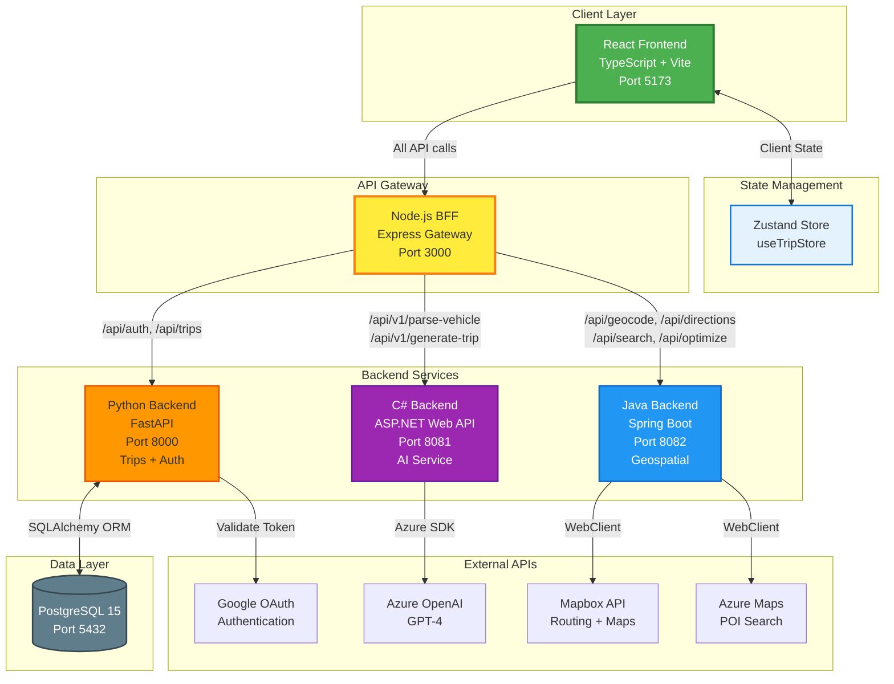
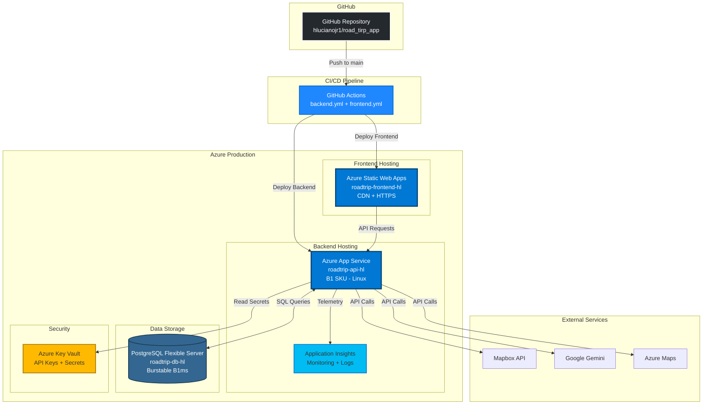
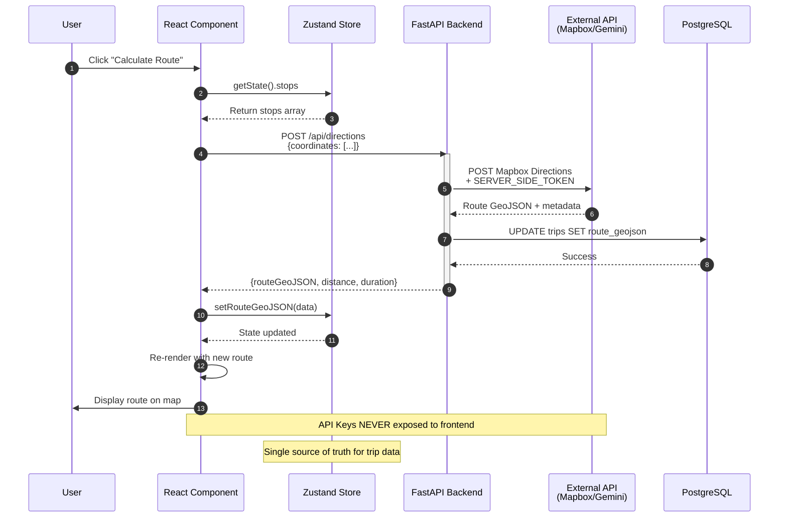
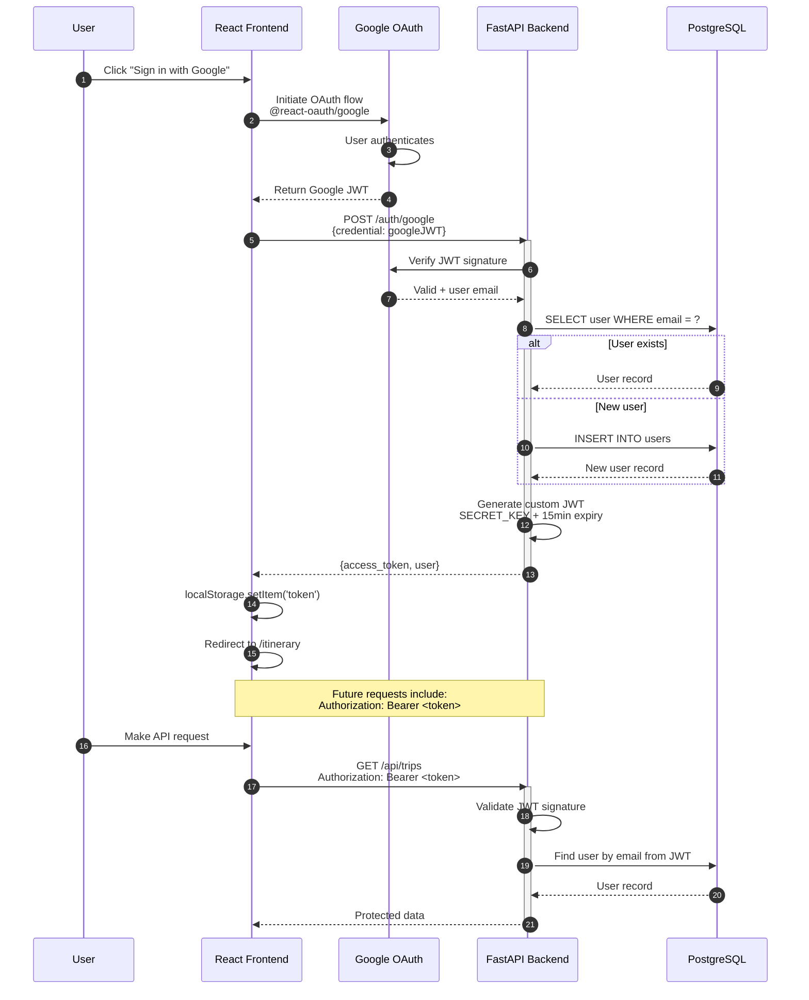
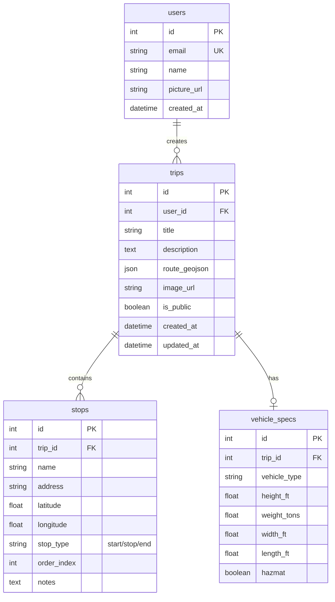

# Road Trip Planner - Architecture Documentation

**Last Updated**: February 25, 2026  
**Version**: 2.0.0  
**Status**: Polyglot Microservices Architecture (Docker-First)

---

## Table of Contents

1. [System Architecture](#system-architecture)
2. [Service Responsibilities](#service-responsibilities)
3. [Azure Deployment Architecture](#azure-deployment-architecture)
4. [Component Hierarchy](#component-hierarchy)
5. [Data Flow Diagram](#data-flow-diagram)
6. [Authentication Flow](#authentication-flow)
7. [Deployment Pipeline](#deployment-pipeline)
8. [Database Schema](#database-schema)
9. [Technology Stack](#technology-stack)
10. [Design Patterns](#design-patterns)

---

## System Architecture

The Road Trip Planner uses a **polyglot microservices** architecture with a **Node.js BFF (Backend-for-Frontend)** API gateway routing to three backend services: Python (trips/auth), C# (AI), and Java (geospatial). All services run in Docker Compose locally with a shared PostgreSQL database.



### Key Architectural Principles

1. **BFF API Gateway**: All frontend requests go through the Node.js BFF, which routes to the appropriate backend
2. **Polyglot Backends**: Python (trips/auth), C# (AI), Java (geospatial) — each in its optimal language
3. **API Proxy Pattern**: External API calls (Mapbox, Azure Maps, Azure OpenAI) go through backend services to hide API keys
4. **Shared Database**: All services connect to one PostgreSQL instance (simplest for local dev)
5. **Docker-First**: All services defined in `docker-compose.yml`, run locally with `docker-compose up`
6. **Client-Side State Management**: Zustand store maintains single source of truth for trip data
7. **RESTful API Design**: Each backend provides OpenAPI/Swagger documentation

---

## Service Responsibilities

| Service | Technology | Port | Owns |
|---------|-----------|------|------|
| **BFF** | Node.js / Express | 3000 | Request routing, CORS, health aggregation, error normalization, request ID propagation |
| **Python** | FastAPI | 8000 | Trip CRUD, authentication (Google OAuth + JWT), vehicle specs fallback, public trips |
| **C#** | ASP.NET Web API | 8081 | AI vehicle parsing (Azure OpenAI), AI trip generation, rule-based fallback |
| **Java** | Spring Boot | 8082 | Geocoding (Mapbox), directions (Mapbox), POI search (Azure Maps), route optimization (Mapbox) |
| **PostgreSQL** | PostgreSQL 15 | 5432 | Shared relational database for all services |

---

## Azure Deployment Architecture

Production deployment on Microsoft Azure with multiple managed services.



### Azure Resources

| Resource | Name | SKU/Tier | Purpose |
|----------|------|----------|---------|
| Static Web Apps | `roadtrip-frontend-hl` | Free | Frontend hosting with CDN |
| App Service | `roadtrip-api-hl` | B1 (Linux) | Backend API hosting |
| PostgreSQL Flexible Server | `roadtrip-db-hl` | Burstable B1ms | Production database |
| Key Vault | `roadtrip-kv-hl` | Standard | Secret management |
| Application Insights | `roadtrip-insights` | - | Monitoring & logging |

### Deployment Regions

- **Primary**: East US (all resources)
- **CDN**: Global (Static Web Apps automatic)

---

## Component Hierarchy

Frontend component tree showing React component relationships and state dependencies.

```mermaid
graph TD
    subgraph "Application Root"
        APP[App.tsx<br/>React Router]
    end
    
    subgraph "Layout"
        ML[MainLayout.tsx<br/>Responsive Container]
        NAV1[DesktopSidebar.tsx<br/>Navigation]
        NAV2[MobileBottomNav.tsx<br/>Bottom Nav]
    end
    
    subgraph "Views (Routes)"
        V1[StartTripView.tsx<br/>/]
        V2[ItineraryView.tsx<br/>/itinerary]
        V3[ExploreView.tsx<br/>/explore]
        V4[AllTripsView.tsx<br/>/all-trips]
        V5[TripsView.tsx<br/>/trips]
    end
    
    subgraph "Shared Components"
        MAP[MapComponent.tsx<br/>React Map GL<br/>Mapbox Integration]
        FP[FloatingPanel.tsx<br/>Trip Management UI]
    end
    
    subgraph "State Management"
        STORE[useTripStore.ts<br/>Zustand Store<br/>- stops[]<br/>- routeGeoJSON<br/>- vehicleSpecs<br/>- currentTrip]
    end
    
    APP --> ML
    ML --> NAV1
    ML --> NAV2
    ML --> V1
    ML --> V2
    ML --> V3
    ML --> V4
    ML --> V5
    
    V2 --> MAP
    V2 --> FP
    V3 --> MAP
    
    V1 -.->|Read/Write| STORE
    V2 -.->|Read/Write| STORE
    V3 -.->|Read/Write| STORE
    V4 -.->|Read| STORE
    V5 -.->|Read| STORE
    FP -.->|Read/Write| STORE
    MAP -.->|Read| STORE
    
    style APP fill:#61dafb,stroke:#20232a,stroke-width:3px
    style ML fill:#4caf50,stroke:#2e7d32,stroke-width:2px
    style MAP fill:#2196f3,stroke:#1565c0,stroke-width:2px,color:#fff
    style FP fill:#ff9800,stroke:#e65100,stroke-width:2px
    style STORE fill:#ffeb3b,stroke:#f57f17,stroke-width:3px
```

### Component Responsibilities

| Component | Type | Responsibility |
|-----------|------|----------------|
| `App.tsx` | Root | React Router configuration, route definitions |
| `MainLayout.tsx` | Layout | Responsive shell with navigation |
| `MapComponent.tsx` | Feature | Mapbox GL integration, route rendering |
| `FloatingPanel.tsx` | Feature | Trip CRUD operations, stop management |
| `StartTripView.tsx` | Page | Trip creation wizard, templates |
| `ItineraryView.tsx` | Page | Active trip editing with map |
| `ExploreView.tsx` | Page | POI discovery, public trips |
| `AllTripsView.tsx` | Page | User's trip library |
| `TripsView.tsx` | Page | Trip list view |

---

## Data Flow Diagram

End-to-end data flow for route calculation (primary use case).



### Critical Data Flow Rules

1. **Never expose API keys to frontend** - All external API calls proxied through backend
2. **Zustand as single source of truth** - All components read from the same store
3. **Immutable state updates** - Use `set((state) => ({ ... }))` pattern in Zustand
4. **GeoJSON standard format** - All geographic data uses `[longitude, latitude]` order
5. **Backend validates all inputs** - Pydantic schemas enforce type safety

---

## Authentication Flow

OAuth 2.0 flow with Google Sign-In and custom JWT token generation.



### Authentication Components

- **Frontend**: `@react-oauth/google` library for OAuth popup
- **Backend**: `python-jose[cryptography]` for JWT signing/verification
- **Token Storage**: `localStorage` (browser)
- **Token Expiry**: 15 minutes (configurable via `ACCESS_TOKEN_EXPIRE_MINUTES`)
- **Protected Routes**: `get_current_user` dependency in FastAPI

---

## Deployment Pipeline

CI/CD workflow using GitHub Actions for continuous deployment to Azure.

```mermaid
graph LR
    subgraph "Developer Workflow"
        DEV[Developer<br/>Local Machine]
        COMMIT[git commit]
        PUSH[git push origin main]
    end
    
    subgraph "GitHub"
        REPO[GitHub Repository]
        ACTIONS[GitHub Actions]
    end
    
    subgraph "Backend Pipeline"
        B1[Checkout code]
        B2[Setup Python 3.11]
        B3[Install dependencies]
        B4[Run pytest]
        B5[Build Docker image]
        B6[Deploy to Azure App Service]
    end
    
    subgraph "Frontend Pipeline"
        F1[Checkout code]
        F2[Setup Node.js 20]
        F3[npm install]
        F4[npm run test]
        F5[npm run build]
        F6[Deploy to Static Web Apps]
    end
    
    subgraph "Azure Production"
        AZURE_BE[Azure App Service<br/>roadtrip-api-hl]
        AZURE_FE[Static Web Apps<br/>roadtrip-frontend-hl]
    end
    
    DEV --> COMMIT
    COMMIT --> PUSH
    PUSH --> REPO
    REPO -->|Trigger workflow| ACTIONS
    
    ACTIONS -->|backend.yml| B1
    B1 --> B2 --> B3 --> B4 --> B5 --> B6
    B6 --> AZURE_BE
    
    ACTIONS -->|frontend.yml| F1
    F1 --> F2 --> F3 --> F4 --> F5 --> F6
    F6 --> AZURE_FE
    
    style DEV fill:#24292e,stroke:#fff,stroke-width:2px,color:#fff
    style ACTIONS fill:#2088ff,stroke:#0366d6,stroke-width:3px,color:#fff
    style AZURE_BE fill:#0078d4,stroke:#004578,stroke-width:3px,color:#fff
    style AZURE_FE fill:#0078d4,stroke:#004578,stroke-width:3px,color:#fff
    style B4 fill:#28a745,stroke:#1e7e34,stroke-width:2px,color:#fff
    style F4 fill:#28a745,stroke:#1e7e34,stroke-width:2px,color:#fff
```



### Pipeline Stages

#### Backend Pipeline (`.github/workflows/backend.yml`)

1. **Build**: Checkout → Setup Python 3.11 → Install dependencies
2. **Test**: Run pytest with coverage
3. **Package**: Build Docker container image
4. **Deploy**: Push to Azure App Service

#### Frontend Pipeline (`.github/workflows/frontend.yml`)

1. **Build**: Checkout → Setup Node.js 20 → npm install
2. **Test**: Run Vitest unit tests
3. **Build**: `npm run build` → Vite production bundle
4. **Deploy**: Azure Static Web Apps deployment

### Deployment Triggers

- **Automatic**: Push to `main` branch
- **Manual**: GitHub Actions workflow dispatch
- **Rollback**: Redeploy previous commit

---

## Database Schema

Entity-relationship diagram showing the PostgreSQL database structure.



### Database Details

- **ORM**: SQLAlchemy 2.0
- **Migrations**: Alembic
- **Dual Support**: SQLite (local dev) / PostgreSQL (production)
- **Connection Pooling**: SQLAlchemy engine default settings
- **Timezone**: UTC for all timestamps

### Key Relationships

- **User → Trips**: One-to-many (user owns multiple trips)
- **Trip → Stops**: One-to-many (trip contains ordered stops)
- **Trip → Vehicle Specs**: One-to-one (optional vehicle configuration)

---

## Technology Stack

### Frontend

| Category | Technology | Version | Purpose |
|----------|-----------|---------|---------|
| Framework | React | 18.3+ | UI library |
| Language | TypeScript | 5.6+ | Type safety |
| Build Tool | Vite | 5.4+ | Fast development/build |
| State Management | Zustand | 5.0+ | Global state |
| Routing | React Router | 6.28+ | Client-side routing |
| Maps | React Map GL | 7.1+ | Mapbox integration |
| Styling | Tailwind CSS | 3.4+ | Utility-first CSS |
| HTTP Client | Axios | 1.7+ | API requests |
| Testing | Vitest | 2.1+ | Unit tests |

### Backend

| Category | Technology | Version | Purpose |
|----------|-----------|---------|---------|
| Framework | FastAPI | 0.115+ | API framework |
| Language | Python | 3.11+ | Backend language |
| ORM | SQLAlchemy | 2.0+ | Database abstraction |
| Migrations | Alembic | 1.13+ | Schema versioning |
| Auth | python-jose | 3.3+ | JWT tokens |
| Validation | Pydantic | 2.9+ | Request/response schemas |
| HTTP Client | httpx | 0.27+ | Async API calls |
| AI | google-generativeai | 0.8+ | Gemini integration |
| Testing | pytest | 8.3+ | Unit/integration tests |

### External Services

- **Mapbox**: Routing, directions, geocoding
- **Google Gemini**: AI vehicle spec parsing
- **Azure Maps**: POI search
- **Google OAuth**: Authentication

---

## Design Patterns

### 1. Backend-for-Frontend (BFF)

The FastAPI backend acts as an API aggregation layer, proxying requests to external services while hiding API keys and transforming responses for frontend consumption.

**Benefits**:
- Centralized API key management
- Response transformation/simplification
- Rate limiting control
- Future microservice readiness

### 2. Repository Pattern

Service modules (`ai_service.py`, `auth.py`) encapsulate business logic and external API calls, keeping route handlers in `main.py` thin.

**Example**:
```python
# main.py (route handler)
@app.post("/api/parse-vehicle")
async def parse_vehicle(description: str):
    return await ai_service.parse_vehicle_specs(description)

# ai_service.py (business logic)
async def parse_vehicle_specs(description: str):
    # Gemini API call logic here
```

### 3. State Management Pattern (Zustand)

Single store (`useTripStore`) maintains all trip-related state with immutable updates.

**Rules**:
- Global state: Trip data, route, vehicle specs
- Local state: Form inputs, UI toggles
- Derived state: Calculated on-the-fly (total distance)

### 4. API Proxy Pattern

All external API calls go through the backend to hide API keys from the client.

**Flow**: Frontend → Backend → External API → Backend → Frontend

### 5. Database Abstraction

SQLAlchemy ORM with dual database support (SQLite for dev, PostgreSQL for prod).

**Configuration**:
```python
DATABASE_URL = os.getenv("DATABASE_URL", "sqlite:///./trips.db")
engine = create_engine(DATABASE_URL)
```

---

## Security Considerations

1. **API Key Protection**: Never expose keys to frontend (proxy through backend)
2. **JWT Token Security**: Short expiry (15min), signed with SECRET_KEY
3. **CORS Configuration**: Whitelist specific origins only
4. **SQL Injection Prevention**: SQLAlchemy ORM parameterized queries
5. **Input Validation**: Pydantic schemas on all endpoints
6. **HTTPS Only**: Enforced by Azure Static Web Apps and App Service

---

## Performance Optimizations

1. **Client-Side State**: Zustand reduces unnecessary API calls
2. **Route Caching**: Store `route_geojson` in database to avoid recalculation
3. **Database Indexing**: Primary keys, foreign keys, unique constraints
4. **CDN Delivery**: Azure Static Web Apps global CDN for frontend assets
5. **Async I/O**: FastAPI async endpoints for external API calls

---

## Future Architecture (Post-Launch)

See `docs/adr/001-bff-architecture-strategy.md` for detailed microservices migration plan.

**Planned Enhancements**:
- Extract AI service to standalone Go microservice (Issue #22)
- Implement Redis caching for POI search (Issue #11)
- Add auto-scaling for Azure App Service (Issue #13)
- Configure Application Insights monitoring (Issue #8)

---

## Related Documentation

- **Project Instructions**: `PROJECT_INSTRUCTIONS.md` - Development guide
- **ROADMAP**: `ROADMAP.md` - All 22 planned issues
- **BFF Strategy**: `docs/adr/001-bff-architecture-strategy.md` - Future microservices plan
- **API Documentation**: `/docs` endpoint (Swagger UI)

---

## Diagram Export

All diagrams in this document are written in Mermaid syntax and render natively on GitHub. To export as PNG:

```bash
# Install Mermaid CLI
npm install -g @mermaid-js/mermaid-cli

# Export diagrams
mmdc -i docs/ARCHITECTURE.md -o docs/architecture-diagrams.png
```

For individual diagram export, use online tools:
- **Mermaid Live Editor**: https://mermaid.live
- **GitHub Mermaid Rendering**: View this file on GitHub

---

**Maintained by**: Road Trip Planner Development Team  
**Last Review**: December 8, 2025  
**Next Review**: Post-launch (February 2026)
