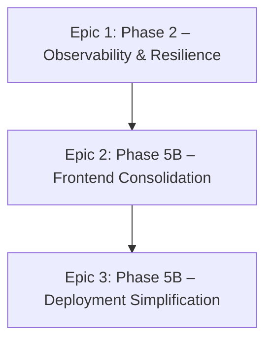

# BFF (Backend-for-Frontend) — AI Developer Workflow Guide

> **Agent**: `@bff-implementer` (claude-sonnet-4)  
> **Conventions**: [bff.instructions.md](../.github/instructions/bff.instructions.md)  
> **Source Roadmap**: [ROADMAP.md — Phase 2 + 5B](./ROADMAP.md#phase-2-nodejs-bff-service)  
> **Service**: `bff/` — Node.js Express TypeScript  
> **TDD Agents**: `@tdd-red` → `@tdd-green` → `@tdd-refactor`  
> **Total Tasks**: 11 across 3 epics | **Effort**: 16–24 hours

---

## Quick Start

```bash
# 1. Pick a task from the table below
# 2. Copy the CORE prompt for that task
# 3. Paste into Copilot Chat with the agent prefix:
@bff-implementer <paste CORE prompt>

# 4. After implementation, verify:
cd bff
npm test
npm run build
```

---

## Dependency Graph



---

## Task Inventory

| ID | Task | Epic | Priority | Est | Status | Dependencies |
|----|------|------|----------|-----|--------|-------------|
| BFF-1.1 | Add request logging with correlation IDs | 1: Observability | High | 2h | 🔴 TODO | — |
| BFF-1.2 | Add circuit breaker for backend failures | 1: Resilience | High | 3h | 🔴 TODO | — |
| BFF-1.3 | Write Jest tests for routing logic | 1: Testing | High | 3h | 🔴 TODO | — |
| BFF-1.4 | Forward Authorization headers to backends | 1: Security | Critical | 1h | 🔴 TODO | — |
| BFF-1.5 | Uniform 502 error body when backend is down | 1: Resilience | High | 1h | 🔴 TODO | BFF-1.2 |
| BFF-2.1 | Add static file serving to BFF | 2: Consolidation | High | 2–3h | 🔴 TODO | BFF-1.3 |
| BFF-2.2 | Create unified Dockerfile (React + BFF) | 2: Consolidation | High | 2–3h | 🔴 TODO | BFF-2.1 |
| BFF-2.3 | Simplify CORS & update Docker Compose | 2: Consolidation | Medium | 1–2h | 🔴 TODO | BFF-2.2 |
| BFF-2.4 | Remove nginx artifacts | 2: Consolidation | Medium | 1h | 🔴 TODO | BFF-2.3 |
| BFF-3.1 | SPA catch-all route after proxy routes | 3: Deployment | High | 0.5h | 🔴 TODO | BFF-2.1 |
| BFF-3.2 | Configure asset caching headers | 3: Deployment | Medium | 0.5h | 🔴 TODO | BFF-2.1 |

---

## Epic 1: Phase 2 Remaining — Observability, Resilience & Testing

### BFF-1.1 — Add Request Logging with Correlation IDs

<details>
<summary>📋 CORE Prompt (click to expand)</summary>

**Context**: You are working on `bff/src/`. The BFF Express app has 18 proxy routes verified but no request logging. `src/middleware/requestId.ts` exists for X-Request-ID but needs correlation ID logging. Follow [bff.instructions.md](../.github/instructions/bff.instructions.md) conventions.

**Objective**: Add structured request logging with correlation ID propagation to all backends.

**Requirements**:
- Install `morgan` or use a custom middleware for structured JSON logging
- Read `X-Request-ID` from incoming request (generate UUID if missing)
- Add `X-Correlation-ID` header to all outbound proxy requests
- Log: method, path, status, responseTime, correlationId
- Format: JSON in production, pretty-print in development
- Verify: `curl -H "X-Request-ID: test-123" http://localhost:3000/health` → logs show `correlationId: test-123`

**Example**: `{"level":"info","method":"GET","path":"/api/trips","status":200,"responseTimeMs":45,"correlationId":"test-123"}`

</details>

---

### BFF-1.2 — Add Circuit Breaker for Backend Failures

<details>
<summary>📋 CORE Prompt (click to expand)</summary>

**Context**: You are working on `bff/src/routes/proxy.ts`. When a backend service is down, proxy requests hang until timeout. No circuit breaker prevents repeated calls to failed backends.

**Objective**: Add circuit breaker pattern for each backend service.

**Requirements**:
- Install `opossum` (circuit breaker library for Node.js)
- Create circuit breakers per backend: Python (:8000), C# (:8081), Java (:8082)
- Configuration: timeout 5s, errorThreshold 50%, resetTimeout 30s
- When circuit open: return 503 immediately with `{"error":"Service temporarily unavailable","service":"python-backend"}`
- Expose circuit state in `/health` response: `{"python":{"status":"closed"},"csharp":{"status":"open"}}`
- RED: Write Jest test — simulate backend down → verify circuit opens → returns 503

**Example**: Python backend down → first 5 requests timeout → circuit opens → next request returns 503 instantly → after 30s → half-open → test request → if success → close circuit

</details>

---

### BFF-1.3 — Write Jest Tests for Routing Logic

<details>
<summary>📋 CORE Prompt (click to expand)</summary>

**Context**: You are working on `bff/`. There are zero tests. The route table in `src/routes/proxy.ts` maps paths to backends. `src/routes/health.ts` aggregates health from all backends. Follow [testing.instructions.md](../.github/instructions/testing.instructions.md).

**Objective**: Create Jest test suite for BFF routing and health aggregation.

**Requirements**:
- Add `jest`, `ts-jest`, `supertest`, `@types/jest`, `@types/supertest` as devDependencies
- Create `bff/jest.config.ts` and test script in `package.json`
- Create `src/__tests__/routes/proxy.test.ts`:
  - Test `/api/trips` routes to Python backend
  - Test `/api/v1/parse-vehicle` routes to C# backend
  - Test `/api/geocode` routes to Java backend
  - Test unknown path `/api/unknown` returns 404
  - Mock `http-proxy-middleware` or use `nock` for backend mocking
- Create `src/__tests__/routes/health.test.ts`:
  - Test `/health` returns aggregated status
  - Test when one backend is down → health returns degraded
- Create `src/__tests__/middleware/errorHandler.test.ts`:
  - Test unhandled errors → 500 + standard error JSON

**Example**: `supertest(app).get('/api/trips').expect(200)` with nock intercepting `http://backend-python:8000/api/trips`

</details>

---

### BFF-1.4 — Forward Authorization Headers to All Backends

<details>
<summary>📋 CORE Prompt (click to expand)</summary>

**Context**: You are working on `bff/src/routes/proxy.ts`. The proxy routes forward requests but may not be forwarding the `Authorization: Bearer <token>` header from the frontend to backend services. Python auth service needs this to verify JWT tokens.

**Objective**: Ensure Authorization headers are forwarded through all proxy routes.

**Requirements**:
- Verify `http-proxy-middleware` forwards `Authorization` header by default
- If not: add `onProxyReq` hook to copy `Authorization` header
- Also forward: `X-Request-ID`, `X-Correlation-ID`, `Content-Type`
- Do NOT forward: `Cookie`, `Host` (use target host)
- Write test: request with `Authorization: Bearer test-token` → backend receives same header

**Example**: Frontend → `Authorization: Bearer eyJhbG...` → BFF proxy → Python backend receives same header

</details>

---

### BFF-1.5 — Uniform 502 Error Body When Backend Is Down

<details>
<summary>📋 CORE Prompt (click to expand)</summary>

**Context**: You are working on `bff/src/middleware/errorHandler.ts`. When a backend is unreachable, the proxy returns raw ECONNREFUSED errors. Need standardized error JSON.

**Objective**: Return uniform error responses when proxy fails.

**Requirements**:
- Catch `ECONNREFUSED`, `ENOTFOUND`, `ETIMEDOUT` errors in proxy error handler
- Return: `{"error":"Backend service unavailable","service":"<name>","status":502,"correlationId":"<id>"}`
- Include `X-Correlation-ID` in error response headers
- Log the error with backend hostname and port for debugging

**Example**: Python backend down → `POST /api/trips` → 502 `{"error":"Backend service unavailable","service":"python-backend","status":502}`

</details>

---

## Epic 2: Phase 5B — BFF Frontend Consolidation

### BFF-2.1 — Add Static File Serving to BFF

<details>
<summary>📋 CORE Prompt (click to expand)</summary>

**Context**: You are working on `bff/src/index.ts`. Architecture decision (Mar 4, 2026): BFF serves the built React SPA as static files, eliminating the separate nginx/frontend container. The React build output goes to `bff/public/`. Same-origin removes CORS complexity.

**Objective**: Configure Express to serve React SPA static files with proper caching.

**Requirements**:
- Install `compression` npm package (`npm i compression @types/compression`)
- Add `compression()` middleware before all routes
- Add `express.static('public', { maxAge: '1y', immutable: true })` **before** proxy routes
- Custom middleware for `index.html`: `Cache-Control: no-cache` (HTML must not be cached, hashed assets can be)
- SPA catch-all route **after** all proxy routes: `app.get('*', (req, res) => res.sendFile('index.html'))`
- Catch-all must NOT intercept `/api/*` or `/health` routes
- Test locally: copy a built React `dist/` into `bff/public/`, verify SPA loads at `http://localhost:3000`

**Example**: `app.use(compression())` → `app.use(express.static('public', {...}))` → API routes → `app.get('*', serveIndex)`

</details>

---

### BFF-2.2 — Create Unified Dockerfile (React + BFF)

<details>
<summary>📋 CORE Prompt (click to expand)</summary>

**Context**: You are working on `bff/`. Currently the React frontend and BFF have separate Dockerfiles and containers. The unified Dockerfile builds both and serves from a single container.

**Objective**: Create multi-stage Dockerfile that builds React + BFF into one image.

**Requirements**:
- Stage 1 — Build React: `node` image, install frontend deps, `npm run build`
- Stage 2 — Build BFF: `node` image, install BFF deps, `npm run build`
- Stage 3 — Production: `node:slim`, copy BFF `dist/` + React `dist/` into `public/`, expose port 3000
- Set `VITE_API_URL=""` in Stage 1 (empty = relative paths, same-origin)
- Add `.dockerignore`: `node_modules/`, `dist/`, `.git/`, `*.md`
- Non-root user: `RUN adduser --disabled-password appuser && USER appuser`
- HEALTHCHECK: `curl -f http://localhost:3000/health || exit 1`
- Verify: `docker build -f bff/Dockerfile.unified -t roadtrip-bff:test .` (from repo root)
- Verify: `docker run -p 3000:3000 roadtrip-bff:test` → SPA loads + API proxy works

**Example**: 3-stage Dockerfile: `FROM node AS frontend-build` → `FROM node AS bff-build` → `FROM node:slim AS production`

</details>

---

### BFF-2.3 — Simplify CORS & Update Docker Compose

<details>
<summary>📋 CORE Prompt (click to expand)</summary>

**Context**: You are working on `bff/src/index.ts` and `docker-compose.yml`. With BFF serving the frontend, CORS is no longer needed for the frontend→BFF path (same-origin). The frontend service in Docker Compose becomes unnecessary.

**Objective**: Simplify CORS configuration and update Docker Compose.

**Requirements**:
- Simplify `cors()` in BFF — only keep for third-party API consumers (if any)
- Update `docker-compose.yml`: remove `frontend` service (or move to dev-only profile)
- BFF becomes the single externally-exposed container on port 3000
- Keep `docker-compose.dev.yml` unchanged — Vite dev server :5173 for hot reload
- Test: `docker-compose up --build -d` → only 4 containers (postgres, bff, python, csharp, java)
- Test: `http://localhost:3000` → React SPA loads

**Example**: Remove `frontend:` service from `docker-compose.yml`, keep in `docker-compose.dev.yml`

</details>

---

### BFF-2.4 — Remove Nginx Artifacts

<details>
<summary>📋 CORE Prompt (click to expand)</summary>

**Context**: After BFF serves the frontend, nginx-related files are obsolete: `frontend/nginx.conf`, `frontend/staticwebapp.config.json`, and the nginx stage in `frontend/Dockerfile`.

**Objective**: Remove all nginx artifacts from the codebase.

**Requirements**:
- Delete `frontend/nginx.conf`
- Delete `frontend/staticwebapp.config.json` (Azure Static Web Apps no longer used)
- Update `frontend/Dockerfile` to be build-only (no nginx stage) — or remove if unified Dockerfile handles everything
- Keep `frontend/Dockerfile.dev` for local Vite development
- Verify: `git diff --stat` shows only deletions of nginx-related files

**Example**: `rm frontend/nginx.conf frontend/staticwebapp.config.json`

</details>

---

## Epic 3: Deployment Configuration

### BFF-3.1 — SPA Catch-All Route After Proxy Routes

<details>
<summary>📋 CORE Prompt (click to expand)</summary>

**Context**: After configuring express.static in BFF-2.1, client-side routes like `/explore`, `/itinerary`, `/trips` need to serve `index.html` for React Router to handle.

**Objective**: Add SPA catch-all route that serves index.html for all non-API paths.

**Requirements**:
- Add `app.get('*', ...)` AFTER all API proxy routes and health endpoint
- Only serve index.html for paths NOT starting with `/api/` or `/health`
- Test: `curl http://localhost:3000/explore` → returns index.html (React handles routing)
- Test: `curl http://localhost:3000/api/trips` → proxies to Python (not index.html)

**Example**: `app.get('*', (req, res) => { if (!req.path.startsWith('/api') && req.path !== '/health') res.sendFile(...) })`

</details>

---

### BFF-3.2 — Configure Asset Caching Headers

<details>
<summary>📋 CORE Prompt (click to expand)</summary>

**Context**: Vite builds output hashed filenames (e.g., `index-abc123.js`). These are safe to cache indefinitely. But `index.html` must not be cached so users get the latest version.

**Objective**: Configure proper Cache-Control headers for static assets.

**Requirements**:
- Hashed assets (JS/CSS): `Cache-Control: public, max-age=31536000, immutable`
- `index.html`: `Cache-Control: no-cache`
- Images/fonts: `Cache-Control: public, max-age=86400`
- Test: `curl -I http://localhost:3000/assets/index-abc123.js` → `Cache-Control: public, max-age=31536000, immutable`
- Test: `curl -I http://localhost:3000/` → `Cache-Control: no-cache`

**Example**: `express.static('public', { maxAge: '1y', immutable: true, setHeaders: (res, path) => { if (path.endsWith('.html')) res.setHeader('Cache-Control', 'no-cache') } })`

</details>

---

## Verification Checklist

After all tasks complete, run:

```bash
# 1. All tests pass
cd bff && npm test

# 2. Build succeeds
npm run build

# 3. Unified Docker build
docker build -f Dockerfile.unified -t roadtrip-bff:test ..

# 4. Full stack
docker-compose up --build -d

# 5. SPA loads
curl http://localhost:3000 | head -5  # Should be React HTML

# 6. API proxy works
curl http://localhost:3000/health | jq '.'
curl http://localhost:3000/api/public-trips | jq '. | length'

# 7. Client-side routing
curl http://localhost:3000/explore | head -1  # Should be <!DOCTYPE html>

# 8. Caching headers
curl -I http://localhost:3000/  # Cache-Control: no-cache

docker-compose down
```
