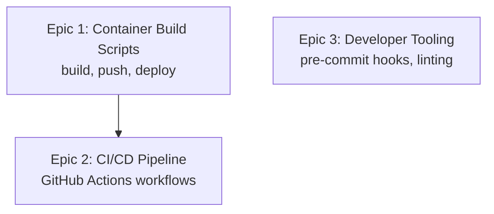

# CI/CD Pipeline — AI Developer Workflow Guide

> **Agent**: `@cicd-pipeline` (claude-sonnet-4)  
> **Conventions**: [cicd.instructions.md](../.github/instructions/cicd.instructions.md)  
> **Source Roadmap**: [ROADMAP.md](./ROADMAP.md) Phase 8 — Issues #28, #35, #16  
> **Directory**: `.github/workflows/`, `infrastructure/`  
> **Total Tasks**: 10 across 3 epics | **Effort**: 18–26 hours

---

## Quick Start

```bash
# 1. Pick a task from the table below
# 2. Copy the CORE prompt for that task
# 3. Paste into Copilot Chat with the agent prefix:
@cicd-pipeline <paste CORE prompt>

# 4. After implementation, verify:
# - Shell scripts pass shellcheck
# - YAML workflows pass actionlint
# - Dry-run mode works for deploy scripts
```

---

## Dependency Graph



---

## Task Inventory

| ID | Task | Epic | Priority | Est | Status | Dependencies |
|----|------|------|----------|-----|--------|-------------|
| CI-1.1 | Create build-containers.sh | 1: Build Scripts | High | 2–3h | 🔴 TODO | — |
| CI-1.2 | Create deploy-container-apps.sh | 1: Build Scripts | High | 2–3h | 🔴 TODO | CI-1.1 |
| CI-1.3 | Create ACR login helper | 1: Build Scripts | Medium | 1h | 🔴 TODO | CI-1.1 |
| CI-2.1 | Create PR validation workflow | 2: CI Pipeline | High | 3–4h | 🔴 TODO | — |
| CI-2.2 | Create container build workflow | 2: CI Pipeline | High | 3–4h | 🔴 TODO | CI-1.1 |
| CI-2.3 | Create deploy-dev workflow | 2: CI Pipeline | High | 2–3h | 🔴 TODO | CI-1.2, CI-2.2 |
| CI-2.4 | Create deploy-prod workflow | 2: CI Pipeline | High | 2–3h | 🔴 TODO | CI-2.3 |
| CI-2.5 | Remove Static Web App deployment | 2: CI Pipeline | Medium | 1h | 🔴 TODO | CI-2.3 |
| CI-3.1 | Configure Husky pre-commit hooks | 3: Dev Tooling | Low | 1–2h | 🔴 TODO | — |
| CI-3.2 | Add lint-staged configuration | 3: Dev Tooling | Low | 1h | 🔴 TODO | CI-3.1 |

---

## Epic 1: Container Build & Deploy Scripts (Issue #35)

### CI-1.1 — Create build-containers.sh

<details>
<summary>📋 CORE Prompt (click to expand)</summary>

**Context**: You are working on a polyglot microservices project with 4 services: BFF (Node.js + React SPA at `bff/`), Python (FastAPI at `backend/`), C# (ASP.NET at `backend-csharp/`), Java (Spring Boot at `backend-java/`). All have `Dockerfile`s. The project is migrating to Azure Container Apps with ACR. There is no container build automation — builds are currently manual. Follow [cicd.instructions.md](../.github/instructions/cicd.instructions.md) conventions.

**Objective**: Create a container build script that builds, tags, and pushes all 4 service images to ACR.

**Requirements**:
- Create `infrastructure/build-containers.sh`
- Accept env vars: `ACR_NAME` (required), `GIT_SHA` (default: `git rev-parse --short HEAD`), `SERVICES` (default: "bff python csharp java")
- Build all 4 Docker images with context-appropriate Dockerfile paths
- Tag each image as: `${ACR_NAME}.azurecr.io/${service}:${GIT_SHA}` AND `${ACR_NAME}.azurecr.io/${service}:latest`
- Push both tags to ACR
- Support `--dry-run` flag (echo commands instead of executing)
- Support building a single service: `./build-containers.sh --service bff`
- Fail fast on any build error (`set -euo pipefail`)
- Print build summary with image names and sizes
- Validate all required inputs exist before building

**Example**:
```bash
#!/usr/bin/env bash
set -euo pipefail

ACR_NAME="${ACR_NAME:?ACR_NAME is required}"
GIT_SHA="${GIT_SHA:-$(git rev-parse --short HEAD)}"

declare -A DOCKERFILES=(
  [bff]="bff/Dockerfile"
  [python]="backend/Dockerfile"
  [csharp]="backend-csharp/Dockerfile"
  [java]="backend-java/Dockerfile"
)
```

</details>

---

### CI-1.2 — Create deploy-container-apps.sh

<details>
<summary>📋 CORE Prompt (click to expand)</summary>

**Context**: After images are pushed to ACR (CI-1.1), Container Apps need their revisions updated to the new image tags. Azure CLI `az containerapp update` can set the image. Each Container App is named: `ca-{service}-{environment}`.

**Objective**: Create a deployment script that updates Container App revisions with new image tags.

**Requirements**:
- Create `infrastructure/deploy-container-apps.sh`
- Accept env vars: `ACR_NAME`, `ENVIRONMENT` (dev/prod), `GIT_SHA`, `RESOURCE_GROUP`
- For each service, run `az containerapp update --name ca-${service}-${env} --resource-group ${rg} --image ${acr}/${service}:${sha}`
- Support `--dry-run` flag
- Idempotent — safe to run multiple times
- Wait for revision to become active (`az containerapp revision show`)
- Health check each service after deployment (curl health endpoint)
- Fail fast and rollback hint on failure
- Accept `--service` to deploy a single service

**Example**:
```bash
for service in "${SERVICES[@]}"; do
  echo "Deploying ${service} to ${ENVIRONMENT}..."
  az containerapp update \
    --name "ca-${service}-${ENVIRONMENT}" \
    --resource-group "${RESOURCE_GROUP}" \
    --image "${ACR_NAME}.azurecr.io/${service}:${GIT_SHA}"
done
```

</details>

---

### CI-1.3 — Create ACR Login Helper

<details>
<summary>📋 CORE Prompt (click to expand)</summary>

**Context**: Both build and deploy scripts need ACR authentication. The login step should be centralized. `az acr login` authenticates Docker to ACR using the current Azure CLI identity.

**Objective**: Create a reusable ACR login helper.

**Requirements**:
- Create `infrastructure/acr-login.sh`
- Run `az acr login --name ${ACR_NAME}`
- Verify login succeeded
- Can be sourced by other scripts: `. ./infrastructure/acr-login.sh`
- Handle error: "Not logged in to Azure" with helpful message

**Example**: `az acr login --name "${ACR_NAME}" || { echo "Failed. Run 'az login' first."; exit 1; }`

</details>

---

## Epic 2: CI/CD Pipeline Integration (Issue #28)

### CI-2.1 — Create PR Validation Workflow

<details>
<summary>📋 CORE Prompt (click to expand)</summary>

**Context**: The project has 4 services with different tech stacks. PRs need validation across all affected services. Currently there is no PR validation workflow. The existing `azure-pipelines.yml` is for Azure DevOps and may be legacy. GitHub Actions is the target CI system.

**Objective**: Create a GitHub Actions workflow for PR validation.

**Requirements**:
- Create `.github/workflows/pr-validation.yml`
- Trigger: `pull_request` targeting `main` and `csharp_python` branches
- Path filters: only run relevant jobs when service code changes
- Jobs (run in parallel):
  - `python-tests`: `cd backend && pip install -r requirements.txt && pytest`
  - `csharp-tests`: `cd backend-csharp && dotnet test`
  - `java-tests`: `cd backend-java && ./mvnw test`
  - `bff-tests`: `cd bff && npm ci && npm test`
  - `frontend-tests`: `cd frontend && npm ci && npm run test`
  - `frontend-lint`: `cd frontend && npm run lint`
  - `terraform-validate`: `cd infrastructure/terraform && terraform init -backend=false && terraform validate`
- Use path filters so each job only runs when relevant files change
- Use caching for npm, pip, Maven, NuGet
- Set timeout-minutes per job

**Example**:
```yaml
on:
  pull_request:
    branches: [main, csharp_python]

jobs:
  python-tests:
    runs-on: ubuntu-latest
    if: contains(github.event.pull_request.changed_files, 'backend/')
```

</details>

---

### CI-2.2 — Create Container Build Workflow

<details>
<summary>📋 CORE Prompt (click to expand)</summary>

**Context**: After PR merges to main, container images need to be built and pushed to ACR. This workflow should call `infrastructure/build-containers.sh` from CI-1.1.

**Objective**: Create a GitHub Actions workflow for building and pushing container images.

**Requirements**:
- Create `.github/workflows/build-containers.yml`
- Trigger: `push` to `main` branch, or `workflow_dispatch` for manual runs
- Login to Azure via `azure/login@v1` with service principal (OIDC preferred)
- Call `infrastructure/build-containers.sh` with proper ACR_NAME and GIT_SHA
- Use `paths` filter to build only changed services (if possible)
- Output image tags for use in deploy workflows
- Store image digest as artifact for traceability

**Example**:
```yaml
- uses: azure/login@v1
  with:
    client-id: ${{ secrets.AZURE_CLIENT_ID }}
    tenant-id: ${{ secrets.AZURE_TENANT_ID }}
    subscription-id: ${{ secrets.AZURE_SUBSCRIPTION_ID }}
- run: ./infrastructure/build-containers.sh
  env:
    ACR_NAME: ${{ vars.ACR_NAME }}
    GIT_SHA: ${{ github.sha }}
```

</details>

---

### CI-2.3 — Create Deploy-Dev Workflow

<details>
<summary>📋 CORE Prompt (click to expand)</summary>

**Context**: After container images are built (CI-2.2), the dev environment should be automatically deployed. This calls `infrastructure/deploy-container-apps.sh`.

**Objective**: Create a GitHub Actions workflow for deploying to the dev environment.

**Requirements**:
- Create `.github/workflows/deploy-dev.yml`
- Trigger: `workflow_run` on `build-containers.yml` completion (success only), or `workflow_dispatch`
- Login to Azure
- Call `infrastructure/deploy-container-apps.sh` with `ENVIRONMENT=dev`
- Run smoke tests after deployment (health checks at minimum)
- Notify on failure (GitHub issue comment or Slack)
- Include manual approval gate option (via `environment: dev`)

**Example**:
```yaml
on:
  workflow_run:
    workflows: ["Build Containers"]
    types: [completed]
    branches: [main]
```

</details>

---

### CI-2.4 — Create Deploy-Prod Workflow

<details>
<summary>📋 CORE Prompt (click to expand)</summary>

**Context**: Production deployment requires a manual approval gate before deploying.

**Objective**: Create a GitHub Actions workflow for production deployment.

**Requirements**:
- Create `.github/workflows/deploy-prod.yml`
- Trigger: `workflow_dispatch` only (manual)
- Require `environment: production` with GitHub Environment protection rules (approval required)
- Accept image tag input (which SHA to deploy)
- Call `infrastructure/deploy-container-apps.sh` with `ENVIRONMENT=prod`
- Run E2E smoke tests post-deploy
- Support rollback input: `--rollback` to revert to previous revision

**Example**: Same pattern as deploy-dev but with manual trigger and environment protection.

</details>

---

### CI-2.5 — Remove Static Web App Deployment

<details>
<summary>📋 CORE Prompt (click to expand)</summary>

**Context**: The project is migrating from Azure Static Web App to BFF-served frontend (Phase 5B). The current CI/CD may have Static Web App deployment steps that need to be removed.

**Objective**: Clean up any Static Web App deployment references from CI/CD.

**Requirements**:
- Search all `.github/workflows/*.yml` for Static Web App references
- Remove `azure/static-web-apps-deploy@v1` steps
- Remove Static Web App API token from workflow secrets references
- Update deploy scripts to not reference SWA
- Verify no broken references remain

**Example**: `grep -r "static-web-apps" .github/workflows/` → remove matches.

</details>

---

## Epic 3: Developer Tooling (Issue #16)

### CI-3.1 — Configure Husky Pre-commit Hooks

<details>
<summary>📋 CORE Prompt (click to expand)</summary>

**Context**: The root `package.json` exists. No pre-commit hooks are configured. Developers can push code without linting or formatting checks. Husky v9+ is the standard for Git hooks in monorepos.

**Objective**: Set up Husky pre-commit hooks for the monorepo.

**Requirements**:
- Install `husky` as dev dependency in root `package.json`
- Run `npx husky init` to create `.husky/` directory
- Create `.husky/pre-commit` hook that runs lint-staged (CI-3.2)
- Create `.husky/commit-msg` hook that validates conventional commits (optional)
- Add `"prepare": "husky"` to root package.json scripts
- Document in README how to skip hooks temporarily: `git commit --no-verify`

**Example**:
```bash
# .husky/pre-commit
npx lint-staged
```

</details>

---

### CI-3.2 — Add lint-staged Configuration

<details>
<summary>📋 CORE Prompt (click to expand)</summary>

**Context**: Pre-commit hooks (CI-3.1) need to know which commands to run on staged files. `lint-staged` runs linters/formatters only on staged files for speed.

**Objective**: Configure lint-staged for the polyglot monorepo.

**Requirements**:
- Install `lint-staged` as root dev dependency
- Add config to root `package.json` or `.lintstagedrc.json`
- Rules:
  - `frontend/**/*.{ts,tsx}`: `eslint --fix` and `prettier --write`
  - `bff/**/*.ts`: `eslint --fix` and `prettier --write`
  - `backend/**/*.py`: `black` and `flake8`
  - `infrastructure/**/*.tf`: `terraform fmt`
  - `**/*.{json,md,yml,yaml}`: `prettier --write`
- Only lint files in the staged changeset (not the entire project)

**Example**:
```json
{
  "frontend/**/*.{ts,tsx}": ["eslint --fix", "prettier --write"],
  "backend/**/*.py": ["black", "flake8"],
  "infrastructure/**/*.tf": ["terraform fmt"]
}
```

</details>

---

## Verification Checklist

After all tasks complete, verify:

```bash
# 1. Shell scripts have proper headers and pass shellcheck
shellcheck infrastructure/build-containers.sh
shellcheck infrastructure/deploy-container-apps.sh

# 2. Dry-run mode works
ACR_NAME=test ./infrastructure/build-containers.sh --dry-run

# 3. GitHub Actions workflows are valid YAML
# Install: brew install actionlint
actionlint .github/workflows/*.yml

# 4. Pre-commit hooks work
git add -A && git stash  # Save current work
echo "test" >> README.md && git add README.md
git commit -m "test: verify hooks" --dry-run  # Hooks should fire

# 5. No Static Web App references remain
grep -r "static-web-apps\|staticwebapp" .github/workflows/ infrastructure/
```
