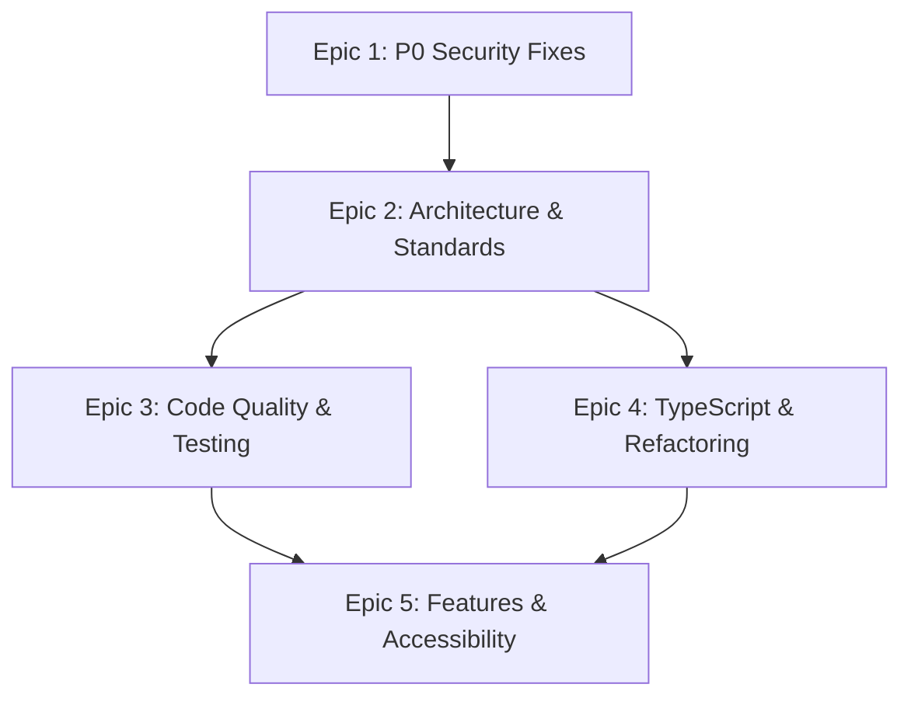

# Frontend (React/TypeScript) — AI Developer Workflow Guide

> **Agent**: `@frontend-implementer` (claude-sonnet-4)  
> **Conventions**: [react.instructions.md](../.github/instructions/react.instructions.md)  
> **Source Roadmap**: [ROADMAP.md — Phases 5, 6, 7](./ROADMAP.md#phase-5-frontend-standardization--security)  
> **Service**: `frontend/` — React 18 + Vite + TypeScript + Tailwind CSS  
> **TDD Agents**: `@tdd-red` → `@tdd-green` → `@tdd-refactor`  
> **Total Tasks**: 22 across 5 epics | **Effort**: 50–72 hours

---

## Quick Start

```bash
# 1. Pick a task from the table below
# 2. Copy the CORE prompt for that task
# 3. Paste into Copilot Chat with the agent prefix:
@frontend-implementer <paste CORE prompt>

# 4. After implementation, verify:
cd frontend
npm run build     # Zero errors
npm run test      # Vitest unit tests
npm run lint      # ESLint
```

---

## Dependency Graph



---

## Task Inventory

| ID | Task | Epic | Priority | Est | Status | Dependencies |
|----|------|------|----------|-----|--------|-------------|
| FE-1.1 | Rotate Mapbox token & fix .gitignore | 1: Security | Critical | 1h | 🔴 TODO | — |
| FE-1.2 | Remove devLogin production exposure | 1: Security | Critical | 0.5h | 🔴 TODO | — |
| FE-1.3 | Migrate all raw axios to axiosInstance | 1: Security | Critical | 3–4h | 🔴 TODO | — |
| FE-2.1 | Fix Vite proxy & VITE_API_URL to BFF | 2: Architecture | High | 0.5h | 🔴 TODO | FE-1.3 |
| FE-2.2 | Create all required constants files | 2: Standards | High | 4–5h | 🔴 TODO | FE-1.3 |
| FE-2.3 | Consolidate conflicting TypeScript types | 2: Standards | High | 3–4h | 🔴 TODO | FE-2.2 |
| FE-2.4 | Remove dead code (App.css, unused imports) | 2: Cleanup | Low | 0.5h | 🔴 TODO | FE-1.3 |
| FE-3.1 | Fix TypeScript `any` violations | 3: Quality | Critical | 8–10h | 🔴 TODO | FE-2.3 |
| FE-3.2 | Fix broken tests & expand coverage | 3: Testing | Medium | 4–6h | 🔴 TODO | FE-1.3 |
| FE-3.3 | Store route GeoJSON in database | 3: Feature | Critical | 3–4h | 🔴 TODO | FE-2.3 |
| FE-3.4 | Extract duplicate code | 3: Quality | Medium | 6–8h | 🔴 TODO | FE-2.2 |
| FE-4.1 | Decompose FloatingPanel.tsx (880 lines) | 4: Refactor | Medium | 4–6h | 🔴 TODO | FE-2.3 |
| FE-4.2 | Add Error Boundaries | 4: Reliability | Medium | 2–3h | 🔴 TODO | — |
| FE-4.3 | Fix useEffect cleanup & race conditions | 4: Bugs | Medium | 2–3h | 🔴 TODO | FE-1.3 |
| FE-4.4 | Fix caching & performance | 4: Performance | Low | 2–3h | 🔴 TODO | FE-2.2 |
| FE-5.1 | Vehicle-aware routing | 5: Features | High | 6–8h | 🔴 TODO | FE-2.3 |
| FE-5.2 | JWT refresh token flow | 5: Features | High | 6–8h | 🔴 TODO | FE-1.3 |
| FE-5.3 | AI trip generation UI | 5: Features | Medium | 12–16h | 🔴 TODO | FE-2.3 |
| FE-5.4 | WCAG AA accessibility | 5: A11y | High | 10–12h | 🔴 TODO | FE-4.1 |
| FE-5.5 | Fix useEffect dependency issues | 5: Bugs | Medium | 2–3h | 🔴 TODO | FE-4.3 |

---

## Epic 1: P0 Security Fixes (Critical)

### FE-1.1 — Rotate Mapbox Token & Fix .gitignore

<details>
<summary>📋 CORE Prompt (click to expand)</summary>

**Context**: You are working on `frontend/`. The real Mapbox token `pk.eyJ1IjoiaGx1Y2lhbm9qciIs...` is committed in `frontend/.env`. The `.gitignore` only ignores `*.local` files, not `.env`. This is a P0 security issue — the token is compromised in git history.

**Objective**: Fix .gitignore, remove the committed .env, and document token rotation.

**Requirements**:
- Add `.env` to `frontend/.gitignore`
- Remove `frontend/.env` from git tracking: `git rm --cached frontend/.env`
- Verify `frontend/.env.example` exists with placeholder values only (e.g., `VITE_MAPBOX_TOKEN=your_mapbox_token_here`)
- Verify `docker-compose.yml` uses `${VITE_MAPBOX_TOKEN}` (not hardcoded)
- Document in PR: "Mapbox token in git history is compromised — rotate in Mapbox dashboard"
- Note: Full git history scrub with BFG Repo-Cleaner is a separate ops task

**Example**: `echo ".env" >> frontend/.gitignore && git rm --cached frontend/.env`

</details>

---

### FE-1.2 — Remove devLogin Production Exposure

<details>
<summary>📋 CORE Prompt (click to expand)</summary>

**Context**: You are working on `frontend/src/components/FloatingPanel.tsx` (~line 155). The `devLogin` function sends `"MOCK_TOKEN"` to `POST /api/auth/google`. This code is visible in production builds — attackers can see the mock auth flow.

**Objective**: Gate devLogin behind development-only check.

**Requirements**:
- Wrap `devLogin()` function with `if (import.meta.env.DEV)` guard
- In production: hide the "Login with Google (Demo)" button entirely
- Verify production build: `npm run build && grep -r "MOCK_TOKEN" dist/` → no results
- Keep devLogin working in `npm run dev` for local development
- Verify: Playwright E2E tests still work (they run against dev server)

**Example**: `{import.meta.env.DEV && <button onClick={devLogin}>Login with Google (Demo)</button>}`

</details>

---

### FE-1.3 — Migrate All Raw axios to axiosInstance

<details>
<summary>📋 CORE Prompt (click to expand)</summary>

**Context**: You are working on `frontend/src/`. There are 16+ raw `axios.get/post` calls bypassing `axiosInstance` auth interceptors. Manual `Authorization: Bearer ${token}` headers are duplicated across files. Files affected: `FloatingPanel.tsx` (~10 calls), `ExploreView.tsx` (3 calls), `TripsView.tsx` (2 calls with manual auth), `AllTripsView.tsx` (1 call).

**Objective**: Replace all raw axios with axiosInstance for centralized auth and error handling.

**Requirements**:
- Replace all `axios.get/post` with `axiosInstance.get/post` in:
  - `src/components/FloatingPanel.tsx` — all ~10 calls
  - `src/views/ExploreView.tsx` — all 3 calls
  - `src/views/TripsView.tsx` — all 2 calls, remove manual auth headers
  - `src/views/AllTripsView.tsx` — 1 call
- Remove all manual `Authorization: Bearer ${token}` header construction
- Remove raw `import axios from 'axios'` from all component/view files
- Verify auth interceptor in `utils/axios.ts` handles all token injection
- Test: Login → save trip → load trips → all work through axiosInstance

**Example**: Before: `axios.get('/api/trips', { headers: { Authorization: \`Bearer ${token}\` } })` → After: `axiosInstance.get('/api/trips')`

</details>

---

## Epic 2: Architecture & Standards

### FE-2.1 — Fix Vite Proxy & VITE_API_URL

<details>
<summary>📋 CORE Prompt (click to expand)</summary>

**Context**: You are working on `frontend/`. Both `vite.config.ts` proxy target (line 12) and `.env` point to Python backend (:8000) instead of the BFF (:3000). All API traffic should route through the BFF.

**Objective**: Point frontend API traffic to BFF instead of directly to Python backend.

**Requirements**:
- Change `vite.config.ts` proxy target from `http://127.0.0.1:8000` to `http://127.0.0.1:3000`
- Change `VITE_API_URL` from `http://localhost:8000` to `http://localhost:3000` in `.env.example`
- Verify all API calls route through BFF in local non-Docker dev
- Verify: `npm run dev` → API calls go to `:3000/api/*`

**Example**: `vite.config.ts` server.proxy: `'/api': { target: 'http://127.0.0.1:3000' }`

</details>

---

### FE-2.2 — Create All Required Constants Files

<details>
<summary>📋 CORE Prompt (click to expand)</summary>

**Context**: You are working on `frontend/src/constants/`. The directory exists but is **completely empty**. Project standards mandate 4 files. Hardcoded strings found across 15+ files: route paths, API endpoints, error messages, localStorage keys, map defaults, vehicle defaults, search defaults, POI categories, stop types.

**Objective**: Create all required constants files and replace hardcoded strings throughout the codebase.

**Requirements**:
- Create `constants/routes.ts`: `EXPLORE`, `ITINERARY`, `TRIPS`, `START`, `ALL_TRIPS`
  - Replace hardcoded paths in: App.tsx, DesktopSidebar.tsx, MobileBottomNav.tsx, StartTripView.tsx
- Create `constants/api.ts`: `GEOCODE`, `DIRECTIONS`, `SEARCH`, `VEHICLE_SPECS`, `TRIPS`, `OPTIMIZE`, `AUTH_GOOGLE`, `AUTH_REFRESH`
  - Replace hardcoded paths in: FloatingPanel.tsx, TripsView.tsx, AllTripsView.tsx, ExploreView.tsx, axios.ts
- Create `constants/errors.ts`: `AUTH_REQUIRED`, `SESSION_EXPIRED`, `TRIP_NOT_FOUND`, `ROUTE_CALC_FAILED`, `ENTER_TRIP_NAME`
  - Replace in: useTripStore.ts, FloatingPanel.tsx, AuthStatus.tsx
- Create `constants/index.ts`: barrel export + `STORAGE_KEYS`, `AUTH_EVENTS`, `MAP_DEFAULTS`, `VEHICLE_DEFAULTS`, `SEARCH_DEFAULTS`, `POI_CATEGORIES`, `STOP_TYPES`
  - Replace 10+ `localStorage.getItem('token')` calls with `STORAGE_KEYS.TOKEN`
  - Replace magic numbers in MapComponent.tsx, useTripStore.ts, FloatingPanel.tsx

**Example**: `export const ROUTES = { EXPLORE: '/explore', ITINERARY: '/itinerary', ... } as const`

</details>

---

### FE-2.3 — Consolidate Conflicting TypeScript Types

<details>
<summary>📋 CORE Prompt (click to expand)</summary>

**Context**: You are working on `frontend/src/types/`. Types defined in BOTH `src/types/index.ts` (218 lines) AND individual files. Definitions **conflict**: `Vehicle.ts` has `type/hazmat/height` while `index.ts` has `fuelType/range/mpg`. `Trip.ts` missing `user_id/is_public/created_at`. Store default `vehicleSpecs` doesn't match either Vehicle type definition.

**Objective**: Consolidate into a single source of truth for all TypeScript types.

**Requirements**:
- Audit all import paths to determine which type definitions are actually used where
- Consolidate into single source of truth in `src/types/index.ts`
- Delete or make individual files (`Vehicle.ts`, `Trip.ts`, `Stop.ts`, `POI.ts`, `Route.ts`) re-export from `index.ts`
- Reconcile all field differences — ensure types match backend API responses
- Fix `useTripStore.ts` default `vehicleSpecs` to match the consolidated `Vehicle` type
- Fix `routeGeoJSON.coordinates` → `routeGeoJSON.geometry.coordinates` (GeoJSON Feature)
- Verify: `npm run build` passes with zero type errors

**Example**: Single `Vehicle` type matching backend: `{ vehicleType, length, width, height, weight, maxWeight, numAxles, fuelType?, mpg? }`

</details>

---

### FE-2.4 — Remove Dead Code

<details>
<summary>📋 CORE Prompt (click to expand)</summary>

**Context**: `frontend/src/App.css` is entirely Vite template boilerplate (`.logo`, `.read-the-docs`), unused. `React` imported but unused in multiple files.

**Objective**: Remove dead code and unused imports.

**Requirements**:
- Delete `frontend/src/App.css` and remove its import from `App.tsx`
- Remove unused `import React` from `App.tsx` and `MainLayout.tsx`
- Remove unused `axiosInstance` import from `FloatingPanel.tsx` (after FE-1.3, raw `axios` import goes away — verify which remains)
- Verify: `npm run build` → zero warnings about unused imports

**Example**: `rm frontend/src/App.css` + remove `import './App.css'` from App.tsx

</details>

---

## Epic 3: Code Quality & Testing

### FE-3.1 — Fix TypeScript `any` Violations

<details>
<summary>📋 CORE Prompt (click to expand)</summary>

**Context**: You are working on `frontend/src/`. `any` types found across the codebase — violates "No `any` types allowed". Key violations: `useTripStore.ts` lines 120, 166, 197 (`catch (error: any)`), `utils/axios.ts` lines 13-14 (`resolve: (value?: any)`), `MainLayout.tsx` line 10 (implicit `any`).

**Objective**: Replace all `any` types with proper TypeScript types.

**Requirements**:
- Replace `catch (error: any)` with `catch (error: unknown)` + type guards (or `AxiosError`)
- Replace `any` in axios queue types with proper `AxiosResponse` types
- Fix implicit `any` in `MainLayout.tsx` store selector
- Enable `"strict": true` in tsconfig.json
- Fix all resulting type errors — zero errors in build output
- Depends on FE-2.3 (type consolidation) being done first

**Example**: `catch (error: unknown) { if (axios.isAxiosError(error)) { console.error(error.response?.data) } }`

</details>

---

### FE-3.2 — Fix Broken Tests & Expand Coverage

<details>
<summary>📋 CORE Prompt (click to expand)</summary>

**Context**: You are working on `frontend/`. 5 tests exist but are broken — they mock raw `axios` not `axiosInstance`, use `jest.Mock` in Vitest, and have wrong env var in setup.

**Objective**: Fix existing tests and add tests for key components.

**Requirements**:
- Fix `useTripStore.test.ts` to mock `axiosInstance` (not raw axios)
- Replace `jest.Mock` with `vi.fn()` typing
- Fix env var: `VITE_API_BASE_URL` → `VITE_API_URL` in `test/setup.ts`
- Add component tests for `AuthStatus`, `MapComponent`
- Add view tests for `ExploreView`, `TripsView`
- Add hook test for `useOnlineStatus`
- Target: all tests pass with `npm run test`

**Example**: `vi.mock('../utils/axios', () => ({ default: { get: vi.fn(), post: vi.fn() } }))`

</details>

---

### FE-3.3 — Store Route GeoJSON in Database

<details>
<summary>📋 CORE Prompt (click to expand)</summary>

**Context**: Saved trips lose route geometry on reload. Also `routeGeoJSON.coordinates` should be `routeGeoJSON.geometry.coordinates` for proper GeoJSON Feature type.

**Objective**: Save and restore route GeoJSON with trips.

**Requirements**:
- Add `route_geojson` field to Trip type and API calls
- When saving trip: include `routeGeoJSON` from store
- When loading trip: restore `routeGeoJSON` to store
- Fix `routeGeoJSON.coordinates` → `routeGeoJSON.geometry.coordinates` in all files
- Backend must also support this (coordinate with Python implementer for Alembic migration)
- Test: save trip with route → reload page → load trip → route displays on map

**Example**: `POST /api/trips` body includes `{ ..., route_geojson: { type: "Feature", geometry: {...} } }`

</details>

---

### FE-3.4 — Extract Duplicate Code

<details>
<summary>📋 CORE Prompt (click to expand)</summary>

**Context**: Key duplications in `frontend/src/`: `getDefaultImage()` with Unsplash URLs duplicated in `AllTripsView.tsx` and `ExploreView.tsx`, `localStorage.getItem('token')` repeated 10+ times, manual auth headers duplicated in multiple files.

**Objective**: Extract shared utilities and eliminate code duplication.

**Requirements**:
- Create `src/utils/images.ts` with `getDefaultTripImage()` — move Unsplash URLs here
- Create `src/hooks/useAuth.ts` with centralized token retrieval
- Replace all duplicated `localStorage.getItem('token')` with `useAuth()` hook or constants
- Replace all duplicated `getDefaultImage()` with imported utility
- Write unit tests for new utilities

**Example**: `export function getDefaultTripImage(index: number): string { return TRIP_IMAGES[index % TRIP_IMAGES.length] }`

</details>

---

## Epic 4: Refactoring & Reliability

### FE-4.1 — Decompose FloatingPanel.tsx (880 lines)

<details>
<summary>📋 CORE Prompt (click to expand)</summary>

**Context**: You are working on `frontend/src/components/FloatingPanel.tsx`. This 880-line component handles 8+ responsibilities: stop search, vehicle config, route calculation, POI search, save/load trips, directions display, drag-and-drop reorder, and Google OAuth.

**Objective**: Split into focused components with FloatingPanel as thin orchestrator.

**Requirements**:
- Extract `StopSearchForm` component — search input + geocoding
- Extract `VehicleConfigPanel` — vehicle specs form
- Extract `DirectionsPanel` — turn-by-turn directions
- Extract `TripSaveLoadPanel` — save/load trip
- Extract `POICategoryButtons` — gas/restaurant/hotel search
- Keep `FloatingPanel` as thin orchestrator (~200 lines max)
- All state flows through Zustand store (no prop drilling)
- Verify: all existing functionality preserved

**Example**: `<FloatingPanel>` renders tab navigation + `<StopSearchForm />`, `<VehicleConfigPanel />`, `<DirectionsPanel />`, `<TripSaveLoadPanel />`

</details>

---

### FE-4.2 — Add Error Boundaries

<details>
<summary>📋 CORE Prompt (click to expand)</summary>

**Context**: You are working on `frontend/src/`. No `<ErrorBoundary>` exists anywhere — any render error crashes the entire UI.

**Objective**: Add error boundaries for graceful error recovery.

**Requirements**:
- Install `react-error-boundary`
- Add top-level `<ErrorBoundary>` in `App.tsx`
- Add route-level boundaries per view (ExploreView, ItineraryView, TripsView)
- Create user-friendly fallback UI component with "Try Again" button
- Add error logging to `onError` callback (console.error for now, App Insights later)

**Example**: `<ErrorBoundary fallbackRender={ErrorFallback} onError={logError}><ExploreView /></ErrorBoundary>`

</details>

---

### FE-4.3 — Fix useEffect Cleanup & Race Conditions

<details>
<summary>📋 CORE Prompt (click to expand)</summary>

**Context**: Multiple async `useEffect` calls without `AbortController` cleanup — race conditions on fast navigation. Specific locations: `ExploreView.tsx:60-62` (fetchFeaturedTrips), `TripsView.tsx:34` (fetchTrips), `useOnlineStatus.ts:42` (setTimeout not cleaned), `useOnlineStatus.ts:70` (isOnline in dependency array causes re-registration).

**Objective**: Fix all useEffect cleanup and race condition issues.

**Requirements**:
- Add `AbortController` to all async `useEffect` calls with cleanup
- Clean up `setTimeout` in `useOnlineStatus.ts` with `clearTimeout`
- Fix `useOnlineStatus` dependency array to avoid stale closures
- Verify no race conditions when rapidly navigating between views
- Pattern: `useEffect(() => { const controller = new AbortController(); fetch(url, { signal: controller.signal }); return () => controller.abort(); }, [deps])`

**Example**: `useEffect(() => { const ac = new AbortController(); fetchTrips(ac.signal).catch(e => { if (!ac.signal.aborted) setError(e) }); return () => ac.abort(); }, [])`

</details>

---

### FE-4.4 — Fix Caching & Performance

<details>
<summary>📋 CORE Prompt (click to expand)</summary>

**Context**: `offlineStorage.ts` opens new IndexedDB connection on every operation (no pooling). `TripsView.tsx:81` reads `localStorage.getItem('token')` in render body (every render).

**Objective**: Fix performance issues with IndexedDB and localStorage access.

**Requirements**:
- Add IndexedDB connection pooling/caching to `offlineStorage.ts` — open once, reuse
- Move `localStorage.getItem('token')` out of render body into `useEffect` or callback
- Verify: no new DB connections on every operation

**Example**: Singleton pattern: `let dbInstance: IDBDatabase | null = null; async function getDB() { if (dbInstance) return dbInstance; ... }`

</details>

---

## Epic 5: Features & Accessibility

### FE-5.1 — Vehicle-Aware Routing

<details>
<summary>📋 CORE Prompt (click to expand)</summary>

**Context**: Route calculation currently ignores vehicle specs. With the Java geospatial service, truck profiles can be used for commercial vehicles with height/weight restrictions.

**Objective**: Integrate vehicle specs into route calculation.

**Requirements**:
- When vehicle type is truck/RV: use `profile=driving-traffic` with truck dimensions
- Pass vehicle height/weight to directions request for clearance routing
- Display warnings for low bridges/weight-restricted roads
- Flow: Frontend → BFF → Java (directions with vehicle profile)
- Dependencies: Java geospatial service endpoints verified

**Example**: Vehicle is "RV Large" (height: 4m) → route avoids tunnels < 4m clearance

</details>

---

### FE-5.2 — JWT Refresh Token Flow

<details>
<summary>📋 CORE Prompt (click to expand)</summary>

**Context**: Current auth stores tokens in `localStorage` (XSS-vulnerable). No auto-refresh — session expires silently.

**Objective**: Implement JWT token refresh with secure storage.

**Requirements**:
- Add refresh token interceptor to `axiosInstance`: on 401 → try refresh → retry original request
- Token rotation: each refresh returns new access + refresh tokens
- Queue concurrent requests during refresh (avoid multiple refresh calls)
- Migrate from `localStorage` to HTTP-only cookies (coordinate with Python backend)
- Flow: Frontend → BFF → Python (auth service)
- Graceful session expiry: redirect to login with message

**Example**: 401 → `POST /api/auth/refresh` with refresh_token → new access_token → retry failed request

</details>

---

### FE-5.3 — AI Trip Generation UI

<details>
<summary>📋 CORE Prompt (click to expand)</summary>

**Context**: The C# backend has `POST /api/v1/generate-trip` endpoint. Need frontend UI for AI-powered trip suggestions. `FloatingPanel.tsx:610` still has a stale "Gemini API Key" comment — now uses Azure OpenAI via C# service.

**Objective**: Create UI for AI trip generation.

**Requirements**:
- Add "AI Generate" tab or button in the Itinerary view
- Input: origin, destination, interests (checkboxes or free text)
- Show loading spinner during AI call
- Display AI-suggested stops with "Add All" or individual "Add" buttons
- Handle error/fallback when AI service is down
- Remove stale Gemini references
- Flow: Frontend → BFF → C# (Azure OpenAI)

**Example**: User enters "Denver to LA, interested in hiking and BBQ" → AI suggests 5 stops with descriptions → user adds to itinerary

</details>

---

### FE-5.4 — WCAG AA Accessibility

<details>
<summary>📋 CORE Prompt (click to expand)</summary>

**Context**: Zero `aria-label` attributes anywhere. No keyboard navigation support. No skip-to-content link. Specific issues: `DesktopSidebar.tsx:22`, `MobileBottomNav.tsx:14` — no nav labels. `VersionDisplay.tsx` tooltip mouse-only. POI markers in `MapComponent.tsx:97-110` no screen-reader labels. No `alt` text fallback for broken images.

**Objective**: Bring the frontend to WCAG AA compliance.

**Requirements**:
- Add `aria-label` to all navigation elements (sidebar, bottom nav)
- Add `aria-label` to all buttons and interactive elements
- Add keyboard event handlers (Enter/Space) alongside click handlers
- Add skip-to-content navigation link at top of page
- Add visible focus indicators for keyboard navigation
- Add `alt` text fallback for images in `AllTripsView.tsx:94`
- Make `VersionDisplay.tsx` tooltip keyboard accessible
- Add screen-reader labels to map markers
- Run `axe-core` audit and fix all A/AA violations

**Example**: `<nav aria-label="Main navigation">` + `<button aria-label="Search gas stations along route">`

</details>

---

### FE-5.5 — Fix useEffect Dependency Issues

<details>
<summary>📋 CORE Prompt (click to expand)</summary>

**Context**: `useOnlineStatus.ts:70` has `isOnline` in the dependency array causing the effect to re-register on every status change — creating a feedback loop.

**Objective**: Fix all useEffect dependency issues for stable behavior.

**Requirements**:
- Remove `isOnline` from dependency array in `useOnlineStatus` — use `useRef` for current value
- Audit all custom hooks for dependency array issues
- Run `eslint-plugin-react-hooks` exhaustive-deps rule — fix all warnings
- Verify: no infinite render loops or excessive re-registrations

**Example**: `const isOnlineRef = useRef(isOnline); isOnlineRef.current = isOnline;` — use ref in effect, remove from deps

</details>

---

## Verification Checklist

After all tasks complete, run:

```bash
# 1. Build passes
cd frontend && npm run build  # Zero errors

# 2. All tests pass
npm run test -- --run

# 3. Lint clean
npm run lint

# 4. No any types
grep -r ": any" src/ --include="*.ts" --include="*.tsx" | wc -l  # Should be 0

# 5. No raw axios
grep -r "from 'axios'" src/components/ src/views/ | wc -l  # Should be 0

# 6. Constants populated
ls -la src/constants/  # routes.ts, api.ts, errors.ts, index.ts

# 7. No hardcoded tokens
grep -r "MOCK_TOKEN" dist/ | wc -l  # Should be 0

# 8. Accessibility audit
npx axe-core src/  # Or use browser extension
```
