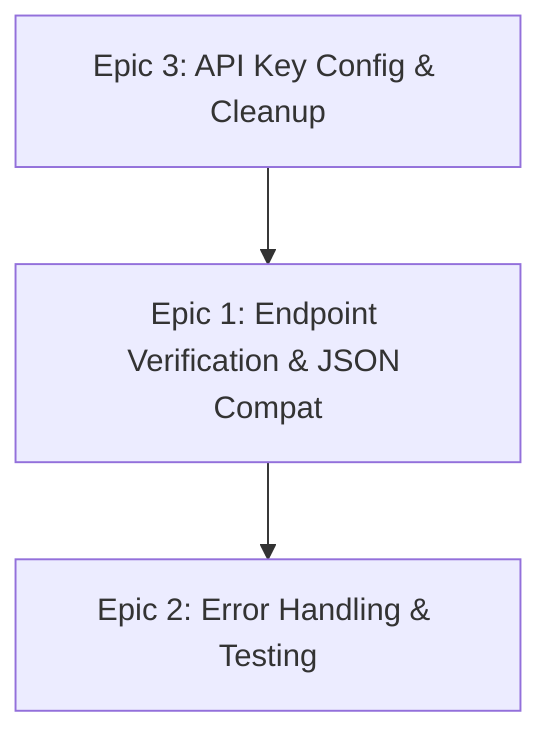

# Java Geospatial Service — AI Developer Workflow Guide

> **Agent**: `@java-implementer` (claude-sonnet-4)  
> **Conventions**: [java.instructions.md](../.github/instructions/java.instructions.md)  
> **Source Roadmap**: [ROADMAP.md — Phase 4](./ROADMAP.md#phase-4-java-spring-boot--geospatial-services)  
> **Service**: `backend-java/` — Spring Boot 3.3 + WebFlux (JDK 21)  
> **TDD Agents**: `@tdd-red` → `@tdd-green` → `@tdd-refactor`  
> **Total Tasks**: 8 across 3 epics | **Effort**: 16–20 hours

---

## Quick Start

```bash
# 1. Pick a task from the table below
# 2. Copy the CORE prompt for that task
# 3. Paste into Copilot Chat with the agent prefix:
@java-implementer <paste CORE prompt>

# 4. After implementation, verify:
cd backend-java
./mvnw test
./mvnw verify   # includes integration tests
```

---

## Dependency Graph



---

## Task Inventory

| ID | Task | Epic | Priority | Est | Status | Dependencies |
|----|------|------|----------|-----|--------|-------------|
| JV-1.1 | Verify geocode endpoint JSON format | 1: Endpoints | Critical | 2h | 🔴 TODO | JV-3.1 |
| JV-1.2 | Verify directions endpoint JSON format | 1: Endpoints | Critical | 2h | 🔴 TODO | JV-3.1 |
| JV-1.3 | Verify search endpoint JSON format | 1: Endpoints | Critical | 2h | 🔴 TODO | JV-3.1 |
| JV-1.4 | Verify optimize endpoint JSON format | 1: Endpoints | High | 2h | 🔴 TODO | JV-3.1 |
| JV-1.5 | Add Jackson snake_case config if needed | 1: Endpoints | High | 1h | 🔴 TODO | JV-1.1 |
| JV-2.1 | Add error handling for missing API keys | 2: Errors | High | 2h | 🔴 TODO | JV-1.1 |
| JV-2.2 | Create JUnit tests with MockWebServer | 2: Testing | High | 3h | 🔴 TODO | JV-2.1 |
| JV-3.1 | Generate proper Maven wrapper | 3: Config | Critical | 0.5h | 🔴 TODO | — |

---

## Epic 1: Endpoint Verification & JSON Compatibility

### JV-1.1 — Verify Geocode Endpoint JSON Format

<details>
<summary>📋 CORE Prompt (click to expand)</summary>

**Context**: You are working on `backend-java/`. The Java Spring Boot geospatial service has `GET /api/geocode?q=<query>` implemented in `src/main/java/com/roadtrip/geospatial/controller/GeospatialController.java`. This endpoint proxies to Mapbox Geocoding API via `MapboxService.java`. The frontend expects the **exact same JSON shape** as the Python backend returned: `{"coordinates": [lng, lat], "placeName": "..."}`. Java returns camelCase by default — verify `place_name` vs `placeName` compatibility with the frontend.

**Objective**: Test the geocode endpoint with real API keys and verify response JSON matches frontend expectations.

**Requirements**:
- Start Docker Compose with valid `MAPBOX_ACCESS_TOKEN`
- Call `GET http://localhost:8082/api/geocode?q=Denver,CO`
- Verify response structure: `coordinates` array `[lng, lat]`, `placeName` string
- Compare against Python backend response format: check if frontend expects snake_case (`place_name`) or camelCase (`placeName`)
- Audit `frontend/src/components/FloatingPanel.tsx` and `frontend/src/views/ExploreView.tsx` for which key names they parse
- Document any format mismatches that need JV-1.5

**Example**: `curl http://localhost:8082/api/geocode?q=Denver` → `{"coordinates":[-104.9903,39.7392],"placeName":"Denver, Colorado, United States"}`

</details>

---

### JV-1.2 — Verify Directions Endpoint JSON Format

<details>
<summary>📋 CORE Prompt (click to expand)</summary>

**Context**: You are working on `backend-java/`. `GET /api/directions?coords=lng1,lat1;lng2,lat2&profile=driving` proxies to Mapbox Directions API. The frontend expects: `{"distance": N, "duration": N, "geometry": {...}, "legs": [...]}`. Check `frontend/src/store/useTripStore.ts` for the exact response shape consumed.

**Objective**: Test the directions endpoint and verify response JSON matches frontend expectations.

**Requirements**:
- Call `GET http://localhost:8082/api/directions?coords=-104.99,39.74;-97.74,30.27&profile=driving`
- Verify response structure: `distance` (meters), `duration` (seconds), `geometry` (GeoJSON LineString), `legs` array
- Compare field names against frontend consumption in `useTripStore.ts` and `FloatingPanel.tsx`
- Verify `legs[].steps[].maneuver.instruction` exists for turn-by-turn directions

**Example**: Response should include route geometry for Denver→Austin, ~1500km distance, ~50000s duration

</details>

---

### JV-1.3 — Verify Search Endpoint JSON Format

<details>
<summary>📋 CORE Prompt (click to expand)</summary>

**Context**: You are working on `backend-java/`. `GET /api/search?query=<text>&proximity=lng,lat` proxies to Azure Maps Fuzzy Search via `AzureMapsService.java`. The service transforms Azure Maps format to Mapbox-compatible GeoJSON: `{"features": [{"id", "type", "text", "place_name", "geometry"}]}`. See `backend/transformed_mapbox_format.json` for the expected output format.

**Objective**: Test the search endpoint and verify the Azure Maps → Mapbox format transformation.

**Requirements**:
- Call `GET http://localhost:8082/api/search?query=gas+station&proximity=-104.99,39.74`
- Verify response matches Mapbox GeoJSON: `"type": "FeatureCollection"`, each feature has `id`, `text`, `place_name`, `center`, `geometry`
- Compare against `backend/transformed_mapbox_format.json` reference
- Verify frontend `ExploreView.tsx` can consume this format

**Example**: `{"type":"FeatureCollection","features":[{"id":"...","type":"Feature","text":"Shell","place_name":"Shell Gas Station, Denver CO","center":[-104.99,39.74],"geometry":{"type":"Point","coordinates":[-104.99,39.74]}}]}`

</details>

---

### JV-1.4 — Verify Optimize Endpoint JSON Format

<details>
<summary>📋 CORE Prompt (click to expand)</summary>

**Context**: You are working on `backend-java/`. `GET /api/optimize?coords=lng1,lat1;lng2,lat2;lng3,lat3` proxies to the Mapbox Optimization API. This is a passthrough — the response should be forwarded unchanged.

**Objective**: Verify the optimize endpoint passes through Mapbox response correctly.

**Requirements**:
- Call with 3+ coordinates covering Denver, Austin, Nashville
- Verify response contains `trips`, `waypoints` from Mapbox
- Verify `waypoints[].waypoint_index` provides the optimized order
- Confirm frontend `FloatingPanel.tsx` consumes the correct response shape

**Example**: Mapbox returns waypoints with reordered indices indicating the optimal route order

</details>

---

### JV-1.5 — Add Jackson snake_case JSON Configuration

<details>
<summary>📋 CORE Prompt (click to expand)</summary>

**Context**: You are working on `backend-java/`. After testing JV-1.1 through JV-1.4, if the frontend expects snake_case keys (like `place_name`) but Java returns camelCase (`placeName`), a global Jackson configuration is needed. Spring Boot uses Jackson by default for JSON serialization.

**Objective**: Configure Jackson for snake_case output if needed based on JV-1.1 findings.

**Requirements**:
- If mismatches found: Add to `application.properties`: `spring.jackson.property-naming-strategy=SNAKE_CASE`
- OR use `@JsonProperty("place_name")` annotations on DTOs for selective snake_case
- Ensure request deserialization handles both camelCase and snake_case input
- Re-test all 4 endpoints after change
- Verify: all endpoint responses match the format consumed by the frontend React code

**Example**: `spring.jackson.property-naming-strategy=SNAKE_CASE` in `src/main/resources/application.properties`

</details>

---

## Epic 2: Error Handling & Testing

### JV-2.1 — Add Error Handling for Missing API Keys

<details>
<summary>📋 CORE Prompt (click to expand)</summary>

**Context**: You are working on `backend-java/`. When `MAPBOX_ACCESS_TOKEN` or `AZURE_MAPS_KEY` is not configured, the service should fail gracefully instead of returning raw 500 errors. Currently `MapboxService.java` and `AzureMapsService.java` construct WebClient requests with the token — if null, the request fails at the external API.

**Objective**: Add graceful error handling when API keys are not configured.

**Requirements**:
- RED: Write JUnit test: `@SpringBootTest` with empty API keys → geocode returns 503 with `{"error":"Mapbox API not configured"}`
- GREEN: Add `@Value` validation in service constructors. If key is empty, log a warning at startup and return 503 for requests
- REFACTOR: Create a `@ConfigurationProperties` class for `MapboxProperties` and `AzureMapsProperties` with `@Validated` `@NotBlank` constraints
- Health endpoint `/health` should report `DOWN` when API keys missing

**Example**: `curl http://localhost:8082/api/geocode?q=Denver` (no MAPBOX key) → 503 `{"error":"Mapbox API not configured","service":"geospatial"}`

</details>

---

### JV-2.2 — Create JUnit Tests with MockWebServer

<details>
<summary>📋 CORE Prompt (click to expand)</summary>

**Context**: You are working on `backend-java/`. There are zero unit tests. The service uses `WebClient` to call Mapbox and Azure Maps. OkHttp `MockWebServer` can intercept WebClient requests for testing without real API keys.

**Objective**: Create comprehensive JUnit test suite using MockWebServer.

**Requirements**:
- Add `com.squareup.okhttp3:mockwebserver` test dependency to `pom.xml`
- Create `src/test/java/com/roadtrip/geospatial/service/MapboxServiceTest.java`:
  - Test `geocode()` — mock response, verify parsed result
  - Test `directions()` — mock response, verify route structure
  - Test `optimize()` — mock response, verify passthrough
- Create `src/test/java/com/roadtrip/geospatial/service/AzureMapsServiceTest.java`:
  - Test `search()` — mock Azure Maps response, verify GeoJSON transformation
- Create `src/test/java/com/roadtrip/geospatial/controller/GeospatialControllerTest.java`:
  - Integration test with `@WebMvcTest` + mocked services
  - Test each endpoint returns correct status codes
  - Test missing query params → 400

**Example**: `MockWebServer server = new MockWebServer()`, `server.enqueue(new MockResponse().setBody(geocodeJson))`, verify `MapboxService` parses correctly

</details>

---

## Epic 3: Configuration & Cleanup

### JV-3.1 — Generate Proper Maven Wrapper

<details>
<summary>📋 CORE Prompt (click to expand)</summary>

**Context**: You are working on `backend-java/`. The current `mvnw` is a simplified version. A proper Maven Wrapper is needed for reproducible builds.

**Objective**: Generate proper Maven wrapper files.

**Requirements**:
- Run `mvn wrapper:wrapper` (or `mvn -N wrapper:wrapper`)
- Verify generated files: `mvnw`, `mvnw.cmd`, `.mvn/wrapper/maven-wrapper.jar`, `.mvn/wrapper/maven-wrapper.properties`
- Verify: `./mvnw --version` outputs Maven version
- Verify: `./mvnw package -DskipTests` builds the JAR
- Commit `.mvn/wrapper/` directory

**Example**: `cd backend-java && mvn wrapper:wrapper -Dmaven=3.9.6` → generates proper wrapper files

</details>

---

## Post-Migration: Python Backend Cleanup

After all Java endpoints are verified, remove migrated endpoints from `backend/main.py`:

| Function | Line | Remove After |
|----------|------|-------------|
| `geocode_address()` | ~241 | JV-1.1 verified |
| `get_directions()` | ~268 | JV-1.2 verified |
| `search_places()` | ~298 | JV-1.3 verified |
| `optimize_route()` | ~362 | JV-1.4 verified |

This reduces `main.py` from ~448 lines to ~280 lines.

---

## Verification Checklist

After all tasks complete, run:

```bash
# 1. All tests pass
cd backend-java && ./mvnw test

# 2. Docker build succeeds
docker build -t roadtrip-java-test .

# 3. Full stack integration
docker-compose up --build -d

# 4. Geocode
curl "http://localhost:3000/api/geocode?q=Denver,CO" | jq '.placeName'

# 5. Directions
curl "http://localhost:3000/api/directions?coords=-104.99,39.74;-97.74,30.27&profile=driving" | jq '.distance'

# 6. Search
curl "http://localhost:3000/api/search?query=gas+station&proximity=-104.99,39.74" | jq '.features | length'

# 7. Optimize
curl "http://localhost:3000/api/optimize?coords=-104.99,39.74;-97.74,30.27;-86.78,36.16" | jq '.waypoints'

docker-compose down
```
