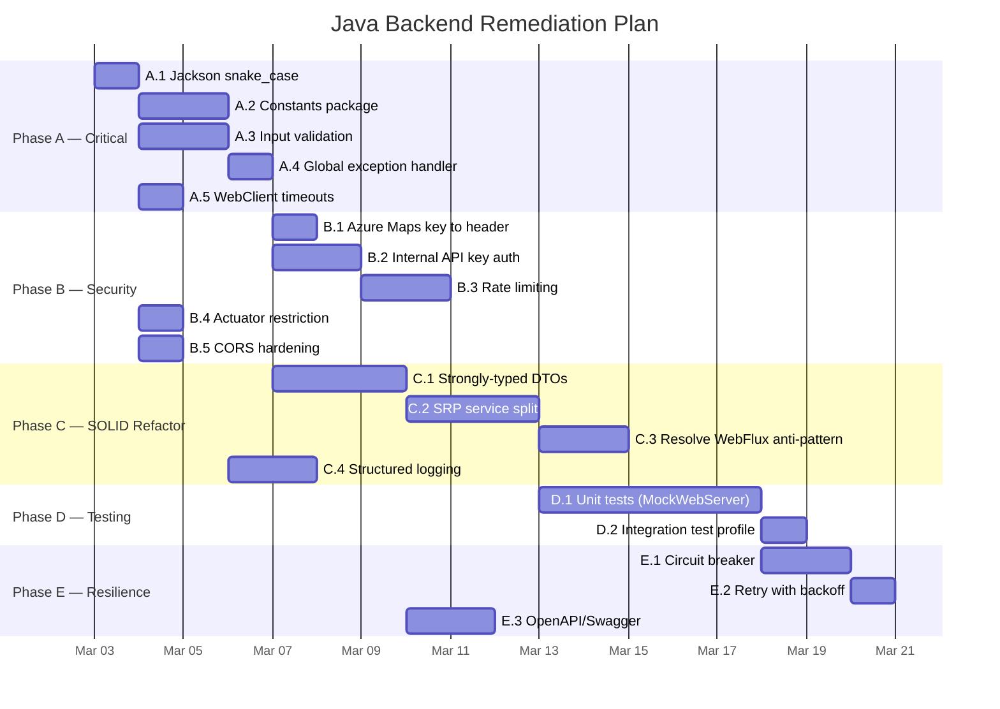

# Java Backend (Geospatial Service) — Architecture Review & Remediation Plan

**Date**: March 2, 2026  
**Reviewer**: Sr. Java Architect (Security & SOLID Focus)  
**Service**: `backend-java/` — Spring Boot 3.3 Geospatial Proxy  
**Status**: 🔴 Requires remediation before Phase 5 (Frontend Integration)

---

## Executive Summary

The Java geospatial service is a functional proxy layer for Mapbox and Azure Maps APIs, but it has **critical security gaps**, **SOLID violations**, **zero test coverage**, and a **JSON serialization mismatch** that will break frontend integration. This plan prioritizes fixes by impact and dependency order.

### Scorecard

| Category | Rating | Key Issue |
|----------|--------|-----------|
| **Security** | 🔴 Poor | No input validation, no auth, API keys in query params, no rate limiting |
| **SOLID Compliance** | 🟡 Fair | SRP and OCP violations in services; DTOs lack type safety |
| **Error Handling** | 🟡 Fair | `ResponseStatusException` used but no global handler, leaks internals |
| **Test Coverage** | 🔴 Poor | 1 smoke test, 0 unit/integration tests |
| **Resilience** | 🔴 Poor | No timeouts, no retries, no circuit breakers |
| **Code Standards** | 🟡 Fair | Clean structure but violates project's own no-hardcoded-strings rule |
| **Production Readiness** | 🔴 Not Ready | snake_case mismatch will break frontend; missing validation is exploitable |

---

## Phase A — Critical Fixes (Before Phase 5 Frontend Integration)

**Effort**: 6-8 hours | **Priority**: 🔴 Critical  
**Goal**: Ensure the Java service produces correct JSON and is not trivially exploitable.

---

### Task A.1: Jackson snake_case Configuration

**Problem**: Java returns `placeName` (camelCase) but the Python backend returns `place_name` (snake_case). The frontend expects snake_case. This **will break** Phase 5 frontend integration.

**File**: `src/main/resources/application.yml`

**Change**:
```yaml
spring:
  application:
    name: geospatial-service
  jackson:
    property-naming-strategy: SNAKE_CASE
```

**Acceptance Criteria**:
- [ ] `GET /api/geocode?q=Denver` returns `{"coordinates": [...], "place_name": "Denver, CO"}`
- [ ] `GET /api/directions?coords=...` returns `geometry` and `legs` with snake_case keys throughout
- [ ] `GET /api/search?query=...` returns `{"features": [{"place_name": "...", ...}]}`
- [ ] Verify response shapes match Python backend's output exactly

**Estimate**: 30 min

---

### Task A.2: Create Constants Package — Externalize All Hardcoded Strings

**Problem**: Dozens of inline strings violate the project's strictly-enforced no-hardcoded-strings rule (see `copilot-instructions.md`).

**New Files**:
```
src/main/java/com/roadtrip/geospatial/constants/
├── ErrorMessages.java       // All error/exception messages
├── ApiConstants.java         // API versions, limits, valid profiles, URL paths
└── GeoJsonConstants.java     // "Feature", "Point", "coordinates", etc.
```

#### `ErrorMessages.java`
```java
package com.roadtrip.geospatial.constants;

public final class ErrorMessages {
    // External API errors
    public static final String NO_RESPONSE_MAPBOX = "No response from Mapbox";
    public static final String NO_RESPONSE_AZURE_MAPS = "No response from Azure Maps";
    public static final String ADDRESS_NOT_FOUND = "Address not found";

    // Configuration errors
    public static final String MAPBOX_TOKEN_NOT_CONFIGURED = "Mapbox token not configured";
    public static final String AZURE_MAPS_KEY_NOT_CONFIGURED = "Azure Maps key not configured";

    // Validation errors
    public static final String INVALID_PROXIMITY_FORMAT = "Invalid proximity format. Expected: lng,lat";
    public static final String INVALID_PROFILE = "Invalid profile. Allowed: driving, walking, cycling, driving-traffic";
    public static final String INVALID_COORDS_FORMAT = "Invalid coordinates format. Expected: lng,lat;lng,lat";
    public static final String QUERY_TOO_LONG = "Query exceeds maximum length";

    private ErrorMessages() {} // prevent instantiation
}
```

#### `ApiConstants.java`
```java
package com.roadtrip.geospatial.constants;

import java.util.Set;
import java.util.regex.Pattern;

public final class ApiConstants {
    // Mapbox profiles
    public static final Set<String> VALID_PROFILES = Set.of(
        "driving", "walking", "cycling", "driving-traffic"
    );
    public static final String DEFAULT_PROFILE = "driving";

    // Input limits
    public static final int MAX_QUERY_LENGTH = 500;
    public static final int MAX_COORDS_LENGTH = 2000;
    public static final int MAX_SEARCH_RESULTS = 10;

    // Coordinate validation pattern: lng,lat;lng,lat (decimal numbers, semicolon separated)
    public static final Pattern COORDS_PATTERN = Pattern.compile(
        "^-?\\d+(\\.\\d+)?,-?\\d+(\\.\\d+)?(;-?\\d+(\\.\\d+)?,-?\\d+(\\.\\d+)?)*$"
    );

    // API versions
    public static final String AZURE_MAPS_API_VERSION = "1.0";

    // Mapbox URL paths
    public static final String MAPBOX_GEOCODE_PATH = "/geocoding/v5/mapbox.places/{query}.json";
    public static final String MAPBOX_DIRECTIONS_PATH = "/directions/v5/mapbox/{profile}/{coords}";
    public static final String MAPBOX_OPTIMIZE_PATH = "/optimized-trips/v1/mapbox/driving/{coords}";

    // Azure Maps URL paths
    public static final String AZURE_MAPS_FUZZY_SEARCH_PATH = "/search/fuzzy/json";

    private ApiConstants() {}
}
```

#### `GeoJsonConstants.java`
```java
package com.roadtrip.geospatial.constants;

public final class GeoJsonConstants {
    public static final String TYPE_FEATURE = "Feature";
    public static final String TYPE_POINT = "Point";
    public static final String FIELD_TYPE = "type";
    public static final String FIELD_COORDINATES = "coordinates";
    public static final String FIELD_GEOMETRY = "geometry";
    public static final String UNKNOWN = "Unknown";

    private GeoJsonConstants() {}
}
```

#### `HealthConstants.java`
```java
package com.roadtrip.geospatial.constants;

public final class HealthConstants {
    public static final String STATUS_HEALTHY = "healthy";
    public static final String SERVICE_NAME = "geospatial-service";
    public static final String RUNTIME_JAVA = "java";

    private HealthConstants() {}
}
```

**Acceptance Criteria**:
- [ ] Zero hardcoded literal strings in service or controller classes (except log messages and test assertions)
- [ ] All error messages reference `ErrorMessages.*`
- [ ] All API paths reference `ApiConstants.*`
- [ ] All GeoJSON keys reference `GeoJsonConstants.*`

**Estimate**: 2 hours

---

### Task A.3: Input Validation on All Endpoints

**Problem**: All endpoints accept raw user input with no validation. The `profile` parameter is interpolated into a URL path — a **path traversal risk**. The `coords` parameter could contain injection payloads. `spring-boot-starter-validation` is in pom.xml but entirely unused.

**File**: `controller/GeospatialController.java` + new `validation/InputValidator.java`

#### New: `InputValidator.java`
```java
package com.roadtrip.geospatial.validation;

import com.roadtrip.geospatial.constants.ApiConstants;
import com.roadtrip.geospatial.constants.ErrorMessages;
import org.springframework.http.HttpStatus;
import org.springframework.web.server.ResponseStatusException;

public final class InputValidator {

    private InputValidator() {}

    public static void validateProfile(String profile) {
        if (!ApiConstants.VALID_PROFILES.contains(profile)) {
            throw new ResponseStatusException(HttpStatus.BAD_REQUEST, ErrorMessages.INVALID_PROFILE);
        }
    }

    public static void validateCoords(String coords) {
        if (coords == null || coords.length() > ApiConstants.MAX_COORDS_LENGTH
                || !ApiConstants.COORDS_PATTERN.matcher(coords).matches()) {
            throw new ResponseStatusException(HttpStatus.BAD_REQUEST, ErrorMessages.INVALID_COORDS_FORMAT);
        }
    }

    public static void validateQuery(String query) {
        if (query == null || query.isBlank() || query.length() > ApiConstants.MAX_QUERY_LENGTH) {
            throw new ResponseStatusException(HttpStatus.BAD_REQUEST, ErrorMessages.QUERY_TOO_LONG);
        }
    }
}
```

#### Controller changes:
```java
@GetMapping("/directions")
public ResponseEntity<DirectionsResponse> getDirections(
        @RequestParam("coords") String coords,
        @RequestParam(value = "profile", defaultValue = "driving") String profile) {
    InputValidator.validateCoords(coords);
    InputValidator.validateProfile(profile);
    DirectionsResponse result = mapboxService.getDirections(coords, profile);
    return ResponseEntity.ok(result);
}
```

**Acceptance Criteria**:
- [ ] `profile` validated against whitelist `{driving, walking, cycling, driving-traffic}`
- [ ] `coords` validated against regex pattern, max 2000 chars
- [ ] `q` / `query` validated for non-blank, max 500 chars
- [ ] Invalid input returns `400 Bad Request` with safe message
- [ ] No user input reaches URL path construction without validation

**Estimate**: 1.5 hours

---

### Task A.4: Global Exception Handler

**Problem**: No `@RestControllerAdvice` exists. Errors return inconsistent formats. Internal details like `"Azure Maps key not configured"` leak to callers.

**New File**: `controller/GlobalExceptionHandler.java`

```java
@RestControllerAdvice
public class GlobalExceptionHandler {

    private static final Logger log = LoggerFactory.getLogger(GlobalExceptionHandler.class);

    record ErrorResponse(String error, int status, String timestamp) {}

    @ExceptionHandler(ResponseStatusException.class)
    public ResponseEntity<ErrorResponse> handleResponseStatus(ResponseStatusException ex) {
        int statusCode = ex.getStatusCode().value();
        // Sanitize: don't leak internal config messages to external callers
        String safeMessage = statusCode >= 500
            ? "Internal service error"
            : ex.getReason();
        log.warn("Request failed: status={}, reason={}", statusCode, ex.getReason());
        return ResponseEntity.status(statusCode)
            .body(new ErrorResponse(safeMessage, statusCode, Instant.now().toString()));
    }

    @ExceptionHandler(Exception.class)
    public ResponseEntity<ErrorResponse> handleGeneral(Exception ex) {
        log.error("Unexpected error", ex);
        return ResponseEntity.status(500)
            .body(new ErrorResponse("Internal service error", 500, Instant.now().toString()));
    }
}
```

**Acceptance Criteria**:
- [ ] All error responses follow `{ "error": "...", "status": N, "timestamp": "..." }` shape
- [ ] 5xx errors never expose internal details (API key, service name, configuration state)
- [ ] 4xx errors return safe validation messages
- [ ] All exceptions are logged server-side with full context

**Estimate**: 1 hour

---

### Task A.5: WebClient Timeouts

**Problem**: All `.block()` calls have no timeout. If Mapbox/Azure Maps hangs, the Java service hangs indefinitely, consuming threads until the pool is exhausted.

**File**: `config/WebClientConfig.java` + service constructors

```java
@Configuration
public class WebClientConfig {

    private static final Duration CONNECT_TIMEOUT = Duration.ofSeconds(5);
    private static final Duration RESPONSE_TIMEOUT = Duration.ofSeconds(10);

    @Bean
    public WebClient.Builder webClientBuilder() {
        HttpClient httpClient = HttpClient.create()
                .option(ChannelOption.CONNECT_TIMEOUT_MILLIS, (int) CONNECT_TIMEOUT.toMillis())
                .responseTimeout(RESPONSE_TIMEOUT);
        return WebClient.builder()
                .clientConnector(new ReactorClientHttpConnector(httpClient));
    }
}
```

**Acceptance Criteria**:
- [ ] Connection timeout: 5 seconds
- [ ] Response timeout: 10 seconds
- [ ] Timeout triggers `504 Gateway Timeout` response (not a hang)
- [ ] Timeouts configurable via `application.yml` properties

**Estimate**: 1 hour

---

## Phase B — Security Hardening

**Effort**: 6-8 hours | **Priority**: 🟠 High  
**Goal**: Defense-in-depth security before production deployment.

---

### Task B.1: Move Azure Maps Key to HTTP Header

**Problem**: `subscription-key` is passed as a URL query parameter, exposing it in logs, proxies, and CDN caches.

**File**: `service/AzureMapsService.java`

**Change**: Azure Maps supports the `Subscription-Key` header natively.

```java
// ❌ Current — key in URL
.queryParam("subscription-key", azureMapsKey)

// ✅ Recommended — key in header
.header("Subscription-Key", azureMapsKey)
// Remove the queryParam line
```

**Acceptance Criteria**:
- [ ] `subscription-key` no longer appears in any URL
- [ ] Azure Maps requests use `Subscription-Key` HTTP header
- [ ] Existing functionality unchanged (search returns same results)

**Estimate**: 30 min

---

### Task B.2: Add Internal Service Authentication

**Problem**: No authentication between BFF and Java service. Anyone with network access to port 8082 can call the endpoints directly.

**Implementation**: Shared API key validation via a filter/interceptor.

```java
@Component
public class InternalApiKeyFilter extends OncePerRequestFilter {
    @Value("${geospatial.internal-api-key:}")
    private String expectedApiKey;

    @Override
    protected void doFilterInternal(HttpServletRequest request,
            HttpServletResponse response, FilterChain chain) {
        // Skip health endpoints
        if (request.getRequestURI().equals("/health") ||
            request.getRequestURI().startsWith("/actuator")) {
            chain.doFilter(request, response);
            return;
        }
        String apiKey = request.getHeader("X-Internal-Api-Key");
        if (expectedApiKey.isBlank() || expectedApiKey.equals(apiKey)) {
            chain.doFilter(request, response);
        } else {
            response.setStatus(403);
            response.getWriter().write("{\"error\":\"Forbidden\",\"status\":403}");
        }
    }
}
```

**Environment Variables**:
```yaml
geospatial:
  internal-api-key: ${INTERNAL_API_KEY:}  # blank = disabled (dev mode)
```

**Acceptance Criteria**:
- [ ] When `INTERNAL_API_KEY` is set, requests without matching `X-Internal-Api-Key` header return 403
- [ ] When `INTERNAL_API_KEY` is empty/unset, all requests pass (backward compatible for dev)
- [ ] `/health` and `/actuator/*` bypass the filter
- [ ] BFF sends the header on all proxied requests to Java service

**Estimate**: 2 hours (includes BFF changes)

---

### Task B.3: Rate Limiting

**Problem**: No rate limiting. An attacker can exhaust Mapbox/Azure Maps API quotas and inflate billing.

**Implementation**: Bucket4j or a simple in-memory rate limiter.

**Acceptance Criteria**:
- [ ] Per-IP rate limit: 60 requests/minute for geocode, directions, search, optimize
- [ ] Rate-limited requests return `429 Too Many Requests`
- [ ] Rate limits configurable via `application.yml`
- [ ] Health endpoints excluded from rate limiting

**Estimate**: 2 hours

---

### Task B.4: Restrict Actuator & Health Exposure

**Problem**: `application.yml` has `show-details: always` for actuator health, exposing internals.

**File**: `src/main/resources/application.yml`

```yaml
management:
  endpoints:
    web:
      exposure:
        include: health
  endpoint:
    health:
      show-details: when-authorized  # Not "always"
```

**Acceptance Criteria**:
- [ ] `/actuator/health` returns `{"status":"UP"}` only (no component details)
- [ ] `/actuator/info` no longer exposed
- [ ] Custom `/health` endpoint remains unchanged

**Estimate**: 15 min

---

### Task B.5: CORS Hardening

**Problem**: `allowedHeaders("*")` with `allowCredentials(true)` is overly permissive.

**File**: `config/CorsConfig.java`

```java
.allowedHeaders("Content-Type", "Authorization", "X-Request-ID", "X-Internal-Api-Key")
// instead of .allowedHeaders("*")
```

**Acceptance Criteria**:
- [ ] Only specific headers whitelisted
- [ ] CORS preflight returns correct `Access-Control-Allow-Headers`
- [ ] Frontend requests still work through BFF

**Estimate**: 15 min

---

## Phase C — Code Quality & SOLID Refactoring

**Effort**: 8-10 hours | **Priority**: 🟡 Medium  
**Goal**: Improve maintainability, testability, and adherence to SOLID principles.

---

### Task C.1: Strongly-Typed DTOs (Replace `Map<String, Object>`)

**Problem**: DTOs use `Map<String, Object>` which provides zero type safety, requires unsafe casts, and makes the API contract invisible.

**New DTOs**:
```java
// Replace Map<String, Object> geometry with:
public record Geometry(String type, List<List<Double>> coordinates) {}

// Replace Map<String, Object> legs with:
public record RouteLeg(double distance, double duration, String summary) {}

// GeoJSON Feature for search results:
public record GeoJsonFeature(
    String id, String type, String text,
    String placeName, Geometry geometry) {}

// Updated responses:
public record DirectionsResponse(
    double distance, double duration,
    Geometry geometry, List<RouteLeg> legs) {}

public record SearchResponse(List<GeoJsonFeature> features) {}
```

**Acceptance Criteria**:
- [ ] Zero `Map<String, Object>` in DTOs
- [ ] Zero `@SuppressWarnings("unchecked")` in service classes
- [ ] All response shapes documented via record fields
- [ ] JSON serialization matches previous output

**Estimate**: 3 hours

---

### Task C.2: Service Layer SRP Refactoring

**Problem**: `MapboxService` handles geocoding, directions, AND optimization (3 responsibilities). `AzureMapsService.searchPlaces()` does validation, HTTP call, AND response transformation in one method.

**Refactored structure**:
```
service/
├── GeocodingService.java       // geocode() — extracted from MapboxService
├── DirectionsService.java      // getDirections() + optimizeRoute() — extracted from MapboxService
├── SearchService.java          // searchPlaces() — delegates to AzureMapsService
├── AzureMapsClient.java        // Raw Azure Maps HTTP calls only
├── MapboxClient.java           // Raw Mapbox HTTP calls only
└── transformer/
    └── GeoJsonTransformer.java // Azure Maps → GeoJSON transformation
```

**Acceptance Criteria**:
- [ ] Each service class has a single responsibility
- [ ] HTTP client calls separated from business logic
- [ ] Response transformation in dedicated transformer class
- [ ] Controller injects focused services, not monolithic ones

**Estimate**: 3 hours

---

### Task C.3: Resolve WebFlux vs Servlet Anti-Pattern

**Problem**: The app uses `spring-boot-starter-web` (servlet, blocking) with `spring-boot-starter-webflux` (reactive) together. All reactive calls are `.block()`-ed, defeating the purpose.

**Options** (choose one):

| Option | Pros | Cons |
|--------|------|------|
| **A: Keep Servlet, use `RestClient`** (Spring Boot 3.2+) | Simple, no reactive complexity, modern API | Loses `WebClient` features |
| **B: Go fully reactive** | Better throughput for proxy workload | More complex, requires reactive controller signatures |

**Recommendation**: **Option A** — this is a thin proxy service, `RestClient` is simpler and idiomatic for Spring Boot 3.3.

**Acceptance Criteria**:
- [ ] Zero `.block()` calls remain
- [ ] Either `WebClient` removed (Option A) or controllers return `Mono<>` (Option B)
- [ ] External API calls remain non-blocking with timeouts

**Estimate**: 2 hours

---

### Task C.4: Add Structured Logging

**Problem**: Both services declare `Logger` fields but never use them. No request tracing, no timing metrics, no error context.

**Implementation**:
```java
log.info("Geocoding query='{}' started", query);
long start = System.currentTimeMillis();
// ... API call ...
log.info("Geocoding query='{}' completed in {}ms, place='{}'",
    query, System.currentTimeMillis() - start, placeName);
```

**Acceptance Criteria**:
- [ ] Every external API call logged at INFO: request params + duration
- [ ] Every error logged at WARN/ERROR with context
- [ ] API keys/tokens NEVER logged (even at DEBUG)
- [ ] X-Request-ID correlation from BFF propagated in log context (MDC)

**Estimate**: 1.5 hours

---

## Phase D — Testing

**Effort**: 8-10 hours | **Priority**: 🟡 Medium  
**Goal**: Achieve ≥80% coverage with unit and integration tests.

---

### Task D.1: Unit Tests with MockWebServer

**New test files**:
```
src/test/java/com/roadtrip/geospatial/
├── service/
│   ├── MapboxServiceTest.java          // MockWebServer for Mapbox API
│   └── AzureMapsServiceTest.java       // MockWebServer for Azure Maps API
├── controller/
│   ├── GeospatialControllerTest.java   // @WebMvcTest with mocked services
│   └── HealthControllerTest.java       // @WebMvcTest
├── validation/
│   └── InputValidatorTest.java         // Unit tests for all validators
└── GeospatialApplicationTests.java     // Existing smoke test
```

**Required dependency** (add to pom.xml):
```xml
<dependency>
    <groupId>com.squareup.okhttp3</groupId>
    <artifactId>mockwebserver</artifactId>
    <scope>test</scope>
</dependency>
```

**Test cases (minimum)**:

| Test | Method | Asserts |
|------|--------|---------|
| Geocode success | `geocode("Denver")` | Returns coordinates + place_name |
| Geocode not found | `geocode("zzzzz")` | Throws 404 |
| Geocode API down | `geocode("Denver")` | Throws 502 |
| Directions success | `getDirections(coords, "driving")` | Returns distance, duration, geometry, legs |
| Directions invalid profile | `getDirections(coords, "flying")` | Throws 400 |
| Directions invalid coords | `getDirections("bad", "driving")` | Throws 400 |
| Search success | `searchPlaces("gas station", "lng,lat")` | Returns GeoJSON features |
| Search no proximity | `searchPlaces("hotel", null)` | Returns features without proximity bias |
| Search invalid proximity | `searchPlaces("hotel", "bad")` | Throws 400 |
| Optimize success | `optimizeRoute(coords)` | Returns optimization response |
| Token not configured | Any Mapbox call | Throws 500 |
| Azure key not configured | `searchPlaces(...)` | Throws 500 |
| Timeout | Any call | Throws 504 after configured timeout |
| Rate limit exceeded | 61 calls in 1 minute | Returns 429 |

**Acceptance Criteria**:
- [ ] ≥80% line coverage
- [ ] All external API calls mocked (no real HTTP calls in tests)
- [ ] Tests run in `./mvnw test` and CI pipeline
- [ ] No test depends on environment variables or API keys

**Estimate**: 8 hours

---

### Task D.2: Add Integration Test Profile

**File**: `src/test/resources/application-test.yml`

```yaml
geospatial:
  mapbox:
    token: test-token
    base-url: http://localhost:${mockwebserver.port}
  azure-maps:
    key: test-key
    base-url: http://localhost:${mockwebserver.port}
```

**Estimate**: 30 min

---

## Phase E — Resilience & Observability

**Effort**: 4-6 hours | **Priority**: 🟢 Medium-Low  
**Goal**: Production-grade resilience patterns.

---

### Task E.1: Circuit Breaker (Resilience4j)

**New dependency**:
```xml
<dependency>
    <groupId>io.github.resilience4j</groupId>
    <artifactId>resilience4j-spring-boot3</artifactId>
</dependency>
```

**Configuration**:
```yaml
resilience4j:
  circuitbreaker:
    instances:
      mapbox:
        sliding-window-size: 10
        failure-rate-threshold: 50
        wait-duration-in-open-state: 30s
      azure-maps:
        sliding-window-size: 10
        failure-rate-threshold: 50
        wait-duration-in-open-state: 30s
```

**Acceptance Criteria**:
- [ ] Circuit opens after 50% failure rate in 10-call window
- [ ] Open circuit returns `503 Service Unavailable` immediately (no upstream call)
- [ ] Circuit half-opens after 30s and allows probe requests
- [ ] Circuit state visible in actuator health

**Estimate**: 2 hours

---

### Task E.2: Retry with Backoff

```yaml
resilience4j:
  retry:
    instances:
      mapbox:
        max-attempts: 3
        wait-duration: 500ms
        exponential-backoff-multiplier: 2
        retry-exceptions:
          - org.springframework.web.reactive.function.client.WebClientRequestException
```

**Acceptance Criteria**:
- [ ] Transient failures retried up to 3 times with exponential backoff
- [ ] Non-retryable errors (4xx) fail fast
- [ ] Retries logged at WARN level

**Estimate**: 1 hour

---

### Task E.3: OpenAPI/Swagger Documentation

**New dependency**:
```xml
<dependency>
    <groupId>org.springdoc</groupId>
    <artifactId>springdoc-openapi-starter-webmvc-ui</artifactId>
    <version>2.3.0</version>
</dependency>
```

**Acceptance Criteria**:
- [ ] Swagger UI at `/swagger-ui.html`
- [ ] All 4 endpoints documented with request/response schemas
- [ ] Query parameters documented with constraints (required, default, pattern)

**Estimate**: 1.5 hours

---

## Implementation Order & Dependencies



---

## Roadmap Alignment

These tasks map to existing roadmap items:

| This Plan | Roadmap Reference | Phase |
|-----------|-------------------|-------|
| A.1 (snake_case) | Phase 4: "Verify response JSON format matches Python backend exactly" | 4 |
| A.2 (constants) | Phase 4 + Coding Standards: "No hardcoded strings" | 4 |
| A.3 (validation) | Phase 4: "Add error handling for API key not configured" | 4 |
| A.4 (error handler) | Phase 4: implied by error handling | 4 |
| A.5 (timeouts) | Phase 4: operational readiness | 4 |
| B.1-B.5 (security) | Phase 6 Issue #3: "Remove Hardcoded API Tokens" + security audit | 6 |
| C.1-C.4 (refactoring) | Phase 6 Issue #20: "Extract Duplicate Code" | 6 |
| D.1-D.2 (testing) | Phase 4: "Create JUnit tests with MockWebServer" | 4 |
| E.1-E.2 (resilience) | Phase 7 / Phase 8: production hardening | 7-8 |
| E.3 (swagger) | Phase 7 Issue #9: "Interactive API Documentation" | 7 |

---

## Files Changed Summary

### New Files (10)
| File | Purpose |
|------|---------|
| `constants/ErrorMessages.java` | All error message strings |
| `constants/ApiConstants.java` | API paths, limits, valid profiles |
| `constants/GeoJsonConstants.java` | GeoJSON field constants |
| `constants/HealthConstants.java` | Health response constants |
| `validation/InputValidator.java` | Input validation utility |
| `controller/GlobalExceptionHandler.java` | Uniform error responses |
| `service/transformer/GeoJsonTransformer.java` | Azure Maps → GeoJSON mapper |
| `src/test/java/.../service/MapboxServiceTest.java` | Mapbox unit tests |
| `src/test/java/.../service/AzureMapsServiceTest.java` | Azure Maps unit tests |
| `src/test/java/.../controller/GeospatialControllerTest.java` | Controller tests |

### Modified Files (8)
| File | Changes |
|------|---------|
| `application.yml` | Add `jackson.property-naming-strategy`, timeouts, actuator restriction |
| `pom.xml` | Add mockwebserver, resilience4j, springdoc dependencies |
| `GeospatialController.java` | Add validation calls, inject focused services |
| `MapboxService.java` | Use constants, add logging, remove hardcoded strings |
| `AzureMapsService.java` | Use header auth, constants, extract transformer |
| `CorsConfig.java` | Whitelist specific headers |
| `WebClientConfig.java` | Add timeouts, HTTP client configuration |
| `HealthController.java` | Use `HealthConstants` instead of inline strings |

---

## Total Effort Estimate

| Phase | Hours | Priority |
|-------|-------|----------|
| **A: Critical Fixes** | 6-8 | 🔴 Critical |
| **B: Security Hardening** | 5-6 | 🟠 High |
| **C: SOLID Refactoring** | 8-10 | 🟡 Medium |
| **D: Testing** | 8-10 | 🟡 Medium |
| **E: Resilience** | 4-6 | 🟢 Medium-Low |
| **Total** | **31-40** | — |

> **Recommendation**: Complete **Phase A** before Phase 5 (Frontend Integration) begins. Phases B-E can be parallelized with Phases 5-7 of the main roadmap.
