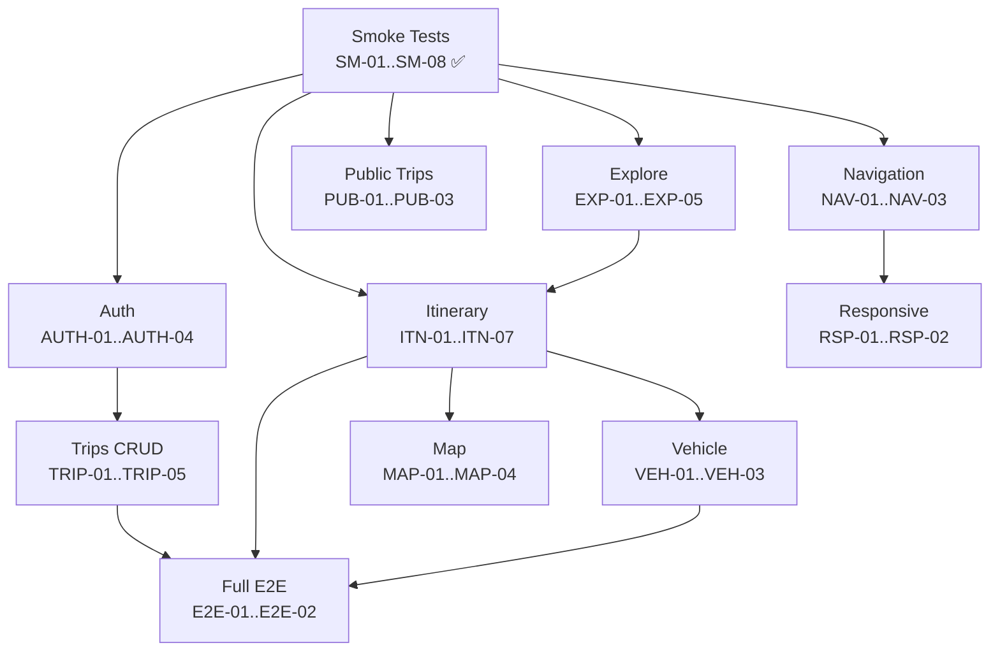

# Playwright E2E Testing — AI Developer Workflow Guide

> **Testing Framework**: Playwright v1.57+ with TypeScript  
> **Conventions**: [testing.instructions.md](../.github/instructions/testing.instructions.md)  
> **Source Roadmap**: [PLAYWRIGHT_TESTING_ROADMAP.md](./PLAYWRIGHT_TESTING_ROADMAP.md)  
> **Directory**: `frontend/e2e/`  
> **Total Test Cases**: 50 (15 implemented, 35 planned) | **Effort**: 25–35 hours

---

## Quick Start

```bash
# 1. Pick a test case from the table below
# 2. Copy the CORE prompt for that test
# 3. Paste into Copilot Chat:
<paste CORE prompt>

# 4. After implementation, run:
cd frontend
npx playwright test <new-test-file> --headed  # Debug visually
npx playwright test --grep @smoke              # Run smoke suite
npx playwright test                            # Run all tests
```

---

## Dependency Graph



---

## Test Inventory

### Legend
| Priority | Meaning | SLA |
|----------|---------|-----|
| **P0** | Blocks release | Every PR |
| **P1** | Important | Nightly |
| **P2** | Nice-to-have | Weekly |

| Icon | Meaning |
|------|---------|
| ✅ | Implemented and passing |
| 📋 | Planned (CORE prompt available) |

---

| ID | Test | Group | Priority | Status | Effort |
|----|------|-------|----------|--------|--------|
| SM-01 | App loads and redirects `/` → `/explore` | Smoke | P0 | ✅ | 5 min |
| SM-02 | Sidebar nav items render | Smoke | P0 | ✅ | 5 min |
| SM-03 | Mapbox GL canvas renders | Smoke | P0 | ✅ | 5 min |
| SM-04 | BFF `/health` returns 200 | Smoke | P0 | ✅ | 5 min |
| SM-05 | No auth token by default | Smoke | P0 | ✅ | 5 min |
| SM-06 | Explore category pills render | Smoke | P0 | ✅ | 5 min |
| SM-07 | Itinerary FloatingPanel renders | Smoke | P0 | ✅ | 5 min |
| SM-08 | Start Trip options render | Smoke | P0 | ✅ | 5 min |
| NAV-01a | Sidebar → Explore | Navigation | P0 | ✅ | 5 min |
| NAV-01b | Sidebar → Itinerary | Navigation | P0 | ✅ | 5 min |
| NAV-01c | Sidebar → My Trips | Navigation | P0 | ✅ | 5 min |
| NAV-01d | Sidebar → Start Trip | Navigation | P0 | ✅ | 5 min |
| NAV-01e | Sequential nav all views | Navigation | P0 | ✅ | 10 min |
| NAV-02 | Browser back/forward | Navigation | P1 | ✅ | 10 min |
| NAV-03 | Mobile bottom nav | Navigation | P2 | 📋 | 30 min |
| EXP-01 | Category pill search | Explore | P0 | 📋 | 30 min |
| EXP-02 | Text search returns results | Explore | P0 | 📋 | 30 min |
| EXP-03 | Add result to trip | Explore | P1 | 📋 | 45 min |
| EXP-04 | Featured trips section | Explore | P1 | 📋 | 20 min |
| EXP-05 | Find Along Route POI | Explore | P2 | 📋 | 1 hr |
| ITN-01 | Add stop via geocode | Itinerary | P0 | 📋 | 45 min |
| ITN-02 | Remove stop from list | Itinerary | P0 | 📋 | 20 min |
| ITN-03 | Calculate route 2+ stops | Itinerary | P0 | 📋 | 45 min |
| ITN-04 | Route distance/duration | Itinerary | P1 | 📋 | 20 min |
| ITN-05 | Optimize route order | Itinerary | P1 | 📋 | 45 min |
| ITN-06 | Drag-and-drop reorder | Itinerary | P2 | 📋 | 1 hr |
| ITN-07 | Directions tab turn-by-turn | Itinerary | P1 | 📋 | 30 min |
| VEH-01 | Select vehicle type | Vehicle | P1 | 📋 | 20 min |
| VEH-02 | Vehicle specs update store | Vehicle | P1 | 📋 | 30 min |
| VEH-03 | AI vehicle description | Vehicle | P2 | 📋 | 45 min |
| AUTH-01 | Dev login flow | Auth | P0 | 📋 | 30 min |
| AUTH-02 | Logout clears session | Auth | P0 | 📋 | 30 min |
| AUTH-03 | Auth status shows email | Auth | P1 | 📋 | 20 min |
| AUTH-04 | Save trip prompts login | Auth | P1 | 📋 | 30 min |
| TRIP-01 | Save trip with stops | Trips | P0 | 📋 | 45 min |
| TRIP-02 | Load saved trips list | Trips | P0 | 📋 | 30 min |
| TRIP-03 | Load specific trip restores data | Trips | P1 | 📋 | 45 min |
| TRIP-04 | Delete trip | Trips | P1 | 📋 | 30 min |
| TRIP-05 | Unauth user login prompt | Trips | P1 | 📋 | 15 min |
| PUB-01 | Load community trips | Public | P1 | 📋 | 30 min |
| PUB-02 | Filter featured trips | Public | P2 | 📋 | 20 min |
| PUB-03 | Load public trip into itinerary | Public | P2 | 📋 | 45 min |
| MAP-01 | Stop markers render | Map | P1 | 📋 | 45 min |
| MAP-02 | Route line renders | Map | P1 | 📋 | 45 min |
| MAP-03 | Auto-fit bounds | Map | P2 | 📋 | 30 min |
| MAP-04 | POI markers render | Map | P2 | 📋 | 30 min |
| RSP-01 | Mobile bottom nav renders | Responsive | P2 | 📋 | 30 min |
| RSP-02 | FloatingPanel adapts mobile | Responsive | P2 | 📋 | 30 min |
| E2E-01 | Complete trip flow | Full E2E | P0 | 📋 | 1.5 hr |
| E2E-02 | Reload saved trip verifies data | Full E2E | P1 | 📋 | 1 hr |

---

## Explore Tests

### EXP-01 — Category Pill Search

<details>
<summary>📋 CORE Prompt (click to expand)</summary>

**Context**: You are writing Playwright E2E tests for a React road trip planner. The test project is at `frontend/e2e/`, uses Page Object Models in `e2e/pages/ExplorePage.ts`, and runs against Docker Compose at `localhost:5173`. The Explore view (`/explore`) renders 10 category pill buttons (Places to Camp, Parks & Nature, Bars & Restaurants, etc.). Clicking a pill sends `GET /api/search?query=<category>&proximity=-98.5795,39.8283` via BFF to the Java backend. Results render as cards with name, address, and "Add to Trip" button. See `frontend/src/views/ExploreView.tsx`.

**Objective**: Create a Playwright test that validates the category pill search flow returns results and displays them correctly.

**Requirements**:
- Create `e2e/tests/explore/category-search.spec.ts`
- Navigate to `/explore` using `ExplorePage.goto()`
- Assert category pills visible via `ExplorePage.expectCategoriesVisible()`
- Click "Places to Camp" pill
- Wait for `/api/search` API response
- Assert ≥1 search result card visible
- Assert each result has a name and "Add to Trip" button
- Tag: `@regression`
- Import from `e2e/fixtures/base.fixture` for `explorePage` fixture

**Example**: `await explorePage.clickCategory('Places to Camp'); await page.waitForResponse(r => r.url().includes('/api/search'));`

</details>

---

### EXP-02 — Text Search Returns Results

<details>
<summary>📋 CORE Prompt (click to expand)</summary>

**Context**: The Explore view has a search input with placeholder "Search and Explore". Typing a query and pressing Enter sends `GET /api/search?query=<text>&proximity=<coords>`. The `ExplorePage` POM has `textSearch(query)`, `waitForResults()`, `getResultCount()`, and `getResultName(index)` methods.

**Objective**: Test free-text search on the Explore page.

**Requirements**:
- Create `e2e/tests/explore/text-search.spec.ts`
- Navigate to `/explore`
- Use `ExplorePage.textSearch('Grand Canyon')` to search
- Wait for results via `ExplorePage.waitForResults()`
- Assert result count > 0
- Assert first result name contains relevant text
- Test clearing and re-searching with a different term
- Tag: `@regression`
- Use `EXPLORE_QUERIES` from `e2e/helpers/test-data.ts`

**Example**: `await explorePage.textSearch('Grand Canyon'); await explorePage.waitForResults(); expect(await explorePage.getResultCount()).toBeGreaterThan(0);`

</details>

---

### EXP-03 — Add Search Result to Trip

<details>
<summary>📋 CORE Prompt (click to expand)</summary>

**Context**: On the Explore view, each search result has an "Add to Trip" button. Clicking it calls `useTripStore.addStop()` which adds the location to the Zustand store. The UI shows a toast "Added to trip!" and the stop appears in Itinerary. The `ExplorePage` POM has `addResultToTrip(index)`. The `ItineraryPage` POM has `getStopCount()`.

**Objective**: Test adding a search result to the trip and verifying cross-view state.

**Requirements**:
- Extend `e2e/tests/explore/text-search.spec.ts`
- Search for a location, click "Add to Trip" on first result
- Assert success toast appears
- Navigate to `/itinerary`
- Assert stop count increased by 1
- Tag: `@regression`

**Example**: `await explorePage.addResultToTrip(0); await expect(page.getByText('Added to trip!')).toBeVisible();`

</details>

---

### EXP-04 — Featured Trips Section

<details>
<summary>📋 CORE Prompt (click to expand)</summary>

**Context**: Explore view has a "Featured Trips" section loading via `GET /api/public-trips?featured_only=true&limit=5`. The `ExplorePage` POM has `expectFeaturedTripsVisible()` and `getFeaturedTrips()`.

**Objective**: Test featured trips load on the Explore page.

**Requirements**:
- Navigate to `/explore`
- Wait for `/api/public-trips` response
- Assert "Featured Trips" heading visible
- Assert ≥1 trip card rendered (handle empty gracefully)
- Tag: `@regression`

**Example**: `await page.waitForResponse(r => r.url().includes('/api/public-trips')); await explorePage.expectFeaturedTripsVisible();`

</details>

---

### EXP-05 — Find Along Route POI Search

<details>
<summary>📋 CORE Prompt (click to expand)</summary>

**Context**: After calculating a route in Itinerary, 3 POI buttons appear (Gas, Food, Sleep). Clicking one samples points every 50km along the route and makes parallel `GET /api/search` requests. Results render as orange POI markers. Requires: 2+ stops added, route calculated. The `ItineraryPage` POM has `searchPOIAlongRoute(category)`.

**Objective**: Test the "Find Along Route" POI search end-to-end.

**Requirements**:
- Create `e2e/tests/itinerary/along-route-poi.spec.ts`
- Add 2 stops (Denver, Austin from `test-data.ts`)
- Calculate route
- Click "Gas" POI button via `ItineraryPage.searchPOIAlongRoute('Gas')`
- Wait for multiple `/api/search` responses
- Assert POI results appear
- Tags: `@regression @slow`

**Example**: Multi-step — uses full route setup before POI search.

</details>

---

## Itinerary Tests

### ITN-01 — Add Stop via Geocode Search

<details>
<summary>📋 CORE Prompt (click to expand)</summary>

**Context**: The Itinerary view (`/itinerary`) has a stop search input with placeholder "Add a stop (City, Place)...". Typing sends `GET /api/geocode?q=<query>` to Java via BFF. Results appear as clickable items. The `ItineraryPage` POM has `addStop(query)` and `getStopCount()`. Use `STOP_QUERIES` from `test-data.ts`.

**Objective**: Test adding a stop to the itinerary via geocode search.

**Requirements**:
- Create `e2e/tests/itinerary/add-stops.spec.ts`
- Navigate to `/itinerary`
- Assert initial stop count is 0
- Type "Denver, CO" and wait for geocode API response
- Click first result → assert stop count is 1
- Add second stop ("Austin, TX") → assert count is 2
- Tag: `@regression`

**Example**: `await itineraryPage.addStop('Denver, CO'); expect(await itineraryPage.getStopCount()).toBe(1);`

</details>

---

### ITN-02 — Remove Stop from List

<details>
<summary>📋 CORE Prompt (click to expand)</summary>

**Context**: Each stop has an X button calling `useTripStore.removeStop(id)`. The `ItineraryPage` POM has `removeStop(index)` and `getStopCount()`.

**Objective**: Test removing a stop from the itinerary.

**Requirements**:
- Extend `add-stops.spec.ts`
- Add 2 stops, assert count is 2
- Remove first stop via `ItineraryPage.removeStop(0)` → assert count is 1

**Example**: `await itineraryPage.removeStop(0); expect(await itineraryPage.getStopCount()).toBe(1);`

</details>

---

### ITN-03 — Calculate Route with 2+ Stops

<details>
<summary>📋 CORE Prompt (click to expand)</summary>

**Context**: After adding 2+ stops, "Calculate Route" becomes enabled. Clicking sends `GET /api/directions?coords=...` to Java/Mapbox. On success, route line renders and distance/duration display. The `ItineraryPage` POM has `calculateRoute()`, `getRouteDistance()`, `getRouteDuration()`.

**Objective**: Test route calculation flow with API interaction and UI update.

**Requirements**:
- Create `e2e/tests/itinerary/calculate-route.spec.ts`
- Add 2 stops (Denver and Austin)
- Click "Calculate Route", wait for `/api/directions` response
- Assert route distance visible (contains number + unit, e.g., "935 mi")
- Assert route duration visible (e.g., "13 hr 52 min")
- Assert map canvas still visible
- Tag: `@regression`

**Example**: `await itineraryPage.calculateRoute(); await expect(page.getByText(/\d+\s*mi/)).toBeVisible();`

</details>

---

### ITN-04 — Route Distance and Duration Display

<details>
<summary>📋 CORE Prompt (click to expand)</summary>

**Context**: After route calculation, FloatingPanel shows distance in miles and duration in hours/minutes from Mapbox Directions API.

**Objective**: Verify route metrics are formatted correctly.

**Requirements**:
- Extend `calculate-route.spec.ts`
- Assert distance matches `/\d+(\.\d+)?\s*(mi|miles)/`
- Assert duration matches `/\d+\s*(hr|hours).*\d+\s*(min|minutes)/`
- Assert both are non-zero

**Example**: `const distance = await itineraryPage.getRouteDistance(); expect(distance).toMatch(/\d+(\.\d+)?\s*(mi|miles)/);`

</details>

---

### ITN-05 — Optimize Route Order

<details>
<summary>📋 CORE Prompt (click to expand)</summary>

**Context**: With 3+ stops, "Optimize" button activates. Sends `GET /api/optimize?coords=...` to reorder for shortest distance. The `ItineraryPage` POM has `optimizeRoute()`.

**Objective**: Test route optimization reorders stops.

**Requirements**:
- Create `e2e/tests/itinerary/optimize-route.spec.ts`
- Add 3 stops (Denver, Austin, Nashville)
- Record initial order
- Click "Optimize", wait for `/api/optimize` response
- Assert order changed (or confirmed as optimal)
- Tags: `@regression @slow`

**Example**: `const before = await itineraryPage.getStopNames(); await itineraryPage.optimizeRoute(); const after = await itineraryPage.getStopNames();`

</details>

---

### ITN-06 — Drag-and-Drop Reorder

<details>
<summary>📋 CORE Prompt (click to expand)</summary>

**Context**: Stop list uses `@dnd-kit/sortable` for drag-and-drop. Each stop has a `GripVertical` drag handle. Playwright supports `locator.dragTo(target)`.

**Objective**: Test drag-and-drop reorder of stops.

**Requirements**:
- Create `e2e/tests/itinerary/drag-reorder.spec.ts`
- Add 3 stops, record initial order
- Drag last stop to first position
- Assert order changed
- Tag: `@regression`

**Example**: `const handle = page.locator('[data-testid="stop-drag-handle"]').last(); await handle.dragTo(page.locator('[data-testid="stop-drag-handle"]').first());`

</details>

---

### ITN-07 — Directions Tab Turn-by-Turn

<details>
<summary>📋 CORE Prompt (click to expand)</summary>

**Context**: After route calculation, "Directions" tab shows turn-by-turn instructions. The `ItineraryPage` POM has `viewDirections()` and `getDirectionsStepCount()`.

**Objective**: Test Directions tab renders navigation instructions.

**Requirements**:
- Extend `calculate-route.spec.ts`
- After route calculation, switch to Directions tab
- Assert ≥1 direction step visible
- Assert steps contain distance text
- Tag: `@regression`

**Example**: `await itineraryPage.viewDirections(); expect(await itineraryPage.getDirectionsStepCount()).toBeGreaterThan(0);`

</details>

---

## Vehicle Tests

### VEH-01 — Select Vehicle Type from Dropdown

<details>
<summary>📋 CORE Prompt (click to expand)</summary>

**Context**: FloatingPanel "Vehicle" tab has a dropdown for vehicle types (car, SUV, van, RV small/large, truck, EV). Selecting sends `POST /api/vehicle-specs` with `{ type: "rv_large" }`. The `ItineraryPage` POM has `selectVehicleType(type)`.

**Objective**: Test vehicle type selection via dropdown.

**Requirements**:
- Create `e2e/tests/vehicle/vehicle-specs.spec.ts`
- Navigate to `/itinerary`, switch to Vehicle tab
- Select "RV (Large)" from dropdown
- Wait for `/api/vehicle-specs` response
- Assert vehicle specs update in UI (height, weight visible)
- Tag: `@regression`

**Example**: `await itineraryPage.selectVehicleType('rv_large'); await page.waitForResponse(r => r.url().includes('/api/vehicle-specs'));`

</details>

---

### VEH-02 — Vehicle Specs Update in Store

<details>
<summary>📋 CORE Prompt (click to expand)</summary>

**Context**: Vehicle specs persist in Zustand store. Can read via `page.evaluate()` accessing `useTripStore.getState().vehicleSpecs`.

**Objective**: Verify vehicle spec changes persist in the store.

**Requirements**:
- Extend `vehicle-specs.spec.ts`
- Select a vehicle type
- Use `page.evaluate()` to read store → assert height > 0, weight > 0
- Change to different type → assert values updated
- Tag: `@regression`

**Example**: `const specs = await page.evaluate(() => useTripStore.getState().vehicleSpecs); expect(specs.height).toBeGreaterThan(0);`

</details>

---

### VEH-03 — AI Vehicle Text Description

<details>
<summary>📋 CORE Prompt (click to expand)</summary>

**Context**: Vehicle tab has text input for AI-powered description (e.g., "2022 Ford F-150 towing a 25ft boat"). Submits to `POST /api/vehicle-specs` which may proxy to C# Azure OpenAI. The `ItineraryPage` POM has `enterVehicleDescription(description)`. Test data: `VEHICLE_AI_DESCRIPTIONS`.

**Objective**: Test AI vehicle description input flow.

**Requirements**:
- Extend `vehicle-specs.spec.ts`
- Enter description from `VEHICLE_AI_DESCRIPTIONS.TRUCK_WITH_TRAILER`
- Wait for API response
- Assert specs populated with non-default values
- Tags: `@regression @slow`

**Example**: `await itineraryPage.enterVehicleDescription(VEHICLE_AI_DESCRIPTIONS.TRUCK_WITH_TRAILER);`

</details>

---

## Auth Tests

### AUTH-01 — Dev Login Flow

<details>
<summary>📋 CORE Prompt (click to expand)</summary>

**Context**: The Itinerary "Trips" tab has "Login with Google (Demo)" button. Clicking calls `devLogin()` → `POST /api/auth/google` with `{ token: "MOCK_TOKEN" }`. Returns `{ access_token, refresh_token, email }` stored in `localStorage`. The `ItineraryPage` POM has `clickLoginDemo()`.

**Objective**: Test the dev/mock login flow end-to-end.

**Requirements**:
- Create `e2e/tests/auth/login-logout.spec.ts`
- Use fresh browser context (no storageState — NOT auth fixture)
- Navigate to `/itinerary`, switch to "Trips" tab
- Assert no token in localStorage initially
- Click "Login with Google (Demo)"
- Wait for `POST /api/auth/google` response
- Assert localStorage has `token`, `refresh_token`, `user_email`
- Tags: `@regression @auth`

**Example**: `await itineraryPage.clickLoginDemo(); const token = await page.evaluate(() => localStorage.getItem('token')); expect(token).toBeTruthy();`

</details>

---

### AUTH-02 — Logout Clears Session

<details>
<summary>📋 CORE Prompt (click to expand)</summary>

**Context**: AuthStatus shows email and logout button. Clicking logout sends `POST /api/auth/logout` and clears localStorage. `AuthStatus` POM has `logout()`.

**Objective**: Test logout clears all auth state.

**Requirements**:
- Extend `login-logout.spec.ts`
- Use `authenticatedPage` fixture (pre-logged-in)
- Assert initially logged in (token exists)
- Click logout via `AuthStatus.logout()`
- Assert localStorage no longer has `token`
- Tags: `@regression @auth`

**Example**: `await authStatus.logout(); const token = await page.evaluate(() => localStorage.getItem('token')); expect(token).toBeNull();`

</details>

---

### AUTH-03 — Auth Status Shows User Email

<details>
<summary>📋 CORE Prompt (click to expand)</summary>

**Context**: AuthStatus component shows "Secure" badge and user email when logged in.

**Objective**: Verify auth status UI displays correctly when authenticated.

**Requirements**:
- Extend `login-logout.spec.ts`
- Use `authenticatedPage` fixture
- Navigate to `/explore`
- Assert "Secure" badge text visible
- Tags: `@regression @auth`

**Example**: `await expect(page.getByText('Secure')).toBeVisible();`

</details>

---

### AUTH-04 — Save Trip Prompts Login

<details>
<summary>📋 CORE Prompt (click to expand)</summary>

**Context**: Unauthenticated users see "Login with Google (Demo)" instead of "Save Trip" on the Trips tab.

**Objective**: Test save action requires authentication.

**Requirements**:
- Create `e2e/tests/auth/protected-actions.spec.ts`
- Fresh context (no auth fixture)
- Navigate to `/itinerary`, switch to Trips tab
- Assert "Login with Google (Demo)" button visible
- Assert "Save Trip" button NOT visible (or disabled)
- Tags: `@regression @auth`

**Example**: `await expect(page.getByRole('button', { name: /Login with Google/i })).toBeVisible();`

</details>

---

## Trips CRUD Tests

### TRIP-01 — Save Trip with Name and Stops

<details>
<summary>📋 CORE Prompt (click to expand)</summary>

**Context**: Authenticated user saves a trip: add stops → Trips tab → enter name → Save Trip → `POST /api/trips`. The `ItineraryPage` POM has `enterTripName(name)`, `saveTrip()`. Use `uniqueTripName()` from `test-data.ts`. Use `authenticatedPage` fixture.

**Objective**: Test saving a new trip end-to-end.

**Requirements**:
- Create `e2e/tests/trips/save-trip.spec.ts`
- Use `authenticatedPage` fixture
- Add 2 stops, switch to Trips tab
- Enter unique trip name, click "Save Trip"
- Wait for `POST /api/trips` response
- Assert success toast
- Tags: `@regression @auth`

**Example**: `await itineraryPage.enterTripName(uniqueTripName()); await itineraryPage.saveTrip();`

</details>

---

### TRIP-02 — Load Saved Trips List

<details>
<summary>📋 CORE Prompt (click to expand)</summary>

**Context**: Trips view (`/trips`) fetches `GET /api/trips` with auth. The `TripsPage` POM has `goto()`, `getTripCount()`, `expectTripsLoaded()`.

**Objective**: Test loading trips list for an authenticated user.

**Requirements**:
- Create `e2e/tests/trips/load-trip.spec.ts`
- Setup: create test trip via `ApiHelpers.createTrip()`
- Use `authenticatedPage` fixture
- Navigate to `/trips`, wait for `GET /api/trips`
- Assert loading spinner disappears, ≥1 trip card visible
- Tags: `@regression @auth`

**Example**: `await tripsPage.goto(); await tripsPage.expectTripsLoaded(); expect(await tripsPage.getTripCount()).toBeGreaterThan(0);`

</details>

---

### TRIP-03 — Load Specific Trip Restores Data

<details>
<summary>📋 CORE Prompt (click to expand)</summary>

**Context**: Clicking trip card → `GET /api/trips/:id` → navigates to `/itinerary` with loaded stops/vehicle. The `TripsPage` POM has `selectTrip(name)`.

**Objective**: Test loading a specific trip restores its data.

**Requirements**:
- Extend `load-trip.spec.ts`
- Create test trip via API with known stops
- Navigate to `/trips`, click test trip
- Assert navigation to `/itinerary`
- Assert stops loaded in itinerary panel
- Tags: `@regression @auth`

**Example**: `await tripsPage.selectTrip(testTripName); await expect(page).toHaveURL(/itinerary/);`

</details>

---

### TRIP-04 — Delete Trip

<details>
<summary>📋 CORE Prompt (click to expand)</summary>

**Context**: Hovering trip card reveals trash icon. Clicking sends `DELETE /api/trips/:id`. `TripsPage` POM has `deleteTrip(name)`.

**Objective**: Test deleting a trip from the list.

**Requirements**:
- Create `e2e/tests/trips/delete-trip.spec.ts`
- Create test trip via API
- Navigate to `/trips`, assert trip exists
- Delete trip, wait for `DELETE /api/trips/:id`
- Assert success toast, trip removed from list
- Tags: `@regression @auth`

**Example**: `await tripsPage.deleteTrip(testTripName); await expect(page.getByText(testTripName)).not.toBeVisible();`

</details>

---

### TRIP-05 — Unauthenticated User Login Prompt

<details>
<summary>📋 CORE Prompt (click to expand)</summary>

**Context**: Trips view shows "Sign in to see your trips" when not authenticated.

**Objective**: Test unauthenticated state of Trips view.

**Requirements**:
- Fresh context (no auth)
- Navigate to `/trips`
- Assert "Sign in to see your trips" message visible
- Assert no trip cards rendered
- Assert no API call to `/api/trips` was made
- Tag: `@regression`

**Example**: `await expect(page.getByText(/sign in/i)).toBeVisible();`

</details>

---

## Community / Public Trips Tests

### PUB-01 — Load Community Trips

<details>
<summary>📋 CORE Prompt (click to expand)</summary>

**Context**: All Trips view (`/all-trips`) fetches `GET /api/public-trips` (no auth). Shows trip cards with filter tabs (All/Featured). The `AllTripsPage` POM has `goto()`, `getTripCount()`, `expectPageLoaded()`.

**Objective**: Test loading community trips page.

**Requirements**:
- Create `e2e/tests/all-trips/community-trips.spec.ts`
- Navigate to `/all-trips`
- Assert "Community Trips" heading visible
- Assert filter tabs visible
- Wait for `/api/public-trips` response
- Handle empty state gracefully
- Tag: `@regression`

**Example**: `await allTripsPage.goto(); await allTripsPage.expectPageLoaded();`

</details>

---

### PUB-02 — Filter Featured Trips

<details>
<summary>📋 CORE Prompt (click to expand)</summary>

**Context**: "Featured" filter tab refetches with `GET /api/public-trips?featured_only=true`. `AllTripsPage` POM has `filterFeatured()`, `filterAll()`.

**Objective**: Test featured filter toggle.

**Requirements**:
- Extend `community-trips.spec.ts`
- Click "Featured" → wait for API with `featured_only=true`
- Click "All Trips" → wait for API refetch
- Tag: `@regression`

**Example**: `await allTripsPage.filterFeatured(); await page.waitForResponse(r => r.url().includes('featured_only=true'));`

</details>

---

### PUB-03 — Load Public Trip into Itinerary

<details>
<summary>📋 CORE Prompt (click to expand)</summary>

**Context**: Clicking trip card calls `setStops()`/`setVehicleSpecs()` on Zustand, navigates to `/itinerary`. `AllTripsPage` POM has `loadTrip(name)`.

**Objective**: Test loading a public trip into the itinerary.

**Requirements**:
- Extend `community-trips.spec.ts`
- If ≥1 trip visible, click it → assert navigation to `/itinerary` → assert stops > 0
- Handle empty state with `test.skip()`
- Tag: `@regression`

**Example**: `await allTripsPage.loadTrip(tripName); await expect(page).toHaveURL(/itinerary/);`

</details>

---

## Map Tests

### MAP-01 — Stop Markers Render on Map

<details>
<summary>📋 CORE Prompt (click to expand)</summary>

**Context**: `MapComponent` renders numbered markers for each stop. POM has `getMarkerCount()` and `expectMarkersVisible(minCount)`.

**Objective**: Test map markers appear when stops are added.

**Requirements**:
- Create `e2e/tests/map/map-markers.spec.ts`
- Navigate to `/itinerary`, assert initial markers = 0
- Add 2 stops → assert markers = 2
- Remove 1 stop → assert markers = 1
- Tag: `@regression`

**Example**: `await mapComponent.expectMarkersVisible(2);`

</details>

---

### MAP-02 — Route Line Renders After Calculation

<details>
<summary>📋 CORE Prompt (click to expand)</summary>

**Context**: After route calculation, a blue route line renders via Mapbox Source+Layer. Route geometry from `routeGeoJSON` in Zustand.

**Objective**: Test route line appears on map.

**Requirements**:
- Extend `map-markers.spec.ts` or `calculate-route.spec.ts`
- Add 2 stops, calculate route
- Assert map canvas updated (heuristic — WebGL canvas is hard to inspect)
- Optionally use `page.evaluate()` to check Mapbox style for route layer
- Tag: `@regression`

**Example**: `const hasRoute = await page.evaluate(() => map.getLayer('route-layer') !== undefined);`

</details>

---

## Responsive Tests

### RSP-01 — Mobile Bottom Nav Renders

<details>
<summary>📋 CORE Prompt (click to expand)</summary>

**Context**: On mobile (<768px), desktop sidebar hides and `MobileBottomNav` renders. Uses Tailwind responsive classes.

**Objective**: Test mobile bottom navigation rendering.

**Requirements**:
- Create `e2e/tests/responsive/mobile-nav.spec.ts`
- Set viewport to iPhone 13 (390x844) via `test.use({ viewport: { width: 390, height: 844 } })`
- Navigate to `/explore`
- Assert mobile bottom nav visible, desktop sidebar NOT visible
- Click mobile nav items → verify navigation works
- Tags: `@regression @mobile`

**Example**: `test.use({ viewport: { width: 390, height: 844 } });`

</details>

---

### RSP-02 — FloatingPanel Adapts to Mobile

<details>
<summary>📋 CORE Prompt (click to expand)</summary>

**Context**: On mobile, FloatingPanel takes full width instead of 420px desktop. Has classes `md:w-[420px]` and `w-full`.

**Objective**: Test panel layout adapts to mobile.

**Requirements**:
- Extend `mobile-nav.spec.ts`
- Set mobile viewport, navigate to `/itinerary`
- Assert FloatingPanel visible and full width
- Assert stop search input accessible
- Tags: `@regression @mobile`

**Example**: `const box = await page.locator('[data-testid="floating-panel"]').boundingBox(); expect(box.width).toBeCloseTo(390, -1);`

</details>

---

## Full End-to-End Flow Tests

### E2E-01 — Complete Trip Flow

<details>
<summary>📋 CORE Prompt (click to expand)</summary>

**Context**: You are writing a comprehensive end-to-end Playwright test for a React road trip planner at `frontend/e2e/`. This test validates the complete happy path: Explore → discover → add to trip → vehicle → route → save. Uses multiple POMs: `ExplorePage`, `ItineraryPage`, `TripsPage`. Uses `authenticatedPage` fixture and `uniqueTripName()`.

**Objective**: Create a single test validating the complete trip planning workflow.

**Requirements**:
- Create `e2e/tests/full-flow/complete-trip.spec.ts`
- Use `authenticatedPage` fixture
- Navigate to `/explore`, search "Grand Canyon", add result to trip → assert toast
- Navigate to `/itinerary`, add second stop ("Denver, CO")
- Switch to Vehicle tab → select "SUV"
- Switch to Itinerary tab → click "Calculate Route"
- Assert distance and duration displayed
- Switch to Trips tab → enter unique name → Save Trip → assert toast
- Navigate to `/trips` → assert saved trip appears
- Tags: `@regression @slow @auth @e2e`

**Example**: This is the critical happy-path test (~30-60s). Uses multiple POMs. Clean up via API teardown.

</details>

---

### E2E-02 — Reload Saved Trip Verifies Data

<details>
<summary>📋 CORE Prompt (click to expand)</summary>

**Context**: After saving a trip, navigating to `/trips` and clicking it should restore all data: stops, vehicle specs, route.

**Objective**: Test data persistence by saving and reloading a trip.

**Requirements**:
- Create `e2e/tests/full-flow/reload-trip.spec.ts`
- Setup: create trip via `ApiHelpers.createTrip()` with known stops/vehicle
- Use `authenticatedPage` fixture
- Navigate to `/trips`, click test trip
- Assert navigation to `/itinerary`
- Assert stops match original data
- Assert vehicle specs restored
- Tags: `@regression @auth`

**Example**: Validates complete data round-trip: API create → UI load → verify integrity.

</details>

---

## Verification Checklist

After implementing new tests, verify:

```bash
cd frontend

# 1. Ensure Docker Compose stack is running
docker-compose up -d && docker-compose ps

# 2. Run the new test in headed mode
npx playwright test <new-test>.spec.ts --headed

# 3. Run smoke suite (should still pass)
npm run test:e2e:smoke

# 4. Run full regression
npm run test:e2e

# 5. Check test report
npm run test:e2e:report

# 6. Verify test isolation (run twice — no flakes)
npx playwright test <new-test>.spec.ts --repeat-each=2
```
