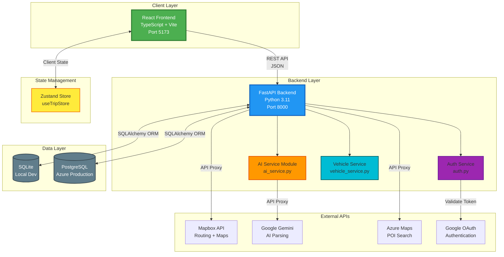
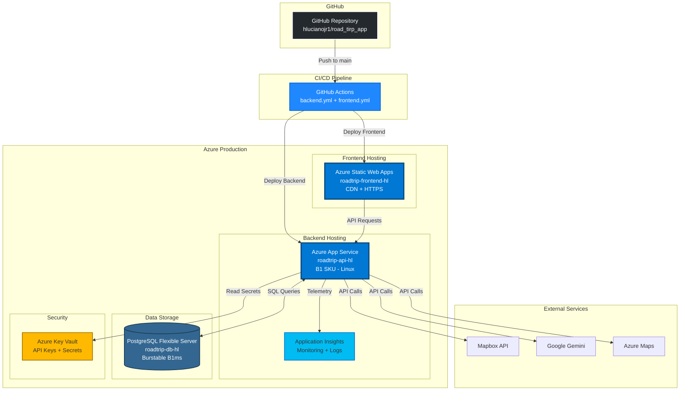
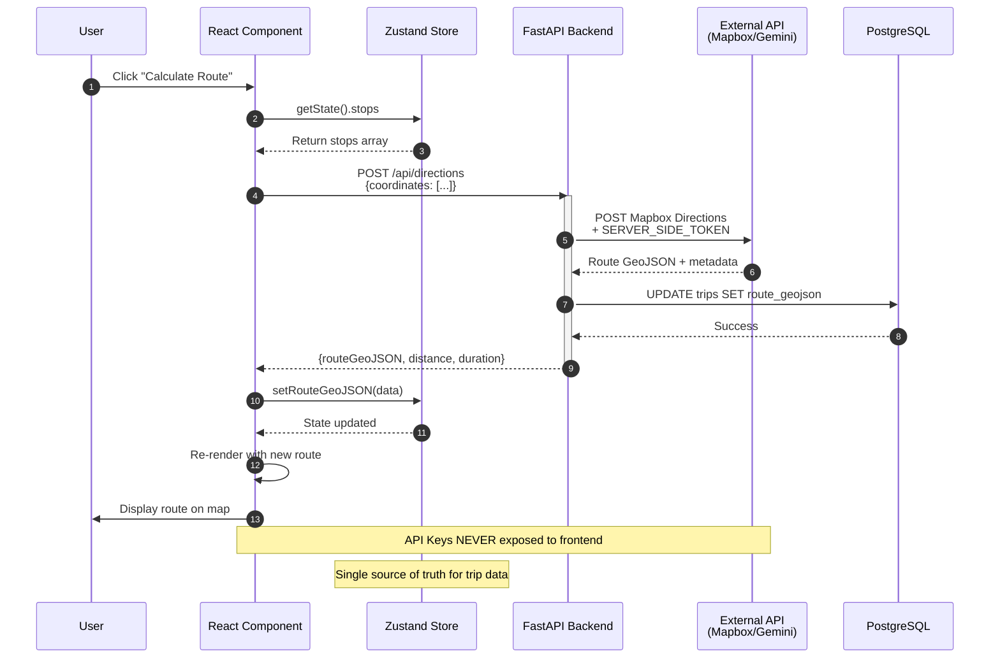
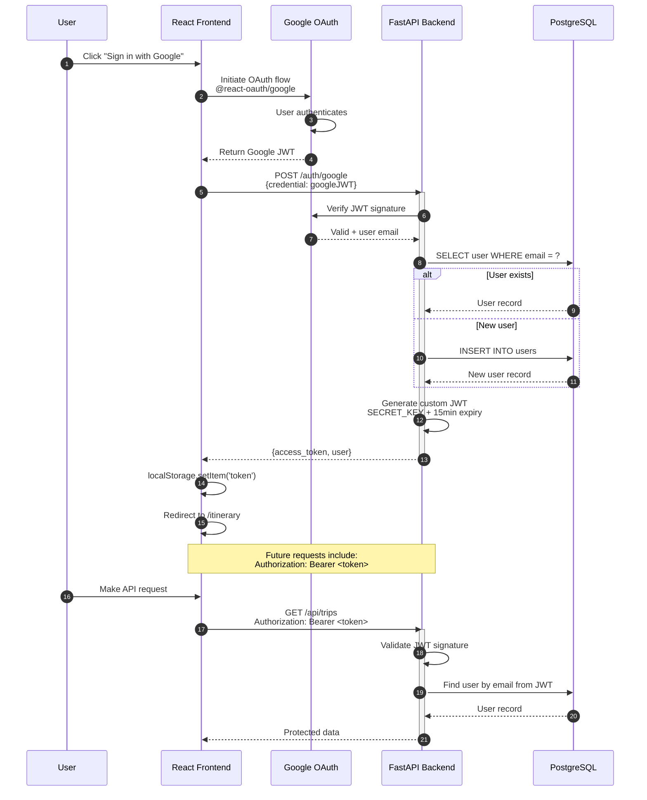
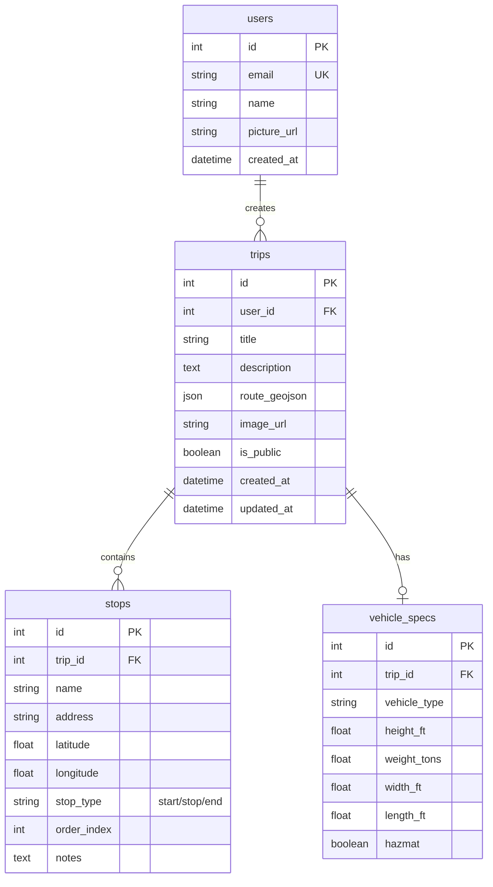

# Road Trip Planner - Complete Project Instructions

**Last Updated:** December 6, 2025

This document consolidates all project documentation into a comprehensive reference guide for development, deployment, and maintenance of the Road Trip Planner application.

> **📋 Development Roadmap**: For task planning, milestones, and issue tracking, see **[ROADMAP.md](./ROADMAP.md)** - the single source of truth for project planning and AI agent task coordination.

> **Note:** The `docs_archive/` folder contains historical documentation files that have been consolidated into this guide. These archived files are for reference only and should not be used for development guidance. AI coding agents and developers should reference this file exclusively.

---

## Table of Contents

1. [Project Overview](#project-overview)
2. [Architecture](#architecture)
3. [Development Setup](#development-setup)
4. [Coding Standards](#coding-standards)
5. [Testing Strategy](#testing-strategy)
6. [Azure Deployment](#azure-deployment)
7. [Feature Reference](#feature-reference)
8. [Troubleshooting](#troubleshooting)

---

## Project Overview

### Description
A modern web application for planning multi-stop road trips, specifically designed for RVs and trucks with vehicle-aware routing and AI-powered discovery.

### Tech Stack
- **Frontend**: React 18+, TypeScript 5+, Vite, Tailwind CSS, Zustand, React Map GL
- **Backend**: Python 3.12+, FastAPI, Pydantic, SQLAlchemy, Alembic
- **Database**: SQLite (local), PostgreSQL (production)
- **External APIs**: Mapbox (routing/maps), Google OAuth (auth), Google Gemini (AI)
- **Testing**: Vitest (frontend), Pytest (backend)
- **Deployment**: Azure App Service, Azure Static Web Apps, Azure PostgreSQL

### Key Features
- Multi-stop route planning with vehicle-aware routing
- Interactive map interface with Mapbox
- Google OAuth authentication
- AI-powered vehicle specification parsing (Gemini)
- Community trip sharing (public/featured trips)
- Save and manage trip itineraries
- Responsive design (mobile + desktop)

---

## Architecture

### Current Architecture (Dec 2025 - Production Ready)

**FastAPI BFF (Backend-for-Frontend) Monolith Pattern**

The application uses a **Backend-for-Frontend (BFF)** pattern where FastAPI acts as an aggregation layer between the React frontend and external services. This pattern is already in use for Mapbox and Gemini APIs.

**Key Characteristics:**
- ✅ **Single Python backend** with service modules (`ai_service.py`, `auth.py`, `vehicle_service.py`)
- ✅ **BFF pattern already in use** - FastAPI proxies external APIs to hide API keys
- ✅ **Simple deployment** - One Azure App Service container
- ✅ **Fast development velocity** - No microservice complexity
- ✅ **Service modules separated** - Ready for future extraction when needed

### Future Architecture (Post-Launch - Feb 2026+)

**BFF with Polyglot Microservices (When Migration Triggers Are Met)**

FastAPI BFF can orchestrate microservices written in **any language** (Java, Go, C#, Python, Rust):
- **Java** (Spring Boot): User management, enterprise integrations
- **Go** (High-performance): Route calculations, real-time POI search
- **C#** (.NET): Analytics, reporting, Azure service integration
- **Python** (AI/ML): Azure OpenAI, NLP, recommendation engine

**Migration Triggers (Wait for One of These):**
1. **Independent Scaling**: AI service gets 10x traffic → Extract to separate service
2. **Performance Bottleneck**: Route calculations >500ms → Rewrite in Go
3. **Language Requirements**: Enterprise integration needs .NET libraries
4. **Team Specialization**: Separate teams want different tech stacks

**Key Principles:**
- ✅ **Language-Agnostic**: FastAPI BFF uses standard HTTP/gRPC (works with any language)
- ✅ **Frontend Unchanged**: React continues calling same FastAPI endpoints
- ✅ **Incremental Migration**: Extract one service at a time (low risk)
- ✅ **Data-Driven**: Extract only when production metrics justify it

> 📖 **For detailed BFF architecture documentation**, see `docs/adr/001-bff-architecture-strategy.md`

### Directory Structure

```
road_trip_app/
├── frontend/               # React Application
│   ├── src/
│   │   ├── components/     # UI Components
│   │   │   ├── FloatingPanel.tsx
│   │   │   ├── MainLayout.tsx
│   │   │   ├── MapComponent.tsx
│   │   │   └── navigation/
│   │   ├── store/          # Zustand State Stores
│   │   │   └── useTripStore.ts
│   │   ├── views/          # Page-level components
│   │   │   ├── AllTripsView.tsx
│   │   │   ├── ExploreView.tsx
│   │   │   ├── ItineraryView.tsx
│   │   │   ├── StartTripView.tsx
│   │   │   └── TripsView.tsx
│   │   └── types/          # TypeScript Interfaces
│   ├── Dockerfile
│   ├── staticwebapp.config.json
│   └── package.json
│
├── backend/                # FastAPI Application
│   ├── main.py            # Route handlers
│   ├── models.py          # SQLAlchemy ORM models
│   ├── schemas.py         # Pydantic validation schemas
│   ├── database.py        # Database configuration
│   ├── auth.py            # Authentication logic
│   ├── ai_service.py      # Gemini AI integration
│   ├── startup.sh         # Production startup script
│   ├── alembic/           # Database migrations
│   │   ├── versions/
│   │   │   └── 001_initial_schema.py
│   │   └── env.py
│   ├── tests/             # Pytest test suite
│   └── requirements.txt
│
├── infrastructure/deploy-azure.sh        # Azure deployment script (moved)
├── azure-pipelines.yml    # Azure DevOps CI/CD
└── .github/workflows/     # GitHub Actions CI/CD
    ├── backend.yml
    └── frontend.yml
```

### Data Flow

**API Proxy Pattern** (Critical):
All external API calls (Mapbox, Gemini) **must** go through the backend to hide API keys.

1. User interacts with frontend (clicks "Calculate Route")
2. Frontend calls backend API (`POST /api/directions`)
3. Backend proxies request to Mapbox with server-side token
4. Backend returns formatted GeoJSON to frontend
5. Frontend updates Zustand store → Map re-renders

**Never** call external APIs directly from frontend components.

---

## Architecture Diagrams

### System Architecture



### Azure Deployment Architecture



### Component Hierarchy

```mermaid
graph TD
    subgraph "Application Root"
        APP[App.tsx<br/>React Router]
    end
    
    subgraph "Layout"
        ML[MainLayout.tsx<br/>Responsive Container]
        NAV1[DesktopSidebar.tsx<br/>Navigation]
        NAV2[MobileBottomNav.tsx<br/>Bottom Nav]
    end
    
    subgraph "Views (Routes)"
        V1[StartTripView.tsx<br/>/]
        V2[ItineraryView.tsx<br/>/itinerary]
        V3[ExploreView.tsx<br/>/explore]
        V4[AllTripsView.tsx<br/>/all-trips]
        V5[TripsView.tsx<br/>/trips]
    end
    
    subgraph "Shared Components"
        MAP[MapComponent.tsx<br/>React Map GL<br/>Mapbox Integration]
        FP[FloatingPanel.tsx<br/>Trip Management UI]
    end
    
    subgraph "State Management"
        STORE[useTripStore.ts<br/>Zustand Store<br/>- stops[]<br/>- routeGeoJSON<br/>- vehicleSpecs<br/>- currentTrip]
    end
    
    APP --> ML
    ML --> NAV1
    ML --> NAV2
    ML --> V1
    ML --> V2
    ML --> V3
    ML --> V4
    ML --> V5
    
    V2 --> MAP
    V2 --> FP
    V3 --> MAP
    
    V1 -.->|Read/Write| STORE
    V2 -.->|Read/Write| STORE
    V3 -.->|Read/Write| STORE
    V4 -.->|Read| STORE
    V5 -.->|Read| STORE
    FP -.->|Read/Write| STORE
    MAP -.->|Read| STORE
    
    style APP fill:#61dafb,stroke:#20232a,stroke-width:3px
    style ML fill:#4caf50,stroke:#2e7d32,stroke-width:2px
    style MAP fill:#2196f3,stroke:#1565c0,stroke-width:2px,color:#fff
    style FP fill:#ff9800,stroke:#e65100,stroke-width:2px
    style STORE fill:#ffeb3b,stroke:#f57f17,stroke-width:3px
```

### Data Flow Diagram



### Authentication Flow



### Deployment Pipeline

```mermaid
graph LR
    subgraph "Developer Workflow"
        DEV[Developer<br/>Local Machine]
        COMMIT[git commit]
        PUSH[git push origin main]
    end
    
    subgraph "GitHub"
        REPO[GitHub Repository]
        ACTIONS[GitHub Actions]
    end
    
    subgraph "Backend Pipeline"
        B1[Checkout code]
        B2[Setup Python 3.11]
        B3[Install dependencies]
        B4[Run pytest]
        B5[Build Docker image]
        B6[Deploy to Azure App Service]
    end
    
    subgraph "Frontend Pipeline"
        F1[Checkout code]
        F2[Setup Node.js 20]
        F3[npm install]
        F4[npm run test]
        F5[npm run build]
        F6[Deploy to Static Web Apps]
    end
    
    subgraph "Azure Production"
        AZURE_BE[Azure App Service<br/>roadtrip-api-hl]
        AZURE_FE[Static Web Apps<br/>roadtrip-frontend-hl]
    end
    
    DEV --> COMMIT
    COMMIT --> PUSH
    PUSH --> REPO
    REPO -->|Trigger workflow| ACTIONS
    
    ACTIONS -->|backend.yml| B1
    B1 --> B2 --> B3 --> B4 --> B5 --> B6
    B6 --> AZURE_BE
    
    ACTIONS -->|frontend.yml| F1
    F1 --> F2 --> F3 --> F4 --> F5 --> F6
    F6 --> AZURE_FE
    
    style DEV fill:#24292e,stroke:#fff,stroke-width:2px,color:#fff
    style ACTIONS fill:#2088ff,stroke:#0366d6,stroke-width:3px,color:#fff
    style AZURE_BE fill:#0078d4,stroke:#004578,stroke-width:3px,color:#fff
    style AZURE_FE fill:#0078d4,stroke:#004578,stroke-width:3px,color:#fff
    style B4 fill:#28a745,stroke:#1e7e34,stroke-width:2px,color:#fff
    style F4 fill:#28a745,stroke:#1e7e34,stroke-width:2px,color:#fff
```



### Database Schema (Entity Relationship)



---

### State Management Rules

- **Global State (Zustand)**: Trip data, route, vehicle specs, user session
- **Local State (useState)**: Form inputs before save, UI toggles (modals, sidebars)
- **Never** store API responses in local state - always go through Zustand

### Database Schema

**Users Table:**
- `id` (Primary Key)
- `email`, `full_name`, `picture`
- `created_at`

**Trips Table:**
- `id` (Primary Key)
- `user_id` (Foreign Key → Users)
- `name`, `description`
- `stops` (JSON array)
- `route_geojson` (JSON)
- `is_public`, `is_featured`
- `distance_miles`
- `created_at`, `updated_at`

---

## Development Setup

### Prerequisites
- Node.js 18.x
- Python 3.12+
- Mapbox API Token
- Google Client ID (OAuth)

### Installation

**Backend:**
```bash
cd backend
python3 -m venv venv
source venv/bin/activate  # On Windows: venv\Scripts\activate
pip install -r requirements.txt
```

**Frontend:**
```bash
cd frontend
npm install
```

### Environment Configuration

**Backend `.env`:**
```bash
DATABASE_URL=sqlite:///./roadtrip.db
MAPBOX_TOKEN=your_mapbox_token
GOOGLE_CLIENT_ID=your_google_client_id
SECRET_KEY=$(openssl rand -base64 32)
GEMINI_API_KEY=your_gemini_key  # Optional
ALLOWED_ORIGINS=http://localhost:5173
```

**Frontend `.env.local`:**
```bash
VITE_API_URL=http://localhost:8000
VITE_GOOGLE_CLIENT_ID=your_google_client_id
VITE_MAPBOX_TOKEN=your_mapbox_token
```

### Running Locally

**Terminal 1 - Backend:**
```bash
cd backend
source venv/bin/activate
uvicorn main:app --reload --host 0.0.0.0 --port 8000
```

**Terminal 2 - Frontend:**
```bash
cd frontend
npm run dev
```

Access at: http://localhost:5173

### Database Migrations

```bash
cd backend

# Create migration from model changes
alembic revision --autogenerate -m "Add description column"

# Apply migrations
alembic upgrade head

# Rollback one version
alembic downgrade -1
```

---

## Coding Standards

### TypeScript Standards (Strict)

**Rule 1: No `any` Types**
```typescript
// ❌ WRONG
const data: any = fetchData();

// ✅ CORRECT
interface TripData {
  id: number;
  name: string;
  stops: Stop[];
}
const data: TripData = fetchData();
```

**Rule 2: Component Props Must Have Interfaces**
```typescript
// ❌ WRONG
function TripCard({ trip, onClick }) { }

// ✅ CORRECT
interface TripCardProps {
  trip: Trip;
  onClick: (tripId: number) => void;
}
function TripCard({ trip, onClick }: TripCardProps) { }
```

**Rule 3: API Responses Must Be Typed**
```typescript
// Define in src/types/
interface DirectionsResponse {
  routes: Route[];
  duration: number;
  distance: number;
}
```

### Python Standards

**Rule 1: Pydantic Models for All API Schemas**
```python
# schemas.py
from pydantic import BaseModel

class TripCreate(BaseModel):
    name: str
    stops: list[dict]
    is_public: bool = False
```

**Rule 2: Business Logic in Service Modules**
```python
# ❌ WRONG - Logic in route handler
@app.post("/api/trips")
async def create_trip(trip: TripCreate):
    db_trip = Trip(**trip.dict())  # Complex logic here
    db.add(db_trip)
    db.commit()

# ✅ CORRECT - Logic in service
# services/trip_service.py
def create_trip(db: Session, trip: TripCreate, user_id: int):
    # Complex logic here
    return db_trip

# main.py
@app.post("/api/trips")
async def create_trip(trip: TripCreate, user = Depends(get_current_user)):
    return trip_service.create_trip(db, trip, user.id)
```

**Rule 3: HTTPException with Clear Status Codes**
```python
# ❌ WRONG
raise Exception("Trip not found")

# ✅ CORRECT
raise HTTPException(status_code=404, detail="Trip not found")
```

### Zustand Store Pattern

```typescript
// ❌ WRONG - Mutating state directly
useTripStore.getState().stops.push(newStop);

// ✅ CORRECT - Immutable update
const addStop = (stop: Stop) => 
  set((state) => ({ stops: [...state.stops, stop] }));
```

### Map Integration Pattern

```typescript
// Always use useTripStore for map data
const { stops, routeGeoJSON } = useTripStore();

// Auto-fit bounds on route change
useEffect(() => {
  if (!mapRef.current || !routeGeoJSON) return;
  const bounds = new mapboxgl.LngLatBounds();
  routeGeoJSON.coordinates.forEach(coord => bounds.extend(coord));
  mapRef.current.fitBounds(bounds, { padding: 50 });
}, [routeGeoJSON]);
```

### Coordinate Format Convention

**Always use GeoJSON format: `[longitude, latitude]`**
```typescript
// ✅ CORRECT
const coords: [number, number] = [-122.4194, 37.7749];

// ❌ WRONG (Lat/Lng reversed)
const coords = [37.7749, -122.4194];
```

### Security Standards (OWASP Top 10)

1. **Input Validation**: All backend inputs validated via Pydantic
2. **Secrets Management**: Never commit API keys - use `.env` files
3. **CORS**: Never use `allow_origins=["*"]` in production
4. **Dependencies**: Regularly audit `npm` and `pip` packages

### Accessibility (a11y)

1. **Semantic HTML**: Use `<button>`, `<nav>`, `<main>` (not `<div>` with click handlers)
2. **Keyboard Navigation**: All interactive elements must be focusable
3. **ARIA**: Use `aria-label` for icon-only buttons
4. **Contrast**: Ensure WCAG AA compliance

---

## Testing Strategy

### Philosophy
**Test-Driven Development (TDD)** - Write tests before implementation.

### Frontend Testing (Vitest - Not Yet Configured)

**Setup Required:**
```bash
npm install -D vitest @testing-library/react @testing-library/user-event
```

**What to Test:**
1. **Utilities**: Pure functions (`calculateDistance`, `formatDuration`)
2. **Components**: Rendering, interaction, accessibility
3. **Hooks/Store**: Zustand selectors and actions in isolation

**Naming:**
- Files: `Component.test.tsx`
- Descriptions: `it('should calculate total distance correctly', ...)`

### Backend Testing (Pytest)

**Run Tests:**
```bash
cd backend
pytest tests/
pytest tests/test_main.py::test_health_check  # Specific test
```

**What to Test:**
1. **Unit Tests**: Service functions
2. **Integration Tests**: API endpoints using `TestClient`
   - Happy path (200 OK)
   - Edge cases (empty inputs)
   - Error states (400, 404, 500)

**Mocking:**
```python
# NEVER call real Mapbox/Gemini in tests
@pytest.fixture
def mock_mapbox_response():
    return {"routes": [...]}

def test_directions(mock_mapbox_response):
    # Use mock instead of real API
```

### AI Agent Workflow

1. **Understand**: Read requirements and relevant files
2. **Plan**: Outline changes and tests to be written
3. **Test**: Write test cases (TDD)
4. **Implement**: Write code to pass tests
5. **Refactor**: Clean up and optimize
6. **Verify**: Run tests and ensure no regressions

---

## Azure Deployment

### Architecture Overview

```
┌─────────────────────────────────────────────────────────────┐
│                         Internet                             │
└────────────┬────────────────────────────────────┬───────────┘
             │                                    │
    ┌────────▼──────────┐              ┌─────────▼──────────┐
    │  Static Web App   │              │   App Service      │
    │   (Frontend)      │◄─────────────┤   (Backend API)    │
    │  React + Vite     │   API Calls  │   FastAPI          │
    └───────────────────┘              └─────────┬──────────┘
                                                  │
                                       ┌──────────▼──────────┐
                                       │  Azure Key Vault    │
                                       │   (Secrets)         │
                                       └─────────────────────┘
                                                  │
                                       ┌──────────▼──────────┐
                                       │  PostgreSQL         │
                                       │  Flexible Server    │
                                       └─────────────────────┘
```

### Azure Resources

- **Backend**: Azure App Service (Linux, Python 3.12)
- **Frontend**: Azure Static Web Apps (Free tier)
- **Database**: PostgreSQL Flexible Server (Burstable B1ms)
- **Secrets**: Azure Key Vault
- **Estimated Cost**: ~$25-30/month

### Prerequisites

1. **Azure CLI** (v2.50+)
   ```bash
   brew install azure-cli
   az login
   ```

2. **API Keys/Secrets:**
   - Mapbox Token
   - Google Client ID
   - Secret Key: `openssl rand -base64 32`
   - Gemini API Key (optional)

3. **Resource Names** (must be globally unique):
   - Resource Group: `rg-roadtrip-prod`
   - App Service: `roadtrip-api-yourname`
   - Static Web App: `roadtrip-frontend-yourname`
   - PostgreSQL: `roadtrip-db-yourname`
   - Key Vault: `kv-roadtrip-abc` (3-24 chars)

### Deployment Options

**Option 1: Automated Script (Recommended for First Deploy)**
```bash
chmod +x infrastructure/deploy-azure.sh
export MAPBOX_TOKEN="your-token"
export GOOGLE_CLIENT_ID="your-client-id"
./infrastructure/deploy-azure.sh
```
Time: ~15-20 minutes

**Option 2: GitHub Actions (Recommended for Production)**

1. Create service principal:
   ```bash
   az ad sp create-for-rbac --name "github-actions-roadtrip" \
     --role contributor \
     --scopes /subscriptions/$SUBSCRIPTION_ID/resourceGroups/$RESOURCE_GROUP \
     --sdk-auth
   ```

2. Add GitHub Secrets:
   - `AZURE_CREDENTIALS` (JSON from above)
   - `DATABASE_URL`
   - `KEY_VAULT_NAME`
   - `ALLOWED_ORIGINS`
   - `VITE_API_URL`
   - `VITE_GOOGLE_CLIENT_ID`
   - `VITE_MAPBOX_TOKEN`
   - `AZURE_STATIC_WEB_APPS_API_TOKEN`

3. Update workflow files with resource names

4. Push to trigger:
   ```bash
   git push origin main
   ```

**Option 3: Azure DevOps**
- Create variable group `roadtrip-prod-vars`
- Configure service connection
- Run pipeline from `azure-pipelines.yml`

### Environment Variables

**Backend:**
- `DATABASE_URL` - PostgreSQL connection string
- `MAPBOX_TOKEN` - Mapbox API key
- `GOOGLE_CLIENT_ID` - Google OAuth client ID
- `SECRET_KEY` - JWT signing key
- `GEMINI_API_KEY` - Optional AI key
- `ALLOWED_ORIGINS` - CORS whitelist (comma-separated)

**Frontend (build-time):**
- `VITE_API_URL` - Backend URL
- `VITE_GOOGLE_CLIENT_ID` - Google OAuth ID
- `VITE_MAPBOX_TOKEN` - Mapbox public token

### Database Migrations

**Run via SSH:**
```bash
az webapp ssh --name $APP_NAME --resource-group $RESOURCE_GROUP
cd /home/site/wwwroot
python -m alembic upgrade head
exit
```

**Create Migration:**
```bash
cd backend
alembic revision --autogenerate -m "Add column"
alembic upgrade head
```

### Monitoring

**View Logs:**
```bash
az webapp log tail --name $APP_NAME --resource-group $RESOURCE_GROUP
```

**Health Checks:**
```bash
curl https://$APP_NAME.azurewebsites.net/health
curl https://$APP_NAME.azurewebsites.net/api/health  # DB check
```

### Cost Optimization

1. **Development**: Use free tiers (F1 App Service, local PostgreSQL)
2. **Auto-scaling**: Scale down during off-hours
3. **Stop/Start**: Stop resources when not in use
   ```bash
   az webapp stop --name $APP_NAME --resource-group $RESOURCE_GROUP
   ```

### Production Checklist

- [ ] Strong `SECRET_KEY` generated (not default)
- [ ] CORS configured (no wildcards)
- [ ] Google OAuth redirect URIs updated
- [ ] Custom domain configured (optional)
- [ ] Application Insights enabled
- [ ] Azure Monitor alerts configured
- [ ] Database backups verified
- [ ] Rate limiting implemented
- [ ] Key Vault access policies reviewed
- [ ] Cost Management budgets set

---

## Feature Reference

### Community Trips

**Feature:** Share and discover road trip itineraries

**Backend Implementation:**
- `Trip.is_public` (Boolean): Makes trip visible to all users
- `Trip.is_featured` (Boolean): Marks for featured display
- `Trip.description` (String): Trip details
- `Trip.distance_miles` (Integer): Auto-calculated

**API Endpoints:**
- `GET /api/public-trips` - Fetch public trips
  - Query params: `skip`, `limit`, `featured_only`
- `PUT /api/trips/{trip_id}` - Update trip metadata
- `DELETE /api/trips/{trip_id}` - Delete trip

**Frontend Components:**
- `AllTripsView.tsx` - Gallery view of all public trips
- `ExploreView.tsx` - Featured trips carousel
- `FloatingPanel.tsx` - Share trip controls

**User Flow:**
1. User plans trip with stops
2. Clicks save, adds description, checks "Share publicly"
3. Trip appears in community gallery
4. Other users can browse and load trip into their itinerary

### Authentication Flow

1. Frontend initiates Google OAuth
2. Google returns JWT
3. Frontend sends to `/auth/google`
4. Backend validates, creates/fetches User in DB
5. Backend returns custom JWT
6. Frontend stores token in `Authorization: Bearer <token>` headers
7. Protected routes use `get_current_user` dependency

---

## Troubleshooting

### Local Development Issues

**Backend won't start:**
```bash
# Check Python version
python3 --version  # Must be 3.12+

# Verify virtual environment
which python  # Should point to venv

# Check environment variables
cat backend/.env

# Test imports
python -c "import fastapi; print('OK')"
```

**Frontend build fails:**
```bash
# Clear node modules
rm -rf node_modules package-lock.json
npm install

# Check Node version
node --version  # Should be 18.x

# Verify environment variables
cat frontend/.env.local
```

**Database connection fails:**
```bash
# For SQLite (local)
ls backend/roadtrip.db  # Should exist

# For PostgreSQL (production)
psql $DATABASE_URL  # Test connection
```

### Azure Deployment Issues

**App Service returns 500:**
1. Check logs: `az webapp log tail --name $APP_NAME --resource-group $RESOURCE_GROUP`
2. Verify environment variables
3. Check Key Vault access policy
4. Test database connection

**Database connection fails:**
1. Verify firewall rules allow App Service IP
2. Check connection string format (must include `?sslmode=require`)
3. Test: `az postgres flexible-server connect -n $DB_SERVER_NAME`

**Frontend can't reach backend:**
1. Verify CORS settings include frontend URL
2. Check `ALLOWED_ORIGINS` env var
3. Verify `VITE_API_URL` in frontend build
4. Check browser console for errors

**Migrations fail:**
1. Run manually via SSH
2. Check database permissions
3. Verify `alembic_version` table exists

### Common Pitfalls

1. **Forgetting to proxy external APIs** - Always route through backend
2. **Using `any` in TypeScript** - Breaks type safety
3. **Storing derived state in Zustand** - Calculate on-the-fly
4. **Direct DB queries in route handlers** - Use service layer
5. **Hardcoding API tokens** - Use environment variables
6. **Resource names not globally unique** - Add suffix/prefix
7. **Coordinates in wrong format** - Always `[lng, lat]` not `[lat, lng]`

### Quick Commands Reference

**Local Development:**
```bash
# Backend
cd backend && source venv/bin/activate && uvicorn main:app --reload

# Frontend
cd frontend && npm run dev

# Tests
cd backend && pytest
cd frontend && npm test
```

**Azure Deployment:**
```bash
# Login
az login

# Deploy
./deploy-azure.sh

# Logs
az webapp log tail --name $APP_NAME --resource-group $RESOURCE_GROUP

# Restart
az webapp restart --name $APP_NAME --resource-group $RESOURCE_GROUP

# SSH
az webapp ssh --name $APP_NAME --resource-group $RESOURCE_GROUP
```

**Database:**
```bash
# Local migration
cd backend && alembic upgrade head

# Create migration
alembic revision --autogenerate -m "Description"

# Rollback
alembic downgrade -1
```

---

## Additional Resources

### Documentation
- **Mapbox**: https://docs.mapbox.com/
- **FastAPI**: https://fastapi.tiangolo.com/
- **React**: https://react.dev/
- **Zustand**: https://github.com/pmndrs/zustand
- **Alembic**: https://alembic.sqlalchemy.org/

### Azure Resources
- **App Service**: https://docs.microsoft.com/en-us/azure/app-service/
- **Static Web Apps**: https://docs.microsoft.com/en-us/azure/static-web-apps/
- **PostgreSQL**: https://docs.microsoft.com/en-us/azure/postgresql/

### Support
- GitHub Issues: [Create issue](https://github.com/yourusername/road_trip_app/issues)
- Check deployment logs in Azure Portal
- Review health check endpoints

---

**Document Version:** 1.0  
**Consolidated From:**
- AI_CODING_STANDARDS.md
- AZURE_DEPLOYMENT.md (740 lines)
- DEPLOYMENT_CHECKLIST.md
- FEATURE_COMMUNITY_TRIPS.md
- IMPLEMENTATION_SUMMARY.md (395 lines)
- PRE_DEPLOYMENT_CHECKLIST.md (206 lines)
- PROJECT_ARCHITECTURE.md
- QUICK_REFERENCE.md
- README.md
- TESTING_STRATEGY.md

**Total Lines Consolidated:** ~1,800+ lines into single comprehensive guide

---

*For detailed Azure deployment steps, see the original AZURE_DEPLOYMENT.md in docs_archive folder.*
