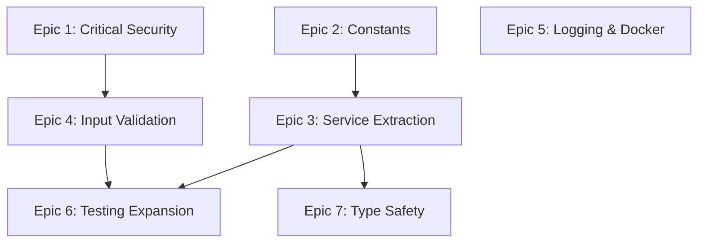

# Python Backend — AI Developer Workflow Guide

> **Agent**: `@python-implementer` (claude-sonnet-4)  
> **Conventions**: [python.instructions.md](../.github/instructions/python.instructions.md)  
> **Source Roadmap**: [PYTHON_BACKEND_ROADMAP.md](./PYTHON_BACKEND_ROADMAP.md)  
> **Service**: `backend/` — FastAPI + SQLAlchemy (Python 3.11+)  
> **TDD Agents**: `@tdd-red` → `@tdd-green` → `@tdd-refactor`  
> **Total Tasks**: 25 across 7 epics | **Effort**: 28–40 hours

---

## Quick Start

```bash
# 1. Pick a task from the table below
# 2. Copy the CORE prompt for that task
# 3. Paste into Copilot Chat with the agent prefix:
@python-implementer <paste CORE prompt>

# 4. After implementation, verify:
cd backend
pytest tests/ -v
pytest --cov=. --cov-report=html
```

---

## Dependency Graph



---

## Task Inventory

| ID | Task | Epic | Priority | Est | Status | Dependencies |
|----|------|------|----------|-----|--------|-------------|
| PY-1.1 | Remove MOCK_TOKEN bypass | 1: Security | Critical | 0.5h | 🔴 TODO | — |
| PY-1.2 | Fix SECRET_KEY fail-fast | 1: Security | Critical | 0.5h | 🔴 TODO | — |
| PY-1.3 | Create auth test suite | 1: Security | Critical | 1–2h | 🔴 TODO | — |
| PY-2.1 | Create constants module | 2: Constants | High | 1–2h | 🔴 TODO | — |
| PY-2.2 | Refactor main.py hardcoded strings | 2: Constants | High | 1h | 🔴 TODO | PY-2.1 |
| PY-2.3 | Refactor auth.py hardcoded strings | 2: Constants | High | 0.5h | 🔴 TODO | PY-2.1, PY-1.2 |
| PY-3.1 | Create auth_service.py | 3: Service Extraction | High | 2h | 🔴 TODO | PY-2.1 |
| PY-3.2 | Create geocode_service.py | 3: Service Extraction | High | 2h | 🔴 TODO | PY-2.1 |
| PY-3.3 | Create search_service.py | 3: Service Extraction | High | 2h | 🔴 TODO | PY-2.1 |
| PY-3.4 | Slim main.py to routes only | 3: Service Extraction | High | 1h | 🔴 TODO | PY-3.1, PY-3.2, PY-3.3 |
| PY-4.1 | Add Pydantic validators | 4: Validation | High | 2h | 🔴 TODO | PY-2.1 |
| PY-4.2 | Add rate limiting (SlowAPI) | 4: Validation | High | 1.5h | 🔴 TODO | PY-1.1 |
| PY-4.3 | Add input sanitization | 4: Validation | High | 1h | 🔴 TODO | — |
| PY-5.1 | Create logging configuration | 5: Logging | Medium | 1h | 🔴 TODO | — |
| PY-5.2 | Secure Dockerfile | 5: Docker | Medium | 1h | 🔴 TODO | — |
| PY-5.3 | Add DB connection pooling | 5: Database | Medium | 1h | 🔴 TODO | — |
| PY-6.1 | Add database failure tests | 6: Testing | Medium | 1.5h | 🔴 TODO | PY-3.1 |
| PY-6.2 | Add security edge case tests | 6: Testing | Medium | 1.5h | 🔴 TODO | PY-4.1 |
| PY-6.3 | Achieve 80% test coverage | 6: Testing | Medium | 1.5h | 🔴 TODO | PY-6.1, PY-6.2 |
| PY-7.1 | Add return type hints | 7: Type Safety | Low | 1h | 🔴 TODO | PY-3.4 |
| PY-7.2 | Enable strict mypy | 7: Type Safety | Low | 1h | 🔴 TODO | PY-7.1 |

---

## Epic 1: Critical Security Fixes

### PY-1.1 — Remove MOCK_TOKEN Authentication Bypass

<details>
<summary>📋 CORE Prompt (click to expand)</summary>

**Context**: You are working on the Python FastAPI backend at `backend/`. The file `main.py` (line ~91) contains a MOCK_TOKEN bypass that accepts the literal string `"MOCK_TOKEN"` as a valid authentication token, returning a mock user without any JWT validation. This is a critical production security vulnerability (SEC-2). There are currently zero auth tests (`tests/test_auth.py` does not exist). The project uses `python-jose` for JWT and SQLAlchemy for the database. Follow [python.instructions.md](../.github/instructions/python.instructions.md) conventions.

**Objective**: Remove the MOCK_TOKEN bypass entirely and write failing tests first (TDD Red phase) that prove the bypass is rejected, then implement the fix (Green phase), then clean up any tests that relied on MOCK_TOKEN to use proper JWT fixtures (Refactor phase).

**Requirements**:
- Create `tests/test_auth.py` with tests: `test_mock_token_rejected_in_production`, `test_mock_token_rejected_for_protected_routes` (GET /api/trips, POST /api/trips, GET /api/auth/me)
- Delete the entire `if token == "MOCK_TOKEN"` block from `main.py`
- Update any existing tests that used MOCK_TOKEN to use proper JWT fixtures from `conftest.py`
- Verify: `grep -r "MOCK_TOKEN" backend/` returns zero matches
- All protected routes return 401 for `"MOCK_TOKEN"`

**Example**: After fix, `curl -H "Authorization: Bearer MOCK_TOKEN" http://localhost:8000/api/trips` → 401 Unauthorized

</details>

---

### PY-1.2 — Fix SECRET_KEY to Fail-Fast if Not Configured

<details>
<summary>📋 CORE Prompt (click to expand)</summary>

**Context**: You are working on `backend/auth.py`. Line 14 sets `SECRET_KEY = os.getenv("SECRET_KEY", "dev-secret-key-change-in-production")` — a predictable fallback that would allow JWT forgery in production (SEC-1). The project follows strict TDD per [python.instructions.md](../.github/instructions/python.instructions.md).

**Objective**: Make the application fail fast at startup if `SECRET_KEY` is missing or weak, using TDD.

**Requirements**:
- RED: Write tests in `tests/test_auth.py`: `test_missing_secret_key_raises_on_import` (ValueError with message "SECRET_KEY.*required"), `test_weak_secret_key_raises_warning` (< 32 chars raises ValueError)
- GREEN: Create `_get_secret_key()` function in `auth.py` that validates presence and minimum 32-char length, raises `ValueError` with actionable error message including `python -c "import secrets; print(secrets.token_urlsafe(32))"`
- Remove the `"dev-secret-key-change-in-production"` default entirely
- Update `conftest.py` / test setup to set a valid SECRET_KEY env var for tests

**Example**: Missing SECRET_KEY → `ValueError: SECRET_KEY environment variable is required. Generate one with: python -c "import secrets; print(secrets.token_urlsafe(32))"`

</details>

---

### PY-1.3 — Create Comprehensive Auth Test Suite

<details>
<summary>📋 CORE Prompt (click to expand)</summary>

**Context**: You are working on `backend/`. There are currently zero authentication tests — a critical coverage gap. The app uses `python-jose` for JWT (HS256), Google OAuth via `auth.verify_google_token()`, guest login, and token refresh with rotation. The database uses SQLAlchemy with `User` model in `models.py`. Follow [python.instructions.md](../.github/instructions/python.instructions.md) and [testing.instructions.md](../.github/instructions/testing.instructions.md) conventions.

**Objective**: Create a comprehensive auth test suite covering token generation, validation, refresh flow, Google OAuth, and guest auth.

**Requirements**:
- Create `tests/test_auth.py` with 15+ test cases across 5 classes:
  - `TestTokenGeneration`: access token claims (sub, exp), expiry timeframe, refresh token longer expiry
  - `TestTokenValidation`: expired token → 401, invalid signature → 401, malformed token → 401, missing header → 401
  - `TestRefreshTokenFlow`: valid refresh → new tokens, expired refresh → 401, token rotation invalidates old
  - `TestGoogleOAuth`: valid google token creates user (mock `verify_google_token`), invalid token → 401
  - `TestGuestAuth`: guest login creates temporary user with `is_guest=True`
- Use `@patch` for Google OAuth mock, proper JWT fixtures from `conftest.py`
- Target: `pytest tests/test_auth.py -v` shows all green

**Example**: `test_expired_token_returns_401` creates a token with `exp = utcnow() - 1h`, sends GET /api/trips, asserts 401

</details>

---

## Epic 2: Constants & Magic String Externalization

### PY-2.1 — Create Constants Module

<details>
<summary>📋 CORE Prompt (click to expand)</summary>

**Context**: You are working on `backend/`. The file `constants.py` does not exist but is required by [python.instructions.md](../.github/instructions/python.instructions.md). There are 16+ hardcoded error messages in `main.py`, credential placeholders in `auth.py`, and magic strings throughout. Constants should use class-based grouping (not module-level variables).

**Objective**: Create `constants.py` with all required constant classes, using TDD.

**Requirements**:
- RED: Create `tests/test_constants.py` with tests for `ErrorMessages` (TRIP_NOT_FOUND, UNAUTHORIZED, INVALID_TOKEN, MAPBOX_NOT_CONFIGURED, AZURE_MAPS_NOT_CONFIGURED), `VehicleTypes` (all lowercase, DEFAULT == CAR, `all()` classmethod), `ConfigKeys` (SECRET_KEY, MAPBOX_TOKEN, etc.), `HttpStatus` (OK, CREATED, BAD_REQUEST, UNAUTHORIZED, etc.), `ApiRoutes` (HEALTH, TRIPS, GEOCODE, etc.)
- GREEN: Create `backend/constants.py` with classes: `ErrorMessages`, `VehicleTypes`, `ConfigKeys`, `HttpStatus`, `ApiRoutes`
- All constants are `str` or `int` class attributes (not Enum — simpler usage)
- `VehicleTypes.all()` returns `list[str]` of all valid types

**Example**: `from constants import ErrorMessages` → `raise HTTPException(status_code=404, detail=ErrorMessages.TRIP_NOT_FOUND)`

</details>

---

### PY-2.2 — Refactor main.py Hardcoded Strings

<details>
<summary>📋 CORE Prompt (click to expand)</summary>

**Context**: You are working on `backend/main.py` (~450 lines). There are 16 hardcoded error message strings (e.g., `"Trip not found"` on lines 408, 415, 435; `"Mapbox token not configured"` on lines 248, 275, 369; `"Invalid Google Token"` on line 97). The `constants.py` module from PY-2.1 is now available with `ErrorMessages`, `ConfigKeys`, and `VehicleTypes` classes.

**Objective**: Replace all 16 hardcoded strings in `main.py` with constants references, verifying no regressions with TDD.

**Requirements**:
- RED: Add assertions to existing tests verifying exact error messages match constants (e.g., `assert response.json()["detail"] == ErrorMessages.TRIP_NOT_FOUND`)
- GREEN: Add `from constants import ErrorMessages, ConfigKeys, VehicleTypes` to `main.py`, replace all 16 strings
- REFACTOR: Run `grep -E '"Trip not found"|"Mapbox token"|"Invalid"' main.py` — must return zero matches
- All existing tests must still pass

**Example**: `raise HTTPException(status_code=404, detail="Trip not found")` → `raise HTTPException(status_code=404, detail=ErrorMessages.TRIP_NOT_FOUND)`

</details>

---

### PY-2.3 — Refactor auth.py Hardcoded Strings

<details>
<summary>📋 CORE Prompt (click to expand)</summary>

**Context**: You are working on `backend/auth.py`. After PY-1.2 removed the insecure SECRET_KEY default, there is still a hardcoded `"your-google-client-id"` placeholder for GOOGLE_CLIENT_ID. The `constants.py` module with `ConfigKeys` is available.

**Objective**: Replace remaining hardcoded config strings in `auth.py` with `ConfigKeys` constants.

**Requirements**:
- Replace `"your-google-client-id"` with `os.getenv(ConfigKeys.GOOGLE_CLIENT_ID)`
- Validate GOOGLE_CLIENT_ID is set (warn if missing, don't crash — OAuth is optional)
- All tests pass with mocked config values

**Example**: `GOOGLE_CLIENT_ID = os.getenv(ConfigKeys.GOOGLE_CLIENT_ID)` with validation in `verify_google_token()`

</details>

---

## Epic 3: Service Layer Extraction

### PY-3.1 — Create auth_service.py

<details>
<summary>📋 CORE Prompt (click to expand)</summary>

**Context**: You are working on `backend/main.py` (~450 lines, exceeds 400-line limit). Three auth route handlers contain business logic that should be in a service layer: `google_login()` (lines 88–130, 4 responsibilities: token validation, user lookup, user creation, JWT generation), `refresh_token()` (lines 177–217, 3 responsibilities), `guest_login()` (lines 132–173). Follow [python.instructions.md](../.github/instructions/python.instructions.md) — `main.py` should be routes-only.

**Objective**: Extract all authentication business logic into `auth_service.py` using TDD, leaving route handlers as thin 5–15 line delegators.

**Requirements**:
- RED: Create `tests/test_auth_service.py` with `TestAuthService` class testing: `authenticate_google_user` (creates new user, returns existing user), `refresh_tokens` (validates token, raises ValueError on invalid), `create_guest_user` (sets is_guest=True), `logout` (clears refresh token)
- GREEN: Create `backend/auth_service.py` with `AuthService` class, `AuthResult` dataclass, and singleton `auth_service = AuthService()`
- REFACTOR: Update `main.py` to import and delegate to `auth_service`, verify ~80 lines removed from main.py
- All existing auth tests still pass

**Example**: `main.py`: `result = auth_service.authenticate_google_user(db, request.token)` → returns `AuthResult(user, access_token, refresh_token)`

</details>

---

### PY-3.2 — Create geocode_service.py

<details>
<summary>📋 CORE Prompt (click to expand)</summary>

**Context**: You are working on `backend/main.py`. Three geocode route handlers (lines 241–265 `geocode_address`, 268–295 `get_directions`, 362–390 `optimize_route`) contain Mapbox API logic mixed with HTTP handling. These should be in a service module. The Python backend still handles geocode endpoints until the Java migration is complete (Phase 4).

**Objective**: Extract all Mapbox API logic into `geocode_service.py` using TDD.

**Requirements**:
- RED: Create `tests/test_geocode_service.py` testing: `geocode()` returns coordinates, raises ValueError on not found; `get_directions()` returns routes with geometry/duration; `optimize_route()` returns optimized waypoints
- GREEN: Create `backend/geocode_service.py` with `GeocodeService` class (constructor takes `mapbox_token`), factory function `create_geocode_service()` that validates token
- REFACTOR: Update `main.py` to use lazy-initialized service instance, verify ~60 lines removed
- Use `httpx.AsyncClient` with 30s timeout (not `requests`)

**Example**: `service = GeocodeService(mapbox_token="pk.ey...")` → `result = await service.geocode("Denver, CO")` → `{"coordinates": [-104.99, 39.74], "place_name": "Denver, CO"}`

</details>

---

### PY-3.3 — Create search_service.py

<details>
<summary>📋 CORE Prompt (click to expand)</summary>

**Context**: You are working on `backend/main.py`. The `search_places()` function (lines 298–360) handles Azure Maps POI search and response transformation from Azure Maps format to Mapbox-compatible GeoJSON. This logic should be extracted to a service.

**Objective**: Extract Azure Maps search logic into `search_service.py` using TDD.

**Requirements**:
- RED: Create `tests/test_search_service.py` testing: `search_nearby()` returns GeoJSON FeatureCollection, `_transform_result()` converts Azure Maps format to GeoJSON Feature with correct coordinate order [lon, lat]
- GREEN: Create `backend/search_service.py` with `SearchService` class (constructor takes `azure_maps_key`), factory function with validation
- REFACTOR: Update main.py, verify ~60 lines removed
- GeoJSON output must be Mapbox-compatible: `{"type": "FeatureCollection", "features": [{"type": "Feature", "geometry": {"type": "Point", "coordinates": [lon, lat]}, "properties": {...}}]}`

**Example**: `service = SearchService(azure_maps_key="...")` → `result = await service.search_nearby("coffee", lat=37.77, lon=-122.42)` → valid GeoJSON

</details>

---

### PY-3.4 — Slim Down main.py to Routes Only

<details>
<summary>📋 CORE Prompt (click to expand)</summary>

**Context**: After PY-3.1, PY-3.2, and PY-3.3, the service modules (`auth_service.py`, `geocode_service.py`, `search_service.py`) exist. `main.py` still contains the old inline business logic. Per [python.instructions.md](../.github/instructions/python.instructions.md), `main.py` must be <400 lines and contain only route definitions that delegate to services.

**Objective**: Refactor `main.py` to be a thin routing layer that delegates all business logic to service modules.

**Requirements**:
- Import and use `auth_service`, `geocode_service`, `search_service` in route handlers
- Each route handler should be 5–15 lines: parse request → call service → format response → return
- Lazy-initialize services with factory functions
- `wc -l main.py` must return < 400
- All existing tests pass unchanged

**Example**: `@app.post("/api/auth/google")` handler becomes: `result = auth_service.authenticate_google_user(db, request.token)` → return dict with tokens

</details>

---

## Epic 4: Input Validation & Security

### PY-4.1 — Add Pydantic Validators to schemas.py

<details>
<summary>📋 CORE Prompt (click to expand)</summary>

**Context**: You are working on `backend/schemas.py` (~110 lines). Currently no length constraints, no email validation, no URL validation on any Pydantic models. Unbounded strings are sent to external APIs (Mapbox, Azure Maps) — this is SEC-4. The `constants.py` module with `VehicleTypes` is available.

**Objective**: Add comprehensive Pydantic validation to all request schemas using TDD.

**Requirements**:
- RED: Create `tests/test_schemas.py` with classes: `TestTripCreateValidation` (name required, max 200 chars, stops max 50), `TestUserBaseValidation` (email format with EmailStr), `TestVehicleTypeValidation` (enum validation — reject "spaceship", accept all valid types)
- GREEN: Update `schemas.py`: `TripCreate` with `Field(min_length=1, max_length=200)`, `TripUpdate` with URL validator, `UserBase` with `EmailStr`, `VehicleTypeRequest` with `VehicleTypeEnum`, `GoogleAuthRequest` with `Field(min_length=10, max_length=5000)`
- Add `pydantic[email]` to requirements.txt if needed
- All existing tests pass

**Example**: `TripCreate(name="a"*201, stops=[])` → `ValidationError` mentioning "200"

</details>

---

### PY-4.2 — Add Rate Limiting with SlowAPI

<details>
<summary>📋 CORE Prompt (click to expand)</summary>

**Context**: You are working on `backend/main.py`. There is no rate limiting (SEC-3) — external APIs (Mapbox, Azure Maps) have per-request costs, and auth endpoints are vulnerable to brute force. The project uses FastAPI.

**Objective**: Add rate limiting using SlowAPI with differentiated limits per route category.

**Requirements**:
- Create `backend/security.py` with `limiter = Limiter(key_func=get_remote_address)` and custom `rate_limit_exceeded_handler` returning JSON 429
- Add `slowapi>=0.1.9` to `requirements.txt`
- Apply limits: geocode/directions/search/optimize → 30/minute, auth endpoints → 10/minute, health → 60/minute
- Register middleware in `main.py`: `app.state.limiter = limiter`, `app.add_middleware(SlowAPIMiddleware)`
- Test: 100 rapid requests to rate-limited endpoint → eventually returns 429

**Example**: `@limiter.limit("30/minute")` on `@app.get("/api/geocode")`

</details>

---

### PY-4.3 — Add Input Sanitization for External APIs

<details>
<summary>📋 CORE Prompt (click to expand)</summary>

**Context**: You are working on `backend/`. User input is passed directly to external APIs (Mapbox geocoding, Azure Maps search) without sanitization. Control characters and excessively long inputs could cause issues.

**Objective**: Create a sanitization utility and apply it to all external API inputs.

**Requirements**:
- RED: Write tests for `sanitize_input()`: removes control characters (\x00–\x08, \x0b, \x0c, \x0e–\x1f, \x7f), truncates at `max_length`, preserves normal text unchanged
- GREEN: Add `sanitize_input(value, max_length=2000, allow_newlines=True)` to `security.py`
- REFACTOR: Apply `sanitize_input()` in `geocode_service.py` and `search_service.py` before API calls
- Log warning when input is truncated

**Example**: `sanitize_input("test\x00injection", max_length=500)` → `"testinjection"`

</details>

---

## Epic 5: Logging & Production Readiness

### PY-5.1 — Create Centralized Logging Configuration

<details>
<summary>📋 CORE Prompt (click to expand)</summary>

**Context**: You are working on `backend/`. There is no centralized logging — some files use `print()`, others use bare `logging.getLogger()` with default formatting. For Azure Monitor compatibility, logs should be JSON-structured.

**Objective**: Create a centralized logging configuration that produces JSON-structured logs.

**Requirements**:
- Create `backend/logging_config.py` with `JsonFormatter` class (outputs JSON with timestamp, level, logger, message, module, function, line, exception), `setup_logging(level)` function, `get_logger(name)` helper
- Replace all `print()` statements with `logger.info/warning/error`
- Log level configurable via `LOG_LEVEL` env var
- Reduce noise: set httpx, urllib3, sqlalchemy loggers to WARNING
- Call `setup_logging()` in `main.py` startup

**Example**: Log output: `{"timestamp": "2026-03-20T...", "level": "INFO", "message": "Road Trip API starting", "module": "main"}`

</details>

---

### PY-5.2 — Secure Dockerfile

<details>
<summary>📋 CORE Prompt (click to expand)</summary>

**Context**: You are working on `backend/Dockerfile`. It currently runs as root (SEC-8), has no `.dockerignore`, no health check, and copies `.env` into the image.

**Objective**: Harden the Dockerfile for production security.

**Requirements**:
- Create `backend/.dockerignore` excluding: `.env`, `.env.*`, `*.pyc`, `__pycache__/`, `.pytest_cache/`, `venv/`, `venv_test/`, `.git/`, `tests/`, `*.md`
- Update `Dockerfile`: add `useradd appuser`, `USER appuser`, `HEALTHCHECK` instruction, `COPY --chown=appuser:appuser`
- Verify: `docker build -t backend-test backend/` succeeds, `docker run --rm backend-test whoami` → `appuser`

**Example**: `HEALTHCHECK --interval=30s --timeout=10s CMD curl -f http://localhost:8000/health || exit 1`

</details>

---

### PY-5.3 — Add Database Connection Pooling

<details>
<summary>📋 CORE Prompt (click to expand)</summary>

**Context**: You are working on `backend/database.py` (~23 lines). Currently no connection pooling configured — missing `pool_size`, `max_overflow`, `pool_recycle`, `pool_pre_ping`. This causes connection issues under load.

**Objective**: Add proper SQLAlchemy connection pooling for PostgreSQL with configurable pool parameters.

**Requirements**:
- Update `database.py`: add `pool_size` (env: DB_POOL_SIZE, default 5), `max_overflow` (env: DB_MAX_OVERFLOW, default 10), `pool_recycle` (env: DB_POOL_RECYCLE, default 3600), `pool_pre_ping=True`
- SQLite fallback should NOT use pooling (incompatible)
- All existing tests pass

**Example**: PostgreSQL engine: `create_engine(url, pool_size=5, max_overflow=10, pool_recycle=3600, pool_pre_ping=True)`

</details>

---

## Epic 6: Testing Expansion

### PY-6.1 — Add Database Failure Tests

<details>
<summary>📋 CORE Prompt (click to expand)</summary>

**Context**: You are working on `backend/tests/`. Current tests don't cover database failure scenarios (connection refused, timeouts). The app uses SQLAlchemy with `SessionLocal` from `database.py`.

**Objective**: Add tests for graceful handling of database failures.

**Requirements**:
- Create `tests/test_error_handling.py` with `TestDatabaseErrors` class: `test_db_connection_failure_returns_503` (mock SessionLocal to raise OperationalError), `test_db_timeout_handled_gracefully` (mock execute to raise TimeoutError)
- Add `TestExternalApiTimeouts`: `test_mapbox_timeout_returns_504` (mock httpx to raise TimeoutError)
- Use `unittest.mock.patch` for all mocking

**Example**: `with patch('database.SessionLocal') as mock: mock.side_effect = OperationalError(...)` → response 503

</details>

---

### PY-6.2 — Add Security Edge Case Tests

<details>
<summary>📋 CORE Prompt (click to expand)</summary>

**Context**: You are working on `backend/tests/`. There are no tests for SQL injection, XSS, path traversal, or JWT algorithm confusion attacks.

**Objective**: Add security edge case tests to verify input handling.

**Requirements**:
- Create `tests/test_security.py` with classes:
  - `TestInputSanitization`: SQL injection in query params (`'; DROP TABLE trips; --`), XSS in trip name (`<script>alert('xss')</script>`)
  - `TestAuthenticationEdgeCases`: JWT with 'none' algorithm rejected, empty bearer token → 401
- Tests should verify the app doesn't crash and returns appropriate status codes (400, 401, 404, 422)

**Example**: `client.get("/api/geocode?q='; DROP TABLE trips; --")` → status 200 or 400 (not 500)

</details>

---

### PY-6.3 — Achieve 80% Test Coverage

<details>
<summary>📋 CORE Prompt (click to expand)</summary>

**Context**: You are working on `backend/`. After epics 1–5, there should be tests for auth, constants, services, schemas, error handling, and security. The target is ≥80% line coverage on all non-generated code.

**Objective**: Configure coverage reporting and fill remaining gaps to reach 80%.

**Requirements**:
- Update `pytest.ini`: add `--cov=. --cov-report=html --cov-report=term-missing --cov-fail-under=80`
- Add `[coverage:run]` section omitting: `tests/*`, `venv/*`, `alembic/*`
- Run `pytest --cov=.` — identify any files below 80%
- Write additional tests for uncovered paths
- Generate HTML report for visual inspection

**Example**: `pytest --cov=. --cov-report=html` → open `htmlcov/index.html` → all files ≥80%

</details>

---

## Epic 7: Type Safety & Code Quality

### PY-7.1 — Add Return Type Hints to Route Handlers

<details>
<summary>📋 CORE Prompt (click to expand)</summary>

**Context**: You are working on `backend/main.py`. Approximately 40% of route handlers lack return type hints. Per [python.instructions.md](../.github/instructions/python.instructions.md), all public functions should have type annotations.

**Objective**: Add return type hints to all route handlers and service methods.

**Requirements**:
- Add `-> Dict[str, str]` to `health_check()`, `-> Dict[str, Any]` to data-returning routes
- Add type hints to all service methods in `auth_service.py`, `geocode_service.py`, `search_service.py`
- Use `from typing import Dict, Any, List, Optional` as needed
- All existing tests pass (type hints don't change runtime behavior)

**Example**: `async def health_check() -> Dict[str, str]: return {"status": "healthy"}`

</details>

---

### PY-7.2 — Enable Strict mypy Checking

<details>
<summary>📋 CORE Prompt (click to expand)</summary>

**Context**: You are working on `backend/`. There is no static type checking configured. After PY-7.1, most functions have type hints.

**Objective**: Enable mypy with strict settings and fix all type errors.

**Requirements**:
- Create `backend/mypy.ini` with: `python_version = 3.11`, `disallow_untyped_defs = True`, `warn_return_any = True`, `check_untyped_defs = True`, `no_implicit_optional = True`
- Ignore tests and alembic directories
- Add `mypy>=1.8.0` and `types-requests` to requirements.txt
- Run `mypy *.py --ignore-missing-imports` → zero errors
- Add mypy step to CI pipeline

**Example**: `mypy main.py auth.py auth_service.py geocode_service.py search_service.py --ignore-missing-imports` → `Success: no issues found`

</details>

---

## Verification Checklist

After all tasks complete, run:

```bash
cd backend

# 1. All tests pass
pytest tests/ -v

# 2. Coverage ≥ 80%
pytest --cov=. --cov-report=term-missing --cov-fail-under=80

# 3. No hardcoded strings
grep -rn "MOCK_TOKEN" .
grep -rn "dev-secret-key" .

# 4. Type checking
mypy *.py --ignore-missing-imports

# 5. main.py under 400 lines
wc -l main.py

# 6. Docker security
docker build -t backend-test .
docker run --rm backend-test whoami   # → appuser

# 7. Constants used everywhere
grep -c "ErrorMessages\." main.py     # Should be > 10
grep -c "from constants import" *.py  # Multiple files
```
