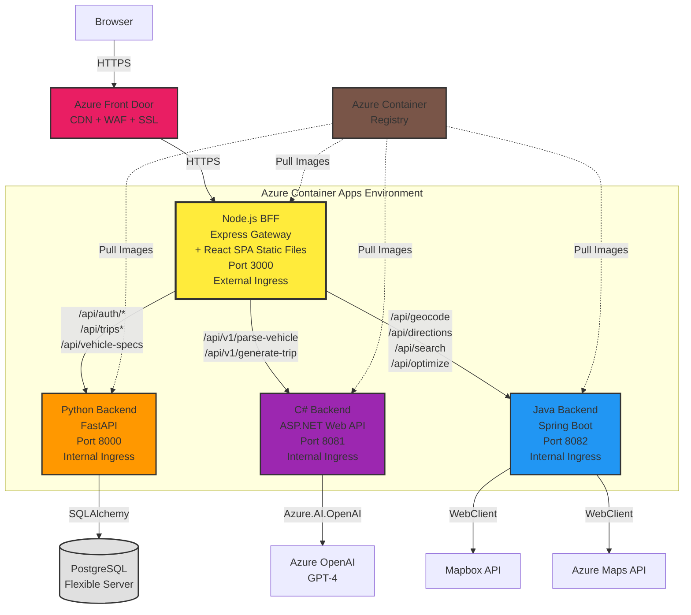
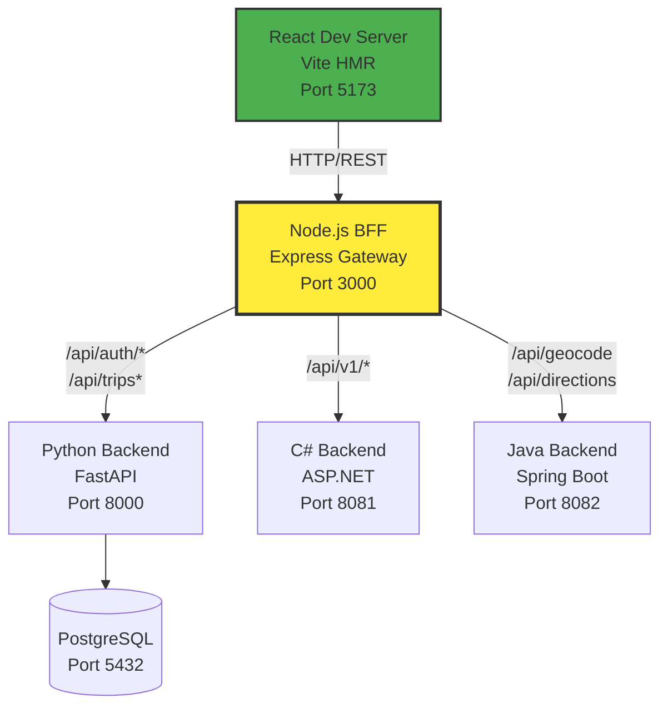
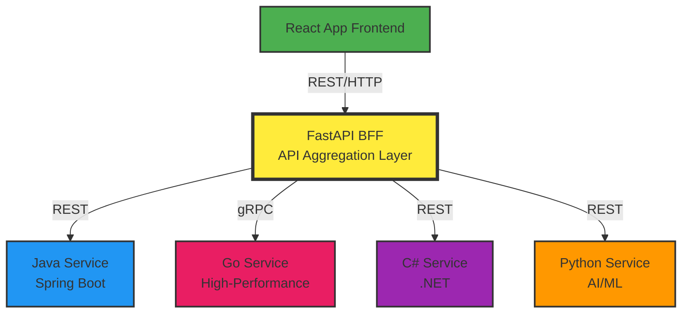
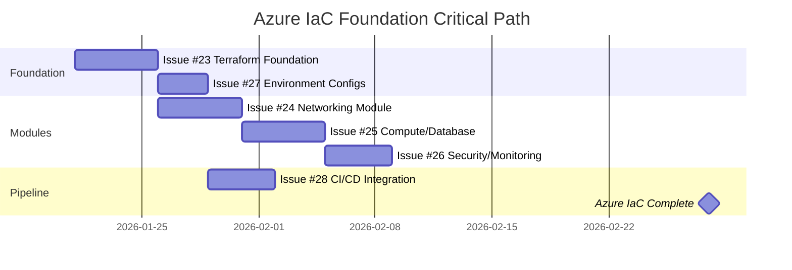

# Road Trip Planner - Development Roadmap

**Last Updated**: March 4, 2026  
**Status**: Architecture pivot — BFF consolidation + Azure Container Apps  
**Total Effort**: 178-247 hours across 9 phases (includes C# remediation + BFF consolidation)  
**Architecture**: Unified Node.js BFF (serves React SPA + API gateway) → Python + C# + Java backends → Azure Container Apps

---

## 📋 Quick Overview

This roadmap reorganizes the project around a **polyglot microservices architecture** with a Node.js BFF (Backend-for-Frontend) API gateway routing to Python (trips/auth), C# (AI/vehicle parsing), and Java (geospatial) backend services. All services run in Docker Compose locally. Infrastructure/cloud deployment is deferred to the final phase.

> **For AI Agents**: This is the **single source of truth** for project planning. Do NOT create duplicate issues. Always reference this roadmap before proposing new tasks.

### ✅ Recent Completions
- **Terraform Roadmap** (Mar 4, 2026): Created detailed IaC roadmap with 40 tasks — ACR module, AI Services module, Container Apps updates, gap analysis ([TERRAFORM_ROADMAP.md](./TERRAFORM_ROADMAP.md))
- **Architecture Pivot** (Mar 4, 2026): Decision to consolidate frontend into BFF, eliminate nginx, deploy all services as Azure Container Apps
- **Frontend Security Review** (Mar 4, 2026): Comprehensive React code audit — 4 P0 security issues, 16+ architecture violations, 0 constants files, conflicting type definitions identified
- **Phase 3 Roadmap** (Mar 2, 2026): C# backend architecture review completed — 25-task remediation roadmap created ([CSHARP_BACKEND_ROADMAP.md](./CSHARP_BACKEND_ROADMAP.md))
- **Issue #4** (Jan 21, 2026): Backend API mocking - 10 JSON fixtures, 10 new tests, CI hardened
- **Issue #1** (Dec 6, 2025): Frontend Testing Infrastructure
- **Issue #21** (Dec 6, 2025): BFF Architecture Research
- **Phase 0** (Feb 25, 2026): Go ai-service removed, replaced by C# ASP.NET Web API scaffold
- **Phase 1** (Feb 25, 2026): Docker Compose rewritten with all 6 services (postgres, bff, python, csharp, java, frontend)
- **Phase 2** (Feb 25, 2026): BFF Docker build verified (npm install + TypeScript compilation)
- **Phase 3** (Feb 25, 2026): C# build verified (dotnet build + fallback mode tested + Docker build)
- **Phase 4** (Feb 25, 2026): Java Docker build verified (Maven package + Spring Boot JAR)

### Architecture Decision Summary
| Decision | Choice | Rationale |
|----------|--------|-----------|
| BFF Technology | Node.js (Express) | Lightweight gateway, strong proxy ecosystem |
| AI Service | C# ASP.NET Web API | Replaces Go, Azure OpenAI SDK support |
| Geospatial Service | Java Spring Boot | Enterprise-grade, WebClient for proxy calls |
| Trips/Auth | Python FastAPI | Existing codebase, minimal migration |
| Database | Shared PostgreSQL | Simplest for local Docker dev |
| API Gateway Pattern | Separate BFF service | Clean separation from business logic |

---

## 🎯 Phases

| Phase | Effort | Description | Priority | Status |
|-------|--------|-------------|----------|--------|
| [Phase 0: Cleanup](#phase-0-cleanup) | 1-2 hrs | Remove Go ai-service | Critical | ✅ **DONE** |
| [Phase 1: Docker-First Setup](#phase-1-docker-first-local-development) | 4-6 hrs | Docker Compose with all services | Critical | ✅ **DONE** |
| [Phase 2: Node.js BFF](#phase-2-nodejs-bff-service) | 8-12 hrs | API gateway routing layer | Critical | 🟡 Build Verified |
| [Phase 3: C# AI Service](#phase-3-c-aspnet-web-api--ai-service) | 31-45 hrs | Vehicle parsing + trip generation + SOLID remediation | High | 🟡 Roadmap Created |
| [Phase 4: Java Geospatial](#phase-4-java-spring-boot--geospatial-services) | 16-20 hrs | Geocode, directions, search, optimize | High | 🟡 Build Verified |
| [Phase 5: Frontend Standardization](#phase-5-frontend-standardization--security) | 14-18 hrs | Security fixes, axios migration, constants, types | Critical | 🔴 Not started |
| [Phase 5B: BFF Consolidation](#phase-5b-bff-frontend-consolidation) | 8-12 hrs | BFF serves React SPA, unified Dockerfile, eliminate nginx | High | 🔴 Not started |
| [Phase 6: Code Quality](#phase-6-code-quality--testing) | 12-16 hrs | Component decomposition, error boundaries, testing | Medium | 🔴 Not started |
| [Phase 7: Features](#phase-7-feature-enhancement) | 20-30 hrs | Vehicle routing, AI trips, accessibility | Medium | 🔴 Not started |
| [Phase 8: Azure Container Apps](#phase-8-azure-container-apps--deployment) | 58-78 hrs | Container Apps Terraform, ACR, CI/CD pipelines ([detailed roadmap](./TERRAFORM_ROADMAP.md)) | High | 🟡 Planning Complete |

---

## Phase 0: Cleanup

**Effort**: 1-2 hours | **Status**: ✅ **COMPLETED** (Feb 25, 2026)

Remove the Go ai-service and prepare the codebase for polyglot architecture.

### Completed Work
- [x] Deleted `ai-service/` directory (Go project: main.go, handlers/, go.mod, Dockerfile)
- [x] Updated `backend/ai_service.py` — now points to C# service at `http://backend-csharp:8081`
- [x] Removed `infrastructure/deploy-ai-service.sh`
- [x] Go service endpoints (`/api/v1/parse-vehicle`, `/api/v1/generate-trip`) will be reimplemented in C#

---

## Phase 1: Docker-First Local Development

**Effort**: 4-6 hours | **Status**: ✅ **COMPLETED** (Feb 25, 2026)

Full Docker Compose stack with all services, PostgreSQL database, and service networking.

### Completed Work
- [x] Rewrote `docker-compose.yml` with 6 services: postgres, bff, backend-python, backend-csharp, backend-java, frontend
- [x] Added PostgreSQL 15 container with health checks and persistent volume
- [x] Frontend `VITE_API_URL` now points to BFF (`http://localhost:3000`) instead of Python backend
- [x] Updated `.env.example` with all service environment variables
- [x] Service networking: frontend → BFF → (Python|C#|Java) → PostgreSQL

### Service Architecture (Docker Compose)

| Service | Port | Technology | Responsibility |
|---------|------|------------|----------------|
| `postgres` | 5432 | PostgreSQL 15 | Shared database |
| `bff` | 3000 | Node.js/Express | API gateway/routing |
| `backend-python` | 8000 | Python/FastAPI | Trips CRUD, Auth, Vehicle fallback |
| `backend-csharp` | 8081 | C#/ASP.NET 8 | AI vehicle parsing, trip generation |
| `backend-java` | 8082 | Java/Spring Boot 3 | Geocode, directions, search, optimize |
| `frontend` | 5173 | React/Vite → Nginx | SPA served via Nginx (**→ to be eliminated in Phase 5B**: BFF will serve SPA) |

### Verification
```bash
docker-compose up --build
# All services should start and respond to /health
curl http://localhost:3000/health    # BFF aggregated health
curl http://localhost:8000/health    # Python
curl http://localhost:8081/health    # C#
curl http://localhost:8082/health    # Java (via actuator)
```

---

## Phase 2: Node.js BFF Service

**Effort**: 8-12 hours | **Status**: � Integration Tested (all proxy routes verified via Docker Compose)

Lightweight Express API gateway that routes frontend requests to the correct backend.

### Project Structure: `bff/`
```
bff/
├── Dockerfile
├── package.json
├── tsconfig.json
├── README.md
└── src/
    ├── index.ts              # Express app entry point
    ├── middleware/
    │   ├── requestId.ts      # X-Request-ID propagation
    │   └── errorHandler.ts   # Uniform error responses
    └── routes/
        ├── health.ts         # Aggregated health checks
        └── proxy.ts          # Route table (path → backend)
```

### Route Table

| Frontend Path | Backend | Service |
|---|---|---|
| `/api/auth/*` | `http://backend-python:8000` | Python |
| `/api/trips*` | `http://backend-python:8000` | Python |
| `/api/public-trips*` | `http://backend-python:8000` | Python |
| `/api/vehicle-specs` | `http://backend-python:8000` | Python |
| `/api/v1/parse-vehicle` | `http://backend-csharp:8081` | C# |
| `/api/v1/generate-trip` | `http://backend-csharp:8081` | C# |
| `/api/geocode*` | `http://backend-java:8082` | Java |
| `/api/directions*` | `http://backend-java:8082` | Java |
| `/api/search*` | `http://backend-java:8082` | Java |
| `/api/optimize*` | `http://backend-java:8082` | Java |
| `/health` | BFF (aggregated) | All |

### Remaining Work
- [x] Run `npm install` to generate `package-lock.json` ✅ (Feb 25, 2026 — via Docker build)
- [x] Verify TypeScript compilation (`npm run build`) ✅ (Feb 25, 2026 — via Docker build)
- [x] Test proxy routing with live backends ✅ (Feb 25, 2026 — 18/18 integration tests pass)
- [ ] Add request logging with correlation IDs
- [ ] Add circuit breaker pattern for backend failures
- [ ] Write Jest tests for routing logic
- [x] Verify Docker build succeeds ✅ (Feb 25, 2026)

### Acceptance Criteria
- [x] `curl http://localhost:3000/health` returns aggregated health from all backends ✅ (Feb 25, 2026)
- [x] `curl http://localhost:3000/api/trips` proxies to Python backend ✅ (Feb 25, 2026 — public-trips verified)
- [x] `curl http://localhost:3000/api/geocode?q=Denver` proxies to Java backend ✅ (Feb 25, 2026 — 500 from missing API key, proxy works)
- [x] `curl -X POST http://localhost:3000/api/v1/parse-vehicle` proxies to C# backend ✅ (Feb 25, 2026)
- [ ] Authorization headers forwarded to all backends
- [ ] X-Request-ID generated and propagated
- [ ] 502 returned with uniform error body when backend is down

---

## Phase 3: C# ASP.NET Web API — AI Service

**Effort**: 12-16 hours | **Status**: 🟡 Build Verified (fallback tested, needs Azure OpenAI + xUnit tests)

Replaces the Go ai-service with a fully implemented C# service. The Go service returned hardcoded mocks — this service actually parses AI responses.

### Project Structure: `backend-csharp/`
```
backend-csharp/
├── Dockerfile                    # Multi-stage .NET 8 build
├── RoadTrip.AiService.csproj
├── Program.cs                    # App configuration
├── appsettings.json
├── README.md
├── Controllers/
│   └── VehicleController.cs      # /api/v1/parse-vehicle, /api/v1/generate-trip
├── Models/
│   └── AiModels.cs               # VehicleSpecs, request/response DTOs
└── Services/
    ├── IAiParsingService.cs      # Interface
    └── AiParsingService.cs       # Azure OpenAI + rule-based fallback
```

### Endpoints

| Method | Path | Description |
|--------|------|-------------|
| POST | `/api/v1/parse-vehicle` | Parse vehicle description → structured specs |
| POST | `/api/v1/generate-trip` | Generate trip suggestions via AI |
| GET | `/health` | Health check (ASP.NET health checks middleware) |

### Key Improvements Over Go Service
1. **Actually parses AI responses** — Go version logged the response but returned hardcoded mocks
2. **Trip generation implemented** — Go version was a stub returning hardcoded suggestions
3. **Graceful fallback** — When Azure OpenAI is not configured, uses rule-based parsing (RV, truck, SUV, van, car)
4. **Swagger UI** — Built-in API documentation at `/swagger`

### Remaining Work
- [x] Run `dotnet restore` and verify build ✅ (Feb 25, 2026 — `dotnet build` succeeded)
- [ ] Test with Azure OpenAI credentials (set env vars)
- [x] Test fallback mode (no Azure OpenAI configured) ✅ (Feb 25, 2026 — truck, RV, car, trip gen all work)
- [x] Verify Docker multi-stage build succeeds ✅ (Feb 25, 2026)
- [x] Integration test: BFF → C# service → response ✅ (Feb 25, 2026 — truck, RV, sedan, trip gen all pass through BFF)
- [x] Architecture review & remediation roadmap ✅ (Mar 2, 2026 — see below)

### C# Backend Remediation Roadmap (19-29 hours)

> **Full Details**: [CSHARP_BACKEND_ROADMAP.md](./CSHARP_BACKEND_ROADMAP.md) — 25 detailed TDD tasks across 8 epics

**Architecture Review Findings** (Mar 2, 2026):
- 5 SOLID violations (SRP×2, OCP×2, ISP×1, DIP×2)
- 6 security gaps (prompt injection, no auth, no rate limit, no input limits, raw AI exposure, generic catches)
- 0 tests (Tests/ directory empty)
- 12+ hardcoded strings violating project coding standards
- No global error handling middleware
- No `.dockerignore`, no non-root user in container

| Epic | Tasks | Effort | Focus |
|------|-------|--------|-------|
| 1. Test Infrastructure | 1.1, 1.2 | 1-2 hrs | xUnit project, test helpers, mocks, fixtures |
| 2. Constants & Strings | 2.1, 2.2 | 2-3 hrs | Externalize all magic strings and numbers |
| 3. DIP & ISP Fix | 3.1, 3.2, 3.3 | 4-6 hrs | Options pattern, client factory, split interfaces |
| 4. SRP Fix | 4.1, 4.2 | 3-4 hrs | Split controller and service by domain |
| 5. Security & Validation | 5.1-5.6 | 4-6 hrs | Error middleware, validation, sanitization, CancellationToken |
| 6. Resilience | 6.1, 6.2, 6.3 | 3-4 hrs | Polly retry, health enrichment, camelCase JSON |
| 7. Docker Hardening | 7.1, 7.2, 7.3 | 1-2 hrs | .dockerignore, non-root user, compose healthcheck |
| 8. Swagger/Docs | 8.1 | 1-2 hrs | XML docs, ProducesResponseType, OpenAPI spec |

**TDD Mandate**: Every task follows Red → Green → Refactor. Target ≥ 80% code coverage.

### Environment Variables
| Variable | Required | Description |
|----------|----------|-------------|
| `AZURE_OPENAI_ENDPOINT` | No* | Azure OpenAI endpoint URL |
| `AZURE_OPENAI_API_KEY` | No* | Azure OpenAI API key |
| `AZURE_OPENAI_DEPLOYMENT` | No* | Model deployment name |
| `PORT` | No | Listen port (default: 8081) |

*When not configured, uses rule-based fallback.

---

## Phase 4: Java Spring Boot — Geospatial Services

**Effort**: 16-20 hours | **Status**: 🟡 Build Verified (Docker build passes, needs endpoint testing with real API keys)

Migrates geospatial proxy endpoints from the Python backend to Java Spring Boot. These endpoints proxy to external APIs (Mapbox, Azure Maps) with server-side API key management.

### Project Structure: `backend-java/`
```
backend-java/
├── Dockerfile                    # Multi-stage JDK 21 build
├── pom.xml                       # Spring Boot 3.3 + WebFlux
├── mvnw                          # Maven wrapper
├── README.md
└── src/main/java/com/roadtrip/geospatial/
    ├── GeospatialApplication.java
    ├── config/
    │   ├── CorsConfig.java
    │   └── WebClientConfig.java
    ├── controller/
    │   ├── GeospatialController.java   # All 4 endpoints
    │   └── HealthController.java
    ├── dto/
    │   ├── GeocodeResponse.java
    │   ├── DirectionsResponse.java
    │   └── SearchResponse.java
    └── service/
        ├── MapboxService.java          # Geocode, directions, optimize
        └── AzureMapsService.java       # POI fuzzy search
```

### Endpoints (ported from Python `backend/main.py`)

| Method | Path | External API | Python Source |
|--------|------|-------------|--------------|
| GET | `/api/geocode?q=` | Mapbox Geocoding | `main.py:241` |
| GET | `/api/directions?coords=&profile=` | Mapbox Directions | `main.py:268` |
| GET | `/api/search?query=&proximity=` | Azure Maps Fuzzy | `main.py:298` |
| GET | `/api/optimize?coords=` | Mapbox Optimization | `main.py:362` |
| GET | `/health` | — | — |

### Response Format Compatibility
The Java service returns **identical JSON shapes** to the Python backend to ensure frontend compatibility:
- Geocode: `{"coordinates": [lng, lat], "placeName": "..."}` (Note: Java uses camelCase by default — verify `place_name` vs `placeName` compatibility)
- Directions: `{"distance": N, "duration": N, "geometry": {...}, "legs": [...]}`
- Search: `{"features": [{"id", "type", "text", "place_name", "geometry"}]}` — transformed from Azure Maps format to Mapbox-compatible GeoJSON
- Optimize: passthrough of Mapbox response

### Remaining Work
- [ ] Generate proper Maven wrapper (`mvn wrapper:wrapper`) — current mvnw is simplified
- [x] Run `./mvnw package` and verify build ✅ (Feb 25, 2026 — via Docker build)
- [ ] Test each endpoint with real Mapbox/Azure Maps keys
- [ ] Verify response JSON format matches Python backend exactly (snake_case vs camelCase)
- [ ] Add Jackson configuration for snake_case JSON if needed
- [ ] Add error handling for API key not configured
- [ ] Create JUnit tests with MockWebServer
- [ ] **Remove migrated endpoints from Python `backend/main.py`** — geocode, directions, search, optimize
- [x] Verify Docker multi-stage build succeeds ✅ (Feb 25, 2026)
- [x] Integration test: BFF → Java service → response ✅ (Feb 25, 2026 — proxy verified, 500 expected without API keys)

### Post-Migration: Python Backend Cleanup
After Java service is verified, remove these functions from `backend/main.py`:
- `geocode_address()` (line 241)
- `get_directions()` (line 268)
- `search_places()` (line 298)
- `optimize_route()` (line 362)

This will reduce `main.py` from ~448 lines to ~280 lines.

---

## Phase 5: Frontend Standardization & Security

**Effort**: 14-18 hours | **Status**: 🔴 Not started  
**Triggered by**: Frontend security & best practices review (Mar 4, 2026)  
**Prerequisite for**: Phase 5B (BFF Consolidation), Phase 6 (Code Quality)

Addresses all P0/P1 findings from the comprehensive React code review: security vulnerabilities, architecture violations (raw axios bypassing BFF), empty constants directory, conflicting type definitions, and dead code.

### 5.1 — P0 Security: Rotate Mapbox Token & Fix .gitignore ⚠️ CRITICAL
- **Effort**: 1 hour | **Status**: 🔴 Not started
- **Finding**: Real Mapbox token `pk.eyJ1IjoiaGx1Y2lhbm9qciIs...` committed in `frontend/.env` — file is NOT in `.gitignore` (only `*.local` is ignored)
- **Files**: `frontend/.env`, `frontend/.gitignore`
- **Tasks**:
  - [ ] Add `.env` to `frontend/.gitignore`
  - [ ] Rotate the Mapbox token in the Mapbox dashboard (old token is compromised)
  - [ ] Scrub git history with BFG Repo-Cleaner or `git filter-repo`
  - [ ] Verify `frontend/.env.example` has placeholder values only
  - [ ] Verify `docker-compose.yml` uses `${VITE_MAPBOX_TOKEN}` (not hardcoded)

### 5.2 — P0 Security: Remove devLogin Production Exposure
- **Effort**: 0.5 hours | **Status**: 🔴 Not started
- **Finding**: `devLogin` function at `FloatingPanel.tsx:~155` sends `"MOCK_TOKEN"` — visible in production builds
- **Files**: `frontend/src/components/FloatingPanel.tsx`
- **Tasks**:
  - [ ] Gate `devLogin` behind `import.meta.env.DEV` check, or remove entirely
  - [ ] Verify mock token code is tree-shaken from production builds

### 5.3 — P0 Architecture: Migrate All Raw axios to axiosInstance
- **Effort**: 3-4 hours | **Status**: 🔴 Not started
- **Finding**: 16+ raw `axios.get/post` calls bypass the `axiosInstance` auth interceptors. Manual `Authorization: Bearer ${token}` headers duplicated across files
- **Files affected** (raw `axios` usage):
  - `frontend/src/components/FloatingPanel.tsx` — ~10 calls (imports `axios` AND `axiosInstance`, only uses raw `axios`)
  - `frontend/src/views/ExploreView.tsx` — 3 calls
  - `frontend/src/views/TripsView.tsx` — 2 calls with manual auth headers
  - `frontend/src/views/AllTripsView.tsx` — 1 call
- **Tasks**:
  - [ ] Replace all `axios.get/post` with `axiosInstance.get/post` in FloatingPanel.tsx
  - [ ] Replace all `axios.get/post` with `axiosInstance.get/post` in ExploreView.tsx
  - [ ] Replace all `axios.get/post` with `axiosInstance.get/post` in TripsView.tsx
  - [ ] Replace all `axios.get/post` with `axiosInstance.get/post` in AllTripsView.tsx
  - [ ] Remove all manual `Authorization: Bearer ${token}` header construction
  - [ ] Remove raw `import axios from 'axios'` from all component/view files
  - [ ] Verify auth interceptor in `utils/axios.ts` handles all token injection
  - [ ] Test: Login → save trip → load trips → all work through axiosInstance

### 5.4 — P1 Architecture: Fix Vite Proxy & VITE_API_URL to Point to BFF
- **Effort**: 0.5 hours | **Status**: 🔴 Not started
- **Finding**: Both `vite.config.ts` proxy target and `.env` point to Python backend (:8000) instead of BFF (:3000)
- **Files**: `frontend/vite.config.ts` (line 12), `frontend/.env` (line 2)
- **Tasks**:
  - [ ] Change `vite.config.ts` proxy target from `http://127.0.0.1:8000` to `http://127.0.0.1:3000`
  - [ ] Change `VITE_API_URL` from `http://localhost:8000` to `http://localhost:3000`
  - [ ] Verify all API calls route through BFF in local non-Docker dev

### 5.5 — P1 Standards: Create All Required Constants Files
- **Effort**: 4-5 hours | **Status**: 🔴 Not started
- **Finding**: `frontend/src/constants/` directory exists but is **completely empty**. Project standards mandate 4 files. Hardcoded strings found across 15+ files
- **Tasks**:
  - [ ] Create `frontend/src/constants/routes.ts`:
    - Route paths: `EXPLORE`, `ITINERARY`, `TRIPS`, `START`, `ALL_TRIPS`
    - Replace hardcoded paths in: App.tsx, DesktopSidebar.tsx, MobileBottomNav.tsx, StartTripView.tsx
  - [ ] Create `frontend/src/constants/api.ts`:
    - Endpoint paths: `GEOCODE`, `DIRECTIONS`, `SEARCH`, `VEHICLE_SPECS`, `TRIPS`, `OPTIMIZE`, `AUTH_GOOGLE`, `AUTH_REFRESH`
    - Replace hardcoded paths in: FloatingPanel.tsx, TripsView.tsx, AllTripsView.tsx, ExploreView.tsx, axios.ts
  - [ ] Create `frontend/src/constants/errors.ts`:
    - Error messages: `AUTH_REQUIRED`, `SESSION_EXPIRED`, `TRIP_NOT_FOUND`, `ROUTE_CALC_FAILED`, `ENTER_TRIP_NAME`
    - Replace hardcoded messages in: useTripStore.ts, FloatingPanel.tsx, AuthStatus.tsx
  - [ ] Create `frontend/src/constants/index.ts`:
    - `STORAGE_KEYS`: `TOKEN`, `REFRESH_TOKEN`, `USER_EMAIL` (replace 10+ `localStorage.getItem('token')` calls)
    - `AUTH_EVENTS`: `SESSION_EXPIRED`, `LOGIN` (replace event name strings)
    - `MAP_DEFAULTS`: `CENTER_US`, `DEFAULT_ZOOM`, `MAP_STYLE` (replace magic numbers in MapComponent.tsx)
    - `VEHICLE_DEFAULTS`: `FUEL_TYPE`, `RANGE`, `MPG`, `FUEL_PRICE` (replace magic numbers in useTripStore.ts, FloatingPanel.tsx)
    - `SEARCH_DEFAULTS`: `MAX_POINTS`, `KM_STEP`, `METERS_TO_MILES` (replace magic numbers in FloatingPanel.tsx)
    - `POI_CATEGORIES`: `GAS_STATION`, `RESTAURANT`, `HOTEL` (replace category strings)
    - `STOP_TYPES`: `START`, `END`, `WAYPOINT` (replace type string comparisons)

### 5.6 — P1 TypeScript: Consolidate Conflicting Type Definitions
- **Effort**: 3-4 hours | **Status**: 🔴 Not started
- **Finding**: Types defined in BOTH `src/types/index.ts` (218 lines) AND individual files. Definitions **conflict**:
  - `Vehicle.ts` has `type`/`hazmat`/`height` — `index.ts` has `fuelType`/`range`/`mpg`
  - `Trip.ts` missing `user_id`/`is_public`/`created_at` — `index.ts` has them
  - `Stop.ts` missing `order` field — `index.ts` has it
  - `POI.ts` has `category: string` — `index.ts` has `POICategory` union type
  - `Route.ts` `Leg` has `steps: Step[]` — `index.ts` `RouteLeg` has `geometry: GeoJSON.LineString`
  - Store default `vehicleSpecs` doesn't match either Vehicle type definition
- **Tasks**:
  - [ ] Audit all import paths to determine which type definitions are actually used where
  - [ ] Consolidate into single source of truth in `src/types/index.ts`
  - [ ] Delete individual files (`Vehicle.ts`, `Trip.ts`, `Stop.ts`, `POI.ts`, `Route.ts`) or make them re-export from `index.ts`
  - [ ] Reconcile all field differences — ensure types match backend API responses
  - [ ] Fix `useTripStore.ts` default `vehicleSpecs` to match the consolidated `Vehicle` type
  - [ ] Fix `routeGeoJSON.coordinates` (should be `routeGeoJSON.geometry.coordinates` for GeoJSON Feature)
  - [ ] Update all component imports to use the consolidated types
  - [ ] Verify: `npm run build` passes with zero type errors

### 5.7 — P2 Cleanup: Remove Dead Code
- **Effort**: 0.5 hours | **Status**: 🔴 Not started
- **Finding**: `App.css` is entirely Vite template boilerplate (`.logo`, `.read-the-docs`), unused. `React` imported but unused in multiple files
- **Tasks**:
  - [ ] Delete `frontend/src/App.css` and remove its import from `App.tsx`
  - [ ] Remove unused `import React` from `App.tsx` and `MainLayout.tsx`
  - [ ] Remove unused `axiosInstance` import from `FloatingPanel.tsx` (it imports both `axios` AND `axiosInstance` — after 5.3, raw `axios` import goes away instead)

### Phase 5 Acceptance Criteria
- [ ] Zero raw `axios` imports in component/view files — all use `axiosInstance`
- [ ] All 4 constants files created and populated
- [ ] Zero hardcoded route paths, API endpoints, error messages, or localStorage keys in components
- [ ] Single set of TypeScript type definitions — no conflicting duplicates
- [ ] `.env` with real token removed from git history
- [ ] `devLogin` not callable in production builds
- [ ] Vite proxy and `VITE_API_URL` both point to BFF (:3000)
- [ ] `npm run build` passes with zero errors
- [ ] All existing functionality preserved (manual smoke test)

---

## Phase 5B: BFF Frontend Consolidation

**Effort**: 8-12 hours | **Status**: 🔴 Not started  
**Architecture Decision**: Mar 4, 2026 — Eliminate nginx, serve React SPA from BFF, deploy as Azure Container Apps  
**Prerequisite for**: Phase 8 (Azure Container Apps)  
**Dependencies**: Phase 5 (frontend must be standardized first)

The BFF becomes the single entry point — serving the built React SPA as static files AND proxying all API calls. This eliminates the separate nginx/frontend container, removes CORS complexity (same-origin), and simplifies deployment to a single container per service.

### 5B.1 — Add Static File Serving to BFF
- **Effort**: 2-3 hours | **Status**: 🔴 Not started
- **Files**: `bff/src/index.ts`, `bff/package.json`
- **Tasks**:
  - [ ] Install `compression` npm package (`npm i compression @types/compression`)
  - [ ] Add `compression()` middleware before all routes in `bff/src/index.ts`
  - [ ] Add `express.static('public', { maxAge: '1y', immutable: true })` middleware **before** proxy routes
  - [ ] Add custom middleware for `index.html` to set `Cache-Control: no-cache` (HTML must not be cached)
  - [ ] Add SPA catch-all route **after** all proxy routes: `app.get('*', (req, res) => res.sendFile('index.html'))`
  - [ ] Ensure catch-all does NOT intercept `/api/*` or `/health` routes
  - [ ] Test locally: copy a built React `dist/` into `bff/public/`, verify SPA loads at `http://localhost:3000`

### 5B.2 — Create Unified Dockerfile
- **Effort**: 2-3 hours | **Status**: 🔴 Not started
- **Files**: New `bff/Dockerfile.unified` (or update `bff/Dockerfile`)
- **Tasks**:
  - [ ] Stage 1 — Build React frontend: `node` image, `cd frontend && npm ci && npm run build`
  - [ ] Stage 2 — Build BFF TypeScript: `node` image, `cd bff && npm ci && npm run build`
  - [ ] Stage 3 — Production: `node:slim` image, copy BFF dist + React dist into `public/`, expose single port
  - [ ] Set `VITE_API_URL=""` in Stage 1 build args (relative paths, same-origin)
  - [ ] Add `.dockerignore` for the unified build context
  - [ ] Test: `docker build -f bff/Dockerfile.unified -t roadtrip-bff:test .` → verify image contains both BFF and React
  - [ ] Test: `docker run -p 3000:3000 roadtrip-bff:test` → verify SPA loads + API proxy works

### 5B.3 — Simplify CORS & Update Docker Compose
- **Effort**: 1-2 hours | **Status**: 🔴 Not started
- **Files**: `bff/src/index.ts`, `docker-compose.yml`
- **Tasks**:
  - [ ] Simplify `cors()` config in BFF — frontend is same-origin, no CORS needed for frontend→BFF path
  - [ ] Keep CORS only for any third-party API consumers (if needed)
  - [ ] Update `docker-compose.yml`: remove `frontend` service (or make it dev-only)
  - [ ] BFF service becomes the single externally-exposed container on port 3000
  - [ ] Keep `docker-compose.dev.yml` unchanged — Vite dev server on :5173 for hot reload during development

### 5B.4 — Remove Nginx Artifacts
- **Effort**: 1 hour | **Status**: 🔴 Not started
- **Files**: `frontend/nginx.conf`, `frontend/Dockerfile`, `frontend/staticwebapp.config.json`
- **Tasks**:
  - [ ] Delete `frontend/nginx.conf` (no longer needed)
  - [ ] Delete `frontend/staticwebapp.config.json` (Azure Static Web Apps no longer used)
  - [ ] Update `frontend/Dockerfile` to be build-only (no nginx stage) — or remove if unified Dockerfile handles everything
  - [ ] Keep `frontend/Dockerfile.dev` for local development with Vite

### Phase 5B Acceptance Criteria
- [ ] `docker-compose up --build` starts BFF on :3000 serving React app at root `/`
- [ ] Navigate to `http://localhost:3000` → React SPA loads correctly
- [ ] Navigate to `http://localhost:3000/explore` → SPA routing works (no 404)
- [ ] `http://localhost:3000/api/health` → returns aggregated health from all backends
- [ ] Static assets (JS/CSS) have `Cache-Control: public, immutable` headers
- [ ] `index.html` has `Cache-Control: no-cache` header
- [ ] No nginx process or container running
- [ ] `docker-compose.dev.yml` still works with Vite dev server on :5173

---

## Phase 6: Code Quality & Testing

**Effort**: 12-16 hours | **Status**: 🔴 Not started

Carry-forward issues from the original roadmap + new findings from the Mar 4 frontend review.

### Issue #2: Fix TypeScript `any` Violations
- **Labels**: `priority:critical`, `type:refactor`
- **Estimate**: 8-10 hours | **Status**: 🔴 Not started
- **Problem**: `any` types found across frontend. Violates: "No `any` types allowed"
- **Key Violations** (Mar 4, 2026 review):
  - `useTripStore.ts` lines 120, 166, 197: `catch (error: any)` — 3 occurrences
  - `utils/axios.ts` lines 13-14: `resolve: (value?: any)`, `reject: (reason?: any)`
  - `MainLayout.tsx` line 10: implicit `any` from untyped store selector
- **Acceptance Criteria**:
  - [ ] Replace `catch (error: any)` with `catch (error: unknown)` + type guards (or `AxiosError`)
  - [ ] Replace `any` in axios queue types with proper `AxiosResponse` types
  - [ ] Fix implicit `any` in `MainLayout.tsx` store selector
  - [ ] Enable `"strict": true` in tsconfig.json
  - [ ] Fix all resulting type errors — zero errors in build output
- **Dependencies**: Phase 5.6 (type consolidation must be done first)

### Issue #3: Remove Hardcoded API Tokens ⚠️ SECURITY
- **Labels**: `priority:critical`, `type:security`
- **Estimate**: 2 hours | **Status**: 🔴 Not started (expanded scope from Mar 4 review)
- **Evidence** (Mar 4, 2026 review):
  - `frontend/.env`: Real Mapbox token committed (P0 — Phase 5.1)
  - `docker-compose.yml`: Hardcoded VITE_MAPBOX_TOKEN
  - `FloatingPanel.tsx:~155`: `devLogin` sends `"MOCK_TOKEN"` (P0 — Phase 5.2)
  - `utils/axios.ts`: Tokens in `localStorage` — vulnerable to XSS
  - `AuthStatus.tsx`: "Secure" badge shown without token validation
- **Acceptance Criteria**:
  - [ ] Remove hardcoded token from docker-compose.yml → use `${VITE_MAPBOX_TOKEN}`
  - [ ] Create `.env.example` files with placeholders for frontend/ and backend/
  - [ ] Audit all services for remaining hardcoded secrets
  - [ ] Verify `.env` files gitignored in all service directories

### Issue #5: Store Route GeoJSON in Database
- **Estimate**: 3-4 hours | **Status**: 🔴 Not started
- **Problem**: Saved trips lose route geometry on reload. Also `routeGeoJSON.coordinates` should be `routeGeoJSON.geometry.coordinates` (GeoJSON Feature)
- **Acceptance Criteria**:
  - [ ] Add `route_geojson` column to Trip model (JSON type)
  - [ ] Create Alembic migration
  - [ ] Fix `routeGeoJSON.coordinates` → `routeGeoJSON.geometry.coordinates` in all files
  - [ ] Frontend saves/restores route with trip

### Issue #20: Extract Duplicate Code
- **Estimate**: 6-8 hours | **Status**: 🔴 Not started
- **Key duplications** (Mar 4 review):
  - `getDefaultImage()` with Unsplash URLs duplicated in `AllTripsView.tsx` and `ExploreView.tsx`
  - `localStorage.getItem('token')` repeated 10+ times across files
  - Manual auth headers duplicated in `TripsView.tsx`, `FloatingPanel.tsx`
- **Acceptance Criteria**:
  - [ ] Create `frontend/src/utils/images.ts` with `getDefaultTripImage()`
  - [ ] Create `frontend/src/hooks/useAuth.ts` with centralized token retrieval
  - [ ] Replace all duplicated instances
  - [ ] Write unit tests for new utilities

### NEW Issue #29: Decompose FloatingPanel.tsx (880 lines)
- **Labels**: `priority:medium`, `type:refactor`
- **Estimate**: 4-6 hours | **Status**: 🔴 Not started
- **Finding**: 880-line component handling 8+ responsibilities (search, stops, vehicle config, route calc, POIs, save/load, directions, drag-and-drop, Google OAuth)
- **Tasks**:
  - [ ] Extract `StopSearchForm` component — search input + geocoding
  - [ ] Extract `VehicleConfigPanel` — vehicle specs form
  - [ ] Extract `DirectionsPanel` — turn-by-turn directions
  - [ ] Extract `TripSaveLoadPanel` — save/load trip
  - [ ] Extract `POICategoryButtons` — gas/restaurant/hotel search
  - [ ] Keep `FloatingPanel` as thin orchestrator (~200 lines max)

### NEW Issue #30: Add Error Boundaries
- **Labels**: `priority:medium`, `type:reliability`
- **Estimate**: 2-3 hours | **Status**: 🔴 Not started
- **Finding**: No `<ErrorBoundary>` anywhere — any render error crashes entire UI
- **Tasks**:
  - [ ] Install `react-error-boundary`
  - [ ] Add top-level `<ErrorBoundary>` in `App.tsx`
  - [ ] Add route-level boundaries per view
  - [ ] Create user-friendly fallback UI component
  - [ ] Add error logging to `onError` callback

### NEW Issue #31: Fix Broken Tests & Expand Coverage
- **Labels**: `priority:medium`, `type:testing`
- **Estimate**: 4-6 hours | **Status**: 🔴 Not started
- **Finding**: 5 tests exist but are broken — mock raw `axios` not `axiosInstance`, use `jest.Mock` in Vitest, wrong env var in setup
- **Tasks**:
  - [ ] Fix `useTripStore.test.ts` to mock `axiosInstance`
  - [ ] Replace `jest.Mock` with `vi.fn()` typing
  - [ ] Fix env var: `VITE_API_BASE_URL` → `VITE_API_URL` in `test/setup.ts`
  - [ ] Add component tests for `AuthStatus`, `MapComponent`
  - [ ] Add view tests for `ExploreView`, `TripsView`
  - [ ] Add hook test for `useOnlineStatus`

---

## Phase 7: Feature Enhancement

**Effort**: 24-36 hours | **Status**: 🔴 Not started

Feature development leveraging the new polyglot architecture + React quality improvements from Mar 4 review.

### Issue #6: Vehicle-Aware Routing
- **Estimate**: 6-8 hours | **Status**: 🔴 Not started
- **Flow**: Frontend → BFF → Java (directions with truck profile) + C# (vehicle specs)
- **Dependencies**: Phase 4 (Java geospatial service)

### Issue #10: JWT Refresh Token Flow
- **Estimate**: 6-8 hours | **Status**: 🔴 Not started
- **Flow**: Frontend → BFF → Python (auth service)
- **Acceptance Criteria**: Auto-refresh, token rotation, secure cookie storage (migrate from localStorage)
- **Security note** (Mar 4 review): Current `localStorage` token storage is XSS-vulnerable. This issue should migrate to HTTP-only cookies

### Issue #14: AI Trip Generation
- **Estimate**: 12-16 hours | **Status**: 🔴 Not started
- **Flow**: Frontend → BFF → C# (Azure OpenAI trip generation)
- **Note**: Originally planned for Gemini, now uses Azure OpenAI via C# service. `FloatingPanel.tsx:610` still has stale "Gemini API Key" comment
- **Dependencies**: Phase 3 (C# AI service)

### Issue #7: WCAG AA Accessibility
- **Estimate**: 10-12 hours | **Status**: 🔴 Not started
- **Scope**: Frontend-only, no backend changes needed
- **Specific findings** (Mar 4 review):
  - Zero `aria-label` attributes on any navigation (`DesktopSidebar.tsx:22`, `MobileBottomNav.tsx:14`)
  - No `aria-label` on form inputs, map markers, or interactive buttons in `FloatingPanel.tsx`
  - `VersionDisplay.tsx` tooltip uses mouse events only — not keyboard accessible
  - POI markers in `MapComponent.tsx:97-110` have no screen-reader labels
  - No skip-to-content navigation link
  - No focus indicators for keyboard navigation
  - No `alt` text fallback for broken images in `AllTripsView.tsx:94`

### Issue #9: Interactive API Documentation
- **Estimate**: 6-8 hours | **Status**: 🔴 Not started
- **Scope**: OpenAPI/Swagger for all 4 services (BFF, Python, C#, Java)

### NEW Issue #32: Fix useEffect Cleanup & Race Conditions
- **Labels**: `priority:medium`, `type:bug`
- **Estimate**: 2-3 hours | **Status**: 🔴 Not started
- **Finding** (Mar 4 review): Multiple async `useEffect` calls without `AbortController` cleanup and timers not cleaned on unmount
- **Specific locations**:
  - `ExploreView.tsx:60-62` — `fetchFeaturedTrips` in `useEffect` with no abort cleanup (race condition on fast navigation)
  - `TripsView.tsx:34` — `fetchTrips` same issue
  - `useOnlineStatus.ts:42` — `setTimeout` not cleaned on unmount (memory leak)
  - `useOnlineStatus.ts:70` — `isOnline` in dependency array causes effect re-registration on every status change
- **Tasks**:
  - [ ] Add `AbortController` to all async `useEffect` calls with proper cleanup in return function
  - [ ] Clean up `setTimeout` in `useOnlineStatus.ts` with `clearTimeout` in effect cleanup
  - [ ] Fix `useOnlineStatus` dependency array to avoid stale closure issues
  - [ ] Verify no race conditions when rapidly navigating between views

### NEW Issue #33: Fix Caching & Performance
- **Labels**: `priority:low`, `type:performance`
- **Estimate**: 2-3 hours | **Status**: 🔴 Not started
- **Finding** (Mar 4 review):
  - `staticwebapp.config.json` sets `no-cache, no-store, must-revalidate` for ALL resources — hashed static assets should be cached aggressively
  - `offlineStorage.ts` opens new IndexedDB connection on every operation — no connection reuse/caching
  - `TripsView.tsx:81` reads `localStorage.getItem('token')` in render body (every render)
- **Tasks**:
  - [ ] Fix caching strategy: cache hashed assets aggressively, `no-cache` only for `index.html` (note: becomes moot after Phase 5B eliminates Static Web App)
  - [ ] Add IndexedDB connection pooling/caching to `offlineStorage.ts`
  - [ ] Move `localStorage.getItem('token')` out of render body into `useEffect` or callback

---

## Phase 8: Azure Container Apps & Deployment

**Effort**: 58-78 hours | **Status**: � Planning Complete  
**Architecture Decision**: Mar 4, 2026 — All services deploy as Azure Container Apps (replaces App Service + Static Web App)  
**Detailed Terraform Roadmap**: [TERRAFORM_ROADMAP.md](./TERRAFORM_ROADMAP.md)

> **📋 For Terraform Tasks**: See [TERRAFORM_ROADMAP.md](./TERRAFORM_ROADMAP.md) for detailed implementation plan with 40 tasks across 5 phases, gap analysis, architecture diagrams, and code specifications.

Azure Container Apps for all 4 services (BFF+frontend, Python, C#, Java) with Azure Container Registry, shared Container Apps Environment, and optional Azure Front Door for CDN/WAF.

### Key Changes Identified (Mar 4, 2026)
| Gap | Resolution | See Task |
|-----|------------|----------|
| No ACR module | Create `modules/acr/` | [TERRAFORM_ROADMAP.md#task-11](./TERRAFORM_ROADMAP.md#task-11-create-acr-module-modulesacrmaintf) |
| No Azure OpenAI/Maps | Create `modules/ai-services/` | [TERRAFORM_ROADMAP.md#task-14](./TERRAFORM_ROADMAP.md#task-14-create-ai-services-module-modulesai-servicesmaintf) |
| Python on App Service | Move to Container Apps | [TERRAFORM_ROADMAP.md#task-21](./TERRAFORM_ROADMAP.md#task-21-add-python-backend-to-container-apps) |
| DB NSG blocks Container Apps | Add NSG rule | [TERRAFORM_ROADMAP.md#task-25](./TERRAFORM_ROADMAP.md#task-25-update-networking-nsg-rules) |
| Missing secrets | Add to Key Vault | [TERRAFORM_ROADMAP.md Phase 2](./TERRAFORM_ROADMAP.md#phase-2-update-existing-modules-high--10-14-hrs) |

### Terraform Foundation (Issues #23-28) — Updated for Container Apps
Original Milestone 0 issues carried forward, **now targeting Azure Container Apps** instead of App Service + Static Web App:
- **Issue #23**: Terraform Foundation & State Management (10-14 hrs) | **Status**: 🟡 Planning complete
- **Issue #24**: Core Networking Module (12-16 hrs) | **Status**: 🟡 Planning complete
- **Issue #25**: Compute & Database Modules — **REVISED**: Container Apps Environment + ACR + 4 Container Apps instead of App Service + Static Web App (12-16 hrs) | **Status**: 🟡 Planning complete
- **Issue #26**: Security & Monitoring Modules (10-14 hrs) | **Status**: 🟡 Planning complete
- **Issue #27**: Environment Configurations — JSON tfvars (4-6 hrs) | **Status**: 🟡 Planning complete
- **Issue #28**: CI/CD Pipeline Integration — container image build + push + deploy per service (10-12 hrs) | **Status**: 🔴 Not started

### NEW Issue #34: Container Apps Terraform Module
- **Labels**: `priority:high`, `type:infra`
- **Estimate**: 8-12 hours | **Status**: 🔴 Not started
- **Replaces**: `azurerm_static_web_app` + single `azurerm_linux_web_app` in current `modules/compute/main.tf`
- **Tasks**:
  - [ ] Create `infrastructure/terraform/modules/container-apps/main.tf`:
    - `azurerm_container_app_environment` — shared environment with Log Analytics
    - `azurerm_container_registry` — ACR for all service images
    - `azurerm_container_app` × 4: BFF (external ingress), Python (internal), C# (internal), Java (internal)
  - [ ] Create `infrastructure/terraform/modules/container-apps/variables.tf` with per-service resource limits, scaling rules, image tags
  - [ ] Create `infrastructure/terraform/modules/container-apps/outputs.tf` with FQDN, ACR login server, resource IDs
  - [ ] Configure ingress: BFF gets external traffic (HTTPS, port 3000); Python/C#/Java are internal-only
  - [ ] Configure secrets: reference Key Vault for `MAPBOX_TOKEN`, DB credentials, Azure OpenAI keys
  - [ ] Configure scaling: min 1, max N based on HTTP concurrency per service
  - [ ] Delete `azurerm_static_web_app` from `modules/compute/main.tf`
  - [ ] Test: `terraform plan` shows Container Apps resources created, Static Web App removed

### NEW Issue #35: Container Build & Deploy Scripts
- **Labels**: `priority:high`, `type:infra`
- **Estimate**: 4-6 hours | **Status**: 🔴 Not started
- **Tasks**:
  - [ ] Create `infrastructure/build-containers.sh`:
    - Builds all 4 Docker images (BFF+frontend unified, Python, C#, Java)
    - Tags with git SHA
    - Pushes to ACR
    - Supports `--dry-run` and accepts `ACR_NAME` via env var
  - [ ] Create `infrastructure/deploy-container-apps.sh`:
    - Updates Container App revisions with new image tags
    - Idempotent, supports `--dry-run`
    - Validates required inputs (fail fast)
  - [ ] Update `.github/workflows/` to call these scripts (no inline bash in YAML)
  - [ ] Remove Static Web App deployment step from CI/CD

### NEW Issue #36: Azure Front Door (CDN + WAF) — Production Only
- **Labels**: `priority:medium`, `type:infra`
- **Estimate**: 4-6 hours | **Status**: 🔴 Not started
- **Rationale**: Elimininating nginx + Static Web App loses their built-in CDN. Azure Front Door restores global CDN caching for static assets, adds SSL termination and WAF rules
- **Scope**: Production and staging only — dev/UAT use direct Container App ingress
- **Tasks**:
  - [ ] Add `azurerm_cdn_frontdoor_profile` to Terraform
  - [ ] Configure origin: BFF Container App FQDN
  - [ ] Configure caching rules: cache static assets (JS/CSS/images) aggressively, pass-through `/api/*`
  - [ ] Configure WAF policy with OWASP rules
  - [ ] Configure custom domain + managed SSL certificate
  - [ ] Make conditional: `enable_front_door` flag in tfvars (off for dev)

### Additional Infrastructure Work
- **Issue #8**: Azure App Insights & Logging — distributed tracing across polyglot services | **Status**: 🔴 Not started
- **Issue #13**: Auto-Scaling — per-Container App scaling policies (replaces App Service scaling) | **Status**: 🔴 Not started
- **Issue #18**: Custom Domain & SSL (via Azure Front Door in Issue #36) | **Status**: 🔴 Not started
- **Issue #15**: Image Upload (Azure Blob Storage) | **Status**: 🔴 Not started
- **Issue #12**: E2E Tests with Playwright (dependency installed, 0 tests) | **Status**: 🔴 Not started
- **Issue #16**: Pre-commit Hooks (Husky) | **Status**: 🔴 Not started
- **Issue #17**: Architecture Diagrams (Mermaid) — update for Container Apps architecture | **Status**: 🔴 Not started

---

## Issues Removed or Superseded

| Original Issue | Disposition |
|---|---|
| **#22** (Go AI Service) | **Removed** — replaced by C# ASP.NET Web API in Phase 3 |
| **#21** (BFF Research) | **Completed** (Dec 6, 2025) — now being implemented in Phase 2 |
| **#11** (POI Caching) | **Deferred** to Phase 8 — implement after Java geospatial service is stable |
| **#19** (Quick Start Templates) | **Deferred** to Phase 8 |
| **Nginx / Static Web App** | **Superseded** (Mar 4, 2026) — eliminated by Phase 5B (BFF serves frontend). `nginx.conf` and `staticwebapp.config.json` to be deleted |
| **Azure App Service** (single backend) | **Superseded** (Mar 4, 2026) — replaced by Azure Container Apps for all 4 services (Issue #34) |

---

## 🏗️ Architecture Diagram

> **Updated Mar 4, 2026**: BFF now serves the React SPA (eliminates nginx). All services target Azure Container Apps.

### Production Architecture (Post Phase 5B)


### Local Development (Docker Compose) 


> **Note**: In local dev, the Vite dev server on :5173 provides hot module reload. In production/Docker, the BFF serves the built React SPA directly — no separate frontend container or nginx.

---

## 📊 Progress Tracking

### Completed
- ✅ Phase 0: Go ai-service removed
- ✅ Phase 1: Docker Compose with all services
- ✅ Issue #1: Frontend Testing Infrastructure
- ✅ Issue #4: Backend API Mocking
- ✅ Issue #21: BFF Architecture Research
- ✅ Architecture Pivot Decision (Mar 4, 2026): Consolidate frontend into BFF, target Azure Container Apps
- ✅ Frontend Security Review (Mar 4, 2026): Comprehensive audit with 36 issues identified

### Integration Tested (needs unit tests + external API key testing)
- 🟢 Phase 2: BFF service (all proxy routes verified, 18/18 Docker Compose integration tests pass)
- 🟢 Phase 3: C# AI service (BFF→C# proxy verified, fallback mode tested, [remediation roadmap created](./CSHARP_BACKEND_ROADMAP.md) — 25 TDD tasks, 19-29 hrs)
- 🟢 Phase 4: Java geospatial service (BFF→Java proxy verified, needs real API key testing)

### Not Started
- 🔴 Phase 5: Frontend Standardization & Security (7 sub-tasks: token rotation, devLogin, axios migration, proxy fix, constants, type consolidation, dead code)
- 🔴 Phase 5B: BFF Consolidation (4 sub-tasks: static serving, unified Dockerfile, CORS/Compose, nginx removal)
- 🔴 Phase 6: Code quality (Issues #2, #3, #5, #20, #29, #30, #31)
- 🔴 Phase 7: Features (Issues #6, #7, #9, #10, #14, #32, #33)
- 🔴 Phase 8: Azure Container Apps (Issues #23-28, #34, #35, #36 + issues #8, #12, #13, #15-18)

### Issue Inventory (36 total)

| Issue | Title | Phase | Priority | Status |
|-------|-------|-------|----------|--------|
| #1 | Frontend Testing Infrastructure | — | Critical | ✅ Done |
| #2 | Fix TypeScript `any` Violations | 6 | Critical | 🔴 Not started |
| #3 | Remove Hardcoded API Tokens | 6 | Critical | 🔴 Not started |
| #4 | Backend API Mocking | — | Critical | ✅ Done |
| #5 | Store Route GeoJSON in Database | 6 | Critical | 🔴 Not started |
| #6 | Vehicle-Aware Routing | 7 | High | 🔴 Not started |
| #7 | WCAG AA Accessibility | 7 | High | 🔴 Not started |
| #8 | App Insights & Logging | 8 | High | 🔴 Not started |
| #9 | Interactive API Documentation | 7 | High | 🔴 Not started |
| #10 | JWT Refresh Token Flow | 7 | High | 🔴 Not started |
| #11 | POI Search Batching/Caching | 8 | Medium | 🔴 Not started |
| #12 | E2E Tests (Playwright) | 8 | Medium | 🔴 Not started |
| #13 | Auto-Scaling | 8 | Medium | 🔴 Not started |
| #14 | AI Trip Generation | 7 | Medium | 🔴 Not started |
| #15 | Image Upload (Blob Storage) | 8 | Medium | 🔴 Not started |
| #16 | Pre-commit Hooks (Husky) | 8 | Low | 🔴 Not started |
| #17 | Architecture Diagrams (Mermaid) | 8 | Low | 🔴 Not started |
| #18 | Custom Domain & SSL | 8 | Low | 🔴 Not started |
| #19 | Quick Start Templates | 8 | Low | 🔴 Not started |
| #20 | Extract Duplicate Code | 6 | Medium | 🔴 Not started |
| #21 | BFF Architecture Research | — | Low | ✅ Done |
| #22 | AI Service (Go) | — | — | ⏸️ Superseded by C# |
| #23 | Terraform Foundation | 8 | Critical | 🔴 Not started |
| #24 | Core Networking Module | 8 | Critical | 🔴 Not started |
| #25 | Compute & Database Modules | 8 | Critical | 🔴 Not started |
| #26 | Security & Monitoring Modules | 8 | Critical | 🔴 Not started |
| #27 | Environment Configurations | 8 | High | 🔴 Not started |
| #28 | CI/CD Pipeline Integration | 8 | High | 🔴 Not started |
| #29 | Decompose FloatingPanel.tsx | 6 | Medium | 🔴 **NEW** |
| #30 | Add Error Boundaries | 6 | Medium | 🔴 **NEW** |
| #31 | Fix Broken Tests & Coverage | 6 | Medium | 🔴 **NEW** |
| #32 | Fix useEffect Cleanup | 7 | Medium | 🔴 **NEW** |
| #33 | Fix Caching & Performance | 7 | Low | 🔴 **NEW** |
| #34 | Container Apps Terraform Module | 8 | High | 🔴 **NEW** |
| #35 | Container Build & Deploy Scripts | 8 | High | 🔴 **NEW** |
| #36 | Azure Front Door (CDN + WAF) | 8 | Medium | 🔴 **NEW** |

---

## 🔗 Related Documentation

- **Architecture**: `docs/ARCHITECTURE.md`
- **Project Guide**: `docs/PROJECT_INSTRUCTIONS.md`
- **BFF ADR**: `docs/adr/001-bff-architecture-strategy.md`
- **BFF README**: `bff/README.md`
- **C# Service**: `backend-csharp/README.md`
- **C# Remediation Roadmap**: `docs/CSHARP_BACKEND_ROADMAP.md` — 8 epics, 25 TDD tasks for SOLID compliance
- **Java Service**: `backend-java/README.md`
- **Docker Compose**: `docker-compose.yml`
- **Environment Setup**: `.env.example`

---

## 📋 Quick Overview

This roadmap organizes all development tasks into 5 milestones with clear priorities, time estimates, and dependencies. Issues are tracked in GitHub Projects at: **https://github.com/users/hlucianojr1/projects/1**

> **For AI Agents**: This is the **single source of truth** for project planning. Do NOT create duplicate issues. Always reference this roadmap and existing GitHub issues before proposing new tasks.

### ✅ Recent Completions
- **Build Verification** (Feb 25, 2026): All 3 new services build verified — C# (dotnet build + fallback tested), BFF (Docker npm+tsc), Java (Docker mvn package)
- **Issue #4** (Jan 21, 2026): Backend API mocking - 10 JSON fixtures, 10 new tests, CI hardened

---

## 🎯 Milestones

| Milestone | Due Date | Total Hours | Issues | Priority | Status |
|-----------|----------|-------------|--------|----------|--------|
| [Azure IaC Foundation](#milestone-0-azure-iac-foundation) | Feb 28, 2026 | 58-78 | 6 | Critical | 🔴 **39 days remaining** |
| [Production Ready](#milestone-1-production-ready) | Mar 15, 2026 | 23-28 | 5 (1 done) | High | 🟡 54 days |
| [Pre-Launch Quality](#milestone-2-pre-launch-quality) | Mar 31, 2026 | 36-48 | 5 | High | 🟡 70 days |
| [Post-Launch Enhancement](#milestone-3-post-launch-enhancement) | Apr 30, 2026 | 50-72 | 7 | Medium | 🟢 100 days |
| [Future Improvements](#milestone-4-future-improvements) | May 31, 2026 | 23-31 | 5 | Low | 🔵 131 days |

---

## Milestone 0: Azure IaC Foundation

**Due**: February 28, 2026 (39 days) | **Effort**: 58-78 hours | **Priority**: Critical

Establish Terraform-based Infrastructure as Code (IaC) for multi-environment Azure deployment. This epic creates the foundation for all Azure resources with separate resource groups per environment (Dev, UAT, Stage, Prod) and tiered networking (public Dev, private UAT/Stage/Prod).

### Issue #23: Terraform Foundation & State Management
- **Labels**: `priority:critical`, `type:infra`
- **Estimate**: 10-14 hours
- **Problem**: No Terraform modules exist - only placeholder tfvars files. Need bootstrap script, state backend, and root module orchestration.
- **Evidence**:
  - `infrastructure/terraform/` has only `.terraform.lock.hcl` and tfvars files
  - No `main.tf`, `variables.tf`, `outputs.tf` in root
  - State backend storage account `roadtriptfstate` not created
- **Acceptance Criteria**:
  - [ ] Create `infrastructure/terraform/bootstrap.sh` to provision Azure Storage Account for state
  - [ ] Create storage account `roadtriptfstate` with container `tfstate`
  - [ ] Configure `versions.tf` with azurerm provider ~>3.85 and backend configuration
  - [ ] Create root `main.tf` with module orchestration for all child modules
  - [ ] Create root `variables.tf` with all input variables (environment, location, SKUs, networking flags)
  - [ ] Create root `outputs.tf` with key resource IDs and endpoints
  - [ ] Document Terraform usage in `infrastructure/terraform/README.md`
  - [ ] Test: `terraform init` succeeds with remote backend
- **Dependencies**: None
- **Agent Workflow**: `@terraform-azure-planning` → Manual review → Apply bootstrap

---

### Issue #24: Core Networking Module
- **Labels**: `priority:critical`, `type:infra`
- **Estimate**: 12-16 hours
- **Problem**: No networking infrastructure for private endpoints. Prod environment requires VNet integration for security compliance.
- **Architecture**:
  - Dev: Public endpoints (no VNet)
  - UAT/Stage/Prod: VNet with 3 subnets (App Service, Database, Private Endpoints)
- **Acceptance Criteria**:
  - [ ] Create `modules/networking/main.tf` with conditional VNet resource
  - [ ] Create `modules/networking/variables.tf` with `enable_vnet_integration` flag
  - [ ] Create `modules/networking/outputs.tf` with subnet IDs and VNet ID
  - [ ] Add 3 subnets: `snet-app` (10.0.1.0/24), `snet-db` (10.0.2.0/24), `snet-pe` (10.0.3.0/24)
  - [ ] Add NSG rules for App Service subnet (allow 443 inbound)
  - [ ] Add NSG rules for Database subnet (allow 5432 from App subnet only)
  - [ ] Implement Private DNS Zones for PostgreSQL (`privatelink.postgres.database.azure.com`)
  - [ ] Implement Private DNS Zones for Key Vault (`privatelink.vaultcore.azure.net`)
  - [ ] Create Private Endpoints with DNS zone linking (conditional on `enable_private_endpoints`)
  - [ ] Test: Dev deploys without VNet, Prod deploys with full networking
- **Dependencies**: Issue #23 (Terraform Foundation)
- **Agent Workflow**: `@terraform-azure-planning` → `@tdd-green` (validate with `terraform plan`)

---

### Issue #25: Compute & Database Modules
- **Labels**: `priority:critical`, `type:infra`
- **Estimate**: 12-16 hours
- **Problem**: Need reusable Terraform modules for App Service, App Service Plan, PostgreSQL Flexible Server, and Static Web App.
- **Evidence**:
  - Current `deploy-azure.sh` creates resources imperatively with `az` CLI
  - No idempotent, version-controlled infrastructure
- **Acceptance Criteria**:
  - [ ] Create `modules/compute/main.tf` with App Service Plan (Linux)
  - [ ] Create `modules/compute/main.tf` with App Service (Python 3.12 runtime)
  - [ ] Add VNet integration for App Service (conditional on `enable_vnet_integration`)
  - [ ] Add Managed Identity for App Service (system-assigned)
  - [ ] Create `modules/database/main.tf` with PostgreSQL Flexible Server
  - [ ] Add firewall rules: allow Azure services (Dev), private endpoint only (UAT/Stage/Prod)
  - [ ] Add private endpoint for PostgreSQL (conditional on `enable_private_endpoints`)
  - [ ] Create `modules/frontend/main.tf` with Azure Static Web App
  - [ ] Configure SKU tiers: B1/Free (Dev), P1V3/Standard (Prod)
  - [ ] Test: Both environments deploy successfully with correct SKUs
- **Dependencies**: Issue #23, Issue #24 (for VNet integration)
- **Agent Workflow**: `@terraform-azure-planning` → `@tdd-green` (validate deployments)

---

### Issue #26: Security & Monitoring Modules
- **Labels**: `priority:critical`, `type:infra`
- **Estimate**: 10-14 hours
- **Problem**: Key Vault and Application Insights need Terraform modules. Currently created manually or via CLI scripts.
- **Security Requirements**:
  - All secrets in Key Vault (no hardcoded values)
  - Managed Identity for secret access (no connection strings in app settings)
  - Private endpoint for Key Vault in Prod
- **Acceptance Criteria**:
  - [ ] Create `modules/security/main.tf` with Key Vault resource
  - [ ] Add Key Vault access policies for App Service Managed Identity
  - [ ] Add RBAC role assignments: Key Vault Secrets User for App Service
  - [ ] Add private endpoint for Key Vault (conditional on `enable_private_endpoints`)
  - [ ] Create `modules/monitoring/main.tf` with Log Analytics Workspace
  - [ ] Add Application Insights connected to Log Analytics
  - [ ] Configure App Service to send logs to Application Insights
  - [ ] Add diagnostic settings for all resources → Log Analytics
  - [ ] Test: App Service can read secrets from Key Vault via Managed Identity
- **Dependencies**: Issue #23, Issue #24, Issue #25
- **Agent Workflow**: `@terraform-azure-planning` → `@tdd-green` (validate secret access)

---

### Issue #27: Environment Configurations (JSON tfvars)
- **Labels**: `priority:high`, `type:infra`
- **Estimate**: 4-6 hours
- **Problem**: Existing tfvars files use HCL format. Need JSON format for CI/CD variable substitution and consistency.
- **Environment Tiers**:
  - **Dev**: Public endpoints, B1/Free SKUs, `rg-roadtrip-dev`
  - **UAT**: Private endpoints, P1V3/GP_D2s SKUs, `rg-roadtrip-uat`
  - **Stage**: Private endpoints, P1V3/GP_D2s SKUs, `rg-roadtrip-stage`
  - **Prod**: Private endpoints, P1V3/GP_D2s SKUs, `rg-roadtrip-prod`
- **Acceptance Criteria**:
  - [ ] Create `environments/dev.tfvars.json` with public networking settings
  - [ ] Create `environments/uat.tfvars.json` with private networking settings
  - [ ] Create `environments/stage.tfvars.json` with private networking settings
  - [ ] Create `environments/prod.tfvars.json` with private networking settings
  - [ ] Remove old HCL tfvars files (`dev.tfvars`, `prod.tfvars`)
  - [ ] Validate JSON syntax with `terraform validate`
  - [ ] Document all variables in `infrastructure/terraform/README.md`
  - [ ] Test: `terraform plan -var-file=environments/dev.tfvars.json` succeeds
  - [ ] Test: `terraform plan -var-file=environments/uat.tfvars.json` succeeds
  - [ ] Test: `terraform plan -var-file=environments/stage.tfvars.json` succeeds
  - [ ] Test: `terraform plan -var-file=environments/prod.tfvars.json` succeeds
- **Dependencies**: Issue #23
- **Agent Workflow**: `@terraform-azure-planning` → Manual review

**dev.tfvars.json** (Reference):
```json
{
  "environment": "dev",
  "location": "centralus",
  "resource_group_name": "rg-roadtrip-dev",
  "enable_private_endpoints": false,
  "enable_vnet_integration": false,
  "app_service_sku": "B1",
  "database_sku": "B_Standard_B1ms",
  "database_storage_mb": 32768,
  "static_web_app_sku": "Free",
  "tags": {
    "Environment": "Development",
    "CostCenter": "Engineering",
    "ManagedBy": "Terraform"
  }
}
```

**uat.tfvars.json** (Reference):
```json
{
  "environment": "uat",
  "location": "centralus",
  "resource_group_name": "rg-roadtrip-uat",
  "enable_private_endpoints": true,
  "enable_vnet_integration": true,
  "app_service_sku": "P1V3",
  "database_sku": "GP_Standard_D2s_v3",
  "database_storage_mb": 65536,
  "static_web_app_sku": "Standard",
  "vnet_address_space": ["10.1.0.0/16"],
  "subnet_app_service": "10.1.1.0/24",
  "subnet_database": "10.1.2.0/24",
  "subnet_private_endpoints": "10.1.3.0/24",
  "tags": {
    "Environment": "UAT",
    "CostCenter": "Engineering",
    "ManagedBy": "Terraform"
  }
}
```

**stage.tfvars.json** (Reference):
```json
{
  "environment": "stage",
  "location": "centralus",
  "resource_group_name": "rg-roadtrip-stage",
  "enable_private_endpoints": true,
  "enable_vnet_integration": true,
  "app_service_sku": "P1V3",
  "database_sku": "GP_Standard_D2s_v3",
  "database_storage_mb": 65536,
  "static_web_app_sku": "Standard",
  "vnet_address_space": ["10.2.0.0/16"],
  "subnet_app_service": "10.2.1.0/24",
  "subnet_database": "10.2.2.0/24",
  "subnet_private_endpoints": "10.2.3.0/24",
  "tags": {
    "Environment": "Staging",
    "CostCenter": "Engineering",
    "ManagedBy": "Terraform"
  }
}
```

**prod.tfvars.json** (Reference):
```json
{
  "environment": "prod",
  "location": "centralus",
  "resource_group_name": "rg-roadtrip-prod",
  "enable_private_endpoints": true,
  "enable_vnet_integration": true,
  "app_service_sku": "P1V3",
  "database_sku": "GP_Standard_D2s_v3",
  "database_storage_mb": 131072,
  "static_web_app_sku": "Standard",
  "vnet_address_space": ["10.0.0.0/16"],
  "subnet_app_service": "10.0.1.0/24",
  "subnet_database": "10.0.2.0/24",
  "subnet_private_endpoints": "10.0.3.0/24",
  "tags": {
    "Environment": "Production",
    "CostCenter": "Engineering",
    "ManagedBy": "Terraform",
    "Criticality": "High"
  }
}
```

---

### Issue #28: CI/CD Pipeline Integration
- **Labels**: `priority:high`, `type:infra`
- **Estimate**: 10-12 hours
- **Problem**: `azure-pipelines.yml` has no Terraform stages. Infrastructure changes require manual `terraform apply`.
- **Pipeline Requirements**:
  - Terraform init/plan/apply stages per environment
  - Service Connection with Contributor RBAC
  - Plan output for review before apply
- **Acceptance Criteria**:
  - [ ] Create Azure DevOps Service Connection with Contributor role on subscription
  - [ ] Add Terraform extension to Azure DevOps organization
  - [ ] Add `TerraformPlan_Dev` stage with `terraform plan -var-file=environments/dev.tfvars.json`
  - [ ] Add `TerraformApply_Dev` stage
  - [ ] Add `TerraformPlan_UAT` stage with `terraform plan -var-file=environments/uat.tfvars.json`
  - [ ] Add `TerraformApply_UAT` stage
  - [ ] Add `TerraformPlan_Stage` stage with `terraform plan -var-file=environments/stage.tfvars.json`
  - [ ] Add `TerraformApply_Stage` stage
  - [ ] Add `TerraformPlan_Prod` stage with `terraform plan -var-file=environments/prod.tfvars.json`
  - [ ] Add `TerraformApply_Prod` stage
  - [ ] Configure pipeline variables for backend configuration (storage account, container, key)
  - [ ] Test: Full pipeline execution deploys Dev environment
  - [ ] Document pipeline usage in `infrastructure/terraform/README.md`
- **Dependencies**: Issue #23, Issue #27
- **Agent Workflow**: `@terraform-azure-planning` → Manual review → Test deployment

**Pipeline Stage Example**:
```yaml
stages:
  - stage: TerraformPlan_Dev
    displayName: 'Terraform Plan (Dev)'
    jobs:
      - job: Plan
        steps:
          - task: TerraformTaskV4@4
            displayName: 'Terraform Init'
            inputs:
              provider: 'azurerm'
              command: 'init'
              workingDirectory: 'infrastructure/terraform'
              backendServiceArm: 'Azure-ServiceConnection'
              backendAzureRmResourceGroupName: 'rg-terraform-state'
              backendAzureRmStorageAccountName: 'roadtriptfstate'
              backendAzureRmContainerName: 'tfstate'
              backendAzureRmKey: 'dev.terraform.tfstate'
          - task: TerraformTaskV4@4
            displayName: 'Terraform Plan'
            inputs:
              provider: 'azurerm'
              command: 'plan'
              workingDirectory: 'infrastructure/terraform'
              commandOptions: '-var-file=environments/dev.tfvars.json -out=dev.tfplan'
              environmentServiceNameAzureRM: 'Azure-ServiceConnection'
```

---

### Azure IaC Architecture Diagram

```mermaid
graph TB
    subgraph "Dev Environment (Public)"
        DEV_RG[rg-roadtrip-dev]
        DEV_APP[App Service B1<br/>Public Access]
        DEV_DB[(PostgreSQL B1ms<br/>Public Access)]
        DEV_KV[Key Vault<br/>Public Access]
        DEV_SWA[Static Web App<br/>Free Tier]
        DEV_AI[Application Insights]
    end

    subgraph "Prod Environment (Private)"
        PROD_RG[rg-roadtrip-prod]
        
        subgraph "VNet 10.0.0.0/16"
            SUBNET_APP[App Subnet<br/>10.0.1.0/24]
            SUBNET_DB[DB Subnet<br/>10.0.2.0/24]
            SUBNET_PE[Private Endpoints<br/>10.0.3.0/24]
        end
        
        PROD_APP[App Service P1V3<br/>VNet Integrated]
        PROD_DB[(PostgreSQL GP_D2s<br/>Private Endpoint)]
        PROD_KV[Key Vault<br/>Private Endpoint]
        PROD_SWA[Static Web App<br/>Standard Tier]
        PROD_AI[Application Insights]
        
        PROD_APP --> SUBNET_APP
        SUBNET_PE --> PROD_DB
        SUBNET_PE --> PROD_KV
    end

    subgraph "Terraform State"
        STATE[Azure Storage Account<br/>roadtriptfstate<br/>Container: tfstate]
    end

    subgraph "CI/CD Pipeline"
        PIPELINE[Azure DevOps Pipeline]
        PIPELINE -->|terraform apply<br/>dev.tfvars.json| DEV_RG
        PIPELINE -->|terraform apply<br/>uat.tfvars.json| UAT_RG
        PIPELINE -->|terraform apply<br/>stage.tfvars.json| STAGE_RG
        PIPELINE -->|terraform apply<br/>prod.tfvars.json| PROD_RG
    end

    style DEV_RG fill:#e3f2fd,stroke:#1976d2,stroke-width:2px
    style PROD_RG fill:#fff3e0,stroke:#f57c00,stroke-width:2px
    style STATE fill:#f3e5f5,stroke:#7b1fa2,stroke-width:2px
    style PIPELINE fill:#e8f5e9,stroke:#388e3c,stroke-width:2px
```



> **Note**: UAT (`rg-roadtrip-uat`, VNet 10.1.0.0/16) and Stage (`rg-roadtrip-stage`, VNet 10.2.0.0/16) environments follow the same private architecture pattern as Prod.

### Environment Verification Matrix

| Environment | Resource Group | Private Endpoints | VNet Integration | App Service SKU | Database SKU | Static Web App |
|-------------|----------------|-------------------|------------------|-----------------|--------------|----------------|
| Dev | `rg-roadtrip-dev` | ❌ No | ❌ No | B1 | B_Standard_B1ms | Free |
| UAT | `rg-roadtrip-uat` | ✅ Yes | ✅ Yes | P1V3 | GP_Standard_D2s_v3 | Standard |
| Stage | `rg-roadtrip-stage` | ✅ Yes | ✅ Yes | P1V3 | GP_Standard_D2s_v3 | Standard |
| Prod | `rg-roadtrip-prod` | ✅ Yes | ✅ Yes | P1V3 | GP_Standard_D2s_v3 | Standard |

### Epic-Level Acceptance Criteria

- [ ] All 4 environments (dev, uat, stage, prod) deployable via `terraform apply -var-file=environments/{env}.tfvars.json`
- [ ] Dev environment deploys with public endpoints and B1/Free SKUs
- [ ] UAT/Stage/Prod environments deploy with VNet, private endpoints, and P1V3/GP_D2s SKUs
- [ ] Terraform state stored in Azure Storage with per-environment isolation
- [ ] Azure DevOps pipeline successfully deploys to Dev environment
- [ ] All secrets stored in Key Vault (no hardcoded values)
- [ ] App Service accesses secrets via Managed Identity
- [ ] Infrastructure documented in `infrastructure/terraform/README.md`

---

## Milestone 1: Production Ready

**Due**: March 15, 2026 | **Effort**: 23-28 hours (2 of 5 complete) | **Priority**: High

> **Updated Mar 4, 2026**: Issues #2, #3, #5, #20 now have expanded scope from the frontend security review. See **Phase 5** and **Phase 6** above for the authoritative, updated acceptance criteria. The milestone sections below retain the original detail for reference but Phase sections take precedence where they differ.

These issues **MUST** be resolved before production deployment. They address security vulnerabilities, testing gaps, and core functionality bugs.

> **Note**: Milestone shifted from Dec 2025 to Mar 2026 to prioritize Azure IaC Foundation (Milestone 0).

### Completed Issues (1)
- ✅ **Issue #1**: Frontend Testing Infrastructure (4-6 hours)
- ✅ **Issue #4**: Backend API Mocking (6 hours) - **Completed Jan 21, 2026**

---

### Issue #1: Add Frontend Testing Infrastructure ⚡ **COMPLETED**
- **Labels**: `priority:critical`, `type:testing`
- **Estimate**: 4-6 hours
- **Status**: ✅ **DONE** - Vitest configured, dependencies installed, example tests created
- **Acceptance Criteria**:
  - [x] Install vitest, @testing-library/react, @testing-library/user-event
  - [x] Configure Vitest in vite.config.ts
  - [x] Verify useTripStore.test.ts runs successfully
  - [x] Add npm test script to package.json
  - [x] Document test commands in frontend/README.md
  - [x] Add 2-3 example component tests
- **Dependencies**: None
- **Agent Workflow**: `@tdd-red` → `@tdd-green` → `@tdd-refactor`

---

### Issue #2: Fix TypeScript `any` Violations
- **Labels**: `priority:critical`, `type:refactor`
- **Estimate**: 8-10 hours
- **Problem**: 20 instances of `any` type violate coding standards: "No `any` types allowed"
- **Key Violations**:
  - `frontend/src/components/FloatingPanel.tsx` line 27: any props
  - `frontend/src/components/MapComponent.tsx` line 32: any event handlers
  - `frontend/src/views/ExploreView.tsx` line 35: any[] for trips
- **Missing**: `frontend/src/types/` directory doesn't exist
- **Acceptance Criteria**:
  - [ ] Create `frontend/src/types/` directory
  - [ ] Define interfaces: Route, Leg, Feature, Stop, Vehicle, Trip, POI
  - [ ] Replace all 20 `any` types with proper interfaces
  - [ ] Enable `"strict": true` in tsconfig.json
  - [ ] Fix all resulting type errors
  - [ ] No TypeScript errors in build output
- **Dependencies**: None
- **Agent Workflow**: `@tech-debt-remediation-plan` (analyze) → `@janitor` (implement fixes)

---

### Issue #3: Remove Hardcoded API Tokens ⚠️ **SECURITY**
- **Labels**: `priority:critical`, `type:security`
- **Estimate**: 2 hours
- **Problem**: **CRITICAL SECURITY ISSUE** - Mapbox token hardcoded in docker-compose.yml lines 3-5
- **Evidence**:
  ```yaml
  VITE_MAPBOX_TOKEN: pk.eyJ1Ijoic3RyaWRlcjEyMzQ1IiwiYSI6ImNtNGRsc2Q2bzBlODMyaXM3bXhwbW85aGgifQ.VVjJaDL2_RWOI8GWzkQqKw
  ```
- **Missing**: No .env.example files in frontend/ or backend/
- **Acceptance Criteria**:
  - [ ] Remove hardcoded token from docker-compose.yml
  - [ ] Update docker-compose.yml to use ${VITE_MAPBOX_TOKEN}
  - [ ] Create `frontend/.env.example` with all VITE_* variables
  - [ ] Create `backend/.env.example` with all backend variables
  - [ ] Document required variables in PROJECT_INSTRUCTIONS.md
  - [ ] Update README.md with environment setup instructions
  - [ ] Verify deployment scripts use environment variables only
- **Dependencies**: None
- **Agent Workflow**: `@janitor` (cleanup) → Manual verification

---

### Issue #4: Add Backend API Mocking for External Services ✅ **COMPLETED**
- **Labels**: `priority:critical`, `type:testing`
- **Estimate**: 6-8 hours | **Actual**: 6 hours
- **Completed**: January 21, 2026
- **Problem**: Backend tests hit real external APIs (Mapbox, Gemini, Azure Maps). CI pipeline has `continueOnError: true` to ignore failures
- **Evidence**: 
  - `.github/workflows/backend.yml` line 52: continueOnError allows test failures
  - `backend/tests/` has no fixtures for HTTP mocking
- **Acceptance Criteria**: ✅ **ALL COMPLETE**
  - [x] Install pytest-httpx or responses library (used unittest.mock)
  - [x] Create fixtures for Mapbox Directions API responses
  - [x] Create fixtures for Gemini AI responses
  - [x] Create fixtures for Azure Maps responses
  - [x] Update test_main.py to use mocked responses (10 new tests)
  - [x] Update test_trips.py to use mocked responses (not needed - no external calls)
  - [x] Remove `continueOnError: true` from backend.yml
  - [x] All tests pass in CI without external API calls (45/45 passing)
- **Implementation Summary**:
  - Created 10 JSON fixture files in `backend/tests/fixtures/` (5 success + 5 error responses)
  - Created `backend/tests/conftest.py` with shared pytest fixtures and mock utilities
  - Added 10 comprehensive tests covering all external API endpoints with success/error cases
  - All 45 backend tests now pass locally without network calls
  - See `backend/BACKEND_TESTING_MEMORY.md` for detailed implementation notes
- **Dependencies**: None
- **Agent Workflow**: `@tdd-green` (create mocks) → `@debug` (verify CI passes)

---

### Issue #5: Store Route GeoJSON in Database When Saving Trips
- **Labels**: `priority:critical`, `type:bug`
- **Estimate**: 3-4 hours
- **Problem**: When trips are saved, the calculated route geometry is not persisted. Loading a saved trip shows stops but no route line on the map
- **Evidence**:
  - `backend/schemas.py` TripCreate schema missing `route_geojson` field
  - `frontend/src/components/FloatingPanel.tsx` line 319 calculates distance but doesn't save route
  - `backend/models.py` Trip model has no route_geojson column
- **Acceptance Criteria**:
  - [ ] Add `route_geojson` column to Trip model (JSON type)
  - [ ] Create Alembic migration: `alembic revision -m "Add route_geojson to trips"`
  - [ ] Update TripCreate and TripResponse schemas to include route_geojson
  - [ ] Update FloatingPanel.tsx save logic to include routeGeoJSON from store
  - [ ] Update trip load logic to restore route on map
  - [ ] Test: Save trip → reload page → route displays correctly
  - [ ] Run migration in Azure: `alembic upgrade head`
- **Dependencies**: None
- **Agent Workflow**: `@debug` (investigate) → `@tdd-red` (write tests) → `@tdd-green` (implement)

---

## Milestone 2: Pre-Launch Quality

**Due**: March 31, 2026 (70 days) | **Effort**: 36-48 hours | **Priority**: High

These issues ensure production-quality features, security, and user experience before public launch.

### Issue #6: Implement Vehicle-Aware Routing with Mapbox Truck Profile
- **Labels**: `priority:high`, `type:feature`
- **Estimate**: 6-8 hours
- **Problem**: Marketing mentions "vehicle-aware routing" but vehicle dimensions are collected and never used. All routes use Mapbox car profile
- **Evidence**: 
  - `backend/main.py` /api/directions endpoint doesn't pass vehicle specs to Mapbox
  - Mapbox Directions API supports `driving-traffic`, `driving`, `walking`, `cycling`, `truck` profiles
  - Vehicle height/weight/width stored but not utilized
- **Acceptance Criteria**:
  - [ ] Research Mapbox Directions API truck profile parameters
  - [ ] Add vehicle_type parameter to /api/directions endpoint
  - [ ] Map vehicle specs to Mapbox truck restrictions (height, weight, hazmat)
  - [ ] Update frontend to pass vehicle type in route request
  - [ ] Add UI indicator: "Route safe for {vehicle_type}"
  - [ ] Test with RV (height restriction) vs car route differences
  - [ ] Document limitations in PROJECT_INSTRUCTIONS.md
- **Dependencies**: Issue #5 (route storage)
- **Agent Workflow**: `@task-researcher` → `@task-planner` → `@tdd-red` → `@tdd-green` → `@tdd-refactor`

---

### Issue #7: Add WCAG AA Accessibility Compliance
- **Labels**: `priority:high`, `type:a11y`
- **Estimate**: 10-12 hours
- **Problem**: Zero accessibility attributes found in codebase. WCAG AA compliance documented in PROJECT_INSTRUCTIONS.md but not implemented
- **Evidence**:
  - No `aria-label` attributes found
  - No `role=` attributes found
  - Icon-only buttons missing labels
  - No keyboard navigation testing
- **Legal Risk**: Section 508 compliance required for government use
- **Acceptance Criteria**:
  - [ ] Install @axe-core/react for development
  - [ ] Audit all pages with axe DevTools
  - [ ] Add aria-label to all icon-only buttons
  - [ ] Ensure all interactive elements keyboard accessible
  - [ ] Add focus indicators (visible outline on tab)
  - [ ] Test with VoiceOver (Mac) or NVDA (Windows)
  - [ ] Add skip-to-content link
  - [ ] Document a11y patterns in PROJECT_INSTRUCTIONS.md
  - [ ] Pass WAVE accessibility checker
- **Dependencies**: None
- **Agent Workflow**: `@accessibility` (audit and implement)

---

### Issue #8: Configure Azure Application Insights and Structured Logging
- **Labels**: `priority:high`, `type:infra`
- **Estimate**: 4-6 hours
- **Problem**: No production monitoring. Backend uses print() statements instead of structured logging. No error tracking for frontend
- **Evidence**:
  - `backend/main.py` has print("WARNING: SECRET_KEY not set...")
  - 12 console.log() instances in frontend production code
  - No Application Insights SDK installed
- **Acceptance Criteria**:
  - [ ] Create Azure Application Insights resource
  - [ ] Install applicationinsights in backend/requirements.txt
  - [ ] Replace print() with logging.info/warning/error
  - [ ] Add Application Insights JS SDK to frontend
  - [ ] Configure custom events for route calculations
  - [ ] Set up alert rules: 500 errors > 5/min, avg response time > 3s
  - [ ] Create Azure Dashboard with key metrics
  - [ ] Test error tracking: trigger error → verify in App Insights
  - [ ] Document monitoring in AZURE_DEPLOYMENT.md
- **Dependencies**: None
- **Agent Workflow**: `@terraform-azure-planning` (infrastructure) → `@task-researcher` (SDK integration)

---

### Issue #9: Create Interactive API Documentation with Examples
- **Labels**: `priority:high`, `type:docs`
- **Estimate**: 4-6 hours
- **Problem**: FastAPI auto-generates /docs but lacks customization, examples, and authentication documentation
- **Current State**: Basic Swagger UI at /docs with minimal descriptions
- **Acceptance Criteria**:
  - [ ] Add docstrings to all route handlers with param descriptions
  - [ ] Add request/response examples to Pydantic schemas
  - [ ] Document authentication flow (Google OAuth → JWT)
  - [ ] Add "Try it out" examples for public endpoints
  - [ ] Configure Swagger UI title, description, version
  - [ ] Add API versioning strategy (e.g., /api/v1/)
  - [ ] Document rate limits (when implemented)
  - [ ] Add Redoc alternative view at /redoc
  - [ ] Link to API docs from PROJECT_INSTRUCTIONS.md
- **Dependencies**: None
- **Agent Workflow**: `@api-docs-generator` (custom agent)

---

### Issue #10: Implement JWT Refresh Token Flow
- **Labels**: `priority:high`, `type:security`
- **Estimate**: 6-8 hours
- **Problem**: JWT tokens expire after 15 minutes (backend/auth.py line 35). No refresh mechanism = users logged out mid-session
- **Current Behavior**: User must re-authenticate every 15 minutes
- **Acceptance Criteria**:
  - [ ] Add refresh_token column to User model (hashed)
  - [ ] Create /auth/refresh endpoint
  - [ ] Return both access_token (15min) and refresh_token (7 days) on login
  - [ ] Frontend stores refresh_token in httpOnly cookie
  - [ ] Implement token refresh interceptor in axios
  - [ ] Auto-refresh access_token when expired (using refresh_token)
  - [ ] Revoke refresh_token on logout
  - [ ] Add refresh_token rotation (issue new on each use)
  - [ ] Test: Wait 16 minutes → verify auto-refresh works
- **Dependencies**: None
- **Agent Workflow**: `@task-planner` → `@tdd-red` → `@tdd-green` → `@debug` (verify)

---

## Milestone 3: Post-Launch Enhancement

**Due**: April 30, 2026 (100 days) | **Effort**: 50-72 hours | **Priority**: Medium

These issues improve performance, add features, enhance the user experience after launch, and establish the foundation for future polyglot microservices architecture.

### Issue #11: Optimize POI Search with Batching and Caching
- **Labels**: `priority:medium`, `type:feature`
- **Estimate**: 6-8 hours
- **Problem**: POI search makes 10 parallel API calls to Azure Maps (one per route sample point). Risk of rate limits and slow response
- **Evidence**: 
  - `backend/main.py` line 244-249: samples 10 points along route
  - Comment line 237: "In production, you'd optimize this..."
- **Acceptance Criteria**:
  - [ ] Research Azure Maps batch API endpoints
  - [ ] Implement batching: single request for multiple points
  - [ ] Add Redis caching layer (Azure Cache for Redis)
  - [ ] Cache POI results by location hash (50km radius)
  - [ ] Set TTL: 24 hours for POI data
  - [ ] Add debouncing: wait 500ms after last stop change
  - [ ] Monitor: compare before/after API call volume
  - [ ] Document caching strategy in PROJECT_INSTRUCTIONS.md
- **Dependencies**: None
- **Agent Workflow**: `@task-researcher` → `@task-planner` → `@tdd-green`

---

### Issue #12: Add End-to-End Tests with Playwright
- **Labels**: `priority:medium`, `type:testing`
- **Estimate**: 12-16 hours
- **Problem**: No E2E tests for critical user flows. Manual testing required for each deployment
- **Risk**: Regressions in core functionality (route calculation, trip save/load)
- **Acceptance Criteria**:
  - [ ] Install Playwright (@playwright/test)
  - [ ] Configure playwright.config.ts (Chrome, Firefox, Safari)
  - [ ] Write test: Create trip → add 3 stops → calculate route → save
  - [ ] Write test: Load saved trip → verify stops and route display
  - [ ] Write test: Search POIs → add to trip → verify marker
  - [ ] Write test: Google login flow (with test account)
  - [ ] Add to CI pipeline (.github/workflows/e2e.yml)
  - [ ] Generate HTML test reports
  - [ ] Document test commands in README.md
- **Dependencies**: Issue #1 (test infrastructure)
- **Agent Workflow**: `@playwright-tester` (specialized agent)

---

### Issue #13: Configure Auto-Scaling for Azure App Service
- **Labels**: `priority:medium`, `type:infra`
- **Estimate**: 6-8 hours
- **Problem**: Single B1 App Service instance cannot handle traffic spikes. No auto-scaling configured
- **Evidence**: `deploy-azure.sh` creates fixed B1 SKU
- **Acceptance Criteria**:
  - [ ] Define scaling rules: CPU > 70% for 5min → scale out
  - [ ] Set max instances: 5 (cost control)
  - [ ] Set min instances: 1 (cost optimization)
  - [ ] Configure scale-in delay: 10 minutes
  - [ ] Add Application Gateway for load balancing
  - [ ] Test: Run load test (Apache Bench) → verify scale-out
  - [ ] Monitor: Check metrics after scale event
  - [ ] Document scaling rules in AZURE_DEPLOYMENT.md
  - [ ] Set up budget alert: >$100/month
- **Dependencies**: Issue #8 (Application Insights for metrics)
- **Agent Workflow**: `@terraform-azure-planning` (create infrastructure plan)

---

### Issue #14: Implement AI Trip Generation with Google Gemini
- **Labels**: `priority:medium`, `type:feature`
- **Estimate**: 12-16 hours
- **Problem**: "AI Trip Planner" button exists in StartTripView (line 43-56) but navigates to blank itinerary. No AI generation logic
- **Vision**: User enters "3-day trip from SF to LA" → AI generates stops and route
- **Acceptance Criteria**:
  - [ ] Design prompt template for Gemini: "Generate {duration} road trip from {start} to {destination} with {interests}"
  - [ ] Create /api/ai/generate-trip endpoint
  - [ ] Parse AI response to extract locations (geocode with Azure Maps)
  - [ ] Create UI modal: duration, interests, preferences
  - [ ] Handle AI errors gracefully (fallback to manual)
  - [ ] Add loading state with progress indicator
  - [ ] Validate AI output (ensure valid coordinates)
  - [ ] Test with 5 different prompt types
  - [ ] Document AI features in PROJECT_INSTRUCTIONS.md
- **Dependencies**: Issue #2 (TypeScript types for AI responses)
- **Agent Workflow**: `@task-researcher` → `@task-planner` → `@context7` (Gemini docs) → `@tdd-red/green`

---

### Issue #15: Add Image Upload for Public Trips with Azure Blob Storage
- **Labels**: `priority:medium`, `type:feature`
- **Estimate**: 8-10 hours
- **Problem**: Trip image_url field exists in database but no upload interface. Currently uses hardcoded Unsplash URLs
- **Evidence**:
  - `backend/models.py` has image_url column
  - `frontend/src/views/AllTripsView.tsx` displays images
  - No upload UI in FloatingPanel save section
- **Acceptance Criteria**:
  - [ ] Create Azure Blob Storage account (or use existing)
  - [ ] Add azure-storage-blob to requirements.txt
  - [ ] Create /api/upload endpoint (max 5MB, jpg/png only)
  - [ ] Generate SAS token for upload
  - [ ] Add image upload component in FloatingPanel
  - [ ] Implement client-side image compression (max 1920x1080)
  - [ ] Update Trip schema to save blob URL
  - [ ] Add image preview before upload
  - [ ] Set blob lifecycle policy: delete after 90 days if trip deleted
  - [ ] Test: Upload → save trip → reload → image displays
- **Dependencies**: None
- **Agent Workflow**: `@task-researcher` (Azure Blob patterns) → `@terraform-azure-planning` → `@tdd-green`

---

### Issue #21: Research and Document BFF Architecture Migration Strategy
- **Labels**: `priority:low`, `type:docs`, `type:architecture`
- **Estimate**: 4-6 hours
- **Status**: ✅ **COMPLETED** (Dec 6, 2025) - All acceptance criteria met
- **Problem**: Current monolith FastAPI backend is suitable for MVP, but need to plan future migration to Backend-for-Frontend (BFF) architecture with polyglot microservices
- **Research Findings**:
  - ✅ BFF pattern is **language-agnostic** - FastAPI can orchestrate Java/Go/C#/Python services
  - ✅ Current architecture **already supports this** - httpx usage is identical for internal services
  - ✅ Communication protocols: REST/HTTP (universal), gRPC (high-performance), GraphQL (flexible)
  - ⚠️ **Recommendation**: Keep FastAPI monolith for Production Ready milestone (Dec 18, 2025)
  - 📅 **Extract to microservices later** when needed (post-launch, Feb+ 2026)
- **Acceptance Criteria**:
  - [x] Research BFF pattern with polyglot microservices (COMPLETED Dec 6, 2025)
  - [x] Confirm FastAPI can proxy to Java/Go/C# services (CONFIRMED)
  - [x] Document migration triggers: independent scaling, different languages, team specialization
  - [x] Create architecture decision record (ADR) documenting BFF strategy (COMPLETED - docs/adr/001-bff-architecture-strategy.md)
  - [x] Add Mermaid diagram showing future polyglot architecture (COMPLETED - Added to ROADMAP.md)
  - [x] Document service extraction criteria in PROJECT_INSTRUCTIONS.md (COMPLETED)
  - [x] Define API contract standards (OpenAPI/Protobuf) for future services (COMPLETED - in ADR and PROJECT_INSTRUCTIONS.md)
  - [x] Create example migration plan: AI service extraction to separate language (COMPLETED - Go example in ADR and PROJECT_INSTRUCTIONS.md)
- **Dependencies**: Issue #17 (Architecture Diagrams with Mermaid)
- **Agent Workflow**: `@hlbpa` (High-Level Big Picture Architect) → `@task-planner` (migration strategy)
- **Future Architecture Example**:
  ```mermaid
  graph TB
      A[React App<br/>TypeScript + Vite] -->|HTTP/REST| B[FastAPI BFF<br/>Python - API Aggregation]
      B -->|HTTP/REST| C[Java Service<br/>Spring Boot<br/>User Management]
      B -->|gRPC| D[Go Service<br/>High-Performance<br/>Routing/Maps]
      B -->|HTTP/REST| E[C# Service<br/>.NET 8<br/>Analytics/Reporting]
      B -->|HTTP/REST| F[Python Service<br/>AI/ML<br/>Azure OpenAI]
      
      C -.->|Read/Write| DB[(PostgreSQL<br/>User Data)]
      D -.->|Read| CACHE[(Redis<br/>Route Cache)]
      E -.->|Read| DW[(Data Warehouse<br/>Analytics)]
      F -.->|API Call| AI[Azure OpenAI<br/>GPT-4]
      
      style B fill:#ff9,stroke:#333,stroke-width:3px
      style A fill:#9f9,stroke:#333,stroke-width:2px
      style C fill:#9cf,stroke:#333,stroke-width:2px
      style D fill:#f9c,stroke:#333,stroke-width:2px
      style E fill:#c9f,stroke:#333,stroke-width:2px
      style F fill:#fc9,stroke:#333,stroke-width:2px
  ```
- **Migration Triggers** (defer until one of these occurs):
  1. AI service gets heavy traffic → extract to separate Go/Python service
  2. Routing performance becomes bottleneck → rewrite in Go
  3. Need .NET for enterprise integrations → add C# service
  4. Team grows and wants language specialization

---

### Issue #22: Build Standalone AI Service with Azure OpenAI (Go Microservice)
- **Labels**: `priority:medium`, `type:feature`, `type:infra`
- **Estimate**: 16-24 hours
- **Status**: ⏸️ **DEFERRED** - Keep in FastAPI monolith until post-launch (Feb 2026+)
- **Rationale**: Production Ready deadline (Dec 18, 2025) is 12 days away. Current Google Gemini integration works. Polyglot microservices add deployment complexity without immediate value. Extract later when AI traffic justifies independent scaling.
- **Problem**: Current backend uses Google Gemini AI (via `ai_service.py`) for vehicle specification parsing. Future state: migrate to Azure OpenAI and implement as a separate, independently scalable microservice
- **Architecture**: Build a standalone Go microservice with its own API and container, allowing independent scaling from the main FastAPI backend
- **Acceptance Criteria** (when implemented post-launch):
  - [ ] Create new Go project structure: `ai-service/` directory
  - [ ] Implement Azure OpenAI SDK integration in Go
  - [ ] Create RESTful API endpoints:
    - `POST /api/v1/parse-vehicle` - Parse vehicle specs from text
    - `POST /api/v1/generate-trip` - Generate trip itinerary (for Issue #14)
    - `GET /health` - Health check endpoint
  - [ ] Implement request/response schemas compatible with existing Python backend
  - [ ] Create Dockerfile for Go service (multi-stage build)
  - [ ] Add docker-compose.yml service definition for local development
  - [ ] Configure Azure Container Apps deployment (separate from main backend)
  - [ ] Set up environment variables: AZURE_OPENAI_ENDPOINT, AZURE_OPENAI_KEY, AZURE_OPENAI_DEPLOYMENT
  - [ ] Implement rate limiting and retry logic with exponential backoff
  - [ ] Add structured logging (JSON format for Azure Application Insights)
  - [ ] Write Go unit tests for AI prompt formatting and response parsing
  - [ ] Update FastAPI backend to call new Go AI service via HTTP (BFF pattern)
  - [ ] Remove `google-generativeai` dependency from requirements.txt (if fully replaced)
  - [ ] Document Go service API in README.md and deployment guide
  - [ ] Update `deploy-azure.sh` to deploy both containers
- **Dependencies**: Issue #21 (BFF Architecture Documentation)
- **Agent Workflow**: `@task-researcher` (Go + Azure OpenAI patterns) → `@task-planner` (microservice architecture) → `@terraform-azure-planning` (container deployment)
- **Implementation Timeline**:
  - ✅ **Dec 2025**: Keep Gemini in FastAPI monolith (Production Ready)
  - 📅 **Feb 2026**: Re-evaluate based on AI usage metrics from Application Insights
  - 📅 **Mar 2026**: If traffic justifies, extract AI service to Go/Python microservice
- **Note**: ⚠️ This will replace Gemini usage in both current vehicle parsing AND future Issue #14 (AI Trip Generation). Implementing as separate service allows independent scaling during high AI usage periods. **Defer until post-launch** to avoid deployment complexity pre-production.

---

## Milestone 4: Future Improvements

**Due**: May 31, 2026 (131 days) | **Effort**: 23-31 hours | **Priority**: Low

These issues improve developer experience, documentation, and code quality for long-term maintainability.

### Issue #16: Add Pre-commit Hooks with Husky and lint-staged
- **Labels**: `priority:low`, `type:refactor`
- **Estimate**: 2-3 hours
- **Problem**: No automated checks before commit. Broken code can be pushed to main branch
- **Acceptance Criteria**:
  - [ ] Install husky and lint-staged
  - [ ] Configure pre-commit hook: run ESLint on staged files
  - [ ] Configure pre-commit hook: run TypeScript type check
  - [ ] Configure pre-commit hook: run Prettier formatting
  - [ ] Add commit-msg hook: enforce conventional commits
  - [ ] Add pre-push hook: run tests
  - [ ] Document in CONTRIBUTING.md
  - [ ] Test: Try to commit broken code → verify rejection
- **Dependencies**: Issue #1 (test infrastructure)
- **Agent Workflow**: `@pre-commit-enforcer` (custom agent)

---

### Issue #17: Create Architecture Diagrams with Mermaid
- **Labels**: `priority:low`, `type:docs`
- **Estimate**: 4-6 hours
- **Problem**: Text-based architecture description in PROJECT_INSTRUCTIONS.md (lines 417-428). No visual diagrams
- **Acceptance Criteria**:
  - [ ] Create system architecture diagram (frontend, backend, Azure services)
  - [ ] Create component hierarchy diagram (React components)
  - [ ] Create data flow diagram (user action → API → database → UI)
  - [ ] Create authentication flow diagram (OAuth → JWT)
  - [ ] Create deployment pipeline diagram (GitHub → Azure)
  - [ ] Embed Mermaid diagrams in PROJECT_INSTRUCTIONS.md
  - [ ] Export PNG versions to docs_archive/images/
  - [ ] Verify diagrams render on GitHub
- **Dependencies**: None
- **Agent Workflow**: `@hlbpa` (High-Level Big Picture Architect) - ⚠️ **NOT YET INSTALLED**

---

### Issue #18: Configure Custom Domain and SSL Certificate
- **Labels**: `priority:low`, `type:infra`
- **Estimate**: 3-4 hours
- **Problem**: App uses default Azure domains: roadtrip-frontend-hl.azurestaticapps.net and roadtrip-api-hl.azurewebsites.net
- **Acceptance Criteria**:
  - [ ] Purchase domain (e.g., roadtrip.app) or use existing
  - [ ] Configure CNAME: www → Static Web App
  - [ ] Configure CNAME: api → App Service
  - [ ] Add custom domain in Azure Portal
  - [ ] Provision free SSL certificate (Azure managed)
  - [ ] Update CORS settings with new domain
  - [ ] Update ALLOWED_ORIGINS environment variable
  - [ ] Test HTTPS: verify certificate valid
  - [ ] Set up DNS redirect: apex → www
  - [ ] Document in AZURE_DEPLOYMENT.md
- **Dependencies**: None
- **Agent Workflow**: `@terraform-azure-planning` (infrastructure plan)

---

### Issue #19: Implement Quick Start Templates with Pre-populated Data
- **Labels**: `priority:low`, `type:feature`
- **Estimate**: 8-10 hours
- **Problem**: Quick Start template buttons exist in StartTripView (lines 60-84) but don't populate any data
- **Vision**: Click "Weekend Getaway" → pre-filled 2-day trip with sample stops
- **Acceptance Criteria**:
  - [ ] Define 4 template data structures: Weekend Getaway, Cross Country, Coastal Drive, National Parks
  - [ ] Create /api/templates endpoint (returns template JSON)
  - [ ] Each template includes: stops, vehicle type, duration, description
  - [ ] Update StartTripView to load template on click
  - [ ] Populate useTripStore with template data
  - [ ] Navigate to itinerary with template loaded
  - [ ] Add "Customize" prompt to edit template
  - [ ] Test all 4 templates
  - [ ] Document template format in PROJECT_INSTRUCTIONS.md
- **Dependencies**: Issue #2 (TypeScript types)
- **Agent Workflow**: `@task-planner` → `@tdd-red` → `@tdd-green`

---

### Issue #20: Extract Duplicate Code into Utility Functions
- **Labels**: `priority:low`, `type:refactor`
- **Estimate**: 6-8 hours
- **Problem**: Code duplication found in multiple files
- **Key Violations**:
  1. **Default Image Logic**: Repeated in AllTripsView.tsx and ExploreView.tsx (same Unsplash URLs)
  2. **Token Retrieval**: `localStorage.getItem('token')` repeated 10+ times across components
- **Acceptance Criteria**:
  - [ ] Create `frontend/src/utils/images.ts` with getDefaultTripImage()
  - [ ] Create `frontend/src/hooks/useAuth.ts` with token retrieval
  - [ ] Replace all instances of duplicate image logic
  - [ ] Replace all instances of localStorage.getItem('token')
  - [ ] Add JSDoc comments to utility functions
  - [ ] Write unit tests for new utilities
  - [ ] Verify no functionality broken
  - [ ] Document patterns in PROJECT_INSTRUCTIONS.md
- **Dependencies**: Issue #1 (test infrastructure for unit tests)
- **Agent Workflow**: `@janitor` → `@tdd-refactor`

---

## 🤖 AI Agent Guidelines

### Before Creating New Tasks

1. **Check this roadmap** - All 28 issues are documented here
2. **Search GitHub Issues** - Use `gh issue list --repo hlucianojr1/road_tirp_app`
3. **Reference existing issues** - Use "Related to #6" instead of creating duplicates
4. **Confirm with user** - If unsure, ask before creating new issues

### Recommended Agent Workflows by Issue Type

| Issue Type | Agent Chain |
|------------|-------------|
| **Bug Fixes** | `@debug` → `@tdd-red` → `@tdd-green` |
| **New Features** | `@task-researcher` → `@task-planner` → `@tdd-red` → `@tdd-green` → `@tdd-refactor` |
| **Refactoring** | `@tech-debt-remediation-plan` → `@janitor` → `@tdd-refactor` |
| **Infrastructure** | `@terraform-azure-planning` → Manual review → Apply plan |
| **Testing** | `@tdd-red` → `@tdd-green` (unit), `@playwright-tester` (E2E) |
| **Documentation** | `@api-docs-generator` (API), `@hlbpa` (diagrams) |
| **Accessibility** | `@accessibility` (audit and implement) |

### Critical Constraints

- ✅ **Research first**: Always use `@task-researcher` for new features before implementation
- ✅ **Get approval**: All planning agents require user confirmation before coding
- ✅ **Reference issues**: Include GitHub issue number in all agent prompts (e.g., "Fix Issue #5")
- ❌ **Never bypass**: Do not skip TDD workflow or planning phases
- ❌ **Never replace**: Do not swap out established tech stack (React, Zustand, FastAPI, etc.)

---

## 🏗️ Architecture Evolution Strategy

### Current State (Dec 2025 - Production Ready)
**FastAPI Monolith** - Single Python backend with service modules:
- ✅ Simple deployment (one container)
- ✅ Fast development velocity
- ✅ Suitable for MVP and initial user base
- ✅ Already structured for future extraction (`ai_service.py`, `auth.py`, etc.)

### Future State (Feb 2026+ - Post-Launch)
**BFF (Backend-for-Frontend) with Polyglot Microservices** - When needed:



### Migration Triggers (Wait for one of these)
1. **Independent Scaling Needed**: AI service gets 10x traffic of main app
2. **Performance Bottleneck**: Route calculations need sub-100ms response (consider Go)
3. **Language-Specific Requirements**: Enterprise integration needs .NET libraries
4. **Team Specialization**: Separate teams want different tech stacks

### Key Principles
- ✅ **Language-Agnostic**: FastAPI BFF can proxy to **any** backend service (Java/Go/C#/Python/Rust)
- ✅ **Standard Protocols**: Use REST/HTTP (simple), gRPC (performant), or GraphQL (flexible)
- ✅ **Frontend Unchanged**: React continues talking to single FastAPI endpoint
- ✅ **Incremental Migration**: Extract one service at a time (start with AI or routing)

### Current Architecture Already Supports This
The FastAPI backend **already uses the BFF pattern** for external APIs:
```python
# Current pattern (external API)
async def get_directions():
    async with httpx.AsyncClient() as client:
        response = await client.post("https://api.mapbox.com/...")
        return response.json()

# Future pattern (internal Go service) - SAME CODE!
async def get_directions():
    async with httpx.AsyncClient() as client:
        response = await client.post("http://routing-service:8080/calculate-route")
        return response.json()
```

**No code changes needed in React** - just change the backend service URL!

### Recommended First Extraction (when ready)
**Option A: AI Service** (if high AI traffic)
- Extract `ai_service.py` to standalone Python/Go service
- Benefits: Independent scaling, isolate AI costs, use Azure OpenAI natively

**Option B: Routing Service** (if performance critical)
- Rewrite routing logic in Go for <100ms response times
- Benefits: 10x performance improvement, reduced Mapbox API costs (caching)

**Decision Point**: Monitor Application Insights metrics post-launch (Feb 2026)

---

## 📊 Progress Tracking

### Completed Issues

- ✅ **Issue #1**: Frontend Testing Infrastructure (4-6 hours) - **DONE Dec 6, 2025**
- ✅ **Issue #21**: BFF Architecture Research and Documentation (4-6 hours) - **✅ COMPLETED Dec 6, 2025**

### In Progress

- None currently

### Blocked

- Issue #6 blocked by Issue #5 (route storage)
- Issue #12 blocked by Issue #1 (now unblocked)
- Issue #13 blocked by Issue #8 (monitoring metrics)
- Issue #14 blocked by Issue #2 (TypeScript types)
- Issue #16 blocked by Issue #1 (now unblocked)
- Issue #20 blocked by Issue #1 (now unblocked)
- Issue #21 blocked by Issue #17 (Mermaid diagrams - partial completion OK)
- Issue #22 **DEFERRED** until post-launch (Feb 2026+) - blocked by Issue #21 (BFF strategy documentation)
- Issue #24 blocked by Issue #23 (Terraform Foundation)
- Issue #25 blocked by Issue #23 and Issue #24 (for VNet integration)
- Issue #26 blocked by Issue #23, #24, #25
- Issue #27 blocked by Issue #23
- Issue #28 blocked by Issue #23 and Issue #27

### Critical Path for Azure IaC Foundation (Feb 28, 2026)

**58-78 hours remaining, 39 days available = ~1.5-2 hours/day**



---

## 🔗 Related Documentation

- **Agent Usage**: `.github/copilot-agents/README.md` - How to use installed agents
- **Quick Start**: `.github/copilot-agents/QUICK_START.md` - Agent examples
- **Cross-Analysis**: `.github/copilot-agents/AGENT_TASK_CROSS_ANALYSIS.md` - Agent-to-issue mapping
- **Project Guide**: `PROJECT_INSTRUCTIONS.md` - Complete development reference
- **C# Remediation Roadmap**: `docs/CSHARP_BACKEND_ROADMAP.md` - 8 epics, 25 TDD tasks for SOLID compliance
- **Deployment**: See deployment scripts in `infrastructure/` directory
- **GitHub Project**: https://github.com/users/hlucianojr1/projects/1 (use `setup-github-project.sh` to create)

---

## 📞 Support

For questions about this roadmap or task prioritization, reference:
1. This file (ROADMAP.md) - single source of truth
2. GitHub Issues - detailed acceptance criteria
3. PROJECT_INSTRUCTIONS.md - technical implementation details
4. `.github/copilot-agents/AGENT_TASK_CROSS_ANALYSIS.md` - agent workflow validation
