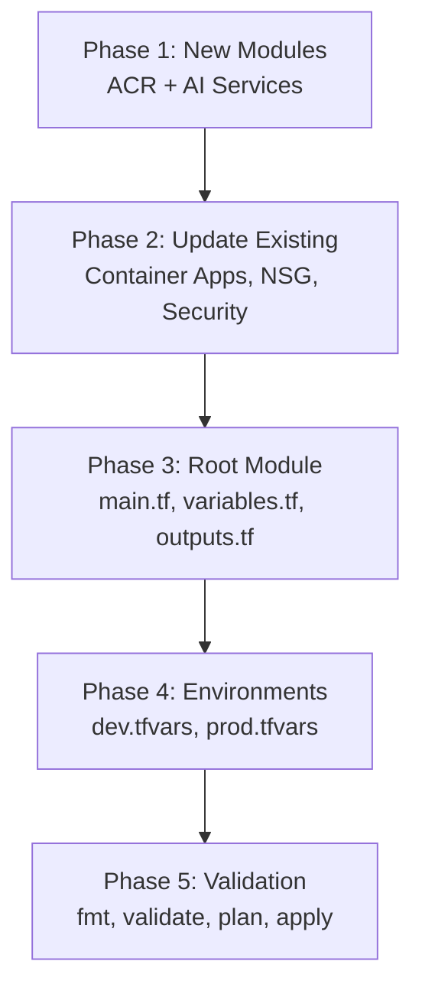

# Terraform Infrastructure — AI Developer Workflow Guide

> **Agent**: `@terraform-implementer` (claude-sonnet-4)  
> **Conventions**: [terraform.instructions.md](../.github/instructions/terraform.instructions.md)  
> **Source Roadmap**: [TERRAFORM_ROADMAP.md](./TERRAFORM_ROADMAP.md)  
> **Directory**: `infrastructure/terraform/`  
> **Total Tasks**: 40 across 5 phases | **Effort**: 40–55 hours

---

## Quick Start

```bash
# 1. Pick a task from the table below
# 2. Copy the CORE prompt for that task
# 3. Paste into Copilot Chat with the agent prefix:
@terraform-implementer <paste CORE prompt>

# 4. After implementation, verify:
cd infrastructure/terraform
terraform fmt -recursive
terraform validate
terraform plan -var-file="environments/dev.tfvars.json"
```

---

## Dependency Graph



---

## Task Inventory

| ID | Task | Phase | Priority | Est | Status | Dependencies |
|----|------|-------|----------|-----|--------|-------------|
| TF-1.1 | Create ACR module main.tf | 1: New Modules | Critical | 3–4h | 🔴 TODO | — |
| TF-1.2 | Create ACR module variables.tf | 1: New Modules | Critical | 0.5h | 🔴 TODO | TF-1.1 |
| TF-1.3 | Create ACR module outputs.tf | 1: New Modules | Critical | 0.5h | 🔴 TODO | TF-1.1 |
| TF-1.4 | Create AI Services — Azure OpenAI | 1: New Modules | Critical | 4–5h | 🔴 TODO | — |
| TF-1.5 | Create AI Services — Azure Maps | 1: New Modules | Critical | 1–2h | 🔴 TODO | TF-1.4 |
| TF-1.6 | Create AI Services variables.tf | 1: New Modules | Critical | 0.5h | 🔴 TODO | TF-1.4 |
| TF-1.7 | Create AI Services outputs.tf | 1: New Modules | Critical | 0.5h | 🔴 TODO | TF-1.4 |
| TF-2.1 | Add Python backend Container App | 2: Updates | High | 2–3h | 🔴 TODO | TF-1.1 |
| TF-2.2 | Configure ACR pull auth (managed identity) | 2: Updates | High | 2–3h | 🔴 TODO | TF-1.1 |
| TF-2.3 | Use Key Vault refs for Container App secrets | 2: Updates | High | 2–3h | 🔴 TODO | TF-2.1 |
| TF-2.4 | Add enable_app_service variable (default false) | 2: Updates | Medium | 1h | 🔴 TODO | — |
| TF-2.5 | Update NSG for Container Apps → PostgreSQL | 2: Updates | High | 1–2h | 🔴 TODO | TF-2.1 |
| TF-2.6 | Add google-client-secret to Key Vault | 2: Updates | Medium | 0.5h | 🔴 TODO | — |
| TF-2.7 | Add acr-admin-password to Key Vault | 2: Updates | Medium | 0.5h | 🔴 TODO | TF-1.1 |
| TF-2.8 | Remove deprecated gemini-api-key | 2: Updates | Low | 0.5h | 🔴 TODO | — |
| TF-2.9 | Add DB firewall rule for Container Apps | 2: Updates | High | 1h | 🔴 TODO | TF-2.5 |
| TF-3.1 | Add module "acr" to main.tf | 3: Root | High | 1h | 🔴 TODO | TF-1.3 |
| TF-3.2 | Add module "ai_services" to main.tf | 3: Root | High | 1h | 🔴 TODO | TF-1.7 |
| TF-3.3 | Pass ACR creds to Container Apps module | 3: Root | High | 1h | 🔴 TODO | TF-3.1 |
| TF-3.4 | Update security secrets map for AI outputs | 3: Root | High | 1h | 🔴 TODO | TF-3.2 |
| TF-3.5 | Add python_config variable | 3: Root | High | 0.5h | 🔴 TODO | — |
| TF-3.6 | Add acr_sku variable | 3: Root | Medium | 0.5h | 🔴 TODO | — |
| TF-3.7 | Add azure_openai_model variables | 3: Root | High | 0.5h | 🔴 TODO | — |
| TF-3.8 | Add google_client_secret variable | 3: Root | Medium | 0.5h | 🔴 TODO | — |
| TF-3.9 | Remove deprecated gemini_api_key variable | 3: Root | Low | 0.5h | 🔴 TODO | — |
| TF-3.10 | Update outputs.tf with new resource URLs | 3: Root | Medium | 1h | 🔴 TODO | TF-3.1, TF-3.2 |
| TF-4.1 | Add python_config to dev.tfvars.json | 4: Envs | High | 0.5h | 🔴 TODO | TF-3.5 |
| TF-4.2 | Add acr_sku: Basic to dev.tfvars.json | 4: Envs | Medium | 0.5h | 🔴 TODO | TF-3.6 |
| TF-4.3 | Add azure_openai_model to dev.tfvars.json | 4: Envs | High | 0.5h | 🔴 TODO | TF-3.7 |
| TF-4.4 | Set enable_app_service: false in dev | 4: Envs | Medium | 0.5h | 🔴 TODO | TF-2.4 |
| TF-4.5 | Use ACR image refs in dev.tfvars.json | 4: Envs | High | 1h | 🔴 TODO | TF-4.2 |
| TF-4.6 | Add python_config to prod.tfvars.json | 4: Envs | High | 0.5h | 🔴 TODO | TF-3.5 |
| TF-4.7 | Add acr_sku: Premium to prod.tfvars.json | 4: Envs | Medium | 0.5h | 🔴 TODO | TF-3.6 |
| TF-4.8 | Add azure_openai_model to prod.tfvars.json | 4: Envs | High | 0.5h | 🔴 TODO | TF-3.7 |
| TF-4.9 | Set enable_app_service: false in prod | 4: Envs | Medium | 0.5h | 🔴 TODO | TF-2.4 |
| TF-5.1 | Run terraform fmt -recursive | 5: Validate | Medium | 0.5h | 🔴 TODO | TF-4.9 |
| TF-5.2 | Run terraform validate | 5: Validate | High | 1h | 🔴 TODO | TF-5.1 |
| TF-5.3 | Run terraform plan for dev env | 5: Validate | High | 1h | 🔴 TODO | TF-5.2 |
| TF-5.4 | Apply to dev environment | 5: Validate | High | 2h | 🔴 TODO | TF-5.3 |
| TF-5.5 | Update infrastructure README | 5: Validate | Medium | 1h | 🔴 TODO | TF-5.4 |

---

## Phase 1: New Terraform Modules

### TF-1.1 — Create ACR Module (modules/acr/main.tf)

<details>
<summary>📋 CORE Prompt (click to expand)</summary>

**Context**: You are working on `infrastructure/terraform/`. The `prod.tfvars.json` references `roadtripacr.azurecr.io` but no ACR is provisioned. Container Apps cannot pull images. Follow [terraform.instructions.md](../.github/instructions/terraform.instructions.md) conventions.

**Objective**: Create Azure Container Registry module with geo-replication support.

**Requirements**:
- Create `modules/acr/main.tf` with `azurerm_container_registry` resource
- Naming: `acr${var.project_name}${var.environment}${var.resource_suffix}`
- `admin_enabled = true` (required for Container Apps initially)
- Dynamic `georeplications` block for Premium SKU (prod only)
- Apply standard tags via `var.tags`
- Follow naming conventions from terraform.instructions.md

**Example**:
```hcl
resource "azurerm_container_registry" "main" {
  name                = "acr${var.project_name}${var.environment}${var.resource_suffix}"
  resource_group_name = var.resource_group_name
  location            = var.location
  sku                 = var.acr_sku
  admin_enabled       = true
  dynamic "georeplications" {
    for_each = var.acr_sku == "Premium" ? var.geo_replication_locations : []
    content {
      location                = georeplications.value
      zone_redundancy_enabled = true
    }
  }
  tags = var.tags
}
```

</details>

---

### TF-1.2 — Create ACR Module Variables

<details>
<summary>📋 CORE Prompt (click to expand)</summary>

**Context**: ACR module from TF-1.1 needs input variables.

**Objective**: Create variables.tf for the ACR module.

**Requirements**:
- Create `modules/acr/variables.tf` with: `resource_group_name`, `location`, `project_name`, `environment`, `resource_suffix`, `acr_sku` (default "Basic", validation: Basic/Standard/Premium), `geo_replication_locations` (list, default []), `tags` (map)

**Example**: `variable "acr_sku" { type = string; default = "Basic"; validation { condition = contains(["Basic","Standard","Premium"], var.acr_sku) } }`

</details>

---

### TF-1.3 — Create ACR Module Outputs

<details>
<summary>📋 CORE Prompt (click to expand)</summary>

**Context**: ACR module outputs are needed by Container Apps and Security modules.

**Objective**: Create outputs.tf for the ACR module.

**Requirements**:
- Create `modules/acr/outputs.tf` with: `acr_id`, `acr_login_server`, `acr_admin_username`, `acr_admin_password` (sensitive)

**Example**: `output "acr_admin_password" { value = azurerm_container_registry.main.admin_password; sensitive = true }`

</details>

---

### TF-1.4 — Create AI Services Module — Azure OpenAI

<details>
<summary>📋 CORE Prompt (click to expand)</summary>

**Context**: You are working on `infrastructure/terraform/`. The C# backend requires Azure OpenAI but only variables exist — no resource. `azurerm_cognitive_account` with `kind = "OpenAI"` and `azurerm_cognitive_deployment` for GPT-4o are needed.

**Objective**: Create Azure OpenAI resources in the AI Services module.

**Requirements**:
- Create `modules/ai-services/main.tf`
- `azurerm_cognitive_account` with `kind = "OpenAI"`, `sku_name = "S0"`
- Custom subdomain: `oai-${var.project_name}-${var.environment}`
- `azurerm_cognitive_deployment` for the model (GPT-4o)
- Scale: `type = "Standard"`, capacity from variable (TPM)
- Note: Azure OpenAI has limited region availability — document in README
- Tags applied

**Example**:
```hcl
resource "azurerm_cognitive_account" "openai" {
  name                  = "oai-${var.project_name}-${var.environment}-${var.resource_suffix}"
  location              = var.location
  resource_group_name   = var.resource_group_name
  kind                  = "OpenAI"
  sku_name              = "S0"
  custom_subdomain_name = "oai-${var.project_name}-${var.environment}"
  tags                  = var.tags
}
```

</details>

---

### TF-1.5 — Create AI Services Module — Azure Maps

<details>
<summary>📋 CORE Prompt (click to expand)</summary>

**Context**: The Java backend requires Azure Maps API for POI search. No Azure Maps Account exists in Terraform.

**Objective**: Add Azure Maps Account to the AI Services module.

**Requirements**:
- Add `azurerm_maps_account` to `modules/ai-services/main.tf`
- Naming: `maps-${var.project_name}-${var.environment}-${var.resource_suffix}`
- SKU from variable (S0 or S1)
- Tags applied

**Example**: `resource "azurerm_maps_account" "main" { name = "maps-..."; sku_name = var.azure_maps_sku }`

</details>

---

### TF-1.6 — Create AI Services Variables

<details>
<summary>📋 CORE Prompt (click to expand)</summary>

**Context**: AI Services module needs input variables for OpenAI model, capacity, and Maps SKU.

**Objective**: Create variables.tf for the AI Services module.

**Requirements**:
- Variables: `resource_group_name`, `location`, `project_name`, `environment`, `resource_suffix`, `azure_openai_model` (default "gpt-4o"), `azure_openai_model_version` (default "2024-05-13"), `azure_openai_capacity` (number, default 10, TPM), `azure_openai_deployment_name` (default "gpt-4o"), `azure_maps_sku` (default "S0"), `tags`

**Example**: `variable "azure_openai_capacity" { type = number; default = 10; description = "Tokens per minute capacity" }`

</details>

---

### TF-1.7 — Create AI Services Outputs

<details>
<summary>📋 CORE Prompt (click to expand)</summary>

**Context**: Container Apps and Security modules need AI service endpoints and keys.

**Objective**: Create outputs.tf for the AI Services module.

**Requirements**:
- Outputs: `azure_openai_endpoint`, `azure_openai_key` (sensitive), `azure_openai_deployment_name`, `azure_maps_key` (sensitive)

**Example**: `output "azure_openai_endpoint" { value = azurerm_cognitive_account.openai.endpoint }`

</details>

---

## Phase 2: Update Existing Modules

### TF-2.1 — Add Python Backend Container App

<details>
<summary>📋 CORE Prompt (click to expand)</summary>

**Context**: You are working on `infrastructure/terraform/modules/container-apps/main.tf`. Currently has BFF, C#, and Java Container Apps. Python backend is missing — it still targets App Service.

**Objective**: Add Python backend as 4th Container App.

**Requirements**:
- Add `azurerm_container_app` resource for Python backend
- Internal ingress only (accessed via BFF), target port 8000
- Environment variables: `DATABASE_URL`, `AI_SERVICE_URL` (C# FQDN), `JWT_SECRET`, `GOOGLE_CLIENT_ID`, `GOOGLE_CLIENT_SECRET`, `ALLOWED_ORIGINS`
- Secrets from variables (will be Key Vault refs in TF-2.3)
- Scaling: min/max replicas from `var.python_config`
- Single revision mode

**Example**: See TERRAFORM_ROADMAP.md Task 2.1 for complete HCL specification

</details>

---

### TF-2.5 — Update Networking NSG Rules

<details>
<summary>📋 CORE Prompt (click to expand)</summary>

**Context**: You are working on `infrastructure/terraform/modules/networking/main.tf`. Database NSG only allows App Service subnet. Container Apps subnet is blocked from reaching PostgreSQL.

**Objective**: Add NSG rule allowing Container Apps → PostgreSQL traffic.

**Requirements**:
- Add `azurerm_network_security_rule` for Container Apps subnet → PostgreSQL port 5432
- Priority: 110
- Conditional: `count = var.enable_container_apps ? 1 : 0`
- Source: Container Apps subnet CIDR (e.g., `10.0.4.0/23`)
- Destination: Database subnet

**Example**: `resource "azurerm_network_security_rule" "allow_container_apps_to_postgres" { source_address_prefix = var.subnet_container_apps; destination_port_range = "5432" }`

</details>

---

### TF-2.6–2.8 — Security Module Updates

<details>
<summary>📋 CORE Prompt (click to expand)</summary>

**Context**: You are working on `infrastructure/terraform/modules/security/main.tf`. Missing `google-client-secret` in Key Vault. Deprecated `gemini-api-key` still exists.

**Objective**: Update Key Vault secrets — add new, remove deprecated.

**Requirements**:
- TF-2.6: Add `google-client-secret` to secrets map
- TF-2.7: Add `acr-admin-password` to secrets map (from ACR module output)
- TF-2.8: Remove `gemini-api-key` from secrets map
- Verify no references to removed secrets in other modules

**Example**: `secrets = { ..., "google-client-secret" = var.google_client_secret, "acr-admin-password" = var.acr_admin_password }`

</details>

---

## Phase 3: Root Module & Variables

### TF-3.1–3.4 — Update main.tf

<details>
<summary>📋 CORE Prompt (click to expand)</summary>

**Context**: You are working on `infrastructure/terraform/main.tf`. Need to wire new ACR and AI Services modules, pass credentials to Container Apps, and update security secrets.

**Objective**: Add new module calls and wire dependencies in root main.tf.

**Requirements**:
- TF-3.1: Add `module "acr" {}` with source and dependency on resource group
- TF-3.2: Add `module "ai_services" {}` with source and dependency on resource group
- TF-3.3: Pass `module.acr.acr_login_server`, `acr_admin_username`, `acr_admin_password` to Container Apps module
- TF-3.4: Update `module.security` secrets map to include `module.ai_services.azure_openai_key` and `module.ai_services.azure_maps_key`
- Ensure correct `depends_on` ordering

**Example**:
```hcl
module "acr" {
  source              = "./modules/acr"
  resource_group_name = azurerm_resource_group.main.name
  location            = var.location
  project_name        = var.project_name
  environment         = var.environment
  acr_sku             = var.acr_sku
  tags                = local.common_tags
}
```

</details>

---

### TF-3.5–3.9 — Update variables.tf

<details>
<summary>📋 CORE Prompt (click to expand)</summary>

**Context**: Root `variables.tf` needs new variables for Python config, ACR, AI services, and cleanup of deprecated ones.

**Objective**: Update root variables.tf with all required variables.

**Requirements**:
- TF-3.5: Add `python_config` object variable (image, cpu, memory, min/max replicas)
- TF-3.6: Add `acr_sku` variable (default "Basic")
- TF-3.7: Add `azure_openai_model`, `azure_openai_capacity` variables
- TF-3.8: Add `google_client_secret` variable (sensitive)
- TF-3.9: Remove `gemini_api_key` variable
- All sensitive variables marked with `sensitive = true`

**Example**: `variable "python_config" { type = object({ image = string, cpu = number, memory = string, min_replicas = number, max_replicas = number }) }`

</details>

---

### TF-3.10 — Update outputs.tf

<details>
<summary>📋 CORE Prompt (click to expand)</summary>

**Context**: Root outputs need new resource URLs for ACR, AI services, and all Container App FQDNs.

**Objective**: Add new outputs to root outputs.tf.

**Requirements**:
- Add: `acr_login_server`, `azure_openai_endpoint`, `azure_openai_deployment_name`, all 4 Container App FQDNs (bff, python, csharp, java)
- Sensitive outputs marked appropriately

**Example**: `output "acr_login_server" { value = module.acr.acr_login_server }`

</details>

---

## Phase 4: Environment Configurations

### TF-4.1–4.5 — Update dev.tfvars.json

<details>
<summary>📋 CORE Prompt (click to expand)</summary>

**Context**: Dev environment configuration needs Python config, ACR, and AI service settings.

**Objective**: Update dev.tfvars.json with all new configuration.

**Requirements**:
- TF-4.1: Add `python_config` object: `{ "image": "acr.../python-backend:latest", "cpu": 0.5, "memory": "1Gi", "min_replicas": 1, "max_replicas": 2 }`
- TF-4.2: Add `"acr_sku": "Basic"`
- TF-4.3: Add `"azure_openai_model": "gpt-4o-mini"` (cheaper for dev)
- TF-4.4: Set `"enable_app_service": false`
- TF-4.5: Replace placeholder images with ACR references: `"${acr_login_server}/service:${git_sha}"`

**Example**: JSON object with all new fields added to existing dev.tfvars.json

</details>

---

### TF-4.6–4.9 — Update prod.tfvars.json

<details>
<summary>📋 CORE Prompt (click to expand)</summary>

**Context**: Production environment needs higher-tier settings.

**Objective**: Update prod.tfvars.json with production configuration.

**Requirements**:
- TF-4.6: Add `python_config` with prod scaling (min_replicas: 2, max_replicas: 10)
- TF-4.7: Add `"acr_sku": "Premium"` (geo-replication)
- TF-4.8: Add `"azure_openai_model": "gpt-4o"` (full model for prod)
- TF-4.9: Set `"enable_app_service": false`

**Example**: Same structure as dev but with production-grade values

</details>

---

## Phase 5: Validation & Documentation

### TF-5.1–5.5 — Validate and Apply

<details>
<summary>📋 CORE Prompt (click to expand)</summary>

**Context**: All modules and configurations are in place. Need to validate, plan, and apply.

**Objective**: Validate all Terraform changes and apply to dev.

**Requirements**:
- TF-5.1: `terraform fmt -recursive` — fix any formatting issues
- TF-5.2: `terraform validate` — fix any schema errors
- TF-5.3: `terraform plan -var-file="environments/dev.tfvars.json"` — verify clean plan, review resource changes
- TF-5.4: `terraform apply dev.tfplan` — apply to dev, verify: Container Apps pull from ACR, Python reaches PostgreSQL, C# calls Azure OpenAI
- TF-5.5: Update `infrastructure/terraform/README.md` with new modules, variables, architecture diagram

**Example**:
```bash
cd infrastructure/terraform
terraform init -backend-config="environments/dev/backend.tfvars"
terraform fmt -recursive
terraform validate
export TF_VAR_mapbox_token="..." TF_VAR_google_client_secret="..."
terraform plan -var-file="environments/dev.tfvars.json" -out=dev.tfplan
terraform apply dev.tfplan
```

</details>

---

## Verification Checklist

After all tasks complete, run:

```bash
cd infrastructure/terraform

# 1. Format check
terraform fmt -recursive -check

# 2. Validation
terraform validate

# 3. Plan (dry run)
terraform plan -var-file="environments/dev.tfvars.json" -out=dev.tfplan

# 4. Verify new modules exist
ls modules/acr/ modules/ai-services/

# 5. Verify no deprecated variables
grep -r "gemini" variables.tf  # Should be empty

# 6. Count resources (should be 4 Container Apps, 1 ACR, 1 OpenAI, 1 Maps)
terraform plan -var-file="environments/dev.tfvars.json" | grep "will be created"
```
