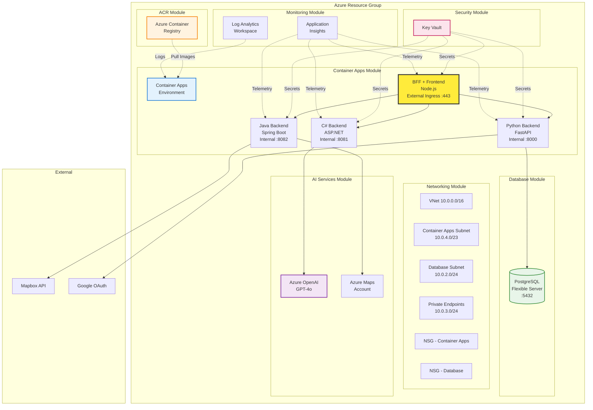

# Terraform Infrastructure Roadmap

**Last Updated**: March 4, 2026  
**Status**: Planning Complete — Ready for Implementation  
**Total Effort**: 40-55 hours across 5 phases  
**Architecture**: Azure Container Apps (all services) + ACR + Azure OpenAI + Azure Maps

---

## 📋 Executive Summary

This roadmap addresses significant gaps between the current Terraform infrastructure and the actual polyglot microservices application. The main issues are:

1. **Missing ACR Module** — `prod.tfvars.json` references `roadtripacr.azurecr.io` but no ACR is provisioned
2. **Missing Azure OpenAI** — C# backend requires Azure OpenAI, only variables exist (no resource)
3. **Missing Azure Maps Account** — Java backend requires Azure Maps API access
4. **Wrong Compute Model** — Python currently targets App Service; should be Container Apps like other services
5. **NSG Gap** — Database NSG only allows App Service subnet, not Container Apps subnet
6. **Missing Secrets** — `GOOGLE_CLIENT_SECRET` not in Key Vault; deprecated `gemini_api_key` still exists

---

## 🎯 Gap Analysis

| Gap | Current State | Required State | Impact |
|-----|---------------|----------------|--------|
| No ACR | `prod.tfvars` references `roadtripacr.azurecr.io` | Create `modules/acr/` | ❌ Container Apps cannot pull images |
| No Azure OpenAI | Variables only, no resource | Create `modules/ai-services/` | ❌ C# backend non-functional |
| No Azure Maps Account | Variables only, no resource | Include in `modules/ai-services/` | ❌ Java backend POI search non-functional |
| Python on App Service | `modules/compute/` creates App Service | Move to `modules/container-apps/` | ⚠️ Inconsistent architecture |
| DB NSG blocks Container Apps | Only App Service subnet allowed | Add Container Apps subnet NSG rule | ❌ Container Apps cannot reach PostgreSQL |
| Missing `google-client-secret` | Not in Key Vault | Add to `modules/security/` secrets map | ⚠️ Google OAuth incomplete |
| Deprecated `gemini_api_key` | Still in `variables.tf` | Remove variable | ⚠️ Confusing configuration |
| Container Apps use inline secrets | Secrets passed as raw values | Use Key Vault references | ⚠️ Security risk |

---

## 🏗️ Target Architecture



---

## 📦 Module Structure

```
infrastructure/terraform/
├── main.tf                          # Root module orchestration
├── variables.tf                     # Root variables
├── outputs.tf                       # Root outputs
├── versions.tf                      # Provider versions
├── environments/
│   ├── dev.tfvars.json              # Development config
│   ├── prod.tfvars.json             # Production config
│   ├── dev/backend.tfvars           # Dev state backend
│   └── prod/backend.tfvars          # Prod state backend
└── modules/
    ├── acr/                         # 🆕 NEW MODULE
    │   ├── main.tf                  # Container Registry + access
    │   ├── variables.tf
    │   └── outputs.tf
    ├── ai-services/                 # 🆕 NEW MODULE
    │   ├── main.tf                  # Azure OpenAI + Azure Maps
    │   ├── variables.tf
    │   └── outputs.tf
    ├── compute/                     # ⚠️ UPDATE (remove App Service)
    │   ├── main.tf                  # Static Web App only (or remove entirely)
    │   ├── variables.tf
    │   └── outputs.tf
    ├── container-apps/              # ⚠️ UPDATE (add Python backend)
    │   ├── main.tf                  # CAE + 4 Container Apps
    │   ├── variables.tf
    │   └── outputs.tf
    ├── database/                    # ⚠️ UPDATE (firewall for Container Apps)
    │   ├── main.tf
    │   ├── variables.tf
    │   └── outputs.tf
    ├── monitoring/                  # ✅ OK (minor updates)
    │   ├── main.tf
    │   ├── variables.tf
    │   └── outputs.tf
    ├── networking/                  # ⚠️ UPDATE (NSG rules)
    │   ├── main.tf
    │   ├── variables.tf
    │   └── outputs.tf
    └── security/                    # ⚠️ UPDATE (add secrets)
        ├── main.tf
        ├── variables.tf
        └── outputs.tf
```

---

## 🎯 Implementation Phases

### Phase 1: New Terraform Modules (Critical — 12-16 hrs)

| Task | Description | Effort | Status |
|------|-------------|--------|--------|
| **1.1** | Create `modules/acr/main.tf` — Azure Container Registry with admin credentials, geo-replication (prod only) | 3-4 hrs | 🔴 Not started |
| **1.2** | Create `modules/acr/variables.tf` — SKU (Basic/Premium), geo-replication regions | 0.5 hrs | 🔴 Not started |
| **1.3** | Create `modules/acr/outputs.tf` — `acr_login_server`, `acr_admin_username`, `acr_admin_password` | 0.5 hrs | 🔴 Not started |
| **1.4** | Create `modules/ai-services/main.tf` — Azure OpenAI (`azurerm_cognitive_account` kind="OpenAI") + model deployment | 4-5 hrs | 🔴 Not started |
| **1.5** | Create `modules/ai-services/main.tf` — Azure Maps Account (`azurerm_maps_account`) | 1-2 hrs | 🔴 Not started |
| **1.6** | Create `modules/ai-services/variables.tf` — model name, capacity (TPM), Maps SKU | 0.5 hrs | 🔴 Not started |
| **1.7** | Create `modules/ai-services/outputs.tf` — `azure_openai_endpoint`, `azure_openai_key`, `azure_maps_key` | 0.5 hrs | 🔴 Not started |

### Phase 2: Update Existing Modules (High — 10-14 hrs)

| Task | Description | Effort | Status |
|------|-------------|--------|--------|
| **2.1** | Update `modules/container-apps/main.tf` — Add Python backend Container App (4th service) | 2-3 hrs | 🔴 Not started |
| **2.2** | Update `modules/container-apps/main.tf` — Configure ACR pull authentication via managed identity | 2-3 hrs | 🔴 Not started |
| **2.3** | Update `modules/container-apps/main.tf` — Use Key Vault references instead of inline secrets | 2-3 hrs | 🔴 Not started |
| **2.4** | Update `modules/compute/main.tf` — Add `enable_app_service` variable (default: `false`) | 1 hr | 🔴 Not started |
| **2.5** | Update `modules/networking/main.tf` — Add NSG rule allowing Container Apps subnet to PostgreSQL | 1-2 hrs | 🔴 Not started |
| **2.6** | Update `modules/security/main.tf` — Add `google-client-secret` to secrets map | 0.5 hrs | 🔴 Not started |
| **2.7** | Update `modules/security/main.tf` — Add `acr-admin-password` to secrets map (from ACR output) | 0.5 hrs | 🔴 Not started |
| **2.8** | Update `modules/security/main.tf` — Remove `gemini-api-key` (deprecated) | 0.5 hrs | 🔴 Not started |
| **2.9** | Update `modules/database/main.tf` — Add firewall rule for Container Apps subnet | 1 hr | 🔴 Not started |

### Phase 3: Root Module & Variables (High — 6-8 hrs)

| Task | Description | Effort | Status |
|------|-------------|--------|--------|
| **3.1** | Update `main.tf` — Add `module "acr" {}` with dependency on resource group | 1 hr | 🔴 Not started |
| **3.2** | Update `main.tf` — Add `module "ai_services" {}` with dependency on resource group | 1 hr | 🔴 Not started |
| **3.3** | Update `main.tf` — Pass ACR credentials to Container Apps module | 1 hr | 🔴 Not started |
| **3.4** | Update `main.tf` — Update `module.security` secrets map to include AI services outputs | 1 hr | 🔴 Not started |
| **3.5** | Update `variables.tf` — Add `python_config` variable (Container App config) | 0.5 hrs | 🔴 Not started |
| **3.6** | Update `variables.tf` — Add `acr_sku` variable (Basic/Premium) | 0.5 hrs | 🔴 Not started |
| **3.7** | Update `variables.tf` — Add `azure_openai_model`, `azure_openai_capacity` variables | 0.5 hrs | 🔴 Not started |
| **3.8** | Update `variables.tf` — Add `google_client_secret` variable | 0.5 hrs | 🔴 Not started |
| **3.9** | Update `variables.tf` — Remove deprecated `gemini_api_key` variable | 0.5 hrs | 🔴 Not started |
| **3.10** | Update `outputs.tf` — Add ACR login server, Azure OpenAI endpoint, Container Apps FQDNs | 1 hr | 🔴 Not started |

### Phase 4: Environment Configurations (High — 4-6 hrs)

| Task | Description | Effort | Status |
|------|-------------|--------|--------|
| **4.1** | Update `environments/dev.tfvars.json` — Add `python_config` object | 0.5 hrs | 🔴 Not started |
| **4.2** | Update `environments/dev.tfvars.json` — Add `acr_sku: "Basic"` | 0.5 hrs | 🔴 Not started |
| **4.3** | Update `environments/dev.tfvars.json` — Add `azure_openai_model: "gpt-4o-mini"` | 0.5 hrs | 🔴 Not started |
| **4.4** | Update `environments/dev.tfvars.json` — Set `enable_app_service: false` | 0.5 hrs | 🔴 Not started |
| **4.5** | Update `environments/dev.tfvars.json` — Remove placeholder images, use ACR references | 1 hr | 🔴 Not started |
| **4.6** | Update `environments/prod.tfvars.json` — Add `python_config` object with prod scaling | 0.5 hrs | 🔴 Not started |
| **4.7** | Update `environments/prod.tfvars.json` — Add `acr_sku: "Premium"` (geo-replication) | 0.5 hrs | 🔴 Not started |
| **4.8** | Update `environments/prod.tfvars.json` — Add `azure_openai_model: "gpt-4o"` | 0.5 hrs | 🔴 Not started |
| **4.9** | Update `environments/prod.tfvars.json` — Set `enable_app_service: false` | 0.5 hrs | 🔴 Not started |

### Phase 5: Validation & Documentation (Medium — 4-6 hrs)

| Task | Description | Effort | Status |
|------|-------------|--------|--------|
| **5.1** | Run `terraform fmt -recursive` on all modules | 0.5 hrs | 🔴 Not started |
| **5.2** | Run `terraform validate` — fix any schema errors | 1 hr | 🔴 Not started |
| **5.3** | Run `terraform plan -var-file="environments/dev.tfvars.json"` — verify clean plan | 1 hr | 🔴 Not started |
| **5.4** | Apply to dev environment, verify resources created | 2 hrs | 🔴 Not started |
| **5.5** | Update [infrastructure/terraform/README.md](../infrastructure/terraform/README.md) with new modules | 1 hr | 🔴 Not started |

---

## 📋 Detailed Task Specifications

### Task 1.1: Create ACR Module (`modules/acr/main.tf`)

```hcl
# modules/acr/main.tf

resource "azurerm_container_registry" "main" {
  name                = "acr${var.project_name}${var.environment}${var.resource_suffix}"
  resource_group_name = var.resource_group_name
  location            = var.location
  sku                 = var.acr_sku
  admin_enabled       = true  # Required for Container Apps (initially)

  # Geo-replication for Premium SKU (prod only)
  dynamic "georeplications" {
    for_each = var.acr_sku == "Premium" ? var.geo_replication_locations : []
    content {
      location                = georeplications.value
      zone_redundancy_enabled = true
    }
  }

  tags = var.tags
}

# Role assignment for Container Apps managed identity (future)
# resource "azurerm_role_assignment" "acr_pull" { ... }
```

**Outputs Required**:
- `acr_id` — Resource ID
- `acr_login_server` — e.g., `acroadtripdev123.azurecr.io`
- `acr_admin_username` — For Container Apps pull
- `acr_admin_password` — For Container Apps pull (store in Key Vault)

---

### Task 1.4: Create AI Services Module (`modules/ai-services/main.tf`)

```hcl
# modules/ai-services/main.tf

# Azure OpenAI Service
resource "azurerm_cognitive_account" "openai" {
  name                = "oai-${var.project_name}-${var.environment}-${var.resource_suffix}"
  location            = var.location  # Note: Limited region availability
  resource_group_name = var.resource_group_name
  kind                = "OpenAI"
  sku_name            = "S0"

  custom_subdomain_name = "oai-${var.project_name}-${var.environment}"

  tags = var.tags
}

# Model Deployment (GPT-4o)
resource "azurerm_cognitive_deployment" "gpt4" {
  name                 = var.azure_openai_deployment_name
  cognitive_account_id = azurerm_cognitive_account.openai.id

  model {
    format  = "OpenAI"
    name    = var.azure_openai_model  # e.g., "gpt-4o"
    version = var.azure_openai_model_version
  }

  scale {
    type     = "Standard"
    capacity = var.azure_openai_capacity  # TPM
  }
}

# Azure Maps Account
resource "azurerm_maps_account" "main" {
  name                = "maps-${var.project_name}-${var.environment}-${var.resource_suffix}"
  resource_group_name = var.resource_group_name
  sku_name            = var.azure_maps_sku  # "S0" or "S1"

  tags = var.tags
}
```

**Outputs Required**:
- `azure_openai_endpoint` — Endpoint URL
- `azure_openai_key` — Primary key (store in Key Vault)
- `azure_openai_deployment_name` — Deployment name for API calls
- `azure_maps_key` — Primary key (store in Key Vault)

---

### Task 2.1: Add Python Backend to Container Apps

Update `modules/container-apps/main.tf`:

```hcl
# Add Python backend Container App
resource "azurerm_container_app" "python" {
  name                         = "ca-python-${var.project_name}-${var.environment}"
  container_app_environment_id = azurerm_container_app_environment.main.id
  resource_group_name          = var.resource_group_name
  revision_mode                = "Single"

  template {
    container {
      name   = "python-backend"
      image  = var.python_config.image
      cpu    = var.python_config.cpu
      memory = var.python_config.memory

      env {
        name        = "DATABASE_URL"
        secret_name = "database-connection-string"
      }
      env {
        name        = "AI_SERVICE_URL"
        value       = "https://${azurerm_container_app.csharp.ingress[0].fqdn}"
      }
      env {
        name        = "JWT_SECRET"
        secret_name = "jwt-secret-key"
      }
      env {
        name        = "GOOGLE_CLIENT_ID"
        secret_name = "google-client-id"
      }
      env {
        name        = "GOOGLE_CLIENT_SECRET"
        secret_name = "google-client-secret"
      }
      env {
        name  = "ALLOWED_ORIGINS"
        value = join(",", var.allowed_origins)
      }
    }

    min_replicas = var.python_config.min_replicas
    max_replicas = var.python_config.max_replicas
  }

  ingress {
    external_enabled = false  # Internal only — accessed via BFF
    target_port      = 8000
    traffic_weight {
      percentage      = 100
      latest_revision = true
    }
  }

  # Secrets from Key Vault
  secret {
    name  = "database-connection-string"
    value = var.database_connection_string
  }
  secret {
    name  = "jwt-secret-key"
    value = var.jwt_secret_key
  }
  secret {
    name  = "google-client-id"
    value = var.google_client_id
  }
  secret {
    name  = "google-client-secret"
    value = var.google_client_secret
  }

  tags = var.tags
}
```

---

### Task 2.5: Update Networking NSG Rules

Update `modules/networking/main.tf` — add rule for Container Apps:

```hcl
# Allow Container Apps subnet to PostgreSQL
resource "azurerm_network_security_rule" "allow_container_apps_to_postgres" {
  count = var.enable_container_apps ? 1 : 0

  name                        = "AllowContainerAppsToPostgres"
  priority                    = 110
  direction                   = "Inbound"
  access                      = "Allow"
  protocol                    = "Tcp"
  source_port_range           = "*"
  destination_port_range      = "5432"
  source_address_prefix       = var.subnet_container_apps  # e.g., "10.0.4.0/23"
  destination_address_prefix  = var.subnet_database
  resource_group_name         = var.resource_group_name
  network_security_group_name = azurerm_network_security_group.database.name
}
```

---

## ✅ Acceptance Criteria

### Phase 1 Complete When:
- [ ] `terraform validate` passes with new ACR and AI Services modules
- [ ] ACR module outputs `acr_login_server`
- [ ] AI Services module outputs `azure_openai_endpoint` and `azure_maps_key`

### Phase 2 Complete When:
- [ ] Container Apps module has 4 Container Apps (BFF, Python, C#, Java)
- [ ] Python Container App has correct environment variables
- [ ] Networking NSG allows Container Apps → PostgreSQL traffic
- [ ] Security module has all required secrets including `google-client-secret`

### Phase 3 Complete When:
- [ ] `main.tf` calls all required modules with correct dependencies
- [ ] `variables.tf` has no deprecated variables (`gemini_api_key` removed)
- [ ] `outputs.tf` exports all resource URLs/FQDNs

### Phase 4 Complete When:
- [ ] `dev.tfvars.json` has `python_config` object
- [ ] `prod.tfvars.json` uses ACR image references (not placeholder)
- [ ] Both environments set `enable_app_service: false`

### Phase 5 Complete When:
- [ ] `terraform plan` shows no errors
- [ ] Dev environment applies successfully
- [ ] Container Apps can pull images from ACR
- [ ] Python Container App can connect to PostgreSQL
- [ ] C# Container App can call Azure OpenAI
- [ ] Documentation updated

---

## 🔗 Related Documentation

- [Main Project Roadmap](./ROADMAP.md) — Phase 8 references this document
- [Architecture Overview](./ARCHITECTURE.md) — System design documentation
- [Infrastructure README](./infrastructure-README.md) — Deployment scripts
- [Terraform README](./terraform-README.md) — Terraform-specific documentation

---

## 📊 Progress Tracking

| Phase | Tasks | Complete | Status |
|-------|-------|----------|--------|
| Phase 1: New Modules | 7 | 0 | 🔴 Not started |
| Phase 2: Update Modules | 9 | 0 | 🔴 Not started |
| Phase 3: Root Module | 10 | 0 | 🔴 Not started |
| Phase 4: Environments | 9 | 0 | 🔴 Not started |
| Phase 5: Validation | 5 | 0 | 🔴 Not started |
| **Total** | **40** | **0** | **0%** |

---

## 📝 Decisions Log

| Date | Decision | Rationale |
|------|----------|-----------|
| Mar 4, 2026 | Create ACR module | Required for Container Apps to pull custom images |
| Mar 4, 2026 | Provision Azure OpenAI in Terraform | C# backend dependency, enables consistent deployment |
| Mar 4, 2026 | All services on Container Apps | Unified architecture, simpler networking, consistent scaling |
| Mar 4, 2026 | Remove `gemini_api_key` | Deprecated — Azure OpenAI is the active AI provider |
| Mar 4, 2026 | Add `google_client_secret` to Key Vault | Required for Google OAuth, currently missing |

---

## ⚠️ Prerequisites & Constraints

### Azure Region Constraints
- **Azure OpenAI** has limited region availability. Confirm `centralus` supports GPT-4o or adjust `location` variable
- Check [Azure OpenAI regional availability](https://learn.microsoft.com/en-us/azure/ai-services/openai/concepts/models#model-summary-table-and-region-availability)

### Sensitive Variables
All secrets must be passed via `TF_VAR_*` environment variables, NOT committed to tfvars:
```bash
export TF_VAR_mapbox_token="pk.eyJ..."
export TF_VAR_google_client_id="1234...apps.googleusercontent.com"
export TF_VAR_google_client_secret="GOCSPX-..."
export TF_VAR_jwt_secret_key="$(openssl rand -base64 32)"
export TF_VAR_database_admin_password="$(openssl rand -base64 24)"
```

### ACR Authentication
Initially using admin credentials for simplicity. Future improvement: use managed identity with `AcrPull` role assignment.

---

## 🚀 Quick Start

```bash
cd infrastructure/terraform

# Initialize with backend config
terraform init -backend-config="environments/dev/backend.tfvars"

# Set sensitive variables
export TF_VAR_mapbox_token="your-token"
export TF_VAR_google_client_id="your-client-id"
export TF_VAR_google_client_secret="your-secret"
export TF_VAR_jwt_secret_key="your-jwt-secret"

# Plan
terraform plan -var-file="environments/dev.tfvars.json" -out=dev.tfplan

# Apply
terraform apply dev.tfplan
```
