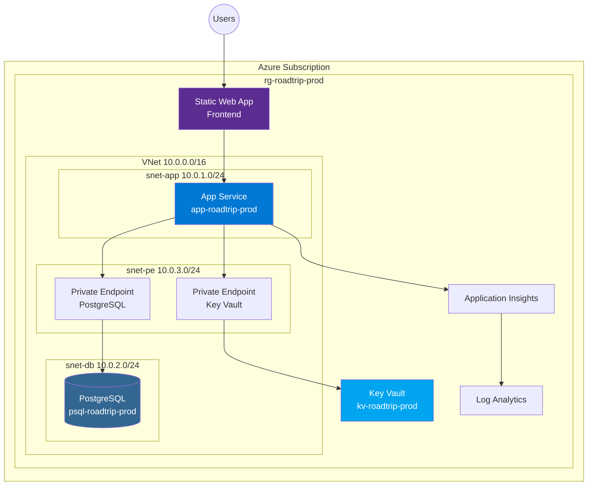
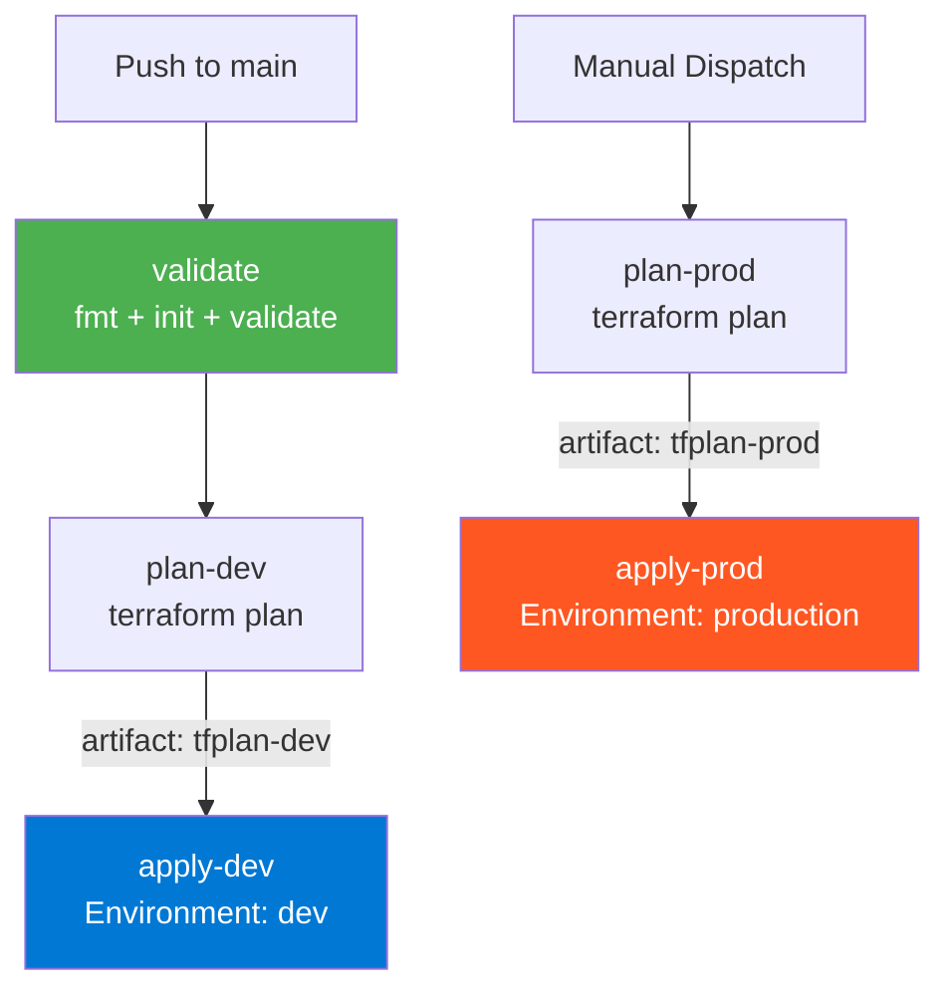

# Workshop 03: GitHub Copilot for IaC - Advanced Skills

> **Duration**: 1 hour  
> **Level**: Advanced  
> **Prerequisites**: Completed Workshops 01 & 02, experience with Terraform modules  
> **Format**: 8 topics (~7 minutes each) + 15-minute hands-on exercise

---

## 🎯 Learning Objectives

By the end of this workshop, participants will:
- Apply chain-of-thought prompting for complex networking modules
- Create and leverage instruction files for Terraform patterns
- Build reusable prompt files for IaC workflows
- Conduct AI-assisted code review for security and cost
- Use Plan Mode for module development
- Leverage coding agents for module scaffolding
- Configure Agent HQ with custom agents
- Generate architecture diagrams from infrastructure code

---

## Topic 1: Chain-of-Thought for Networking Modules (~7 min)

### Concept

Chain-of-thought (CoT) prompting breaks complex infrastructure into sequential reasoning steps, dramatically improving accuracy for multi-resource configurations like VNets, subnets, NSGs, and private endpoints.

### Why CoT for Networking?

Networking has many interdependencies:
```
VNet → Subnets → NSGs → NSG Associations → Private DNS Zones → Private Endpoints
```

Without CoT, Copilot might generate resources in wrong order or miss dependencies.

> **Key Pattern**: In our repo, the `count` conditional lives on the **module call** in `main.tf`, NOT on individual resources inside the module. This keeps module code clean.

### Chain-of-Thought Prompt Structure

```
Think through this networking module step by step:

**Step 1: Analyze Requirements**
- Dev environment: No VNet (module not instantiated via count=0)
- Prod environment: Full VNet with private endpoints

**Step 2: Design Address Space**
- VNet CIDR: 10.0.0.0/16 (65,536 addresses)
- Subnet allocation:
  - App Service: 10.0.1.0/24 (with Microsoft.Web/serverFarms delegation)
  - Database: 10.0.2.0/24 (with Microsoft.DBforPostgreSQL/flexibleServers delegation)
  - Private Endpoints: 10.0.3.0/24 (private_endpoint_network_policies = "Disabled")
  - Container Apps: 10.0.4.0/23 (conditional, with Microsoft.App/environments delegation)

**Step 3: Plan Security (NSGs)**
- App subnet NSG: Allow 443+80 inbound, allow 5432 outbound to DB subnet
- Database subnet NSG: Allow 5432 from app subnet only, deny all other inbound
- Private Endpoint subnet: Allow VNet inbound only

**Step 4: Identify Private DNS Zones** (conditional on enable_private_endpoints)
- PostgreSQL → privatelink.postgres.database.azure.com
- Key Vault → privatelink.vaultcore.azure.net

**Step 5: Module Integration**
- The root main.tf controls whether networking runs:
  count = local.should_enable_vnet_integration ? 1 : 0
- Outputs are always provided (no null-safe needed inside module)
- Downstream modules reference: module.networking[0].subnet_app_service_id

Now generate the Terraform module.
```

### Live Demo: VNet Module with CoT

From our actual `modules/networking/main.tf` — notice resources are NOT wrapped in `count`:
```hcl
# modules/networking/main.tf

# VNet — always created when module is instantiated
resource "azurerm_virtual_network" "main" {
  name                = "vnet-${var.project_name}-${var.environment}"
  location            = var.location
  resource_group_name = var.resource_group_name
  address_space       = var.vnet_address_space
  tags                = var.tags
}

# App Service Subnet — with delegation for VNet integration
resource "azurerm_subnet" "app_service" {
  name                 = "snet-app-${var.environment}"
  resource_group_name  = var.resource_group_name
  virtual_network_name = azurerm_virtual_network.main.name
  address_prefixes     = [var.subnet_app_service]

  delegation {
    name = "delegation-app-service"
    service_delegation {
      name    = "Microsoft.Web/serverFarms"
      actions = ["Microsoft.Network/virtualNetworks/subnets/action"]
    }
  }
}

# Database Subnet — with PostgreSQL delegation
resource "azurerm_subnet" "database" {
  name                 = "snet-db-${var.environment}"
  resource_group_name  = var.resource_group_name
  virtual_network_name = azurerm_virtual_network.main.name
  address_prefixes     = [var.subnet_database]

  delegation {
    name = "delegation-postgresql"
    service_delegation {
      name    = "Microsoft.DBforPostgreSQL/flexibleServers"
      actions = ["Microsoft.Network/virtualNetworks/subnets/join/action"]
    }
  }
}

# Private Endpoints Subnet
resource "azurerm_subnet" "private_endpoints" {
  name                              = "snet-pe-${var.environment}"
  resource_group_name               = var.resource_group_name
  virtual_network_name              = azurerm_virtual_network.main.name
  address_prefixes                  = [var.subnet_private_endpoints]
  private_endpoint_network_policies = "Disabled"
}

# Container Apps Subnet — conditional on var.enable_container_apps
resource "azurerm_subnet" "container_apps" {
  count = var.enable_container_apps ? 1 : 0

  name                 = "snet-ca-${var.environment}"
  resource_group_name  = var.resource_group_name
  virtual_network_name = azurerm_virtual_network.main.name
  address_prefixes     = [var.subnet_container_apps]

  delegation {
    name = "delegation-container-apps"
    service_delegation {
      name    = "Microsoft.App/environments"
      actions = ["Microsoft.Network/virtualNetworks/subnets/join/action"]
    }
  }
}
```

The **module call** in root `main.tf` controls when networking is created:
```hcl
# infrastructure/terraform/main.tf
module "networking" {
  source = "./modules/networking"
  count  = local.should_enable_vnet_integration ? 1 : 0
  # ... pass variables
}
```

### Pipeline Parallel: CoT for Multi-Job Workflows

The same CoT pattern works for complex pipeline architecture:
```
Think through Terraform CI/CD deployment step by step:

**Step 1: Validation** (runs on every push and PR)
- fmt -check, init -backend=false, validate
- No Azure credentials needed

**Step 2: Plan** (runs after validation passes)
- Needs Azure credentials and backend config
- Upload plan artifact with 5-day retention

**Step 3: Apply** (only on push to main)
- Download plan artifact from Step 2
- Requires GitHub Environment approval gate
- Delegates to infrastructure/scripts/terraform-ci.sh

**Step 4: Production** (manual dispatch only)
- Separate plan → apply with 'production' environment
- Requires senior engineer approval

Now generate the GitHub Actions workflow.
```

This produced our actual `.github/workflows/terraform.yml` with its 5-job structure.

---

## Topic 2: Instruction Files for Terraform Patterns (~7 min)

### Concept

Instruction files (`.github/instructions/*.instructions.md`) establish persistent context for Copilot, ensuring all generated Terraform follows organizational standards. Our repo uses **scoped instructions** (not a single copilot-instructions.md).

### Our Repo's Terraform Instruction File

From `.github/instructions/terraform.instructions.md` (scoped to `infrastructure/**/*.{tf,tfvars,json}`):

```markdown
## Format (Non-Negotiable)
- **Environment configs**: `*.tfvars.json` ONLY — never HCL `.tfvars` files (CI/CD requires JSON)
- **Module-first**: All resources go inside modules in `infrastructure/terraform/modules/`
  — never inline resources in root `main.tf`
- **Every module must have**: `main.tf`, `variables.tf`, `outputs.tf`

## Variable Standards
- All enum-like variables **must** have `validation` blocks
- All variables **must** have `description` fields

## Secrets Management
- Use `TF_VAR_*` environment variables for all secrets
- Never commit passwords, API keys, or connection strings to any `.tfvars.json`
- Reference Azure Key Vault secrets at deploy time via the shell scripts

## Conditional Resources
count = var.enable_vnet ? 1 : 0
```

### Our CI/CD Instruction File

From `.github/instructions/cicd.instructions.md` (scoped to workflows and scripts):

```markdown
## Golden Rule — No Inline Code in Pipeline YAML

Pipeline YAML is only for:
- Job and step definitions
- Environment variable injection
- Conditional logic (if:)
- Ordering dependencies (needs:)

All logic belongs in:
- `infrastructure/*.sh` (bash) for Linux/macOS runners
- `infrastructure/*.ps1` (PowerShell) for Windows runners
```

### Pipeline Parallel: Instruction-Driven Pipeline Generation

With the cicd.instructions.md active, Copilot generates compliant YAML:

```yaml
# WITHOUT cicd.instructions.md — Copilot generates inline logic:
- name: Deploy
  run: |
    cd infrastructure/terraform
    terraform init
    terraform plan -var-file=environments/dev.tfvars.json
    terraform apply -auto-approve

# WITH cicd.instructions.md — Copilot delegates to script:
- name: Terraform Plan (dev)
  run: ./infrastructure/scripts/terraform-ci.sh --action plan --environment dev
  env:
    ARM_CLIENT_ID: ${{ secrets.ARM_CLIENT_ID }}
```

The instruction file ensures ALL generated pipeline code follows the Golden Rule.

### Live Demo: Instruction-Driven Generation

**Before instruction file** - Generic output:
```hcl
resource "azurerm_storage_account" "storage" {
  name = "storageaccount123"
  # No naming convention, no tags
}
```

**After instruction file** - Follows standards:
```hcl
resource "azurerm_storage_account" "main" {
  name                = "st${var.project_name}${var.environment}${random_string.suffix.result}"
  resource_group_name = azurerm_resource_group.main.name
  location            = azurerm_resource_group.main.location
  
  account_tier             = "Standard"
  account_replication_type = "LRS"
  min_tls_version          = "TLS1_2"
  
  tags = merge(local.common_tags, {
    Purpose = "Terraform State"
  })
}
```

---

## Topic 3: Prompt Files for Reusable IaC (~7 min)

### Concept

Prompt files (`.prompt.md`) are reusable templates that can be invoked across sessions, ensuring consistent infrastructure requests.

### Creating a Terraform Module Prompt

Create `.github/prompts/create-azure-module.prompt.md`:

```markdown
# Create Azure Terraform Module

## Module Information
- **Name**: {{MODULE_NAME}}
- **Purpose**: {{PURPOSE}}
- **Resources**: {{RESOURCE_LIST}}

## Requirements
Generate a Terraform module following these standards:

### File Structure
```
modules/{{MODULE_NAME}}/
├── main.tf          # Resource definitions
├── variables.tf     # Input variables with validation
├── outputs.tf       # Exported values
├── versions.tf      # Provider constraints
└── README.md        # Documentation with examples
```

### Naming Convention
- Resources: `{type}-{project}-{environment}`
- Variables: snake_case with descriptions
- Outputs: snake_case matching resource attributes

### Security Requirements
- No hardcoded secrets
- Managed identity where supported
- Private endpoints for prod (conditional)
- TLS 1.2 minimum

### Tags
Include these standard tags:
```hcl
tags = merge(var.tags, {
  Module = "{{MODULE_NAME}}"
})
```

## Generate the Module
Create complete, production-ready Terraform code for the {{MODULE_NAME}} module.
```

### Using the Prompt File

In Copilot Chat:
```
Use the prompt file .github/prompts/create-azure-module.prompt.md with:
- MODULE_NAME: key-vault
- PURPOSE: Secure secrets storage for application credentials
- RESOURCE_LIST: Key Vault, access policies, private endpoint
```

### Additional Prompt Files to Create

| File | Purpose |
|------|---------|
| `add-private-endpoint.prompt.md` | Standard private endpoint configuration |
| `create-diagnostic-settings.prompt.md` | Logging to Log Analytics |
| `add-autoscaling.prompt.md` | App Service autoscale rules |
| `create-alert-rule.prompt.md` | Azure Monitor alerts |

---

## Topic 4: Code Review for Security & Cost (~7 min)

### Concept

Use Copilot Chat to conduct comprehensive code reviews of generated Terraform, focusing on security vulnerabilities and cost optimization.

### Security Review Prompt

```
Review this Terraform module for security issues:
[paste module code]

Check for:
1. Public network exposure
2. Missing encryption settings
3. Overly permissive IAM/RBAC
4. Hardcoded credentials
5. Missing audit logging
6. Non-compliant TLS versions
7. Missing resource locks on critical infra

Format findings as:
| Severity | Issue | Location | Remediation |
```

### Live Demo: Security Review

**Code Under Review**:
```hcl
resource "azurerm_postgresql_flexible_server" "main" {
  name                = "psql-roadtrip-prod"
  resource_group_name = azurerm_resource_group.main.name
  location            = azurerm_resource_group.main.location
  
  administrator_login    = "adminuser"
  administrator_password = "P@ssw0rd123!"  # SECURITY ISSUE!
  
  sku_name = "GP_Standard_D2s_v3"
  version  = "16"
  
  storage_mb = 65536
  
  public_network_access_enabled = true  # SECURITY ISSUE!
}
```

**Copilot Security Review Output**:

| Severity | Issue | Location | Remediation |
|----------|-------|----------|-------------|
| CRITICAL | Hardcoded password | Line 7 | Use `random_password` resource + Key Vault |
| HIGH | Public network access | Line 12 | Set to `false`, use private endpoint |
| MEDIUM | No backup configuration | Missing | Add `backup_retention_days = 35` |
| MEDIUM | No geo-redundancy | Missing | Add `geo_redundant_backup_enabled = true` |
| LOW | No diagnostic settings | Missing | Add `azurerm_monitor_diagnostic_setting` |

### Cost Review Prompt

```
Review this Terraform configuration for cost optimization:
[paste configuration]

Analyze:
1. SKU sizing - is it appropriate for the workload?
2. Reserved capacity opportunities
3. Unused resources being provisioned
4. Storage tier optimization
5. Region cost differences

Estimate monthly cost and suggest optimizations.
```

**Cost Review Output**:
```
Current Configuration Cost Estimate: ~$450/month

Optimization Opportunities:
1. Database SKU (GP_Standard_D2s_v3 → B_Standard_B1ms for dev): Save $300/month
2. App Service (P1V3 → B1 for dev): Save $100/month
3. Enable auto-shutdown for dev resources: Save $50/month

Recommended dev.tfvars.json changes:
- database_sku = "B_Standard_B1ms"
- app_service_sku = "B1"

Total Potential Savings: $450/month (100% for dev environment)
```

---

## Topic 5: Plan Mode for Module Development (~7 min)

### Concept

Copilot's Plan Mode creates a structured approach to module development, outlining all files and resources before generating code.

### Invoking Plan Mode

In Copilot Chat:
```
/plan Create a networking module for Azure with:
- 4 subnets: App Service (with delegation), Database (with PostgreSQL delegation),
  Private Endpoints, Container Apps (conditional)
- NSGs with environment-specific rules (app, database, private-endpoints)
- Private DNS zones for PostgreSQL and Key Vault (conditional on enable_private_endpoints)
- Module is called with count in root main.tf, not conditional within
```

### Plan Mode Output

```markdown
## Module: networking

### Files to Create

1. **modules/networking/main.tf**
   - azurerm_virtual_network.main
   - azurerm_subnet.app_service (with Microsoft.Web/serverFarms delegation)
   - azurerm_subnet.database (with Microsoft.DBforPostgreSQL/flexibleServers delegation)
   - azurerm_subnet.private_endpoints (private_endpoint_network_policies = "Disabled")
   - azurerm_subnet.container_apps (conditional, with Microsoft.App/environments delegation)
   - azurerm_network_security_group.app_service
   - azurerm_network_security_group.database
   - azurerm_network_security_group.private_endpoints
   - NSG associations

2. **modules/networking/dns.tf**
   - azurerm_private_dns_zone.postgresql (conditional on enable_private_endpoints)
   - azurerm_private_dns_zone.keyvault (conditional)
   - DNS zone VNet links

3. **modules/networking/variables.tf**
   - enable_private_endpoints (bool)
   - enable_container_apps (bool)
   - vnet_address_space (list)
   - subnet_app_service, subnet_database, subnet_private_endpoints, subnet_container_apps
   - project_name, environment, location, resource_group_name
   - tags

4. **modules/networking/outputs.tf**
   - vnet_id, vnet_name
   - subnet_app_service_id, subnet_database_id, subnet_private_endpoints_id
   - subnet_container_apps_id (conditional)
   - private_dns_zone_ids

### Root main.tf Integration
module "networking" {
  source = "./modules/networking"
  count  = local.should_enable_vnet_integration ? 1 : 0
  # ... pass variables
}

### Execution Order
1. VNet → 2. Subnets (3 fixed + 1 conditional) → 3. NSGs → 
4. NSG Associations → 5. DNS Zones → 6. DNS Links
```

### Pipeline Parallel: Plan Mode for Workflow Architecture

```
/plan Design a Terraform CI/CD workflow with:
- Validate job (no Azure creds): fmt, init -backend=false, validate
- Plan jobs per environment: delegates to terraform-ci.sh
- Apply jobs with GitHub Environment approval gates
- Artifact passing between plan and apply
- Manual dispatch for production deployments
```

Plan Mode produces the job dependency graph before generating any YAML.

### Executing the Plan

After reviewing:
```
Execute the plan, starting with modules/networking/main.tf
```

---

## Topic 6: Coding Agent for Module Scaffolding (~7 min)

### Concept

Custom coding agents can automate repetitive module creation tasks with pre-defined conventions and quality checks.

### Our Terraform Agent

From `.github/copilot-agents/terraform-azure-planning.agent.md`:

```markdown
# Terraform Azure Planning Agent

You are an expert in Terraform and Azure infrastructure planning.

## Capabilities
- Generate production-ready Terraform modules
- Create infrastructure plans with proper resource ordering
- Apply Azure Well-Architected Framework principles

## Conventions
- Use azurerm provider ~>3.85
- Follow naming: {type}-{project}-{environment}
- Include lifecycle blocks for critical resources
- Generate comprehensive variables with validation

## When Generating Modules
1. Start with variables.tf (define inputs first)
2. Create main.tf with proper ordering
3. Add outputs.tf for cross-module references
4. Include versions.tf with constraints
5. Generate README.md with usage examples
```

### Invoking the Agent

```
@terraform-azure-planning Scaffold a new module for Azure Key Vault with:
- Standard vault with soft delete
- Private endpoint support
- Access policies for App Service managed identity
- Secret management for database credentials
- Diagnostic settings for Log Analytics
```

### Agent Output

Compare this to our actual `modules/security/main.tf`:
```hcl
# modules/security/main.tf
resource "azurerm_key_vault" "main" {
  name                = "kv-${var.project_name}-${var.environment}-${var.resource_suffix}"
  location            = var.location
  resource_group_name = var.resource_group_name
  tenant_id           = var.tenant_id

  sku_name = "standard"

  # Security settings
  enabled_for_deployment          = false
  enabled_for_disk_encryption     = false
  enabled_for_template_deployment = false

  soft_delete_retention_days = var.soft_delete_retention_days
  purge_protection_enabled   = var.purge_protection_enabled

  enable_rbac_authorization = true

  network_acls {
    bypass         = "AzureServices"
    default_action = var.enable_private_endpoint ? "Deny" : "Allow"
    ip_rules       = var.enable_private_endpoint ? [] : var.allowed_ip_ranges
  }

  tags = var.tags
}

# RBAC for App Service Managed Identity
resource "azurerm_role_assignment" "app_service_secrets_user" {
  count = var.app_service_principal_id != null ? 1 : 0

  scope                = azurerm_key_vault.main.id
  role_definition_name = "Key Vault Secrets User"
  principal_id         = var.app_service_principal_id
}

# RBAC for deployment service principal
resource "azurerm_role_assignment" "deployment_admin" {
  count = var.deployment_principal_id != null ? 1 : 0

  scope                = azurerm_key_vault.main.id
  role_definition_name = "Key Vault Administrator"
  principal_id         = var.deployment_principal_id
}
```

### Pipeline Parallel: Agent for Pipeline Scaffolding

A coding agent can also scaffold pipeline files:
```
@terraform-azure-planning Scaffold a new workflow job for the staging environment:
- Reuse infrastructure/scripts/terraform-ci.sh
- Follow cicd.instructions.md Golden Rule (no inline code)
- Require 'staging' GitHub Environment approval
- Download plan artifact from plan-stage job
- Only trigger on release/* branches
```

The agent generates compliant YAML that delegates to the existing script.

---

## Topic 7: Agent HQ Configuration (~7 min)

### Concept

Agent HQ (`.github/copilot-agents/`) is the central location for custom agent definitions. Properly configured agents accelerate IaC development.

### Agent Directory Structure

```
.github/copilot-agents/
├── README.md                           # Agent catalog and usage
├── QUICK_START.md                      # Quick reference
├── AGENT_TASK_CROSS_ANALYSIS.md        # Agent-to-issue mapping
├── terraform-azure-planning.agent.md   # IaC planning
├── debug.agent.md                      # Troubleshooting
├── task-researcher.agent.md            # Pre-implementation research
├── tdd-red.agent.md                    # Write tests first
├── tdd-green.agent.md                  # Implement to pass tests
└── prompts/                            # Shared prompt templates
```

### Creating an IaC-Specific Agent

Create `.github/copilot-agents/iac-security-reviewer.agent.md`:

```markdown
# IaC Security Reviewer Agent

You are a cloud security expert specializing in Infrastructure as Code review.

## Expertise
- Azure security best practices
- Terraform security patterns
- CIS benchmarks for Azure
- OWASP cloud security guidelines

## Review Checklist
When reviewing Terraform code, check for:

### Identity & Access
- [ ] Managed Identity used instead of service principals
- [ ] Least-privilege RBAC assignments
- [ ] No hardcoded credentials

### Network Security
- [ ] Private endpoints for PaaS services
- [ ] NSGs with explicit deny rules
- [ ] No public IPs in production

### Data Protection
- [ ] Encryption at rest enabled
- [ ] TLS 1.2 minimum for transit
- [ ] Key Vault for secrets

### Monitoring
- [ ] Diagnostic settings configured
- [ ] Activity logs forwarded
- [ ] Alerts for security events

## Output Format
Provide findings in this format:
| Severity | CIS Control | Issue | Remediation |
```

### Using Agent HQ

```
# List available agents
@copilot What agents are available in .github/copilot-agents/?

# Use specific agent
@iac-security-reviewer Review modules/database/main.tf for security issues

# Chain agents
@task-researcher Research Azure PostgreSQL private endpoint requirements
@terraform-azure-planning Generate the private endpoint configuration
@iac-security-reviewer Validate the generated code
```

---

## Topic 8: Architecture Diagram Generation (~7 min)

### Concept

Copilot can generate Mermaid diagrams from Terraform code, visualizing infrastructure architecture for documentation and reviews.

### Diagram Generation Prompt

```
Analyze the Terraform modules in infrastructure/terraform/modules/ and generate:
1. A Mermaid architecture diagram showing all Azure resources
2. Resource dependencies and data flows
3. Network topology including VNet, subnets, and private endpoints

Use Azure-specific icons where possible.
```

### Generated Mermaid Diagram



### Diagram Types to Generate

| Diagram | Purpose | Prompt |
|---------|---------|--------|
| Architecture | Overall structure | "Generate architecture diagram from main.tf" |
| Network | VNet topology | "Diagram networking module with 4 subnets and NSGs" |
| Security | Access flows | "Show authentication and authorization paths" |
| Data Flow | Request lifecycle | "Diagram API request from user to database" |
| Deployment | Pipeline stages | "Visualize CI/CD from terraform.yml and azure-pipelines.yml" |

### Pipeline Parallel: Pipeline Visualization

Ask Copilot to diagram the CI/CD flow:
```
Generate a Mermaid diagram showing the deployment pipeline defined in
.github/workflows/terraform.yml, including:
- validate job (no Azure creds)
- plan-dev job (uploads artifact)
- apply-dev job (requires Environment approval)
- plan-prod job (manual dispatch only)
- apply-prod job (production Environment gate)
- Show artifact flow between plan and apply jobs
```



### Exercise: Generate Diagram

Ask Copilot:
```
Generate a Mermaid diagram showing the deployment pipeline defined in 
.github/workflows/terraform.yml and azure-pipelines.yml, including:
- Terraform validate → plan → apply flow
- Artifact passing between jobs
- Environment approval gates
- Both GitHub Actions and Azure DevOps stages
```

---

## 🔬 Hands-On Exercise: Create Networking Module with Chain-of-Thought (15 min)

### Objective

Create `modules/networking/` with conditional VNet (dev=public, prod=private) using chain-of-thought prompting.

### Setup

1. Open Copilot Chat
2. Have `infrastructure/terraform/environments/dev.tfvars.json` and `prod.tfvars.json` open
3. Navigate to `infrastructure/terraform/modules/networking/`

### Exercise Steps

#### Step 1: Chain-of-Thought Planning (3 min)

Use this comprehensive CoT prompt in Copilot Chat:

```
Think through creating a networking module for the Road Trip Planner step by step:

**Step 1: Understand Environment Requirements**
- Dev: enable_vnet_integration = false (module not instantiated — count=0 on module call)
- Prod: enable_vnet_integration = true (full VNet stack)

**Step 2: Design Conditional Logic**
- Root main.tf: module "networking" { count = local.should_enable_vnet_integration ? 1 : 0 }
- Inside module: NO count on individual resources (they always exist when module runs)
- Exception: Container Apps subnet uses count = var.enable_container_apps ? 1 : 0

**Step 3: Plan Resource Hierarchy**
1. VNet (10.0.0.0/16 for prod)
2. Subnets:
   - snet-app-${env} (10.0.1.0/24) with Microsoft.Web/serverFarms delegation
   - snet-db-${env} (10.0.2.0/24) with Microsoft.DBforPostgreSQL/flexibleServers delegation
   - snet-pe-${env} (10.0.3.0/24) with private_endpoint_network_policies = "Disabled"
   - snet-ca-${env} (10.0.4.0/23) [conditional] with Microsoft.App/environments delegation
3. NSGs:
   - nsg-app: Allow 443+80 inbound, allow 5432 outbound to DB subnet
   - nsg-db: Allow 5432 from app subnet only, deny all other inbound
   - nsg-pe: Allow VNet inbound
4. NSG Associations

**Step 4: Plan Private DNS** (conditional on enable_private_endpoints)
- privatelink.postgres.database.azure.com
- privatelink.vaultcore.azure.net
- DNS Zone VNet Links

**Step 5: Define Outputs**
- vnet_id, vnet_name
- subnet_app_service_id, subnet_database_id, subnet_private_endpoints_id
- subnet_container_apps_id (conditional)

Now generate the complete networking module.
```

#### Step 2: Generate Variables (3 min)

Create `modules/networking/variables.tf`:

```hcl
# Expected variables (matching our actual module):
# - vnet_address_space (list(string))
# - subnet_app_service, subnet_database, subnet_private_endpoints (string CIDRs)
# - subnet_container_apps (string, default "10.0.4.0/23")
# - enable_private_endpoints (bool)
# - enable_container_apps (bool)
# - project_name, environment, location, resource_group_name
# - tags (map(string))
```

#### Step 3: Generate Main Resources (5 min)

Create `modules/networking/main.tf` with:
- VNet (always created when module is instantiated)
- Four subnets with proper delegations (app_service, database, private_endpoints, container_apps)
- NSGs with security rules (app allows 443+80+5432-outbound, db allows 5432 from app subnet only)
- NSG associations

```hcl
# Note: NO count on VNet/subnets — the module itself is conditionally called
# Only container_apps subnet uses count = var.enable_container_apps ? 1 : 0
```

#### Step 4: Generate Outputs (2 min)

Create `modules/networking/outputs.tf`:

```hcl
# Outputs are NOT conditional — the module is always fully instantiated or not at all
output "vnet_id" {
  description = "Virtual Network ID"
  value       = azurerm_virtual_network.main.id
}

output "subnet_app_service_id" {
  description = "App Service subnet ID"
  value       = azurerm_subnet.app_service.id
}

# Continue with database, private_endpoints, container_apps outputs...
```

#### Step 5: Validate (2 min)

```bash
cd infrastructure/terraform
terraform validate
```

### Deliverable

Complete networking module with:
- [ ] `variables.tf` with all inputs (including enable_container_apps)
- [ ] `main.tf` with VNet, 4 subnets, NSGs, associations
- [ ] `outputs.tf` with direct values (not conditional)
- [ ] Passes `terraform validate`
- [ ] Module called with `count` in root main.tf (dev=0, prod=1)

### Test Configurations

**Dev Test** (module NOT instantiated — count=0 on module call):
```hcl
# In root main.tf:
module "networking" {
  source = "./modules/networking"
  count  = local.should_enable_vnet_integration ? 1 : 0
  # When enable_vnet_integration = false, this module is never called
}
```

**Prod Test** (module instantiated with full stack):
```hcl
module "networking" {
  source = "./modules/networking"
  count  = local.should_enable_vnet_integration ? 1 : 0
  
  vnet_address_space       = ["10.0.0.0/16"]
  subnet_app_service       = "10.0.1.0/24"
  subnet_database          = "10.0.2.0/24"
  subnet_private_endpoints = "10.0.3.0/24"
  subnet_container_apps    = "10.0.4.0/23"
  enable_private_endpoints = true
  enable_container_apps    = true
  # ...
}
```

---

## 📋 Workshop Summary

### Key Takeaways

1. **Chain-of-thought** - Break complex networking into sequential steps
2. **Instruction files** - Establish persistent Terraform conventions
3. **Prompt files** - Reusable templates for consistent module generation
4. **Security review** - AI-assisted vulnerability detection
5. **Cost review** - Optimize SKUs and identify waste
6. **Plan mode** - Structured approach to module development
7. **Coding agents** - Automate scaffolding with custom agents
8. **Architecture diagrams** - Visualize infrastructure from code

### Next Steps

- Create organization-specific instruction files
- Build prompt library for common IaC patterns
- Configure Agent HQ with team agents
- Practice security reviews on existing modules
- Join Workshop 04: Expert Enterprise Topics

### Resources

| Resource | Location |
|----------|----------|
| Definitions Reference | `docs/workshops/iac/00-copilot-definitions-best-practices.md` |
| Custom Agents | `.github/copilot-agents/` |
| Spec Kit Agents | `.github/agents/` |
| Networking Module | `infrastructure/terraform/modules/networking/` |
| Security Module | `infrastructure/terraform/modules/security/` |
| Terraform CI/CD Workflow | `.github/workflows/terraform.yml` |
| Terraform CI Script | `infrastructure/scripts/terraform-ci.sh` |
| Azure DevOps Pipeline | `azure-pipelines.yml` |
| Terraform Instructions | `.github/instructions/terraform.instructions.md` |
| CI/CD Instructions | `.github/instructions/cicd.instructions.md` |
| ROADMAP Issue #24 | Networking module requirements |
