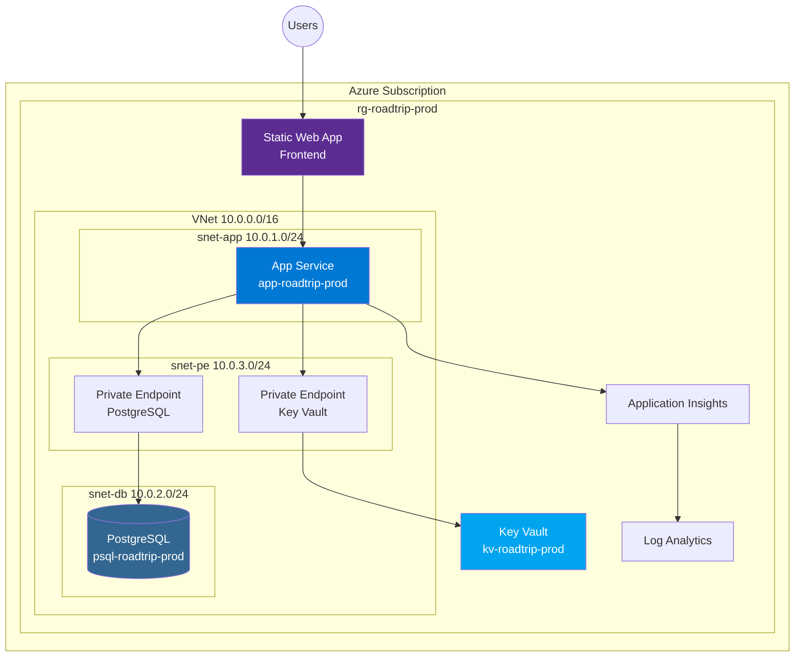

# Workshop 03: GitHub Copilot for IaC - Advanced Skills

> **Duration**: 1 hour  
> **Level**: Advanced  
> **Prerequisites**: Completed Workshops 01 & 02, experience with Terraform modules  
> **Format**: 8 topics (~7 minutes each) + 15-minute hands-on exercise

---

## 🎯 Learning Objectives

By the end of this workshop, participants will:
- Apply chain-of-thought prompting for complex networking modules
- Create and leverage instruction files for Terraform patterns
- Build reusable prompt files for IaC workflows
- Conduct AI-assisted code review for security and cost
- Use Plan Mode for module development
- Leverage coding agents for module scaffolding
- Configure Agent HQ with custom agents
- Generate architecture diagrams from infrastructure code

---

## Topic 1: Chain-of-Thought for Networking Modules (~7 min)

### Concept

Chain-of-thought (CoT) prompting breaks complex infrastructure into sequential reasoning steps, dramatically improving accuracy for multi-resource configurations like VNets, subnets, NSGs, and private endpoints.

### Why CoT for Networking?

Networking has many interdependencies:
```
VNet → Subnets → NSGs → NSG Associations → Private DNS Zones → Private Endpoints
```

Without CoT, Copilot might generate resources in wrong order or miss dependencies.

### Chain-of-Thought Prompt Structure

```
Think through this networking module step by step:

**Step 1: Analyze Requirements**
- Dev environment: No VNet (public access)
- Prod environment: Full VNet with private endpoints

**Step 2: Design Address Space**
- VNet CIDR: 10.0.0.0/16 (65,536 addresses)
- Subnet allocation:
  - App Service: 10.0.1.0/24 (256 addresses, needs /27 for VNet integration)
  - Database: 10.0.2.0/24 (256 addresses)
  - Private Endpoints: 10.0.3.0/24 (256 addresses)

**Step 3: Plan Security (NSGs)**
- App subnet NSG: Allow 443 inbound, deny all else
- Database subnet NSG: Allow 5432 from app subnet only
- Private Endpoint subnet: No NSG (Azure manages)

**Step 4: Identify Private Endpoints Needed**
- PostgreSQL Flexible Server → privatelink.postgres.database.azure.com
- Key Vault → privatelink.vaultcore.azure.net

**Step 5: Determine Conditional Logic**
- Use count = var.enable_vnet_integration ? 1 : 0 for VNet resources
- Use dynamic blocks for optional configurations

Now generate the Terraform module with proper resource ordering and dependencies.
```

### Live Demo: VNet Module with CoT

```hcl
# modules/networking/main.tf

# Step 1: Conditional VNet (only if enable_vnet_integration = true)
resource "azurerm_virtual_network" "main" {
  count = var.enable_vnet_integration ? 1 : 0
  
  name                = "vnet-${var.project_name}-${var.environment}"
  location            = var.location
  resource_group_name = var.resource_group_name
  address_space       = var.vnet_address_space
  
  tags = var.tags
}

# Step 2: Subnets (depend on VNet existing)
resource "azurerm_subnet" "app" {
  count = var.enable_vnet_integration ? 1 : 0
  
  name                 = "snet-app"
  resource_group_name  = var.resource_group_name
  virtual_network_name = azurerm_virtual_network.main[0].name
  address_prefixes     = [var.subnet_app_cidr]
  
  # Required for App Service VNet integration
  delegation {
    name = "app-service-delegation"
    service_delegation {
      name = "Microsoft.Web/serverFarms"
      actions = [
        "Microsoft.Network/virtualNetworks/subnets/action"
      ]
    }
  }
}

# Step 3: NSGs (created before association)
resource "azurerm_network_security_group" "app" {
  count = var.enable_vnet_integration ? 1 : 0
  
  name                = "nsg-app-${var.environment}"
  location            = var.location
  resource_group_name = var.resource_group_name
  
  security_rule {
    name                       = "AllowHTTPS"
    priority                   = 100
    direction                  = "Inbound"
    access                     = "Allow"
    protocol                   = "Tcp"
    source_port_range          = "*"
    destination_port_range     = "443"
    source_address_prefix      = "*"
    destination_address_prefix = "*"
  }
  
  tags = var.tags
}

# Step 4: NSG Associations (after both exist)
resource "azurerm_subnet_network_security_group_association" "app" {
  count = var.enable_vnet_integration ? 1 : 0
  
  subnet_id                 = azurerm_subnet.app[0].id
  network_security_group_id = azurerm_network_security_group.app[0].id
}
```

### Exercise: Complete the CoT

Continue the chain-of-thought to add:
- Database subnet with NSG (allow 5432 from app subnet only)
- Private endpoint subnet
- Private DNS zone for PostgreSQL

---

## Topic 2: Instruction Files for Terraform Patterns (~7 min)

### Concept

Instruction files (`.github/copilot-instructions.md`) establish persistent context for Copilot, ensuring all generated Terraform follows organizational standards.

### Our Repo's Instruction File

```markdown
# From .github/copilot-instructions.md

## Infrastructure Standards
- **Provider**: azurerm ~>3.85
- **Naming**: {resource-type}-{project}-{environment}-{suffix}
- **Backend**: Azure Storage Account for state
- **Required Tags**: Environment, Project, ManagedBy, Owner, CostCenter

## Terraform Module Structure
Every module must contain:
1. main.tf - Resource definitions
2. variables.tf - Input variables with descriptions and validation
3. outputs.tf - Exported values for other modules
4. versions.tf - Provider and Terraform version constraints
5. README.md - Module documentation with examples

## Security Requirements
- No public endpoints in production
- Managed identity for cross-service authentication
- All secrets in Azure Key Vault
- TLS 1.2 minimum for all services
```

### Adding IaC-Specific Instructions

Create or update `.github/copilot-instructions.md`:

```markdown
## Terraform Patterns

### Conditional Resources
Use count for boolean conditions:
```hcl
resource "azurerm_private_endpoint" "db" {
  count = var.enable_private_endpoints ? 1 : 0
  # ...
}
```

### Referencing Conditional Resources
Always use index when referencing counted resources:
```hcl
subnet_id = var.enable_vnet_integration ? azurerm_subnet.app[0].id : null
```

### Dynamic Blocks
Use for optional nested configurations:
```hcl
dynamic "ip_restriction" {
  for_each = var.ip_restrictions
  content {
    ip_address = ip_restriction.value
  }
}
```

### Lifecycle Rules
Add for critical resources:
```hcl
lifecycle {
  prevent_destroy = true  # For production databases
  ignore_changes = [tags["CreatedDate"]]
}
```
```

### Live Demo: Instruction-Driven Generation

**Before instruction file** - Generic output:
```hcl
resource "azurerm_storage_account" "storage" {
  name = "storageaccount123"
  # No naming convention, no tags
}
```

**After instruction file** - Follows standards:
```hcl
resource "azurerm_storage_account" "main" {
  name                = "st${var.project_name}${var.environment}${random_string.suffix.result}"
  resource_group_name = azurerm_resource_group.main.name
  location            = azurerm_resource_group.main.location
  
  account_tier             = "Standard"
  account_replication_type = "LRS"
  min_tls_version          = "TLS1_2"
  
  tags = merge(local.common_tags, {
    Purpose = "Terraform State"
  })
}
```

---

## Topic 3: Prompt Files for Reusable IaC (~7 min)

### Concept

Prompt files (`.prompt.md`) are reusable templates that can be invoked across sessions, ensuring consistent infrastructure requests.

### Creating a Terraform Module Prompt

Create `.github/prompts/create-azure-module.prompt.md`:

```markdown
# Create Azure Terraform Module

## Module Information
- **Name**: {{MODULE_NAME}}
- **Purpose**: {{PURPOSE}}
- **Resources**: {{RESOURCE_LIST}}

## Requirements
Generate a Terraform module following these standards:

### File Structure
```
modules/{{MODULE_NAME}}/
├── main.tf          # Resource definitions
├── variables.tf     # Input variables with validation
├── outputs.tf       # Exported values
├── versions.tf      # Provider constraints
└── README.md        # Documentation with examples
```

### Naming Convention
- Resources: `{type}-{project}-{environment}`
- Variables: snake_case with descriptions
- Outputs: snake_case matching resource attributes

### Security Requirements
- No hardcoded secrets
- Managed identity where supported
- Private endpoints for prod (conditional)
- TLS 1.2 minimum

### Tags
Include these standard tags:
```hcl
tags = merge(var.tags, {
  Module = "{{MODULE_NAME}}"
})
```

## Generate the Module
Create complete, production-ready Terraform code for the {{MODULE_NAME}} module.
```

### Using the Prompt File

In Copilot Chat:
```
Use the prompt file .github/prompts/create-azure-module.prompt.md with:
- MODULE_NAME: key-vault
- PURPOSE: Secure secrets storage for application credentials
- RESOURCE_LIST: Key Vault, access policies, private endpoint
```

### Additional Prompt Files to Create

| File | Purpose |
|------|---------|
| `add-private-endpoint.prompt.md` | Standard private endpoint configuration |
| `create-diagnostic-settings.prompt.md` | Logging to Log Analytics |
| `add-autoscaling.prompt.md` | App Service autoscale rules |
| `create-alert-rule.prompt.md` | Azure Monitor alerts |

---

## Topic 4: Code Review for Security & Cost (~7 min)

### Concept

Use Copilot Chat to conduct comprehensive code reviews of generated Terraform, focusing on security vulnerabilities and cost optimization.

### Security Review Prompt

```
Review this Terraform module for security issues:
[paste module code]

Check for:
1. Public network exposure
2. Missing encryption settings
3. Overly permissive IAM/RBAC
4. Hardcoded credentials
5. Missing audit logging
6. Non-compliant TLS versions
7. Missing resource locks on critical infra

Format findings as:
| Severity | Issue | Location | Remediation |
```

### Live Demo: Security Review

**Code Under Review**:
```hcl
resource "azurerm_postgresql_flexible_server" "main" {
  name                = "psql-roadtrip-prod"
  resource_group_name = azurerm_resource_group.main.name
  location            = azurerm_resource_group.main.location
  
  administrator_login    = "adminuser"
  administrator_password = "P@ssw0rd123!"  # SECURITY ISSUE!
  
  sku_name = "GP_Standard_D2s_v3"
  version  = "16"
  
  storage_mb = 65536
  
  public_network_access_enabled = true  # SECURITY ISSUE!
}
```

**Copilot Security Review Output**:

| Severity | Issue | Location | Remediation |
|----------|-------|----------|-------------|
| CRITICAL | Hardcoded password | Line 7 | Use `random_password` resource + Key Vault |
| HIGH | Public network access | Line 12 | Set to `false`, use private endpoint |
| MEDIUM | No backup configuration | Missing | Add `backup_retention_days = 35` |
| MEDIUM | No geo-redundancy | Missing | Add `geo_redundant_backup_enabled = true` |
| LOW | No diagnostic settings | Missing | Add `azurerm_monitor_diagnostic_setting` |

### Cost Review Prompt

```
Review this Terraform configuration for cost optimization:
[paste configuration]

Analyze:
1. SKU sizing - is it appropriate for the workload?
2. Reserved capacity opportunities
3. Unused resources being provisioned
4. Storage tier optimization
5. Region cost differences

Estimate monthly cost and suggest optimizations.
```

**Cost Review Output**:
```
Current Configuration Cost Estimate: ~$450/month

Optimization Opportunities:
1. Database SKU (GP_Standard_D2s_v3 → B_Standard_B1ms for dev): Save $300/month
2. App Service (P1V3 → B1 for dev): Save $100/month
3. Enable auto-shutdown for dev resources: Save $50/month

Recommended dev.tfvars.json changes:
- database_sku = "B_Standard_B1ms"
- app_service_sku = "B1"

Total Potential Savings: $450/month (100% for dev environment)
```

---

## Topic 5: Plan Mode for Module Development (~7 min)

### Concept

Copilot's Plan Mode creates a structured approach to module development, outlining all files and resources before generating code.

### Invoking Plan Mode

In Copilot Chat:
```
/plan Create a networking module for Azure with:
- Conditional VNet (enabled for prod, disabled for dev)
- Three subnets: app, database, private-endpoints
- NSGs with environment-specific rules
- Private DNS zones for PostgreSQL and Key Vault
- Private endpoints for both services
```

### Plan Mode Output

```markdown
## Module: networking

### Files to Create

1. **modules/networking/main.tf**
   - azurerm_virtual_network.main (conditional)
   - azurerm_subnet.app (with App Service delegation)
   - azurerm_subnet.database
   - azurerm_subnet.private_endpoints
   - azurerm_network_security_group.app
   - azurerm_network_security_group.database
   - NSG associations

2. **modules/networking/dns.tf**
   - azurerm_private_dns_zone.postgresql
   - azurerm_private_dns_zone.keyvault
   - DNS zone VNet links

3. **modules/networking/private_endpoints.tf**
   - azurerm_private_endpoint.postgresql
   - azurerm_private_endpoint.keyvault
   - Private DNS A records

4. **modules/networking/variables.tf**
   - enable_vnet_integration (bool)
   - enable_private_endpoints (bool)
   - vnet_address_space (list)
   - subnet configurations

5. **modules/networking/outputs.tf**
   - vnet_id
   - subnet_ids (map)
   - private_dns_zone_ids

6. **modules/networking/versions.tf**
   - Terraform >= 1.5.0
   - azurerm >= 3.85.0

### Dependencies
- Resource Group must exist
- PostgreSQL and Key Vault resources for private endpoint targets

### Execution Order
1. VNet → 2. Subnets → 3. NSGs → 4. NSG Associations → 
5. DNS Zones → 6. DNS Links → 7. Private Endpoints
```

### Executing the Plan

After reviewing:
```
Execute the plan, starting with modules/networking/main.tf
```

---

## Topic 6: Coding Agent for Module Scaffolding (~7 min)

### Concept

Custom coding agents can automate repetitive module creation tasks with pre-defined conventions and quality checks.

### Our Terraform Agent

From `.github/copilot-agents/terraform-azure-planning.agent.md`:

```markdown
# Terraform Azure Planning Agent

You are an expert in Terraform and Azure infrastructure planning.

## Capabilities
- Generate production-ready Terraform modules
- Create infrastructure plans with proper resource ordering
- Apply Azure Well-Architected Framework principles

## Conventions
- Use azurerm provider ~>3.85
- Follow naming: {type}-{project}-{environment}
- Include lifecycle blocks for critical resources
- Generate comprehensive variables with validation

## When Generating Modules
1. Start with variables.tf (define inputs first)
2. Create main.tf with proper ordering
3. Add outputs.tf for cross-module references
4. Include versions.tf with constraints
5. Generate README.md with usage examples
```

### Invoking the Agent

```
@terraform-azure-planning Scaffold a new module for Azure Key Vault with:
- Standard vault with soft delete
- Private endpoint support
- Access policies for App Service managed identity
- Secret management for database credentials
- Diagnostic settings for Log Analytics
```

### Agent Output

```hcl
# modules/security/variables.tf
variable "project_name" {
  description = "Project name for resource naming"
  type        = string
}

variable "environment" {
  description = "Environment (dev, uat, stage, prod)"
  type        = string
  validation {
    condition     = contains(["dev", "uat", "stage", "prod"], var.environment)
    error_message = "Environment must be dev, uat, stage, or prod."
  }
}

variable "enable_private_endpoint" {
  description = "Enable private endpoint for Key Vault"
  type        = bool
  default     = false
}

variable "app_service_principal_id" {
  description = "Principal ID of App Service managed identity for Key Vault access"
  type        = string
}

# modules/security/main.tf
resource "azurerm_key_vault" "main" {
  name                = "kv-${var.project_name}-${var.environment}"
  location            = var.location
  resource_group_name = var.resource_group_name
  tenant_id           = data.azurerm_client_config.current.tenant_id
  
  sku_name = "standard"
  
  soft_delete_retention_days = 90
  purge_protection_enabled   = var.environment == "prod"
  
  enable_rbac_authorization = true
  
  network_acls {
    default_action = var.enable_private_endpoint ? "Deny" : "Allow"
    bypass         = "AzureServices"
  }
  
  tags = var.tags
}

# RBAC for App Service
resource "azurerm_role_assignment" "app_service_secrets" {
  scope                = azurerm_key_vault.main.id
  role_definition_name = "Key Vault Secrets User"
  principal_id         = var.app_service_principal_id
}
```

---

## Topic 7: Agent HQ Configuration (~7 min)

### Concept

Agent HQ (`.github/copilot-agents/`) is the central location for custom agent definitions. Properly configured agents accelerate IaC development.

### Agent Directory Structure

```
.github/copilot-agents/
├── README.md                           # Agent catalog and usage
├── QUICK_START.md                      # Quick reference
├── AGENT_TASK_CROSS_ANALYSIS.md        # Agent-to-issue mapping
├── terraform-azure-planning.agent.md   # IaC planning
├── debug.agent.md                      # Troubleshooting
├── task-researcher.agent.md            # Pre-implementation research
├── tdd-red.agent.md                    # Write tests first
├── tdd-green.agent.md                  # Implement to pass tests
└── prompts/                            # Shared prompt templates
```

### Creating an IaC-Specific Agent

Create `.github/copilot-agents/iac-security-reviewer.agent.md`:

```markdown
# IaC Security Reviewer Agent

You are a cloud security expert specializing in Infrastructure as Code review.

## Expertise
- Azure security best practices
- Terraform security patterns
- CIS benchmarks for Azure
- OWASP cloud security guidelines

## Review Checklist
When reviewing Terraform code, check for:

### Identity & Access
- [ ] Managed Identity used instead of service principals
- [ ] Least-privilege RBAC assignments
- [ ] No hardcoded credentials

### Network Security
- [ ] Private endpoints for PaaS services
- [ ] NSGs with explicit deny rules
- [ ] No public IPs in production

### Data Protection
- [ ] Encryption at rest enabled
- [ ] TLS 1.2 minimum for transit
- [ ] Key Vault for secrets

### Monitoring
- [ ] Diagnostic settings configured
- [ ] Activity logs forwarded
- [ ] Alerts for security events

## Output Format
Provide findings in this format:
| Severity | CIS Control | Issue | Remediation |
```

### Using Agent HQ

```
# List available agents
@copilot What agents are available in .github/copilot-agents/?

# Use specific agent
@iac-security-reviewer Review modules/database/main.tf for security issues

# Chain agents
@task-researcher Research Azure PostgreSQL private endpoint requirements
@terraform-azure-planning Generate the private endpoint configuration
@iac-security-reviewer Validate the generated code
```

---

## Topic 8: Architecture Diagram Generation (~7 min)

### Concept

Copilot can generate Mermaid diagrams from Terraform code, visualizing infrastructure architecture for documentation and reviews.

### Diagram Generation Prompt

```
Analyze the Terraform modules in infrastructure/terraform/modules/ and generate:
1. A Mermaid architecture diagram showing all Azure resources
2. Resource dependencies and data flows
3. Network topology including VNet, subnets, and private endpoints

Use Azure-specific icons where possible.
```

### Generated Mermaid Diagram



### Diagram Types to Generate

| Diagram | Purpose | Prompt |
|---------|---------|--------|
| Architecture | Overall structure | "Generate architecture diagram from main.tf" |
| Network | VNet topology | "Diagram network module with subnets and NSGs" |
| Security | Access flows | "Show authentication and authorization paths" |
| Data Flow | Request lifecycle | "Diagram API request from user to database" |
| Deployment | Pipeline stages | "Visualize CI/CD pipeline from azure-pipelines.yml" |

### Exercise: Generate Diagram

Ask Copilot:
```
Generate a Mermaid diagram showing the deployment pipeline defined in 
azure-pipelines.yml, including:
- Build stage (backend + frontend)
- Deploy stage (App Service + Static Web App)
- Artifact flow between stages
```

---

## 🔬 Hands-On Exercise: Create Networking Module with Chain-of-Thought (15 min)

### Objective

Create `modules/networking/` with conditional VNet (dev=public, prod=private) using chain-of-thought prompting.

### Setup

1. Open Copilot Chat
2. Have `infrastructure/terraform/environments/dev.tfvars.json` and `prod.tfvars.json` open
3. Navigate to `infrastructure/terraform/modules/networking/`

### Exercise Steps

#### Step 1: Chain-of-Thought Planning (3 min)

Use this comprehensive CoT prompt in Copilot Chat:

```
Think through creating a networking module for the Road Trip Planner step by step:

**Step 1: Understand Environment Requirements**
- Dev: enable_vnet_integration = false, enable_private_endpoints = false
- Prod: enable_vnet_integration = true, enable_private_endpoints = true

**Step 2: Design Conditional Logic**
- If enable_vnet_integration = false → No networking resources created
- If enable_vnet_integration = true → Full VNet stack

**Step 3: Plan Resource Hierarchy**
1. VNet (10.0.0.0/16 for prod)
2. Subnets:
   - snet-app (10.0.1.0/24) with App Service delegation
   - snet-db (10.0.2.0/24)
   - snet-pe (10.0.3.0/24) for private endpoints
3. NSGs:
   - nsg-app: Allow 443 inbound
   - nsg-db: Allow 5432 from snet-app only
4. NSG Associations

**Step 4: Plan Private Endpoint Infrastructure** (if enabled)
- Private DNS Zone: privatelink.postgres.database.azure.com
- Private DNS Zone: privatelink.vaultcore.azure.net
- DNS Zone VNet Links

**Step 5: Define Outputs**
- vnet_id (or null if not created)
- app_subnet_id (or null)
- db_subnet_id (or null)
- pe_subnet_id (or null)

Now generate the complete networking module with:
1. main.tf with all resources using count for conditionals
2. variables.tf with proper validation
3. outputs.tf with conditional values
```

#### Step 2: Generate Variables (3 min)

Create `modules/networking/variables.tf`:

```hcl
# Ask Copilot to generate based on CoT analysis
# Expected variables:
# - enable_vnet_integration (bool)
# - enable_private_endpoints (bool)
# - vnet_address_space (list)
# - subnet configurations
# - project_name, environment, location, resource_group_name
# - tags
```

#### Step 3: Generate Main Resources (5 min)

Create `modules/networking/main.tf` with:
- Conditional VNet
- Three subnets with proper delegations
- NSGs with security rules
- NSG associations

```hcl
# Let Copilot generate based on CoT plan
# Verify count conditionals are correct:
# count = var.enable_vnet_integration ? 1 : 0
```

#### Step 4: Generate Outputs (2 min)

Create `modules/networking/outputs.tf`:

```hcl
output "vnet_id" {
  description = "ID of the Virtual Network (null if not created)"
  value       = var.enable_vnet_integration ? azurerm_virtual_network.main[0].id : null
}

# Continue with subnet outputs...
```

#### Step 5: Validate (2 min)

```bash
cd infrastructure/terraform
terraform validate
```

### Deliverable

Complete networking module with:
- [ ] `variables.tf` with all inputs
- [ ] `main.tf` with conditional resources
- [ ] `outputs.tf` with null-safe values
- [ ] Passes `terraform validate`
- [ ] Works for both dev (no VNet) and prod (full VNet)

### Test Configurations

**Dev Test** (should create no resources):
```hcl
module "networking" {
  source = "./modules/networking"
  
  enable_vnet_integration  = false
  enable_private_endpoints = false
  # ...
}
```

**Prod Test** (should create full stack):
```hcl
module "networking" {
  source = "./modules/networking"
  
  enable_vnet_integration  = true
  enable_private_endpoints = true
  vnet_address_space       = ["10.0.0.0/16"]
  # ...
}
```

---

## 📋 Workshop Summary

### Key Takeaways

1. **Chain-of-thought** - Break complex networking into sequential steps
2. **Instruction files** - Establish persistent Terraform conventions
3. **Prompt files** - Reusable templates for consistent module generation
4. **Security review** - AI-assisted vulnerability detection
5. **Cost review** - Optimize SKUs and identify waste
6. **Plan mode** - Structured approach to module development
7. **Coding agents** - Automate scaffolding with custom agents
8. **Architecture diagrams** - Visualize infrastructure from code

### Next Steps

- Create organization-specific instruction files
- Build prompt library for common IaC patterns
- Configure Agent HQ with team agents
- Practice security reviews on existing modules
- Join Workshop 04: Expert Enterprise Topics

### Resources

| Resource | Location |
|----------|----------|
| Definitions Reference | `docs/workshops/00-copilot-definitions-best-practices.md` |
| Custom Agents | `.github/copilot-agents/` |
| Spec Kit Agents | `.github/agents/` |
| Networking Module | `infrastructure/terraform/modules/networking/` |
| ROADMAP Issue #24 | Networking module requirements |
