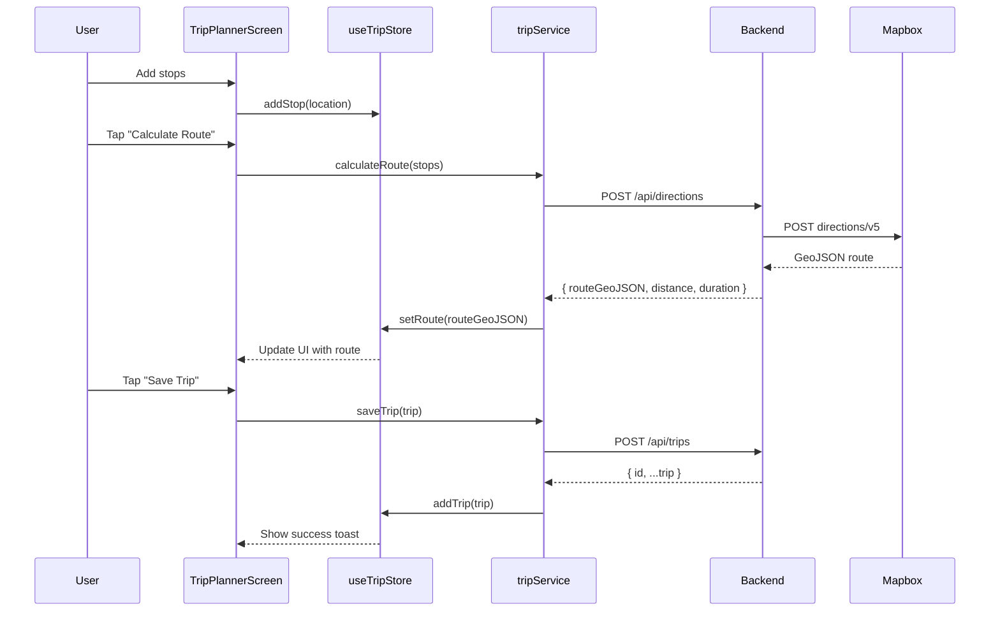

# Specification: Mobile MVP (React Native iOS/Android)

**Feature ID**: mobile-mvp  
**Version**: 1.0.0  
**Status**: Implementation  
**Created**: December 11, 2025  
**Milestone**: 1.5 - Mobile MVP  
**Due Date**: January 22, 2026

---

## Executive Summary

Add React Native mobile application (iOS and Android) to the existing Road Trip Planner web app. The mobile app provides native iOS and Android experiences while sharing the same FastAPI backend and business logic with the web application.

**Key Deliverables**:
- Native iOS app submitted to App Store
- Native Android app submitted to Google Play
- Shared backend API (no backend changes)
- 100% code reuse target for business logic (Zustand stores)
- Google OAuth authentication
- React Native Maps integration with Mapbox

---

## User Stories

### US1: View Saved Trips (Mobile)
**As a** mobile user  
**I want to** view my list of saved road trips  
**So that** I can access my trips on-the-go from my phone

**Acceptance Criteria**:
- List displays all user's trips with thumbnail images
- Each trip shows title, distance, duration, stop count
- Pull-to-refresh updates trip list
- Tap trip to view details
- Empty state shows "No trips yet" message
- Loading state during API fetch
- Error handling for network failures

**Mobile Considerations**:
- FlatList for performance with large lists
- Native pull-to-refresh gesture
- Safe area handling for notches/home indicators
- Touch target sizes: minimum 44x44 points (iOS HIG)

---

### US2: View Trip Details with Map (Mobile)
**As a** mobile user  
**I want to** see trip details with an interactive map  
**So that** I can review the route and stops on my phone

**Acceptance Criteria**:
- Full-screen map displays trip route as polyline
- Markers show all stops with custom icons (start, waypoint, end)
- Tap marker to see stop details in bottom sheet
- Map auto-fits bounds to show entire route
- Zoom and pan gestures work smoothly (60 FPS)
- List of stops below map with distance/duration
- Location permissions requested on first use

**Mobile Considerations**:
- React Native Maps with Mapbox provider
- Native MapView for performance
- Bottom sheet for stop details (react-native-bottom-sheet)
- Request location permissions: "Allow while using app"
- Handle permission denials gracefully
- Test on physical devices (maps flaky in simulators)

---

### US3: Create and Plan Trips (Mobile)
**As a** mobile user  
**I want to** create new road trips by adding stops  
**So that** I can plan trips directly from my phone

**Acceptance Criteria**:
- "New Trip" button navigates to trip planner
- Search locations using autocomplete (Azure Maps)
- Add locations as stops to trip
- Reorder stops with drag handles
- Calculate route between all stops
- Display total distance and duration
- Save trip with title and optional notes
- Trip syncs to backend and appears in list

**Mobile Considerations**:
- Keyboard avoidance for search input
- Autocomplete dropdown over content
- DragDropContext for reordering stops
- Loading indicator during route calculation
- Toast notifications for save success/failure
- Validate trip has at least 2 stops before saving

---

### US4: Authenticate with Google (Mobile)
**As a** mobile user  
**I want to** log in with my Google account  
**So that** I can access my trips across devices

**Acceptance Criteria**:
- "Sign in with Google" button on login screen
- Expo AuthSession opens Google OAuth flow
- Successful login stores JWT in AsyncStorage
- JWT attached to all API requests as Bearer token
- Auto-login if valid JWT exists
- Logout clears JWT and returns to login screen
- Token refresh before expiration (15-minute expiry)

**Mobile Considerations**:
- Use Expo AuthSession (not web OAuth flow)
- Test on physical devices (OAuth limited in simulators)
- Handle Google Play Services missing on Android
- Configure OAuth redirect URI in Google Console
- Deep linking for OAuth callback
- Secure storage with AsyncStorage encryption

---

## Functional Requirements

### FR1: Cross-Platform Compatibility
- Single codebase targets iOS 14+ and Android 8.0+ (API 26+)
- Expo managed workflow for simplified builds
- Platform-specific code isolated in `.ios.tsx` and `.android.tsx` files
- Test on iPhone 12+ and Android Pixel 4+ equivalent devices

### FR2: Backend API Integration
- Mobile app uses identical API endpoints as web app
- Base URL: `VITE_API_URL` from environment variables
- Endpoints: `/api/trips`, `/api/directions`, `/api/pois`, `/auth/google`
- JWT authentication with Bearer tokens
- API client handles token refresh automatically
- Offline mode: Show cached data with "Offline" indicator

### FR3: Map Rendering
- React Native Maps with Mapbox integration
- Display GeoJSON routes as polylines
- Custom markers for stops (start=green, waypoint=blue, end=red)
- Map gestures: zoom, pan, rotate
- Auto-fit bounds to show entire route
- Location permissions: "When in use" (not "Always")
- Mapbox token from environment variables

### FR4: State Management
- Zustand stores shared with web app (100% code reuse)
- `useTripStore`: Trip data (stops, route, metadata)
- `useAuthStore`: User session, JWT token
- `useMapStore`: Map state (region, markers, selected stop)
- AsyncStorage for persistence (JWT, cached trips)

### FR5: Navigation
- React Navigation with stack and bottom tabs
- Bottom tabs: Home (trips list), Map, Profile
- Stack navigation for trip details and planner
- Deep linking: `roadtrip://trip/:id`
- Drawer navigation: None (bottom tabs only)

---

## Non-Functional Requirements

### NFR1: Performance
- **App Startup**: <3 seconds on mid-range devices (iPhone 12, Pixel 4)
- **Map Rendering**: 60 FPS with route and 10+ markers
- **Memory Usage**: <200MB under normal use
- **Bundle Size**: <50MB download size (OTA updates <10MB)
- **API Response**: <2 seconds for trip list, <5 seconds for route calculation

### NFR2: Offline Support
- Cache last 10 viewed trips in AsyncStorage
- Display cached trips with "Offline" badge
- Queue trip saves when offline, sync when online
- Show error toast if offline and action requires network
- Graceful degradation: Maps don't load offline

### NFR3: Accessibility
- Screen reader support (VoiceOver on iOS, TalkBack on Android)
- Minimum touch targets: 44x44 points (iOS), 48x48 dp (Android)
- Color contrast: WCAG AA compliance (4.5:1 for text)
- Dynamic type support: Text scales with system font size
- Semantic labels on all interactive elements

### NFR4: Security
- JWT tokens stored in AsyncStorage with encryption
- API keys (Mapbox) never exposed in client code
- HTTPS only for API calls (no HTTP fallback)
- Certificate pinning for API requests (optional - future enhancement)
- No sensitive data in logs or crash reports

### NFR5: Testing
- **Unit Tests**: 70% coverage for services, stores, utils
- **Component Tests**: Key screens and components
- **Integration Tests**: API calls with mocked responses
- **Manual Testing**: Physical iOS and Android devices
- **Performance Testing**: React Native Performance Monitor

---

## Technical Design

### Architecture: Backend-for-Frontend (BFF)

```
┌─────────────────────────────────┐
│      Mobile App (React Native)  │
│  ┌───────────────────────────┐  │
│  │  Screens (UI Layer)       │  │
│  │  - TripListScreen         │  │
│  │  - TripDetailScreen       │  │
│  │  - TripPlannerScreen      │  │
│  └───────────────────────────┘  │
│  ┌───────────────────────────┐  │
│  │  Business Logic           │  │
│  │  - Zustand Stores         │  │
│  │  - React Query Cache      │  │
│  └───────────────────────────┘  │
│  ┌───────────────────────────┐  │
│  │  Services (API Layer)     │  │
│  │  - tripService.ts         │  │
│  │  - authService.ts         │  │
│  │  - mapService.ts          │  │
│  └───────────────────────────┘  │
└─────────────────────────────────┘
           │
           │ REST/HTTP (HTTPS)
           │ Authorization: Bearer <JWT>
           ▼
┌─────────────────────────────────┐
│  FastAPI Backend (Python)       │
│  ┌───────────────────────────┐  │
│  │  main.py (Routes)         │  │
│  │  - GET /api/trips         │  │
│  │  - POST /api/trips        │  │
│  │  - POST /api/directions   │  │
│  │  - POST /api/pois         │  │
│  │  - POST /auth/google      │  │
│  └───────────────────────────┘  │
└─────────────────────────────────┘
           │
           ▼
┌─────────────────────────────────┐
│  External APIs                  │
│  - Mapbox Directions API        │
│  - Google Gemini AI             │
│  - Azure Maps POI Search        │
└─────────────────────────────────┘
```

**Key Points**:
- Mobile calls backend API (same as web)
- Backend proxies external APIs (API keys hidden)
- JWT authentication for all protected routes
- No direct external API calls from mobile

---

### Data Flow: Trip Creation



---

### Component Hierarchy

```
App.tsx
└── RootNavigator
    ├── AuthNavigator (if not authenticated)
    │   └── LoginScreen
    └── AppNavigator (if authenticated)
        └── BottomTabNavigator
            ├── TripStack
            │   ├── TripListScreen
            │   └── TripDetailScreen
            ├── PlannerStack
            │   └── TripPlannerScreen
            └── ProfileStack
                └── ProfileScreen
```

**Navigation Structure**:
- Root: Conditional rendering based on auth state
- Bottom Tabs: Main navigation for authenticated users
- Stack Navigators: Nested navigation within each tab
- Modals: AddStopModal (presented over TripPlannerScreen)

---

### State Management: Zustand Stores

#### `useTripStore` (Shared with Web)
```typescript
interface TripState {
  trips: Trip[];
  currentTrip: Trip | null;
  stops: Stop[];
  routeGeoJSON: GeoJSON | null;
  loading: boolean;
  error: string | null;
  
  // Actions
  fetchTrips: () => Promise<void>;
  setCurrentTrip: (trip: Trip) => void;
  addStop: (stop: Stop) => void;
  removeStop: (stopId: string) => void;
  reorderStops: (fromIndex: number, toIndex: number) => void;
  calculateRoute: () => Promise<void>;
  saveTrip: () => Promise<void>;
  deleteTrip: (tripId: string) => Promise<void>;
}
```

#### `useAuthStore` (Shared with Web)
```typescript
interface AuthState {
  user: User | null;
  token: string | null;
  isAuthenticated: boolean;
  loading: boolean;
  
  // Actions
  login: (googleToken: string) => Promise<void>;
  logout: () => void;
  refreshToken: () => Promise<void>;
  checkAuth: () => Promise<void>;
}
```

#### `useMapStore` (Mobile-Specific)
```typescript
interface MapState {
  region: {
    latitude: number;
    longitude: number;
    latitudeDelta: number;
    longitudeDelta: number;
  };
  selectedStopId: string | null;
  showUserLocation: boolean;
  
  // Actions
  setRegion: (region: MapState['region']) => void;
  fitBounds: (stops: Stop[]) => void;
  selectStop: (stopId: string) => void;
  clearSelection: () => void;
}
```

---

### API Client: Axios Configuration

**File**: `mobile/src/services/api.ts`

```typescript
import axios from 'axios';
import { getToken, refreshToken } from './authService';
import { VITE_API_URL } from '@env';

const api = axios.create({
  baseURL: VITE_API_URL,
  timeout: 10000,
  headers: {
    'Content-Type': 'application/json',
  },
});

// Request interceptor: Attach JWT
api.interceptors.request.use(
  async (config) => {
    const token = await getToken();
    if (token) {
      config.headers.Authorization = `Bearer ${token}`;
    }
    return config;
  },
  (error) => Promise.reject(error)
);

// Response interceptor: Handle 401 (token expired)
api.interceptors.response.use(
  (response) => response,
  async (error) => {
    const originalRequest = error.config;
    
    if (error.response?.status === 401 && !originalRequest._retry) {
      originalRequest._retry = true;
      
      try {
        const newToken = await refreshToken();
        originalRequest.headers.Authorization = `Bearer ${newToken}`;
        return api(originalRequest);
      } catch (refreshError) {
        // Redirect to login
        return Promise.reject(refreshError);
      }
    }
    
    return Promise.reject(error);
  }
);

export default api;
```

---

## Data Models

### Trip (TypeScript Interface)
```typescript
interface Trip {
  id: string;
  user_id: string;
  title: string;
  description: string | null;
  stops: Stop[];
  route_geojson: GeoJSON;
  total_distance_km: number;
  total_duration_hours: number;
  image_url: string | null;
  is_public: boolean;
  created_at: string;
  updated_at: string;
}
```

### Stop (TypeScript Interface)
```typescript
interface Stop {
  id: string;
  trip_id: string;
  name: string;
  address: string;
  latitude: number;
  longitude: number;
  stop_order: number;
  stop_type: 'start' | 'waypoint' | 'end';
  notes: string | null;
}
```

### GeoJSON Route (TypeScript Interface)
```typescript
interface RouteGeoJSON {
  type: 'FeatureCollection';
  features: Array<{
    type: 'Feature';
    geometry: {
      type: 'LineString';
      coordinates: [number, number][]; // [lng, lat]
    };
    properties: {
      distance: number; // meters
      duration: number; // seconds
    };
  }>;
}
```

### User (TypeScript Interface)
```typescript
interface User {
  id: string;
  email: string;
  name: string;
  picture: string | null;
  created_at: string;
}
```

---

## UI/UX Design

### Screen Layouts

#### TripListScreen
- **Header**: "My Trips" title, "New Trip" button (right)
- **Content**: FlatList of TripCard components
- **Empty State**: "No trips yet" message with "Create Trip" CTA
- **Pull-to-Refresh**: Native gesture to reload trips

#### TripDetailScreen
- **Header**: Trip title, back button (left)
- **Content**: 
  - MapView (60% height) with route and markers
  - ScrollView with stop list (40% height)
- **Actions**: "Edit Trip" button, "Delete Trip" menu option

#### TripPlannerScreen
- **Header**: "New Trip" or trip title, cancel button (left)
- **Content**:
  - Text input: Trip title
  - Search bar: Location autocomplete
  - FlatList: Stops with drag handles
  - Map preview: Small map showing route
- **Actions**: "Calculate Route" button, "Save Trip" button

#### LoginScreen
- **Header**: App logo and tagline
- **Content**: 
  - Hero image: Road trip scene
  - "Sign in with Google" button (centered)
- **Footer**: Terms and privacy links

---

### Color Palette (Following Web App)
- **Primary**: `#3B82F6` (Blue 500)
- **Secondary**: `#10B981` (Green 500)
- **Accent**: `#F59E0B` (Amber 500)
- **Background**: `#F9FAFB` (Gray 50)
- **Surface**: `#FFFFFF` (White)
- **Error**: `#EF4444` (Red 500)
- **Text Primary**: `#111827` (Gray 900)
- **Text Secondary**: `#6B7280` (Gray 500)

---

## Testing Strategy

### Unit Tests (Jest)
- **Zustand Stores**: Test actions, state updates
- **Services**: Test API calls with mocked responses
- **Utilities**: Test helper functions (validation, formatting)
- **Hooks**: Test custom hooks with `@testing-library/react-hooks`

**Example**: `useTripStore.test.ts`
```typescript
import { renderHook, act } from '@testing-library/react-hooks';
import { useTripStore } from '../store/useTripStore';

test('addStop adds stop to store', () => {
  const { result } = renderHook(() => useTripStore());
  
  act(() => {
    result.current.addStop({
      id: '1',
      name: 'San Francisco',
      latitude: 37.7749,
      longitude: -122.4194,
    });
  });
  
  expect(result.current.stops).toHaveLength(1);
  expect(result.current.stops[0].name).toBe('San Francisco');
});
```

### Component Tests (@testing-library/react-native)
- **Screens**: Test rendering, user interactions, navigation
- **Components**: Test props, events, conditional rendering

**Example**: `TripCard.test.tsx`
```typescript
import { render, fireEvent } from '@testing-library/react-native';
import TripCard from '../components/TripCard';

test('TripCard displays trip details and handles press', () => {
  const mockPress = jest.fn();
  const trip = {
    id: '1',
    title: 'California Coast',
    total_distance_km: 450,
    stops: [{ name: 'SF' }, { name: 'LA' }],
  };
  
  const { getByText } = render(
    <TripCard trip={trip} onPress={mockPress} />
  );
  
  expect(getByText('California Coast')).toBeTruthy();
  expect(getByText('450 km')).toBeTruthy();
  
  fireEvent.press(getByText('California Coast'));
  expect(mockPress).toHaveBeenCalledWith(trip);
});
```

### Integration Tests
- **API Integration**: Test service calls with mocked Axios responses
- **Navigation**: Test screen navigation flows
- **Authentication**: Test login/logout flows

### Manual Testing Checklist
- [ ] Test on physical iOS device (iPhone 12+)
- [ ] Test on physical Android device (Pixel 4+)
- [ ] Test Google OAuth login on real devices
- [ ] Test location permissions flow
- [ ] Test offline mode (airplane mode)
- [ ] Test map gestures (zoom, pan, rotate)
- [ ] Test trip creation end-to-end
- [ ] Test app in landscape orientation
- [ ] Test with VoiceOver (iOS) and TalkBack (Android)
- [ ] Test with system font size changes

---

## Deployment

### EAS Build Configuration

**File**: `mobile/eas.json`
```json
{
  "build": {
    "development": {
      "developmentClient": true,
      "distribution": "internal",
      "ios": {
        "simulator": true
      }
    },
    "preview": {
      "distribution": "internal",
      "ios": {
        "simulator": false
      }
    },
    "production": {
      "autoIncrement": true
    }
  },
  "submit": {
    "production": {
      "ios": {
        "appleId": "your-apple-id@email.com",
        "ascAppId": "1234567890"
      },
      "android": {
        "serviceAccountKeyPath": "./google-service-account.json"
      }
    }
  }
}
```

### Build Commands
```bash
# iOS development build (simulator)
eas build --platform ios --profile development

# iOS production build (TestFlight)
eas build --platform ios --profile production

# Android development build
eas build --platform android --profile development

# Android production build (Google Play)
eas build --platform android --profile production
```

### Store Submission
```bash
# iOS: Submit to App Store Connect
eas submit --platform ios

# Android: Submit to Google Play Console
eas submit --platform android
```

---

## Acceptance Criteria

### Milestone 1.5 Complete When:
- [ ] Mobile app runs on iOS 14+ and Android 8.0+
- [ ] All 4 user stories implemented and tested
- [ ] Google OAuth login works on physical devices
- [ ] Maps display routes and markers correctly
- [ ] Trip creation and saving functional
- [ ] Unit tests: 70% coverage for business logic
- [ ] Component tests written for key screens
- [ ] Manual testing completed on physical iOS and Android devices
- [ ] iOS app submitted to App Store (in review or approved)
- [ ] Android app submitted to Google Play (in review or approved)
- [ ] mobile/README.md documentation complete
- [ ] Performance targets met (<3s startup, 60 FPS, <200MB memory)

---

## Dependencies

### Prerequisites
- Milestone 1 (Production Ready) completed by Dec 18, 2025
- Backend FastAPI endpoints functional
- Node.js 18+ installed
- Xcode 15+ (for iOS builds) on macOS
- Android Studio with Android SDK 33+ (for Android builds)
- EAS CLI installed: `npm install -g eas-cli`
- Apple Developer Program account ($99/year)
- Google Play Developer account ($25 one-time)
- Physical iOS device for OAuth testing
- Physical Android device for OAuth testing

### External Services
- Mapbox API (existing - no changes)
- Google Gemini AI (existing - no changes)
- Azure Maps POI Search (existing - no changes)
- Google OAuth (existing - configure mobile redirect URI)
- App Store Connect (Apple)
- Google Play Console

---

## Constraints

- Timeline: 4 weeks (Dec 19 - Jan 15 development, Jan 22-28 approval)
- Budget: $124 one-time (Apple $99 + Google $25 developer accounts)
- Platform Versions: iOS 14+, Android 8.0+ (API 26+)
- Bundle Size: <50MB download (App Store/Google Play limits)
- Backend Changes: None allowed (mobile uses existing API)

---

## Future Enhancements (Out of Scope for MVP)

- Push notifications for trip updates
- Offline maps with downloaded tiles
- Share trips with other users
- In-app messaging between trip members
- AR navigation using device camera
- Wear OS and watchOS support
- Tablet-optimized layouts
- Split-screen multitasking support
- Siri shortcuts / Google Assistant integration
- CarPlay / Android Auto support

---

## References

- Constitution v1.0.0: `.specify/memory/constitution.md`
- Project Instructions: `PROJECT_INSTRUCTIONS.md`
- BFF Architecture: `docs/adr/001-bff-architecture-strategy.md`
- Roadmap: `ROADMAP.md` (Milestone 1.5)
- Backend API: `backend/main.py`
- Web Store Reference: `frontend/src/store/useTripStore.ts`
- Web Types Reference: `frontend/src/types/`
